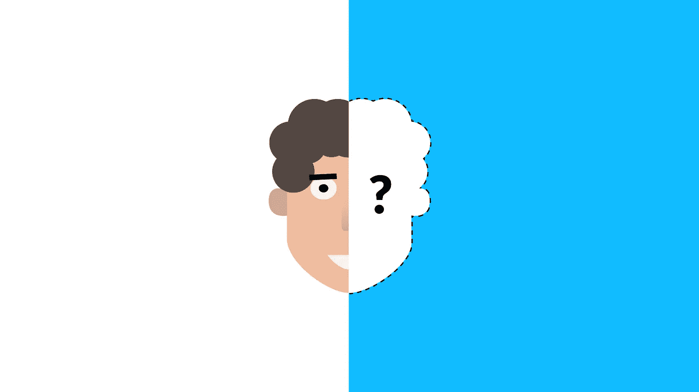
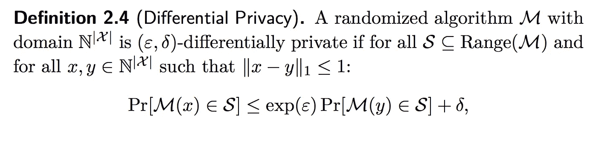
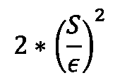
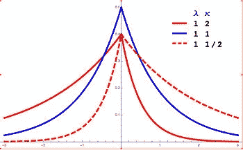

# GDPR 时代的机器学习

> 原文：<https://medium.datadriveninvestor.com/machine-learning-in-the-age-of-gdpr-8152d3424766?source=collection_archive---------4----------------------->

Source: [https://www.inovex.de/blog/differential-privacy/](https://www.inovex.de/blog/differential-privacy/)

2018 年 5 月 25 日，“通用数据保护条例”或 GDPR 应运而生。" [GDPR (2016/679)是欧盟法律中关于欧盟和欧洲经济区所有公民的数据保护和隐私的法规。它还解决了将个人数据输出到欧盟和欧洲经济区以外的问题](https://www.google.com/url?sa=t&rct=j&q=&esrc=s&source=web&cd=1&ved=2ahUKEwjp97XH2__iAhVBbFAKHfDWCWYQFjAAegQIAxAB&url=https%3A%2F%2Fgdpr-info.eu%2F&usg=AOvVaw1akHzzz224Oq1yU0pd6qSw)。这对方(脸书、亚马逊、、谷歌)公司造成了巨大打击，这些公司明确依赖收集私人用户数据，并训练其机器学习模型，用于产品或节目推荐系统、定向广告、好友建议等。

然而，这个隐私问题不仅影响到方公司，也严重限制了研究人员和学生。由于对公共数据集的访问有限，训练新的机器学习/深度学习模型以及测试它们的准确性变得极其困难。那么，我们怎样才能鱼与熊掌兼得呢？

> 输入差分隐私！

# 什么是差分隐私？

在辛西娅·德沃克和亚伦·罗斯所著的《T2 差分隐私的算法基础》一书中，差分隐私被定义为:

## “差别隐私”描述了数据持有者或管理者对数据主体做出的承诺:“无论有什么其他研究、数据集或信息源可用，您都不会因为允许您的数据用于任何研究或分析而受到不利或其他影响。"

让我们用一个简单的例子来理解对数据库的特定查询。让我们以一个有一定数量条目的数据库为例。我们可以说，如果对整个数据库的查询和对所有子数据库(从原始数据库中仅删除了一个元素的数据库)的查询返回相同的值，即特定值的存在或不存在不会改变查询返回的结果，则数据库具有差分隐私。

下面我们给出了上述书中定义的差分隐私的数学定义。

该表达式表示查询输出在整个数据库上的分布(由 *x* 给出)必须满足不等式；每个子数据库的输出分布(由 *y* 给出)，乘以*exp(є)*加上一个小的增量值。*є*代表数据库的敏感度。数据库的敏感性意味着当从数据库中删除一个元素时，查询的输出会有多大的不同。灵敏度越低，意味着输出变化越小，因此数据“泄漏”越少，数据库越安全。

> 但是我们如何实现差别隐私呢？**掷硬币！**

比方说，我们正试图进行一项关于有多少学生在 sat 考试中作弊的研究。然而，由于这是一个敏感的话题，我们很少会发现一个学生愿意公开承认作弊，我们给他们提供了一个似是而非的否认情况。我们让他们扔硬币，如果是正面，他们必须如实回答。然而，如果是反面，我们让他们第二次扔硬币。如果第二次抛硬币的结果是正面，他们会回答是，如果是反面，他们会回答不是。在这种情况下，如果学生被单独询问，我们会允许他们合理的否认。然而，当我们分析数据集时，因为我们知道每个“是”都有 3/4 的正确几率，所以我们可以在计算输出时考虑该概率，并相应地进行调整。因此，这种情况下，我们可以找到我们的问题的实际答案，同时保护个别学生。

# 添加噪声:局部还是全局？

在上一节中，我们看到了一个简单的掷硬币的方法是如何保护学生的个人身份的。更广泛地说，我们可以通过向数据库添加噪声来保护个人数据所有者。

有两种向数据库添加噪声的方法。向数据库的每个条目添加噪声也称为局部差分隐私，向数据库查询的输出添加噪声也称为全局差分隐私。通常，后一种方法是首选，因为现实生活中的数据集非常庞大，向每个元素添加噪声可能是一件乏味的事情。

> 但是我需要添加多少噪声呢？？

令人欣慰的是，这些优秀的作者设计了一种非常简单的方法来计算我们需要添加到数据库中的噪声量，以确保我们能够实现不同的隐私。由 [Elamurugaiyan](https://www.linkedin.com/in/aarurane/) et 提出的一个短算法。《T4》[2]【T5]中的艾尔把它概括得很美

**输入:**函数 *F* ，输入 *X* ，隐私级别ϵ
**输出:**有噪声的回答
计算 *F (X)* 计算 *F 的灵敏度:S*
绘制噪声 *L* 从一个具有方差的拉普拉斯分布:

**回车** *F(X) + L*

因此，这里我们看到，我们需要添加的噪声量取决于数据库的敏感度，即，敏感度越高，我们需要添加的噪声就越多，以确保不同的隐私。这种方法被称为拉普拉斯机制。拉普拉斯分布的表示如下所示。(注:所有分布的平均值均为 0)

Source: Wikipedia

> 很好！但是所有这些与训练机器学习模型有什么关系呢？

差分隐私的类似概念可以应用于训练机器学习模型。如果 ML 模型的输出预测甚至在从数据集中删除一些数据之后仍然相同，那么我们可以说该模型已经实现了差分隐私。然而，在机器学习的背景下有两个主要的区别，训练的顺序是不同的，不像在数据库中总是有特定的顺序。第二个主要区别是，即使在相同的数据集上训练，模型的神经元也会达到不同的权重。

# 最后的想法

在机器学习的背景下，差分隐私的一个主要挑战是确定向数据库添加多少噪声，因为少量的噪声会泄露用户的隐私信息，而添加过多的噪声会导致模型精度低。尽管有这个缺点，差分隐私是一个不断发展的领域，未来有很大的希望。在遵守更多监管机构的同时，成功地将机器学习应用于私有和公共数据集是一个巨大的挑战，而差异隐私是缓解这一挑战的关键。

# 参考

[1]辛西娅·德沃克。差异隐私:结果调查。2008 年计算模型理论与应用国际会议。

[[2]https://medium . com/Georgian-impact-blog/a-brief-introduction-to-differential-privacy-eacf 8722283 b](https://medium.com/georgian-impact-blog/a-brief-introduction-to-differential-privacy-eacf8722283b)

[3]维基百科贡献者。拉普拉斯分布，2018 年 7 月。

[4] Aaruran Elamurugaiyan。显示不同查询次数下不同私人响应的标准误差的图。，2018 年 8 月。

[5] [本杰明·鲁宾斯坦和弗朗切斯科·阿尔达。无痛苦随机差分隐私与敏感性采样。在 2017 年第 34 届机器学习国际会议(ICML 2017)上。](https://medium.com/georgian-impact-blog/a-brief-introduction-to-differential-privacy-eacf8722283b)