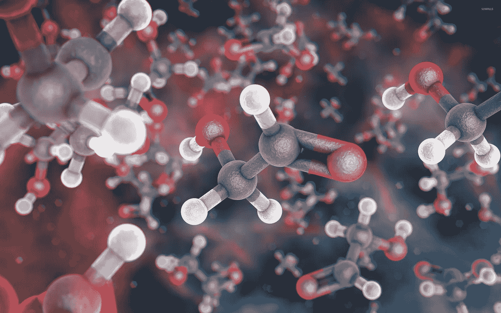
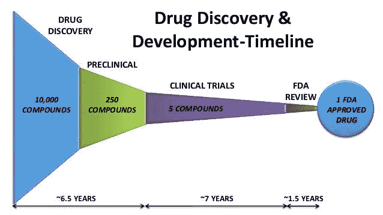
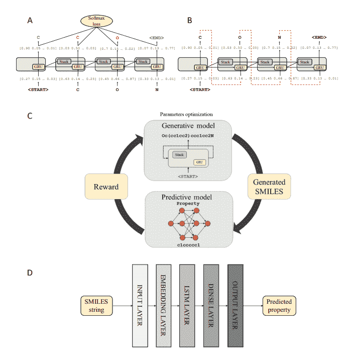
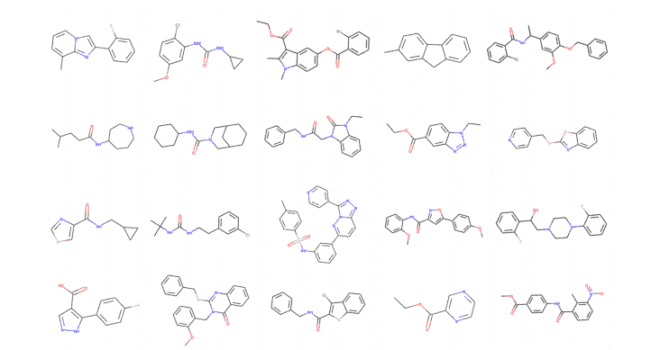
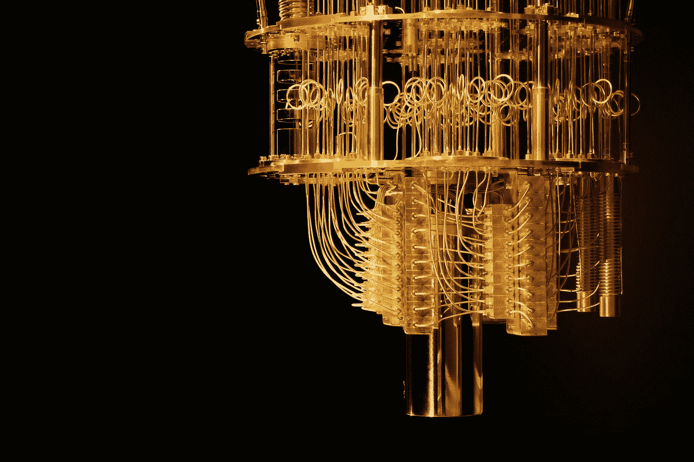

# 机器学习将会颠覆制药业，下面是方法

> 原文：<https://medium.datadriveninvestor.com/machine-learning-is-going-to-disrupt-the-pharmaceutical-industry-heres-how-250cafb3ad00?source=collection_archive---------3----------------------->

*2016 年:*

***5690 万*** *全球死亡人数*

*前 10 位死因占* ***全部死亡的 54%***

****这 10 种*** *病因中有 9 种是疾病**

**这 9 种疾病占全球死亡总数的**

****消灭九大致命疾病将会* ***挽救 2720 万条生命******

# **未来无病？**

**想象一下，现在地球上所有的疾病都消失了。世界会是什么样子？数百万人的生活将被改变。许多人不会有今天的痛苦。他们不会被他们的条件所限制，他们可以过上更好的生活。那将是一个所有人都可以为我们的文明增加价值并更快发展的未来。那将是一个令人惊奇的世界，不是吗？是的，它会，但你不必继续梦想，人们已经在努力使它成为现实。**

# **人工智能和药物发现**

**当然，人工智能正再次被用作解决一些世界上最棘手问题的工具。使用人工智能比现有方法更高效、更快速地发现药物。**

# **当前流程**

****

**目前的药物研发过程慢得令人难以置信。如今，通过药物研发渠道获得一种 FDA 批准的药物平均需要大约 15 年时间和大约 10 亿美元。药物发现阶段大约需要 3-5 年，重点是目标识别和验证、分析开发和先导化合物的生成(先导化合物是已经进入管道中后期阶段的药物)。**

**药物发现两个字:**昂贵的**和**及时的****

# **制药药物:寻找成功药物的标准**

**在我们进入有可能找到疾病治疗方法的人工智能方法领域之前，让我们先了解一下成功药物的背景。所以要理解什么是好药，我们先来理解它的衡量标准。**

**让我们从 **ADMET** 开始:**

*   ****吸收**:口服给药的药物，必须通过消化道充分吸收，并有能力通过血脑屏障**
*   ****分配**:药物必须尽最大努力达到预定的目标，以减少副作用，尤其是抗癌药物，往往有很多有害的副作用。**
*   ****新陈代谢**:人体会分解体内的异物。容易代谢的药物可能效率较低。在某些情况下，新陈代谢可以吸收一种物质，当它代谢时可以分解成一种有害的药物。前体药物是指通过代谢来发挥其功能的药物。当药物需要更好的吸收时，通常就是这种情况。**
*   ****排泄**:药物的排泄过程变得至关重要，因为如果药物在体内积累，它可能会变得有害。大多数药物通过尿液排泄，或者分解成简单的化合物，如二氧化碳和水。**
*   ****毒性**:药物总会有一些副作用。毒性是指这些副作用的严重性。重要的是找到没有严重副作用但仍然表现良好的药物，尽管如果药物显示出很强的潜力，但有更多的副作用，也不排除在早期测试阶段使用药物。**

**ADMET 是一个首字母缩写词，集中在一个成功的药物应该擅长的五个最重要的领域。简单来说，一种成功的药物应该看起来像今天存在的并且是成功的。另一个度量标准存在，但更侧重于化学结构。这个标准就是利平斯基的五法则。**

****利平斯基五法则**指出，任何口服药物都具有:**

*   **不超过 5 个氢键供体(如 OH 和 NH 基团)**
*   **不超过 10 个氢键受体(如环中的 N 和 O 原子)**
*   **分子量低于 500**
*   **分配系数(在辛醇和水中的相对溶解度，它估计分子的疏水性)log P 小于 5**

**这些只是目前存在的一些指标，有助于确定哪些药物在早期阶段显示出潜力。但是早期阶段的问题是，使用排除法不是很有效或者很成功。机器学习模型有能力提高效率，减少在这个过程中花费的疯狂时间，并可以生成更有可能进入后期阶段的药物。**

**现在是你们一直在等待的部分……机器学习模型！！！**

# **用于药物发现的机器学习模型**

**我将分解目前存在的两种非常有趣和成功的方法，并解释模型基础结构、它学习的方式以及这种方法实际上是如何工作的。**

**两个非常成功的架构是对立的自动编码器和强化学习。但首先，让我们尝试并理解机器学习模型将理解的化学命名格式。**

**我们将处理两种化学命名格式。分子**接入系统【MACCS】**和**简化分子输入线输入系统(SMILES)** 。化学家通常处理 IUPAC 命名。**

**IUPAC:4-(2-氨乙基)苯-1，2-二醇**

**SMILES: C1=CC(=C(C=C1CCN)O)O(用符号和字母表示结构的 1D 数据)**

**MACCS: 1001100011…(代表结构的 166 位二进制指纹)**

# **使用对抗性自动编码器**

**这种方法相当成功，并在 MCF-7 乳腺癌细胞系上进行了测试。研究人员的目标是开发抑制这些肿瘤生长的药物。**

****

**简单地说，敌对的自动编码器通过接受输入，解构它，然后试图再次完美地重建它来进行训练。这似乎有悖直觉，但重要的是数据被浓缩的潜在层。这种潜在的变量将会在以后被用来产生新的药物(在这种情况下)。**

**在这种方法中，研究人员使用二元指纹作为输入，以及一个称为**药物浓度**(对数浓度值或 LCONC)的值。他们还在潜伏层中添加了一个节点，其值称为**生长抑制**(GI——范围在-100 和 100 之间，-100 表示它完全杀死肿瘤，100 表示它加速肿瘤的生长),表示它抑制肿瘤生长的程度。**

**在训练过程之后，潜在变量被用于产生具有期望特性的新药。然后用 LCONC < 5.0M were filtered out and then were screened on 72 million compounds on the Pubchem database. Then the best performers were selected and they had drugs that showed anti-cancer properties, which means that the earlier stage of drug discovery through this process was much improved giving better early-stage drugs with a high potential to do well in later stages.**

# **Reinforcement Learning Method (Based on ReLeaSE)**

**This method was used to generate new chemical compounds from scratch with certain desired properties. This architecture is a little bit more complex but that is because the SMILES format is used since MACCS data doesn’t retain all important info.**

****

****A** 的药物:训练生成栈增强的递归神经网络。使用堆栈 RNN 的原因是它最能理解 SMILES 的语法。普通的 RNN 人努力学习微笑可以有不同的长度，但是斯塔克-RNN 擅长这个。**

****B** :这是 RNN 的生成组件，它输出下一个最可能字符的概率向量。**

****C** :本流程的强化学习系统(需要关于强化学习的介绍？查看我的文章！)生成模型将生成微笑，然后预测模型将根据生成器制作的药物的逼真程度输出奖励。**

****D** :预测模型的基础设施。微笑字符串被传递到输入层，嵌入层，LSTM 层，密集层，然后输出层给我们预测的属性。使用平方损失函数来优化该模型。**

****

**一旦训练完成，模型就能够输出许多分子。这些是它所产生的一些例子。在 PubChem 上筛选后，证明了 **95%的分子在化学上是可行的**，并且很容易合成。**

**这些是现今存在的许多方法中的两种！但是他们表现得真的很好，这向我们展示了人类有多大的潜力去找到治愈许多疾病的方法。让我们来看看将来会令人惊奇的东西，并从药物发现过程中再省去 6-7 年的时间。**

# **分子模拟**

**随着量子计算机开始变得更好，我们将能够模拟分子，并有可能看到它们如何与人体相互作用，而不必进行多年的临床试验。然而现在，被模拟的最复杂的**分子是氢化铍(BeH2)** 。**

****

**是的，那是氢化铍。看起来不多，但这是我们最好的计算机能够模拟的。在我们能够模拟更复杂的分子之前，我们还有很多时间，这样我们就可以加快药物发现的进程。**

****

**不过，很明显，医药行业将被这些崭露头角的科技公司所颠覆。当前的药物过程对我们来说太及时和昂贵了，我们不能继续进行这些过程。这一领域的成功将意味着许多现有的制药公司将会失败，而这些科技公司将会增长。**

**现在有许多挑战，但是在未来的 5-10 年，谁知道我们会在哪里？有几十家公司已经开始尝试使用机器学习来生产新药，并取得了令人难以置信的进展。如果掌握了这些技术，使用这些技术可能会产生治愈癌症的方法，这种想法太疯狂了。如果没有疾病，世界将会完全不同，这是一个可以成为现实的梦想。**

**如果你喜欢我的文章并学到了新东西，请点赞并分享！请在下面评论你对医药行业未来十年的看法！**