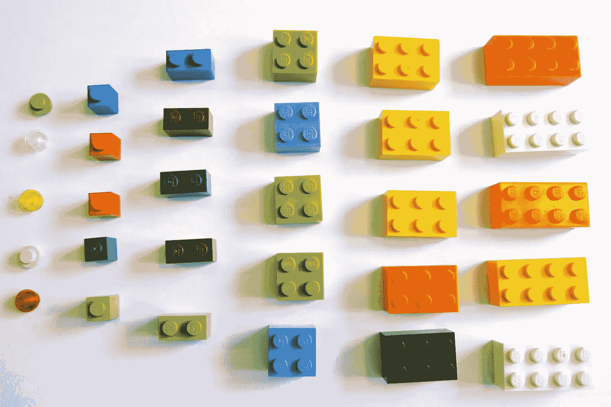

# 机器学习变得容易:它是什么以及它是如何工作的

> 原文：<https://medium.datadriveninvestor.com/machine-learning-made-easy-what-it-is-and-how-it-works-1121b3aa4d93?source=collection_archive---------12----------------------->

人们担心计算机会变得太聪明并接管世界，但真正的问题是它们太笨了，它们已经接管了世界

——佩德罗·多明戈斯

**机器学习**是机器学习一些东西的过程。结束了。

只是开玩笑。我们将比这更深入一点，但它确实展示了机器学习的基本概念有多简单。在本文中，我们将让机器学习变得如此简单，以至于一个孩子都可以做到。这就是为什么我们要用乐高。

As easy as playing with LEGO.

我们的机器学习示例将识别每个乐高积木的信息，包括颜色、大小和表面积。通过将这些砖块的信息存储在算法的数据库中，它可以开始预测你接下来可能需要哪些砖块。事实上，它可以开始分析每一种可能的碎片组合，并识别出你可能试图构建的形状。你可以把它想象成谷歌的自动完成功能，但是用的是乐高。

机器学习通过识别如何最好地分离不同的数据点来工作。例如，如果上面的一堆块是原始数据，算法可能会对数据进行如下排序:

Sorted data. In the form of LEGO blocks.

对于处理数据的机器学习算法来说，它需要一个称为目标函数的东西，这基本上是定义算法使用的规则和功能的东西。对于机器学习，我们倾向于使用损失函数，这基本上意味着算法在出错时会受到惩罚。那么，目标就是尽可能少犯错误。

机器学习算法基本上被告知找出排列乐高积木的最佳方式，同时尽可能少地得分。就像对一袋混合的乐高积木进行分类的方法不止一种一样，从决策树到神经网络，创建算法的方法也不止一种。诀窍是找到完成工作的最佳解决方案。

Getting the job done.

一些机器学习算法比其他算法更灵活，但这种灵活性通常伴随着一些其他成本，例如运行算法所需的资源量。最重要的是，大多数开发人员将运行不同算法的不同迭代，以查看哪一个得到最好的结果。

我们通常称这些不同的迭代为“模型”，我们随后会利用这些模型。有了我们的乐高积木，模型将能够在添加新积木时对它们进行分类，而不仅仅是最初给它的积木。事实上，机器学习的真正力量来自这样一个事实，即它使用得越多，处理的数据越多，它就变得越好。

Hats off to machine learning.

创建机器学习算法与常规编程没有太大区别，因为它们都需要人类的输入。不同的是，一个普通的程序员将不得不把他们的头脑放在乐高挑战上，并为机器设计一套盲目遵循的规则。机器学习程序员设置参数，提供输入，让机器自己识别解决方案。

在绝大多数情况下，这些算法的最大问题是它们首先理解数据的能力，尤其是当数据来自不同来源时。例如，在医疗保健行业，机器学习受到缺乏可互操作的数据集以及丢失或不正确的数据点的阻碍，这些数据点会将机器学习引向错误的方向。

这是一个坏消息，但好消息是，我们仍处于机器学习的早期阶段，医疗保健领域的潜在应用使其成为地球上最令人兴奋的技术之一。现在你知道它是如何工作的了，你可以向一个 10 岁的孩子解释。这是一件好事，因为今天的 10 岁儿童将构建为未来提供动力的机器学习系统。放马过来。

# 想了解更多？

在我的新书《医疗保健的未来:人类和机器合作实现更好的结果》中，我更多地谈到了数据、人工智能和机器学习。点击此处为自己购买一份。