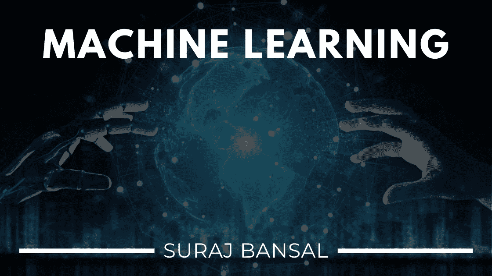
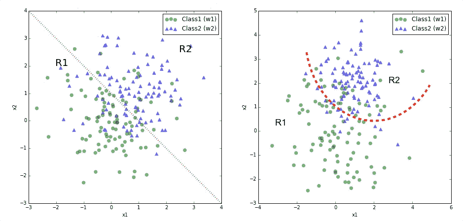
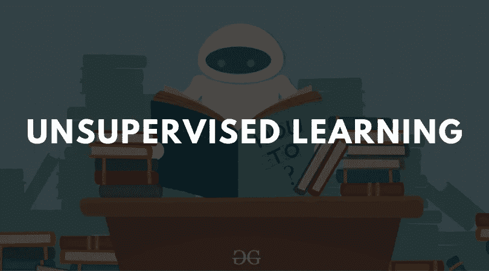
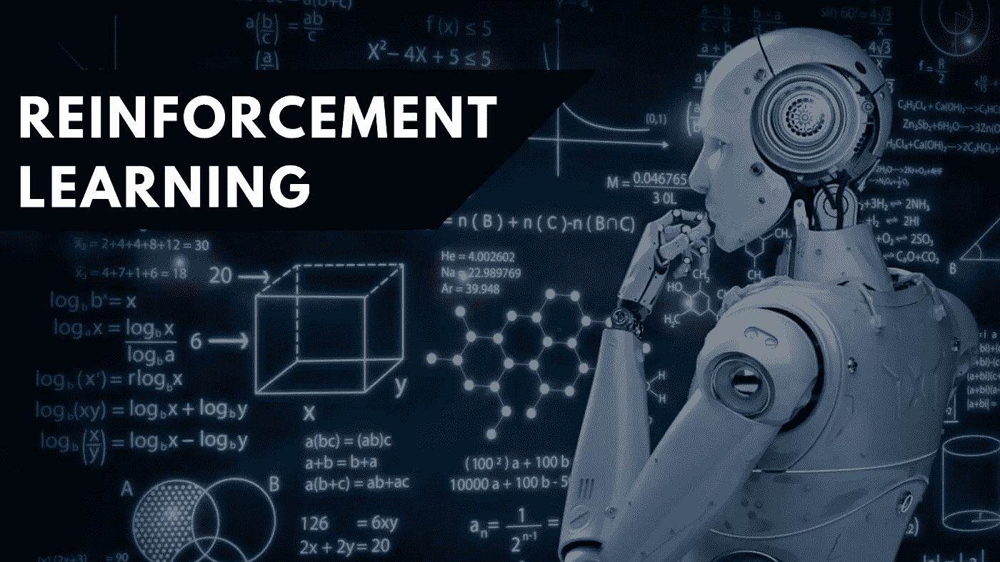

# 机器学习——让人工智能变得不那么人工，甚至更加智能

> 原文：<https://medium.datadriveninvestor.com/machine-learning-making-ai-way-less-artificial-and-even-more-intelligent-cc2d5cf11ac0?source=collection_archive---------3----------------------->

人工智能(AI)经历了指数级增长，在人工智能和人类能力之间创造了前所未有的平行。从理解你的 facebook 内容偏好到语音识别和图像分类，人工智能的**可能性是无限的**。选举人工智能为你们的总统候选人-人工智能治愈癌症-人工智能驱动的药物发现。我们甚至无法*想象的概念和想法*融入我们的生活方式，将成为未来令人兴奋的现实。

现在，考虑到研究人员和人工智能爱好者正在开发基于人工智能的方法来解决全球性问题，如癌症治疗、环境保护和教育不平等。

 [## DDI 编辑推荐:5 本让你从新手变成专家的机器学习书籍|数据驱动…

### 机器学习行业的蓬勃发展重新引起了人们对人工智能的兴趣

www.datadriveninvestor.com](https://www.datadriveninvestor.com/2019/03/03/editors-pick-5-machine-learning-books/) 

是的-不是每天都有 16 岁的孩子告诉你科技可以解决人类最普遍的问题。

这些可笑的技术是由**机器学习**的原理驱动的！机器学习算法使机器能够识别数据点和趋势，以从其环境中学习，并重新配置其方法以达到最佳任务性能。这个概念本质上模拟了人类通过跨学科使用我们的五种感官来成长和适应的方式。

机器学习有 3 个主要分支

1.  监督学习
2.  无监督学习
3.  强化学习

**监督学习**描述这样的算法，其中机器有一个指定的教师，可以为机器的尝试提供答案和确认，但不能为某些事情可能正确或不正确提供理由或解释。他们正在从**标记的数据**中学习。

想象一下，你回到一年级，学习加减法，你有 100 个数学问题，但你的老师从来没有教你数学方法！您猜测每个答案并提交工作表。老师给你看哪 20 题你猜对了，哪 80 题你答错了。很自然，你会感到困惑。一年级学生可能会继续犯同样的错误，而不是寻找一致性。

嗯-没关系。随着时间的推移，孩子的认知功能会增长和发展，他会识别趋势并自己推导出规则。机器学习的迷人之处在于其前所未有的速度和准确性——机器能够立即识别模式和趋势，并决定哪种方法将提高准确性和精确度。

监督学习可以分为两个算法系统。

**分类**允许机器找到**离散值**并评估准确性——比如产品被分类为苹果还是香蕉

*   *二元*分类是指预测只有两个可能输出值的响应
*   *多类别*分类使模型能够预测多个类别

**回归**对具有**连续**值的输出进行建模，计算误差值-误差幅度越小；回归模型的准确度越高

*   确定产品的重量或价值(所有连续值)

让我们考虑下面的例子来正确理解监督学习的概念。

**见见弗雷迪**！弗雷迪得到了一篮子丰富的水果，并且是为了区分苹果和香蕉而建造的。弗雷迪进行猜测，标签显示他是否正确——每次尝试都促使机器改变它的模型。弗雷迪继续训练自己，慢慢变得更加准确，直到机器感觉准备好面对**未标记的数据**，并能够以相当不错的准确度确认给定的对象是苹果还是香蕉。Freddy 将继续对输出和输入要素之间的关系和依赖关系进行建模，以便我们可以根据从以前的数据集中获取的这些关系来预测新数据的输出值。

现在弗雷迪已经成为大男孩，他准备好面对他不再有标签的真实环境。这训练了他在现实生活中的能力，因为你在实践中没有被给予标签或确认。 *75%* 的数据用于**训练过的数据点**，其中机器已输入输入和输出，而 *25%* 的数据用于**测试数据点**，其中仅输入输入。

监督学习算法是*难以置信的有价值* -这些看似复杂的原理和算法已经融入到你的生活方式中，甚至你都不知道！电子邮件过滤系统、面部识别和决策支持机器只是监督学习的一些应用。

让我们再来看看弗雷迪——除了这一次，弗雷迪没有被贴上标签，也不知道他的猜测是真是假，因为没有老师来证实或否认他的近似。弗雷迪还能训练他的模型建立准确性并区分苹果和香蕉吗？**见鬼耶！**

这些模型是使用**无监督学习**算法构建的，并使用**未标记数据**进行学习。*神经网络*开始识别模式、结构和异常，而实际上不需要理解数据的目的。在人类专家不确定他们应该寻找什么的情况下，这个概念非常有价值。

现在你可能会想，打住，机器可以学习它根本无法理解的数据？那是*不可能的*。

听起来像是前所未闻的事情，对吗？嗯，想想几千年前，人类无法理解为什么会发生天气变化。然而，通过试验和磨难，我们能够推断天气模式并理解其含义。与人类类似，机器使用无监督学习来调查**趋势和模式**，并开发自己对数据的理解。

无监督学习可以分为两个算法系统。

**聚类**允许机器识别数据的固有分组，并将每个数据点放入适当的聚类中

*   这在识别消费者购买行为时很有用

**关联**寻找大型数据集参数之间的关系

*   这对于识别购买产品 X 的人通常也购买产品 Y 是有用的

回到我们友好的机器，Freddy——如果给他同样一篮没有标签的水果，他会使用无监督学习来分析水果的形状、质量和其他特征。随着时间的推移，弗雷迪将能够在评估特征后将水果分为苹果和香蕉，而实际上并不知道它们是苹果和香蕉！

有监督和无监督的学习已经以不可想象的程度融入了我们的生活方式。尽管它们的数据分析能力超过了人类，但它们无法与环境互动。**强化学习**展示了类似于具有主要目标的点系统的方法。这种形式的机器学习教会代理人通过对环境做出反应来*最大化奖励*和*最小化惩罚*。强化学习的独特之处在于**代理**没有确定的模型——相反，它们只需要以下内容:

1.  代表他们的环境
2.  奖励和惩罚计数
3.  知道它可以执行什么操作/功能

通过实践，代理将了解什么样的行动和行为有利于最大化其回报，并将继续重复其方法，直到他们实现了**最小风险和最大回报**。需要简单的奖励反馈让代理学习它的行为；这就是所谓的**强化信号。**

强化学习可以用下面一个老经典的例子来建模:**吃豆人**(又名我的童年)！

吃豆人(代理人)有功能性运动，是为了达到最大奖励的目的而建造的。以下是游戏中正面和负面奖励计数的表示。

*   小圆== 10 分
*   大圆== 100 分
*   berry == 1000 点，即累积奖金
*   幽灵== -500 点

在测试环境后，Pacman 会将相对满意水平与这些价值联系起来，并学习如何重新配置环境以避免鬼魂并收集奖励。

# **关键要点和亮点**

*   机器学习具有革命性的能力——这项技术将改变世界
*   机器学习原理增强了人工智能的能力。机器学习有三种主要方法
*   机器学习具有革命性的能力——这项技术将改变世界
*   监督学习机器用分类和回归的标记数据进行训练
*   无监督学习-机器使用未标记的数据进行训练，用于聚类和识别数据集的模式和趋势
*   强化学习——机器与其环境互动，并从奖励和惩罚计数中学习

> 我希望你喜欢这篇文章，并学习机器学习的基础知识！请做以下事情来支持我的努力！

1.  用一些**掌声**祝福我的文章！
2.  **在 [LinkedIn](https://www.linkedin.com/in/suraj-bansal/) 上连接**和我
3.  **查看**我的[作品集](https://tks.life/profile/suraj.bansal)
4.  继续关注我的旅程，并为订阅我的时事通讯！