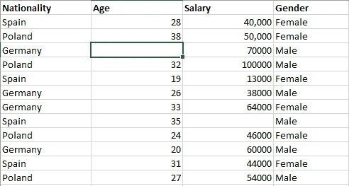
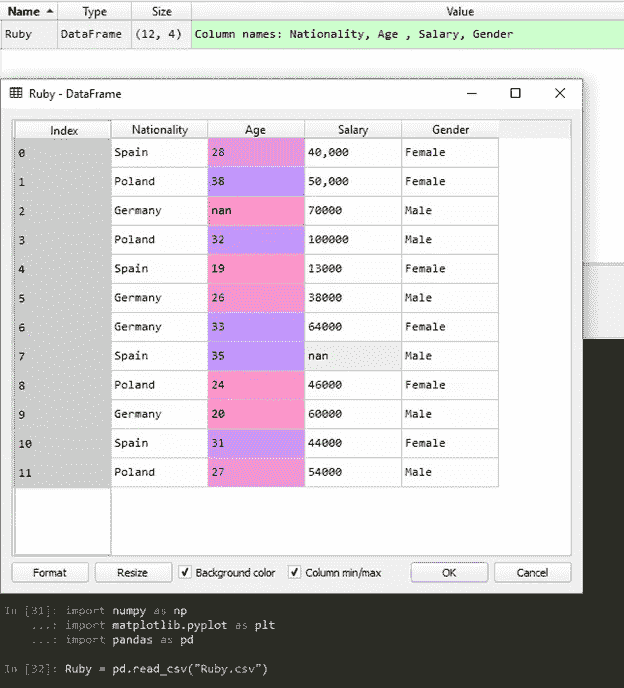
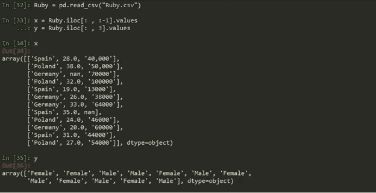

# 机器学习(ML)——数据预处理

> 原文：<https://medium.datadriveninvestor.com/machine-learning-ml-data-preprocessing-5b346766fc48?source=collection_archive---------0----------------------->

你好，

希望你喜欢我上一篇关于机器学习基础的帖子。

今天，我将向您介绍机器学习的**数据预处理**方面，这是 ML 的核心。

**顺便问一下，什么是数据预处理？**

全世界的数据科学家都在努力赋予数据预处理以意义。然而，简单地说，数据预处理是一种数据挖掘技术，包括将原始数据转换成可理解的格式。真实世界的数据通常不完整、不一致和/或缺少某些行为或趋势，并且可能包含许多错误。数据预处理是解决这类问题的一种行之有效的方法。

这是怎么做到的？就像医疗专业人员让病人为手术做准备一样，数据预处理也是如此，它为进一步的处理准备原始数据。以下是数据预处理中要采取的步骤

*   数据清理:填充缺失值，平滑噪声数据，识别或删除异常值，并解决不一致问题。
*   数据集成:使用多个数据库、数据立方体或文件。
*   数据转换:规范化和聚合。
*   减少数据量，但产生相同或相似的分析结果。
*   数据离散化:数据简化的一部分，用名义属性代替数字属性。

现在是我们采取一些实际步骤来理解数据预处理是如何完成的时候了。

**第一步。数据收集**

这里我们有一个数据集，其中包含 IT 专业人员的信息，如他们的国家、年龄、工资和性别，如下所示:

您可以随意创建该数据集的副本，也可以点击下载精确的数据集

您一定已经观察到上面的数据集包含一些空单元格，这是故意的。你很快就会看到这是如何进行的。我们随后的重点将完全集中在处理缺失数据上。

**第二步。导入库**

现在让我们导入我们的库，即程序员完成一些工作所需的预编译例程和资源，并开始预处理。

我们将在本模块中探索三个主要的库，它们是 ***numpy、matplotlib.pyplot 和 pandas。numpy*** 库包含数学工具，因此它可以用于在我们的代码中包含任何类型的数学，而***matplotlib . py plot***用于绘制直观的图形，最后 ***pandas*** 用于导入和管理数据集。

以下是我们导入库的方式:

*#* ***导入库***

*导入 numpy 作为 np*

*导入 matplotlib.pyplot 作为 plt*

*进口熊猫当 pd*

PS:给他们起的别名；这将在您的代码中证明是有用的，便于实现。

**第三步。导入数据集**

现在我们已经导入了库，我们需要获取数据集。在我的本地电脑上，我将我的数据集命名为“Ruby ”,它的格式是. csv。所以我们做到了:

*Ruby = PD . read _ CSV(" Ruby . CSV ")*

导入数据集后，我们的变量资源管理器环境如下所示:

恭喜你！！我们已经成功地将数据集插入到测试环境中。

**第四步。将数据集设置为因变量和自变量**

好的，我们需要完成的下一个任务是，确定我们的因变量(y)和自变量(x)应该是什么？让我们回顾一下历史，当我们在高中时，我们被告知自变量是被调整或操纵以给出因变量的结果/值的变量。

因此，从我们上面的数据集，我们可以得出结论，变量国籍，年龄和工资是我们的自变量，而我们的因变量是性别变量，因为我们的目标是能够根据他们的工资，国籍和年龄来确定硅谷 IT 专业人员的性别。因此，我们这样设置我们的变量:

***#设定因变量和自变量***

*x = Ruby.iloc[:，:-1]。数值*

*y = Ruby.iloc[:，3]。数值*

PS:列的索引表示:在 python 中，索引从 0 开始。

对于 x 变量，第一个“:”表示我们希望选择所有的行，而第二个“:”表示列，其后的-1 表示我们希望选择数据集中除最后一列之外的所有列。而对于 y 变量，“3”表示我们只想选取第三列。

我们的 IPYTHON 控制台环境应该如下所示:

从上图中我们可以看到 python 是如何将变量分别设置到 x 和 y 中的。

至此，我们已经成功地完成了本周机器学习的核心内容，我们已经学会了如何导入包含我们的例程和资源的库，从本地资源获取我们的数据集，以及设置我们的因变量和自变量。

别忘了我们的数据集中仍有一些缺失的数据，需要解决。请注意下一个要点，我们将学习如何处理数据集中缺失的值。在那之前，继续呼吸，人格化学习！

编剧:拉吉·亚当·比佛拉(MSCA，MCP)。tech specialist Consulting Limited 的数据科学家/BI 分析师。

# 来自 DDI 的相关帖子:

 [## 用 7 个步骤解释深度学习——数据驱动投资者

### 在深度学习的帮助下，自动驾驶汽车、Alexa、医学成像-小工具正在我们周围变得超级智能…

www.datadriveninvestor.com](https://www.datadriveninvestor.com/2019/01/23/deep-learning-explained-in-7-steps/)  [## 数据科学和软件工程哪个更有前途？-数据驱动型投资者

### 大约一个月前，当我坐在咖啡馆里为一个客户开发网站时，我发现了这个女人…

www.datadriveninvestor.com](https://www.datadriveninvestor.com/2019/01/23/which-is-more-promising-data-science-or-software-engineering/)