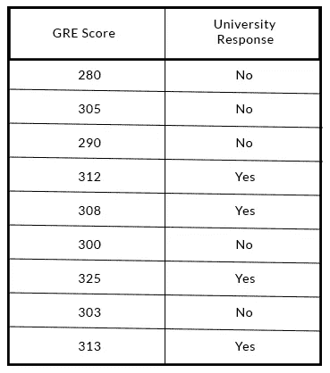
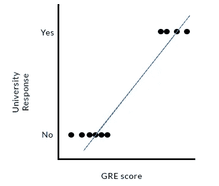
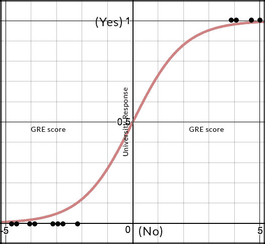
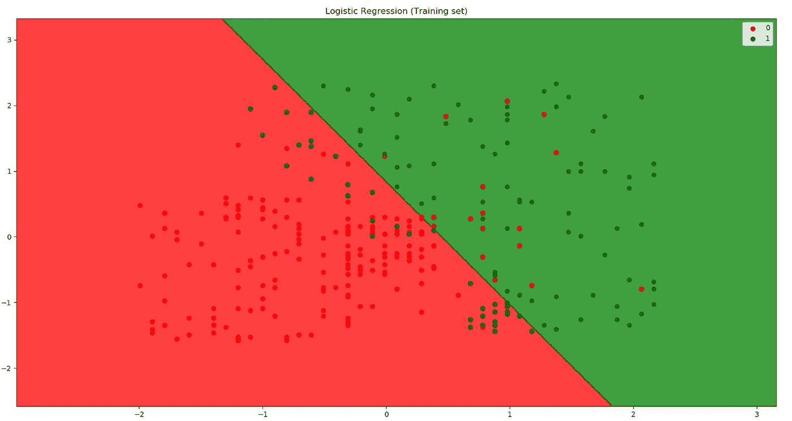

# 机器学习模型:逻辑回归

> 原文：<https://medium.datadriveninvestor.com/machine-learning-model-logistic-regression-5fa4ffde5773?source=collection_archive---------1----------------------->


假设你刚刚参加了 GRE 考试(这是一项被全球研究生院和商学院接受的标准考试)，你在总分 340 分中得了 310 分。你觉得很有信心，但是你想知道你以那个分数进入 A 级大学的机会或概率。



A demo dataset on GRE scores and corresponding Uni response

在制定全面的策略之前，您开始收集相关数据。你会看到一份 GRE 成绩清单，上面列有这些成绩是否被一流大学录取。大学的回答是“是”或“否”，没有任何介于两者之间的形式。

在我的[上一篇文章](https://medium.com/datadriveninvestor/machine-learning-model-simple-linear-regression-dbedb22ce200)中，我讨论了线性回归及其应用，它可以用来寻找自变量和因变量之间的相关性，我们这样做的方法是通过一条最佳拟合线。但是对于这种特殊的情况，响应变量表现为二分法，即它是二元的(是和否)而不是连续的。如果你仔细观察，很容易理解为什么这里的线性最佳拟合线不能达到目的，因此在这种情况下使用线性回归将给出很差的预测。



A linear best fit line in this situation would give bad predictions.

这就是我们的**逻辑回归。** Logistic 回归是一种统计方法，用于分析一个或多个自变量是否决定一个结果(其中只有两种可能的结果)。换句话说，它预测某事是真还是假，即响应是一个二分变量(二进制)，而不是预测像长度或大小这样的连续变量。



A sigmoid S-shaped curve

当然，更好的解决方案应该是得到类似 S 形曲线的东西。这被称为【This 形函数。我们使用 sigmoid 函数 S(x ),因为函数的输出介于 0 和 1 之间(概率估计)。我们可以用函数来估计以某个 GRE 分数被 A 级大学录取的概率。我们将基本上*拟合*(训练)我们的 sigmoid 曲线来适应我们的训练集，并使用该模型来找出某个分数被录取的概率。

我们可能会决定，如果概率低于 50%，大学更有可能拒绝申请，反之亦然。


The formula for the sigmoid function. The function has a value between 0 and 1, which gives you the probability.

如果你还记得从[上次](https://medium.com/datadriveninvestor/machine-learning-model-simple-linear-regression-dbedb22ce200)开始，我们使用了库 *sklearn.linear_model* 。这次我们也将使用同一个库。至于类，我们将使用*logisticregression。如你所见，这些名字非常直观。*

```
from sklearn.linear_model import LogisticRegression
```

接下来我们要做的是创建一个该类的对象。如果你以前关注过我的文章，你几乎会发现这是本能的一步。我们将把我们的对象称为分类器。

```
classifier = LogisticRegression()
```

之后，我们将在训练集上训练我们的对象。如果你记得不错，你会知道我们*适合*我们的模型到我们的训练集。

```
classifier.fit(X_train, y_train)
```

既然我们的模型已经*从我们的训练集中学习了*，是时候预测一些观察结果了。就像线性回归一样，我们将从我们的类中调用方法 *predict* 来预测 X_test 的相应值。让我们称我们的预测值为 *y_pred* 。

```
y_pred = classifier.predict(X_test) 
```

瞧啊。这会给我们一系列的预测数据。这里， *y_pred* 是预测值，而我们的 *y_test* 数据是实际值。


An example of a confusion matrix. In the diagram, the number of incorrect predictions are 5 and 10, while the number of correct predictions are 50 and 100\. Do you see how?

为了评估我们模型的性能，我们可以创建一个**混淆矩阵。**混淆矩阵是一种表格，通常用于描述分类模型的性能。我们可以用它来查看我们的模型准确预测的实例数量，反之亦然。混淆矩阵将包含我们的模型做出的所有正确预测以及所有不正确的预测。

为了创建混淆矩阵，我们将使用库 *sklearn.metrics* 中的函数*混淆矩阵*。到目前为止，我们看到的名字都很直观。

```
from sklearn.metrics import confusion_matrix
```

现在我们将调用我们的函数并简单地传递参数。这个函数的第一个参数要求真实(正确)的值，它由我们的 y_test 值表示。第二个参数要求我们的估计(预测)值，它由我们的 y_pred 值表示。我们可以传递这两个参数来成功地创建我们的混淆矩阵。

```
cm = confusion_matrix(y_test, y_pred)
```

这就对了。您已经成功地将逻辑回归应用到您的问题中。当预测变量是分类形式(文本形式)或二进制形式(0 或 1)时，这是一个简单而有效的机器学习模型。

无论你从机器学习模型中找到什么样的见解，你都可以将其表示为可视化。

> “视觉让我们能够更好地理解见解，并与他人交流这些见解。这些数据通常以故事的形式展示，将原本可能被忽视的模式、趋势和相关性可视化。”



我们可以创建吸引人的可视化效果，如上图所示，来代表我们当前的发现/见解。如果分类器预测数据点为“0 ”,我们可以决定将数据点涂成红色，否则涂成绿色。逻辑回归是一个线性分类器，这意味着它在两类观察值之间画一条直线进行分类。如果仔细观察图表，红色区域中的绿点和绿色区域中的红点是我们的模型在这种情况下做出的错误预测。这取决于你要解决的问题。机器学习的一条黄金法则是永远对结果保持怀疑。我将在以后的文章中深入讨论数据可视化。

祝你好运！