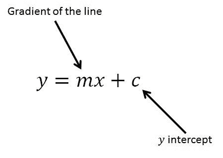
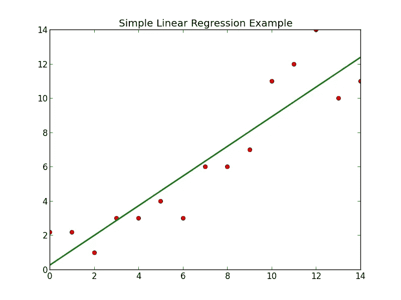
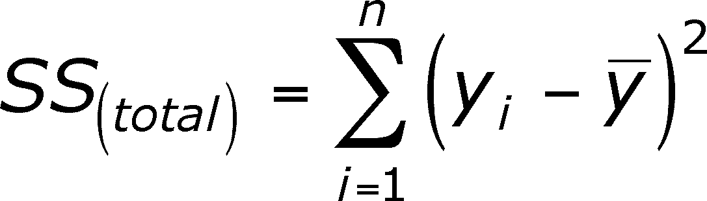
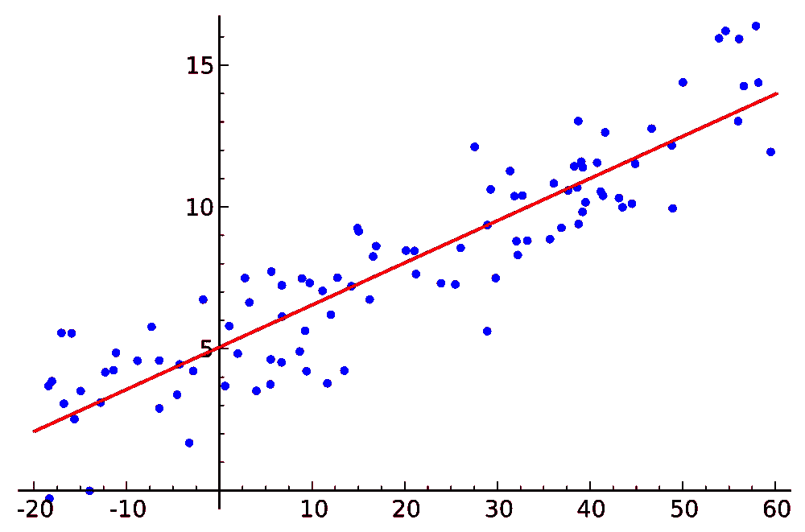

# 机器学习模型:简单线性回归

> 原文：<https://medium.datadriveninvestor.com/machine-learning-model-simple-linear-regression-dbedb22ce200?source=collection_archive---------0----------------------->


准确描述机器学习的方法之一是它是解决现实世界问题的数学优化的领域。是的，以后都是数学！你选择一个你非常想解决的问题，你找到合适的数据，你认为这些数据会帮助你对这个问题有更深刻的认识，你选择最适合这个情况的模型，然后进入后面的阶段。在本文中，我将专注于一个特定的机器学习模型，这也是最简单的，涵盖理论，然后展示如何应用它。

有时，当您试图使用机器学习解决现实世界的问题时，您可能希望检查某些因素是否与某种影响有任何关联。例如，您可能想要检查垃圾食品消费量的增加是否与某个地方在某段时间内被诊断患有胆固醇的人数有任何关联。在特定的例子中，消费垃圾食品的人数将是一个预测变量(独立变量 x)，它是自由变化的，根据我们的假设，被诊断患有疾病的人数将是对 x 的变化做出反应的反应变量(因变量 y)。

> 在这里我必须指出，相关性并不一定意味着因果关系。
> “仅仅因为 A 与 B 相关联而导致 B 的假设，往往**而不是**被接受为一种合法的论证形式”。*一个典型的相关性与因果性的例子是，吸烟可能与酒精中毒有关，但不会导致酒精中毒。记住这一点。*

## 继续，什么是简单的线性回归？

线性回归是在自变量和因变量之间形成关系的方法。您可能遇到的最简单的情况是，当您要检查某个响应的单个预测变量(自变量 x)时。换句话说，您可能希望检查单个操作是否与某个响应有任何关系。这叫做简单线性回归**。**

**这个过程非常简单。我们将简单地尝试找出一条最适合我们数据的直线。在这一点上，你可能想重温你的高中数学。别担心，我会掩护你的。**

********

**(On the left) Equation of a straight line. y is the dependent variable and x is the independent variable. The gradient is the slope of the line which determines how steep or flat the line is and the y-intercept is basically where the line cuts the y-axis. (On the right) A line that best fits the data.**

**在我们开始写我们的算法之前，我们有必要了解我们的算法是如何通过研究我们的数据，找出最佳拟合直线的方程的。**

****

**如果你看左边的图，你可以看到一个叫做*垂直偏移*，的东西，它是实际数据和预测直线模型之间的差异。**

**我们的算法取所有这些*垂直偏移*的平方和，即差值，并得出该总和最小的线。**这是我们算法的症结所在。****

****

**The best fit line is the one for which the SS value will be the minimum.**

**在我的[上一篇文章](https://medium.com/@amitabhadey/data-preprocessing-for-machine-learning-188e9eef1d2c)中，我讨论了为机器学习预处理数据的系统步骤。我讨论了为什么它是必要的，以及如何将数据集分成训练集和测试集。数据预处理模板在这里[可用](https://gist.github.com/AmitabhaDey/91773ca0a9d7ab5c5e4c442780c3e879)使用。**

**一旦你准备好数据，我们将对我们的数据集进行线性回归。我们不必手动执行操作。一个名为 *sklearn.linear_model* 的库使得这项繁琐的任务变得简单，它有一个非常适合这项工作的类，名为 *LinearRegression* 。很明显！**

```
from sklearn.linear_model import LinearRegression
```

**如果您还记得我以前的文章，下一步自然是创建该类的对象来调用该类的函数。我们将把我们的对象命名为*回归器*。**

```
regressor = LinearRegression()
```

**现在我们的回归器需要在我们的数据集上进行训练。该训练也称为 *fit* 。我们将输入两个训练集 X_train 和 y_train 作为它的参数。(如果这让你困惑，请参考我之前的文章**

```
regressor.fit(X_train, y_train)
```

**我们基本上是告诉机器使用线性回归模型，并从我们的训练集中的数据点集中学习。*机器在学习！***

**既然我们的*回归器*对象已经从我们的训练集中学习了，我们就要检验它预测新观测值的准确性。很简单，我们将使用一个叫做 *predict 的方法，在 *LinearRegression* 类中有*可用。作为它的参数，我们将输入 X_test，看看它能多好地预测它们的响应(对应的因变量 Y)。现在，我们姑且称它们为 y_pred。**

```
y_pred = regressor.predict(X_test)
```

**这会给我们一系列的预测数据。这里， *y_pred* 是预测值，而我们的 *y_test* 数据是实际值。我们可以比较这两个集合，以评估我们的模型表现的好坏。**

**然后，我们可以继续将我们的结果转换成可视化的图表。我们将基本上散点图我们的数据，并绘制最佳拟合线。对于这个任务，我们将使用 matplotlib 库，这是最流行的 Python 2D 绘图库之一。**

```
import matplotlib.pyplot as plt
```

**我们想要一个散点图，所以将调用*散点图*方法。最初，我们想要散点图我们的训练集-X _ train 和 y_train。我们可以决定用蓝色来代表它们。**

```
plt.scatter(X_train, y_train, color = 'blue')
```

**在我们分散的数据中，我们想要绘制出我们的最佳拟合线，而不是散点图。在同一图表上，最佳拟合线的坐标是 X 坐标(X_train)和相应的预测值。我们之前已经预测了 X_test 的值。简单地用 X_train 代替 X_test，我们可以用类似的方式找到相应的预测值。下面的代码非常简单明了:**

```
plt.plot(X_train, regressor.predict(X_train), color = 'red')
```

**我们基本上是在用 X_train 作为 X 坐标，用 X_train 中每个数据点的相应预测值作为 y 坐标来绘制一条线。让最佳拟合线为红色。**

**现在，为了显示该图，我们将使用:**

```
plt.show()
```

****

**The resulting figure should be something like this.**

**在上图中，蓝色的点是真实值，而红色的数据点是预测值。红色最佳拟合线上方的蓝点告诉我们实际值高于我们的预测值，那些较低的点告诉我们实际值低于我们的预测值，那些与我们的最佳拟合线重合的点已经被我们的模型准确预测。我们的模型(最佳拟合线)就是基于这些训练集进行训练的。为了弄清楚我们的模型是否运行良好，我们将绘制另一个图表，这次我们将保持最佳拟合线不变，但是用散点图表示我们的测试数据(X_test)。**

```
plt.scatter(X_test, y_test, color = 'blue')plt.plot(X_train, regressor.predict(X_train), color = 'red')
plt.show()
```

**如果更多的曲线与我们的最佳拟合线重合或相当接近，可以说我们的模型表现良好。**

**这样你就可以创建自己的机器学习模型了。您已经在给定的数据集上建立了模型，并找到了自变量和因变量之间的相关性，用最佳拟合线表示。然后，最佳拟合线可用于进行未来预测。**

**尝试将此模型应用于以下情况:**

1.  **高中 GPA vs 高考分数**
2.  **瘦体重与肌肉力量**
3.  **花在广告上的钱与总销售额之比**
4.  **年资与薪水**
5.  **体育锻炼(分钟)与胆固醇水平**

**祝你好运！**