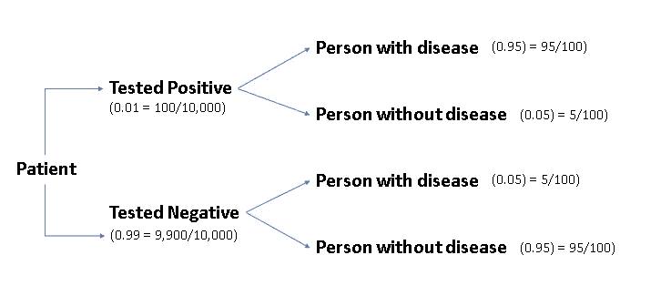
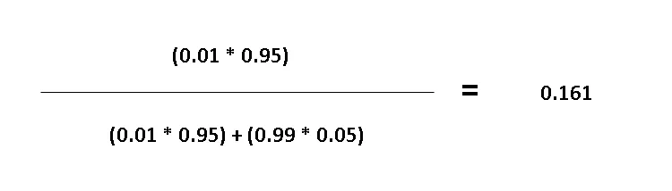
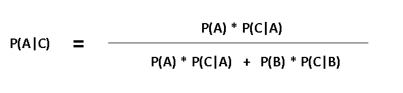
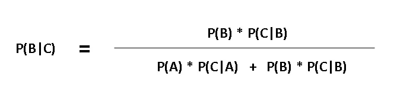

# 数据科学生涯—第 4 部分—机器学习—朴素贝叶斯

> 原文：<https://medium.datadriveninvestor.com/machine-learning-naive-bayes-58119642495e?source=collection_archive---------9----------------------->

假设你被检测出患有一种无症状的疾病，而这种疾病每 100 人中就有 1 人患有。你做的测试有 95%的准确率。你测试呈阳性。你得这种病的可能性有多大？如果你的答案与大多数人的答案相符，为 95%。

*这是不正确的——你也会明白，这根本就不接近。这个问题的逻辑在本帖中有所提及。*

所以，如果你一直在关注我的博客，这是我关于朴素贝叶斯的机器学习的第四篇文章。

如果你是第一次来这里，下面是我的介绍性文章的链接，希望你喜欢我博客上的内容，珍惜这次学习之旅。

 [## 开始数据科学职业生涯？

### 你对人工智能的能力着迷吗？还是你属于那种相信…

medium.com](https://medium.com/@harris.datascientist/beginning-a-career-in-data-science-241102f1fc5a) 

© [Dustin Lee](https://unsplash.com/photos/jLwVAUtLOAQ?utm_source=unsplash&utm_medium=referral&utm_content=creditCopyText), Unsplash

# 有趣的事实:

*阿兰·图灵开发了****Banburismus****，***一个密码分析程序，用来帮助破解* ***德文 Kriegsmarine 消息*** *在****称为 ***顺序条件概率*** *的过程被应用于* *来推断关于英格玛的可能设置的信息。然而，在 20 世纪 40 年代的* ***贝叶斯统计*** *被推崇* ***抽样*** *和* ***频率统计的统计学家们所不齿。*** *这个我是从《不会死的理论》***作者* ***莎伦·麦克格雷恩的书中得知的。********

# ****贝叶斯法则**描述了一个事件发生的概率，基于可能与该事件相关的条件的先验知识。**

**例如，如果癌症与年龄有关，那么使用贝叶斯定理，与在不知道人的年龄的情况下进行的癌症概率的评估相比，可以使用人的年龄来更准确地评估他们患有癌症的概率。**

# **这种直觉可能真的会帮助你更好地理解:**

**在这篇关于朴素贝叶斯的文章的前面，我提出了一个场景，在这个场景中，你被检测出患有一种无症状的疾病。提供了概率估计，你必须计算出患这种疾病的概率。这可以被认为是“贝叶斯法则”上一个微妙的直觉层面的例子。理解这个逻辑将有助于你更好地理解这个概念。**

**假设，我们测试了 10，000 个病人。在这一万名患者中，其中 100 人患病，9900 人没有患病。**

**当对 100 名患有这种疾病的患者进行检测时，结果有 95 人呈阳性，5 人呈阴性。然而，当对 9900 名没有患病的患者进行检测时，我们对 495 名患者的检测结果为阳性，其余 9405 名患者的检测结果为阴性。**

**因此，总共有 590 名患者呈阳性结果。在这些病人中，95 人患有这种疾病，495 人没有。如果你所知道的是，你被检测为阳性，那么你患这种疾病的几率是 95/590 = 0.161，或者说大约是 16 %。**

****

**© [Tim Marshall](https://unsplash.com/photos/nuc-mltC4iQ?utm_source=unsplash&utm_medium=referral&utm_content=creditCopyText), Unsplash**

# **这也可以用另一种方式来解释，让我们用数学方法来处理这个问题:**

****

**我们知道，患者被检测为阳性的概率是 1%，而患者被检测为阴性的概率是 1 —概率(检测为阳性)，即 99 %。**

**当新的信息出现时，测试准确的概率是 95%。**

*   **我们可以推断，被检测为阳性的患者有 95%的可能性会患有无症状疾病&被检测为阳性的患者有 5%的可能性不会患有该疾病。**
*   **类似地，检测结果为阴性的患者患病的概率是 5% &检测结果为阴性的患者不患病的概率是 95%。**

**现在，根据条件概率公式，事件 B 相对于事件 A 发生的概率只不过是这两个独立事件的概率的乘积。**

*   **所以，检测呈阳性时患此病的概率:
    0.01 * 0.95 = 0.0095**
*   **检测阳性时未患病的概率:
    0.01 * 0.05 = 0.0005**
*   **检测阴性时患此病的概率:
    0.99 * 0.05 = 0.0495**
*   **检测阴性时未患病的概率:
    0.99 * 0.95 = 0.9405**

**我们有四种可能的情况，你可以检查这些概率加起来是 1。但是，我们想知道，假设你被检测为阳性，你患无症状疾病的几率有多大。**

**因此，在这 4 种给定情景中，只有 2 种是可能的，即患者患有疾病的 2 种情况。然而，为了找到一个精确的概率度量，也为了保持这两种情况的概率比，我们可以， ***将它们归一化*** 或者等效地，将它们除以某个数，这样它们现在加起来就是 1。我们要除以的是两者之和。所以我们患这种病并被检测为阳性的新概率是:**

****

**在更正式的版本中，贝叶斯定理可以被认为是:**

************

**© [Jörg Angeli](https://unsplash.com/photos/luhbI6_pIdg?utm_source=unsplash&utm_medium=referral&utm_content=creditCopyText), Unsplash**

# **现在，这就是“天真”一词在朴素贝叶斯中的由来**

**我们将在这里做一个天真的假设。让我们看看这两个事件同时发生的概率。所以，P(A & B)无非是 P(A **∩** B)，是 P(A)和 P(B)的乘积。这只有在两个事件独立时才会发生。如果不是，那么这不是真的。**

**然而，在朴素贝叶斯中，我们将假设我们的概率是独立的。正如我所说，这是一个天真和错误的假设。但在实践中，它运行良好，使我们的算法非常快。**

**我要用的另一个公式是条件概率公式，这是 P 的两种写法(A **∩** B)，这是我们贝叶斯定理的基础。**

# **P(A | B) * P(B) = P(B | A) * P(A)**

**但是我们在这里使用的技巧是忘记 P(B)。因此，这个等式不成立。所以，让我们通过引入比例来稍微修改一下。**

# **P(A | B) ∝ P(B | A) * P(A)**

**这将非常有效，因为实际上 P(B)将会抵消，所以这两者成比例的事实将会非常有用。**

**现在，我们准备使用我们天真的假设。让我们考虑同样的情况，当你被检测为阳性时，你应该发现患无症状疾病的机会。所以，用我们刚刚复习过的条件概率规则，把它写成:**

> **P(疾病|检测阳性)∝ P(检测阳性|疾病)* P(疾病)
> P(疾病|检测阳性)∝ [(95/100) * (1/100)] * (1/100)**
> 
> **P(疾病|测试阴性)∝ P(测试阴性|疾病)* P(疾病)
> P(疾病|测试阴性)∝ [(99/100) * (5/100)] * (1/100)**

**类似于最初的方法，让我们通过将每个概率除以所有概率的总和来归一化概率，以获得期望的概率。**

# **我没告诉你吗？95%与答案相差甚远。嗯，贝叶斯法则证实了这一点！**

****

**© [Brooke Lark](https://unsplash.com/photos/nTZOILVZuOg?utm_source=unsplash&utm_medium=referral&utm_content=creditCopyText), [Unsplash](https://unsplash.com/photos/aGjP08-HbYY?utm_source=unsplash&utm_medium=referral&utm_content=creditCopyText)**

**下一篇文章将会是关于支持向量机(SVM)的，一旦它准备好发表，我将会发布它的链接。**

**一如既往，我要感谢我的读者们宝贵的时间和兴趣。用我最喜欢的一句话来结束这篇关于朴素贝叶斯的文章:**

*****“权力存在于人们认为它存在的地方。这是个骗局。墙上的影子。一个非常小的人可以投下非常大的阴影。”***——瓦里斯勋爵，《权力的游戏》**

****

**Enjoyed the article? Click & Hold the ❤ below to recommend it to other interested readers!**