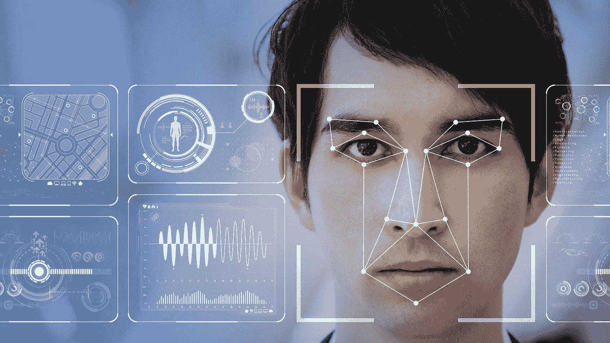
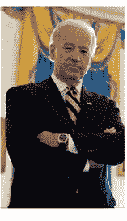
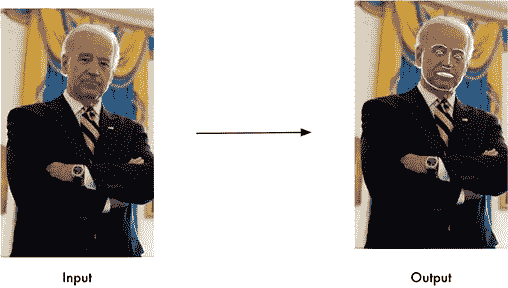
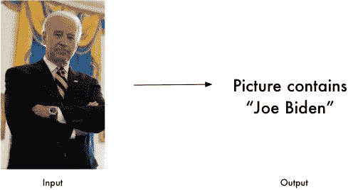

# 人脸识别的机器学习

> 原文：<https://medium.datadriveninvestor.com/machine-learning-on-facial-recognition-b3dfba5625a7?source=collection_archive---------0----------------------->



Image result for facial recognition

在机器学习中，**卷积神经网络** ( **CNN** 或 **ConvNet** )是一类深度前馈人工神经网络，已成功应用于分析视觉图像。它们在图像识别(面部识别)和视频分析、推荐系统和自然语言处理中有应用。这里，**面部识别**将被分析。

# 什么是面部识别？

面部识别是一种生物统计软件应用程序，能够通过比较和分析基于人的面部轮廓的模式来唯一地识别或验证一个人。面部识别主要用于安全目的，尽管对其他领域的使用也越来越感兴趣。事实上，面部识别技术已经受到了极大的关注，因为它具有与执法以及其他企业相关的广泛应用的潜力。

有不同的面部识别技术在使用，如**广义匹配面部检测方法**和**自适应区域混合匹配方法**。大多数面部识别系统基于人脸上不同的节点来工作。针对与人的面部点相关联的变量测量的值有助于唯一地识别或验证该人。通过这项技术，应用程序可以使用从人脸捕获的数据，并可以准确、快速地识别目标个人。随着 3d 建模等新方法的出现，面部识别技术正在快速发展，这有助于克服现有技术的问题。

面部识别有许多优点。与其他生物识别技术相比，面部识别是非接触式的。可以从远处捕捉面部图像，并且可以对其进行分析，而无需与用户/人进行任何交互。因此，没有用户能够成功地模仿另一个人。面部识别可以作为时间跟踪和出勤的极好的安全措施。面部识别也是一种廉价的技术，因为像其他生物识别技术一样，它涉及的处理更少。

# 如何在面部识别上使用机器学习

我们将用于面部识别的方法非常简单，但是你可以在一个非常复杂的问题[的情况下检验它。让我们了解一下现代人脸识别是如何工作的！](https://medium.com/@ageitgey/machine-learning-is-fun-part-4-modern-face-recognition-with-deep-learning-c3cffc121d78)

这里的目标是让深度神经网络输出一个人的带有识别的人脸。这意味着需要训练神经网络来自动识别面部的不同特征，并基于此计算数字。神经网络的输出可以被认为是特定人脸的标识符——如果你传入同一个人的不同图像，神经网络的输出将非常相似或接近，而如果你传入不同人的图像，输出将非常不同。

机器学习通过选择一种机器学习算法，输入数据，得到结果，解决了很多问题。我们不需要建立自己的神经网络。我们可以使用经过训练的模型 [dlib](http://dlib.net/) 。它确实做了我们需要它做的事情——当我们传入某人的面部图像时，它输出一串数字(面部编码);比较来自不同图像的人脸编码将告诉我们某人的脸是否与我们有图像的任何人相匹配。

然而，一个名为[面部识别](https://github.com/ageitgey/face_recognition#face-recognition)的面部识别库更容易安装和使用。这将在这里某个地方使用。

这些是我们将采取的步骤:

1.  检测:在图片中查找人脸
2.  地标:在图片中查找和操作面部特征
3.  比较:识别图片中的人脸

# 面部识别的步骤

1.  准备图像

这里，为了简单起见，将使用一个图像。



1.  陆标

通过获取每个人的眼睛、鼻子、嘴和下巴的位置和轮廓，在图像中进行操作。



```
import face_recognitionimage = face_recognition.load_image_file("your_file.jpg")face_landmarks_list = face_recognition.face_landmarks(image)
```

从面部识别获得输出有点乏味，面部识别特征应该被认为是重要的分析。

1.  识别图片中的人脸

这是通过识别照片中出现的人的面部来实现的。



```
import face_recognitionknown_image = face_recognition.load_image_file("biden.jpg")unknown_image = face_recognition.load_image_file("unknown.jpg") biden_encoding = face_recognition.face_encodings(known_image)[0]unknown_encoding = face_recognition.face_encodings(unknown_image)[0]results = face_recognition.compare_faces([biden_encoding], unknown_encoding)
```

这将输出“Joe Biden”作为照片中的人。

这种方法也可以用于一张照片中的几个图像，这是通过挑出照片中出现的人脸来完成的。然后，使用上面列出的步骤来分析(n)的输入，以给出(n)的输出。

# 结论

我们已经能够使用简单的方法通过检测、处理和识别面部轮廓来检测照片中的图像代表谁。

这清楚地表明了机器学习是如何在人工智能领域迅速占据主导地位的。一个日常的例子是脸书，它自动标记照片中的人，而无需手动标记。这在以前有时并没有实现，而是照片中的人被加上了建议标签。