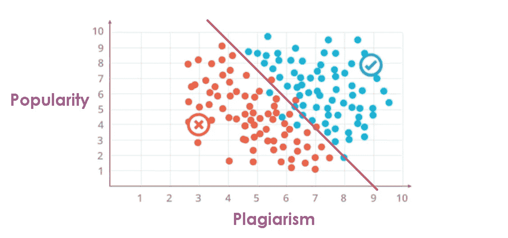
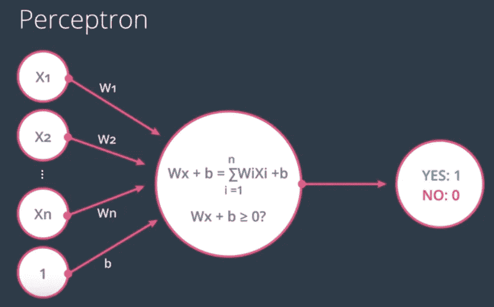
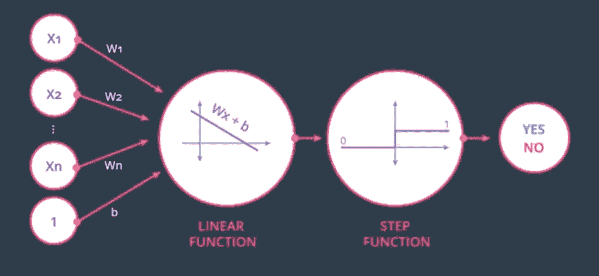

# 数据科学职业生涯—第 2 部分—机器学习—感知机

> 原文：<https://medium.datadriveninvestor.com/machine-learning-perceptron-algorithm-bd46e954791?source=collection_archive---------19----------------------->

每个神经网络的构建模块都是一个由相互连接的感知机组成的巨大网络！

所以，如果你一直在仔细关注我的博客，这是我关于机器学习感知机的第二篇文章。如果是一个人第一次浏览我的博客，这里是我的介绍性文章的链接，希望你喜欢我博客上的内容，很高兴在整个旅程中看到你。

 [## 开始数据科学职业生涯？

### 你对人工智能的能力着迷吗？还是你属于那种相信…

medium.com](https://medium.com/@harris.datascientist/beginning-a-career-in-data-science-241102f1fc5a) 

© [Thomas Lipke](https://unsplash.com/photos/oIuDXlOJSiE?utm_source=unsplash&utm_medium=referral&utm_content=creditCopyText), [Unsplash](https://unsplash.com/search/photos/aurora?utm_source=unsplash&utm_medium=referral&utm_content=creditCopyText)

# 有趣的事实:

**DeepMind 的 AlphaZero 击败了围棋、象棋和国际象棋的顶级人工智能冠军。**在 2016 年成功击败人类最佳围棋选手后，AlphaGo 在一年后升级为更强大的广义化身， *AlphaZero* **。AlphaZero 没有游戏的先验知识，只有基本的游戏规则作为输入，仅用了四个小时就学会了如何下大师级的国际象棋。然后，它在一场 100 局的比赛中击败了斯托克菲什(顶级人工智能国际象棋选手)——一局未输。**

在 3 天内，AlphaGo Zero 超过了 AlphaGo Lee，该版本在 2016 年的 5 场比赛中击败了 Lee Sidol。在 21 天内，AlphaGo Zero 达到了 AlphaGo Master 的水平，该版本在 2017 年的 3 场比赛中击败了 60 名顶级职业选手和世界冠军柯洁。在 40 天内，AlphaGo Zero 超越了所有其他版本的 AlphaGo，并且无可争议地成为了世界上最好的围棋选手。它完全是在自我游戏中完成的，没有人为干预，也没有使用任何历史数据。相当，一个壮举要实现！

# 在我们深入到感知机的实际概念之前，让我从一个非常简单的例子开始:

**假设你正在建立一个社交网络平台，就像脸书或 Twitter 一样。作为一种策略，你决定为用户在你的网站上受欢迎和真实的内容奖励一些积分。**判断一个帖子是否值得打赏，你考虑的是点赞数、分享数&评论聚到 ***“人气”*** 在 0-10 之间 ***“抄袭”*** 在 0-10 之间，这里 10 表示完全原创，0 反之亦然。

那么，让我们来看看一些样本帖子。第一个帖子的流行指数为 9，抄袭指数为 9，该帖子非常受欢迎，获得了很多关注，因此获得了奖励。然后，我们有第二个帖子获得 3/10 的受欢迎度和 2/10 的抄袭，这个帖子并不突出，也不是真实的，因此它没有得到奖励。现在，我们有了第三个帖子，它的受欢迎程度得到了 6/10，抄袭得到了 7/10，内容非常新颖，也受到了很多人的赞赏。 ***嗯，这个帖子有奖励吗？？***

**这个问题的答案很容易缩小。**我们做我们大部分算法里做的事情，就是看我们之前的数据。上图显示了根据我们的参数获得奖励和拒绝的帖子。*红点*对应那些被拒绝奖励的帖子，而*蓝点*对应那些被奖励的帖子。因此，我们可以从这个图表中推断出 ***“具有良好人气和原创性的帖子更有可能获得奖励，而在这两方面得分都很低的帖子更不可能获得奖励”*** 。

© [Kira auf der Heide](https://unsplash.com/photos/fV4-DdSdcpI?utm_source=unsplash&utm_medium=referral&utm_content=creditCopyText), [Unsplash](https://unsplash.com/search/photos/gift?utm_source=unsplash&utm_medium=referral&utm_content=creditCopyText)

**看起来这些数据可以用一条线很好地分开，看起来棕色线上的大多数帖子得到了奖励，而棕色线下的大多数帖子没有得到奖励。**

所以，这条线将成为我们的模型。这里的模型犯了几个错误，因为线下的蓝点很少，线上的红点也很少。为了简单起见，我们不要考虑那些错误分类的点。

***我们是如何用这一行精确地将给定的数据分成想要的类的呢？***

让我涉及一些数学…

将变量 ***抄袭*** 对应的横轴视为 x1，将变量 ***人气*** 对应的纵轴视为 x2。所以，这条分开蓝点和红点的边界线将会有一个线性方程。

2x1+ x2 — 18 = 0

这是什么意思？？

把这个当做我们的 ***【分数】*** 方程式 ***。***

分数是 2 x(抄袭)+ 1 x(人气)— 18。因此，对于任何给定的帖子，如果分数是正数，那么帖子会得到奖励；如果分数是负数，那么帖子不会得到奖励。

得分> 0:奖励

得分< 0 : Not Rewarded

> I如果得分为 0，按照惯例，帖子会得到奖励，这个预测不会对模型产生太大影响。

在更一般的情况下，我们线的方程将是这样的:

(w1x1 + w2x2 + w3x3 + ………..wnxn ) + b = 0

Wx + b = 0，其中 b 是 ***偏置项，***

W = w1，w2，w3…wn； ***权重***

x = x1，x2，x3…..xn； ***输入***

y = 0 或 1； ***标签***

**预测:**这里，算法预测我们的标签是什么，即

> 如果 Wx + b > = 0，则 y` = 1
> 
> y` = 0 if Wx + b < 0

The goal of our problem here is to find the boundary line that classifies most of the points above the line as Blue and the points below the line as Red, which is exactly equivalent to predicting the y` as closely as possible to y.

© [Júnior Ferreira](https://unsplash.com/photos/7esRPTt38nI?utm_source=unsplash&utm_medium=referral&utm_content=creditCopyText), [Unsplash](https://unsplash.com/search/photos/bulb?utm_source=unsplash&utm_medium=referral&utm_content=creditCopyText)

**现在让我们引入*感知器的概念。*** 这只是把我们的方程式编码成一个小图形。我们构建它的方式是，我们将数据和边界线放入一个节点中。然后我们添加更小的节点来输入，在我们的例子中是流行和抄袭。这里，让我们考虑流行度是 9，抄袭也是 9 的情况。感知器所做的是，它绘制点(9，9)并检查该点是位于正区域还是负区域。

如果点在正区域，则返回 Yes (1)，如果点在负区域，则返回 No (0)。重量(w1，w2，w3…..wn)和偏差(b)定义了线性方程。

基于给定的输入(9，9)，Wx + b 形式的线性方程的分数是

**2(9)+9–18 = 9**；分数> = 0

这里的分数大于 0。因此，我们知道给定的点位于线上方，帖子将获得奖励。分数位于区间(- ∞，+ ∞)。这需要转换为 0 或 1，即要么帖子得到奖励，要么帖子没有得到奖励。

© Udacity

这里，我们可以使用一个隐函数来获得想要的输出。 ***其中一个功能就是步进功能。*** 如果输入是 0 或者是正数，阶跃函数返回 1。如果这个函数的输入是一个负数，那么它返回 0。

© Udacity

所以在现实中，这些感知器可以被视为几个节点的组合。其中第一个节点对给定的一组 ***输入*** 和 ***权重*** 计算线性方程，第二个节点将 ***阶跃函数*** 应用于结果。将来，我们会遇到其他的阶跃函数。

# 现在，我们终于有了描述感知器算法的所有工具。

*   我们从一个随机方程开始，它将确定一些线(考虑 2 个特征)和 2 个区域，即正区域和负区域。我们将移动这条线以获得更好的拟合。
*   对于每个错误分类的点(x1，x2，x3…xn)我们执行以下操作:

a)如果预测为 0，这意味着该点是负区域中的正点，那么我们将如下更新权重

因为 i = 1，2，3…n

*   **Wi` = Wi + α*xi**
*   **b` = b + α**

这里α是学习率参数。

b)如果预测是 1，这意味着该点是正区域中的负点，我们将以类似的方式更新权重，除了我们将减去而不是增加。

因为 i = 1，2，3…n

*   **Wi` = Wi — α*xi**
*   **b` = b — α**

通过执行以下步骤，我们可以将线移近我们的错误分类点。我们重复这些步骤，直到没有错误，或者直到错误值很低。

这就是感知器算法。

© Brooke Lark, Unsplash

这里是下一篇关于决策树的文章的链接。

 [## 数据科学职业生涯—第 3 部分—机器学习—决策树

### 我们每天都要做出成百上千个决定。像“我应该带红色还是……

medium.com](https://medium.com/datadriveninvestor/machine-learning-decision-trees-946255e6df2d) 

一如既往，我要感谢我的读者们的时间、兴趣和关注。用我最喜欢的一句话来结束这篇关于感知机的文章:

“我希望这件事不要发生在我的时代，”佛罗多说。“我也是，”甘道夫说，“所有活着看到这种时刻的人都是如此。但这不是他们能决定的。我们需要决定的是如何利用给我们的时间。”— J.R.R .托尔金《指环王》中。

Enjoyed the article? Click & Hold the ❤ below to recommend it to other interested readers!