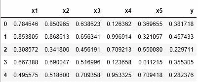
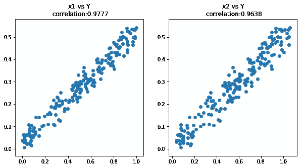

# 机器学习简介 1

> 原文：<https://medium.datadriveninvestor.com/machine-learning-preface-ba69bca4701d?source=collection_archive---------1----------------------->

这是一门关于机器学习的入门课程，旨在从实践的角度向分析师或软件工程师讲授数据科学。对于更全面的数学基础(在学完这门课程后)，我推荐斯坦福 cs231n、cs224n 和加州大学 cs294。

本课程的唯一独特之处在于，它给出了定制 ML 系统以适应商业问题的例子和指导方针，使商业了解现代能力，并向数学家提出了比传统 ML 问题更复杂的挑战。

我在哥伦比亚大学和百事可乐公司教过这个课程(有额外的附加内容)，并且正在考虑开设一个平行的课程来教授更多的关于定制 ML 系统的整个 pythonic 开发环境的实践开发。如果有兴趣参加课程，给我发消息 leedtan@gmail.com。

## 学习目标

我们将提出线性回归，将其与相关性进行比较，并将其作为模型进行分析。最后，我们将讨论堆叠线性回归模块来构建神经网络的优势。

如果你想跟随代码，代码贴在这里:
[ML](https://github.com/leedtan/LeeTanData/tree/master/MachineLearningPrefaceCode)前言的代码。

要在你的电脑上设置 python，按照我的教程在 windows 上设置 anaconda，并安装必要的库: [Python 安装](https://medium.com/@leetandata/basic-python-setup-for-ml-for-windows-users-aaadb2be534c)

# 引入回归

大多数现代机器学习都源于一种叫做线性回归的模型。线性回归解决了基于一些已知特征预测目标变量的问题。

*特征是观察的数字表示。一个机器学习任务可能是我今天是否快乐，如果我那天在工作中有会议，这两个特征将是[0–1]，以及[0–100]当天的温度。*

对于符号，让我们假设模型接受一组特性，我们称之为 **X** 。假设一个例子 X 由[x1，x2，x3]组成，分别代表三个日常营销预算。该模型试图预测一个目标变量，在本例中是公司当天的收入。当我们讨论一天销售额的真实值时，我们会称之为 **Y** 。当模型取 X，预测 Y，我们就把模型的预测**叫做 Yhat** 。

## 线性回归如何工作

线性回归由一组乘数参数化。对于每个输入变量，模型都有相应的乘数，我们称之为标量。

该模型接受 X，并通过将每个特征[x1，x2，x3，...]乘以标量乘数[a1，a2，a3，...]，然后将所有结果相加来预测 Y。例如，如果输入是 X=[2，1，3]，标量是 A=[2，3，0]，模型将预测 Yhat = A * X = 4 + 3+ 0 = 7。这表示某一天公司在 x1 上花了 2 美元，在 x2 上花了 1 美元，在 x3 上花了 3 美元，模型预测公司将赚 7 美元。

现在轮到你了，假设模型有 A = [1，0，-2]，你花了 X = [5，4，1]。那天你有多少收入？检查你的理解，确保你在继续之前达到收入= 3 美元。

## 学习线性回归

在每个样本上，我们可以从数据集中计算目标的预测值和真实值之间的损失函数。我们的损失函数惩罚坏的预测。然后，我们可以学习模型的参数[a1，a2，a3，...]，以最小化损失函数。关于复杂的优化讨论，请参见[软件工程师优化](https://towardsdatascience.com/neural-network-introduction-for-software-engineers-1611d382c6aa)。

为了这篇文章的目的，让我们来看看梯度下降背后的思想，但是把数学放一放。假设我们的模型是 A = [0，2]并且我们的数据集有三天的三个点:
第 1 天:X = [1，0]收入= 1
第 2 天:X = [2，0]收入= 1
第 3 天:X = [1，2]收入= 2

我们可以看到，在 A = [0，2]的情况下，我们的模型预测第 1 天和第 2 天的收入为 0，第 3 天的收入为 4。我们注意到，如果 a1 更大，模型将更准确地预测第 1 天和第 2 天，如果 a2 更小，模型将更准确地预测第 3 天。

我们将模型更新得更精确一点(预测更接近真实答案)，然后我们继续评估和更新。

梯度下降就是这种思维过程，但是通过对我们的数据有效地应用矩阵代数运算来完成。

现在，你可以忽略这个优化是如何超越一般概念的数学，只接受有一些数学优化。我们将在后面讨论模型如何学习这些值。

# 回归分析

这个模型本身是有价值的，但它通常不是最准确的方法。线性回归很有价值，因为它的参数 A 是可解释的，指示相对于输入要素增量的输出变化率。例如，如果 **A5** = **3** ，这意味着如果 **X5** 增加 1，则 Yhat 增加 **3** 。

直到 2016 年左右，工程师们花时间手工制作针对特定问题的有价值的功能。例如，在标准应用程序中，我们定义
Yhat = a1 * x1 + a2 * x2，并学习具有特征 x1，x2 的 a1，a2。
工程师可以改为设计特征 x1、x2 ^ 2 和 x1 / x2，使得
yhat = a1 * x1+a2 * x2 ^ 2+a3 * x1/x2
这被称为*特征工程*，因为他们是手工制作的，或者*工程*，特定的*特征*用在他们的模型中。
在此期间，ML 工程和主题专家(SME)之间有着紧密的合作，因为 ML 工程师需要 SME 提供如何创建有意义功能的想法。

## 概念检查:特征工程

使用上面在优化过程中描述的销售和营销数据集
([1，0]: Revenue = 1，[2，0]: Revenue = 1，[1，2]: Revenue = 2)
想出一些比 a1*x1 + a2*x2 更有助于模型拟合数据集的功能。

## 建议

1-创建一个值始终为 1 的特征，并定义函数:
a0 * 1 + a1 * x1 + a2*x2 用 a0 = 1，a1 = 0，a2 = .5
2-创建一个名为“x1 > 1”的特征，如果 x1 > 1，则等于 1，否则等于 0。
a1 * x1 + a2 * x2 + a3 * ('x1 > 1 ')拟合 a1=1，a2=.5，a3=-1 的数据

*不过不用担心，这只是一个思想实验，我们不会再这么做了。*

# 相关概念:回归与相关性

线性回归将输入和输出联系起来，所以有些人认为这就像输入和输出之间的相关性。但很多时候，当他们谈到相关性时，他们想到的实际上是一个输入因素如何影响产出，而不是从统计学家的角度来看通常的相关系数。

相关性度量关系“当变量 X 高时，Y 通常是高还是低？”如果 X 和 Y 完美地一起增加和减少，相关性为 1，如果它们彼此相反地跟踪，值为-1，如果它们不相关，值为 0。

让我们举一个模拟例子来说明这种关系。

## 例子

让我们详细介绍一下销售预测。我们定义了五个特性，X1-X5 代表每日营销预算，Y 代表每日销售额。问题是计算出每个营销行为的*投资回报* (ROI)，即哪些特性对 y 有积极影响，哪些对 y 有消极影响。

在这种环境中，变量是模拟的:

*   X1 随机[0–1]
*   X2 = X1 +噪声[0–0.1]
*   X3，X4，X5 随机[0–1]
*   y = X1–0.5 * X2+噪声[0–0.1]

在这种情况下，X1 和 X2 是正相关的，因为我们将 X2 定义为 X1 的一个小调整。对于那些感兴趣的人，让我们简单地在代码中得到更多的细节。对于那些想了解这段代码的人，这里有一个帖子。



上面看起来应该类似于 SQL 或 Excel 表。这是一个 2D 表，行代表日期或数据点，列代表特征和目标变量 y

我们的数据集由 200 天的这些输入特性和相应的每日销售额组成。

## 相关性分析

上面我们用规则 Y = X1–0.5 * X2+噪声产生了 Y。随后，请注意以下事项:
1。X1 的投资回报率为 1，X2 的投资回报率为负 0.5，因为 Y = X1–0.5 * X2
2。X1 和 X2 正相关，因为 X2 = X1 +噪声
3。现在让我们考虑一下相关性:当 X1 高时，Y 也会高吗？X2 高的时候，Y 会高吗？

下面我们将这些关系形象化。[同样，代码解释见此处。](https://medium.com/@leetandata/machine-learning-python-programming-introduction-for-business-people-10588e13ce9d)



在左图中，X1 与 Y 之间的相关性为正。当 X1 为高电平时，Y 也为高电平。但是 X2 和 Y 的相关系数也是 0.96，即使我们知道 X2 在 Y 上的投资回报率是负的 0.5！这是因为 X2 与 X1 密切相关，我们知道 X1 对 y 有很强的正面影响

## 相关性与回归

上述相关性分析无法发现每个特性对输出的实际影响。这些见解甚至连方向都不准确！这是因为计算相关性时一次只考虑两个变量。

另一方面，回归可以同时考虑所有相关变量。当它匹配 X1 到 Y 时，它考虑它认为 X2 具有的影响；当它将 X2 与 Y 匹配时，它会考虑 X1 的影响。它同时学习所有这些关系，以使其 ROI 适合数据集。

## 设置回归分析的代码

首先让我们为回归准备输入和输出数据。[同样，代码解释见此处。](https://medium.com/@leetandata/machine-learning-python-programming-introduction-for-business-people-10588e13ce9d)

那么让我们来看看回归:

哇，那很容易。一行代码执行回归，一行代码询问它学到了什么。那么它学到了什么？

## 解释回归模型

上面，我们将变量名映射到回归系数。

```
Regression coefficients from Sklearn
[('x1', 1.04),('x2', -0.54),('x3', -0.0),('x4', -0.0),('x5', -0.0)]
```

哇，回归几乎完美地了解到 X1 的投资回报率为 1 (1.04)，而 X2 的投资回报率为负 0.5(-0.54)。它还注意到其他功能几乎没有影响。

同样，线性回归乘数可以直接解释为 ROI。
如果 Yhat = 1.04 * X1 — .54 * X2，那么如果我们将 X1 增加 1，则 Yhat 将增加 1.04。此外，如果我们将 X2 增加 1，那么 Yhat 将减少 0.54，就像投资回报率的衡量标准一样！

## 更加可定制/复杂的选项

有一种替代方法可以解决这个问题。如果我们需要定制优化过程，我们可能需要在 Python 中使用 Tensorflow。这变得更加复杂，但使我们能够更好地控制。

要看这是什么样子(但不要担心理解它)，见下文。注意，它要长得多，也复杂得多，所以当我们不需要定制时，我们坚持使用简单的回归模型。

我们又一次学到了有意义的系数:

```
Regression coefficients From Tensorflow:
[('x1', 1.0),('x2', -0.49),('x3', -0.0),('x4', -0.0),('x5', -0.0)
```

**概念检查:用 Tensorflow** 学习回归上面我们注意到了一些核心章节。我们有一个 for 循环，它计算一个小的优化步骤，并执行 40000 次。调整上面的代码来回答下面的问题:需要多少个步骤才能使所有的参数都在实际值的. 1 以内？需要多少步骤才能使损失降到 0.01 以下？
提示:使用`sess.run(loss {x_ph:X, y_ph:Y})`检查优化过程中的损失值。

## 解决方案:用 Tensorflow 学习回归

## 总结回归与相关

对于这个问题，我们证明了我们的输入和输出之间的相关性如果被解释为因果因素是误导的。但是有了回归系数，模型可以学习到更有意义的因果影响。这就是使用回归来学习特性影响(例如 ROI)的原因。

# 改善回归

回到我们对回归的分析，我们谈到了工程师是如何为特定问题生成大量特性的:比如
Yhat = A1 * X1 / X2 + A2 * X2 ^ 2 + A3 * X2

这是一项艰巨的工作。上面，我们有两个原始特征，X1 和 X2。然后，我们计算了三个手工制作的特征:

*   功能 1: X1 / X2
*   功能 2: X2 ^2
*   特色三:X2

我们将学习标量系数(A)来乘以这些特征。但是有无限多的方法来对数据集进行特征工程，可能是 X2 ^ 3 或 log(X1)？**那么为什么不设计一个可以决定如何生成特征的模型呢？**

## 设计模型以生成特征

最简单的选择是定义一组 N 个线性回归模型，这些模型接受原始输入要素并产生 N 个输出值。这些值稍后用作最终线性回归模型的特征，如上面的“特征 1，2，3”。因此，一个单独的线性回归问题创建了每个特征，而不是工程师选择每个特征。

数学上，设 A = (A1，A2，…)为线性回归模型的集合，我们可以计算出输出值
(把 H 读作“Hidden”)Hi = Ai * X

每一个 Ai 都是一个代表线性回归问题的向量，所以每一个 Hi 都是一个单一的数字，也就是那个回归问题的输出。

等价地，我们可以使用矩阵乘法一次计算所有值:H = A * X .之后，我们预测 y = B * H 其中 B 是最终的线性回归模型，H 称为隐藏的要素层，使用像正常线性回归一样的点积。

## 概念检查:试图(但失败了)创建隐藏的回归特征，其行为类似于 H = X1 * X2

让我们尝试使用 X1 和 X2 创建一个类似 X1 * X2 的特征。X1 * X2 是 0，如果任一个都是 0。如果 X1 = 1，那么 X1 * X2 = X2。如果 X2 = 3，那么 X1 * X2 = X2 * 3。

你能想出一种方法来创建 H = A1 * X1 + A2 * X2，并以这种方式运行吗？我们不能。哦不！这正是数学家们几十年来认为“否定”神经网络的逻辑。

# 最后一点:非线性必然性

不幸的是，矩阵乘法的堆叠层仅能够表示可由单个矩阵乘法表示的函数。从商业角度忽略数学细节:两个矩阵乘法，或者两组线性回归问题，并不比一个线性回归问题更有价值。
*(即他们无法构造特征 X1 * X2)*

因此，我们将这些矩阵乘法中的每一个与元素相关的非线性函数交替使用，如整流线性单元(ReLU)。注意，我们将强调这些函数是基于元素的。这与矩阵乘法形成对比，矩阵乘法采用许多元素来计算新值。然而，基于元素的函数只接受一个元素来计算新值，我们选择非线性的基于元素的函数。

以上面的数学示例为例，我们计算 H = ReLU(A * X ),而不是 H = a* X。ReLU 只是将负值剪裁为 0，并保留正值。

这听起来可能很傻，但它是非线性的，因为你不能用直线来画它。现在，请相信我的话，在线性矩阵乘法之间交替使用非线性函数至关重要。


## 概念检查:使用隐藏层来适应网络:

考虑 XOR 数据集[1，0]:1，[0，1]:1，[0，0]:0，[1，1]:0
为了使这个问题更简单，还使用了一个 bias 项，它将数据集扩展为:
[1，0，1]:1，[0，1，1]:1，[0，0，1]:0，[1，1，1]:0
利用两个隐藏单元和 ReLU 函数来拟合 XOR 数据集。模型的参数是什么？

## 解决方案:使用隐藏层来适应网络:

我们认识到，如果任何一个输入单元打开，我们需要打开输出。然而，如果两个输入单元都打开，我们需要关闭输出。

所以我们需要一个隐藏的单元，它在输入和输出之间正相关。我们还需要另一个隐藏单元，如果两个输入都打开，它就会打开，如果启用，就会禁用输出。
h1 raw = x1+x2
H2 raw =-1+x1+x2
Hraw =[h1 raw，H2 raw]
H = ReLU(Hraw)
Yhat = H[0]-2 * H[1]

请注意以下映射:

【x1，x2】:【h1，H2】:yhat
【1，0】:【1，0】:1
【0，1】:【1，0】:1
【0，0】:【0，0】:0
【1，1】:【2，1】:0

如果没有像 ReLU 这样的非线性函数，你肯定无法解决这个问题！

# 将回归打包到神经网络中

概括地说，我们使用几个线性回归模型和元素非线性转换来构建特征，然后使用这些特征来预测最终输出。我们实际上可以使用这些特征来计算更多的特征，进而计算更多的特征，最终计算出最终的输出。

一旦我们有了一个具有许多层隐藏特征的“深度”网络，我们如何训练这些层？(旁注:流行术语“深度学习”中的“深度”，是“人工智能”背后的主力，是对线性回归的许多堆叠层的引用)。

我们可以训练最后一层来最小化损失函数。这是一个你现在可以忽略的数学细节，或者参见这里的[获得由 Kyunghyun Cho 教授撰写的全面解释。对于我们的深度网络，我们使用一个反馈环路，它将最终输出定义为原始输入的函数，然后使用 Calc 1/线性代数迭代调整参数以提高性能。](https://github.com/nyu-dl/Intro_to_ML_Lecture_Note/raw/master/lecture_note.pdf)

这是一个神经网络！如果我们想解释我们的投资回报率 ML 模型，我们可以使用最小的神经网络:线性回归！检查我的代码和数学的其他博客帖子，这个博客只是为了激发机器学习的需要。

**拟跟进岗位:** [https://medium.com/@leetandata/ml-preface-2-355b1775723e](https://towardsdatascience.com/ml-preface-2-355b1775723e)

**对于苦于代码或理解的人可选后续:** 本帖代码详细分析:[https://medium . com/@ leetandata/machine-learning-python-programming-introduction-for-business-people-10588 e 13 ce 9d](https://medium.com/@leetandata/machine-learning-python-programming-introduction-for-business-people-10588e13ce9d)

关于 Python 编程的免费综合课程。确保注册，但选择免费的可选项目。所有课堂内容免费提供:
[https://www . coursera . org/learn/python-programming-introduction/](https://www.coursera.org/learn/python-programming-introduction/)

一个比这个更复杂的机器学习教程，但比下面的(不是我写的)更容易[https://www . ka ggle . com/rochelle Silva/simple-tutorial-for-初学者](https://www.kaggle.com/rochellesilva/simple-tutorial-for-beginners)

**软件工程师可选后续岗位:** 重数学、重 CS 的详解(上):[https://medium . com/@ leetandata/neural-network-introduction-for-Software-Engineers-1611d 382 C6 aa](https://medium.com/@leetandata/neural-network-introduction-for-software-engineers-1611d382c6aa)

重数学、重 CS 的详解(下):[https://medium . com/@ leetandata/neural-network-for-software-engineers-2-mini-batch-training-and-validation-46ee 0a 1269 a 0](https://medium.com/@leetandata/neural-network-for-software-engineers-2-mini-batch-training-and-validation-46ee0a1269a0)

**Cho 教授可选数学笔记:**
[https://github . com/NYU-dl/Intro _ to _ ML _ Lecture _ Note/raw/master/Lecture _ Note . pdf](https://github.com/nyu-dl/Intro_to_ML_Lecture_Note/raw/master/lecture_note.pdf)