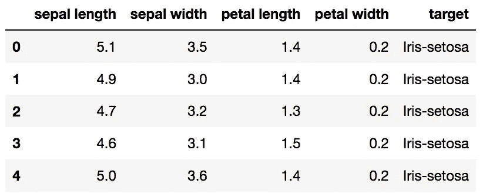

# 机器学习项目工作流程

> 原文：<https://medium.datadriveninvestor.com/machine-learning-project-workflow-8137a401ed81?source=collection_archive---------4----------------------->

[](http://www.track.datadriveninvestor.com/1B9E)

对不同的人来说，工作流有不同的含义，但是在 ML 中，它是 ML 项目进行的一系列不同的步骤。它意味着通过工作流程中的每一个阶段，成功并及时地完成项目。

我们将遵循一般的机器学习工作流程步骤:

1.  收集数据。
2.  数据准备。
3.  探索性数据分析。
4.  特征工程选择。
5.  选择最佳模型。
6.  训练我们的模型。
7.  评估模型。
8.  对模型执行超参数调整。
9.  解释模型结果。

现在有一个问题，我们如何开始？

**问题定义:**

在我们深入到编码部分和工作流程部分之前的第一步，我们需要对我们的问题有一个基本的了解，什么是需求，什么是可能的解决方案。

现在，我们将处理一个预定义的数据集，称为*虹膜数据集。这是监督学习的一部分，因为我们可以访问特征和目标，我们需要在两者之间映射我们的模型。我们的模型必须是**精确的**和**可解释的。***

**收集数据**

我们现在进入第一步，即**收集数据**。我们模型的质量取决于收集数据的数量和质量，因此这一步是最重要的一步。

**数据准备**

在这里，我们加载数据，并准备在机器学习模型中使用它。但是，完美的数据是经过完美清理和格式化的数据。数据清洗是大多数数据科学问题的必要组成部分。数据预处理只是数据准备的一部分。首先，我们将数据加载为 Pandas DataFrame:

Pandas 是用于将我们的数据加载到模型中的 python 库。Matplotlib 用于绘制所需结果的图形。

```
import pandas as pd 
import matplotlib.pyplot as plt
import numpy as np
# Load dataset
url = "https://raw.githubusercontent.com/jbrownlee/Datasets/master/iris.csv"
names = ['sepal-length', 'sepal-width', 'petal-length', 'petal-width', 'class']
dataset = pd.read_csv(url, names=names)#shape
print(dataset.shape)
#this will be the output - (150,5)
print(dataset.head(5))
```



**source : towardsdatascience.com**

现在我们进入下一步，即 EDA。这是一个开放式的过程，在这个过程中，我们开发统计数据和图表，以找到趋势或与数据的关系。

所以基本上，EDA 帮助我们更多地了解我们的数据，以及我们可以从中了解到什么。这些发现、信息可以帮助我们知道我们可以在我们的模型中选择哪些特征，并且可能是我们可以改进我们的特征选择方式。

**特征工程选择:**提供机器学习问题投入的时间回报。它是获取原始数据并选择或提取最相关特征的过程。它帮助我们从模型中删除不需要的特性，这帮助我们创建一个更好、更易理解的模型。

机器学习模型从我们提供的数据中学习，因此数据必须包含所有相关信息，以便模型预测的输出非常准确。

使用一键编码器是特征工程的几个步骤之一。这个过程帮助我们在数据中包含分类变量。

```
# Split-out validation dataset
array = dataset.values
X = array[:,0:4]
Y = array[:,4]
validation_size = 0.20
seed = 7
X_train, X_validation, Y_train, Y_validation = model_selection.train_test_split(X, Y, test_size=validation_size, random_state=seed)
```

上述过程是将数据集分成两部分，其中 80%将用于训练我们的模型，另外 20%将用于保留作为验证数据集。


**source : pybloggers.com**

上图是为了让我们更好地理解，它告诉我们数据集有 3 个不同的类别，即***【Setosa】，Versicolor，Virginica*** 。总共有 150 个值，每个值 50 个。

这个图可以在 python 库 *MATPLOTLIB 的帮助下获得。*

**选择型号:**继续下一步，我们必须选择最合适的型号。

模型是根据它们生成的准确度分数进行比较的。我们可以用 KNN 模式前进，因为在一般情况下，它会产生最好的结果。

```
# Make predictions on validation dataset
knn = KNeighborsClassifier()
knn.fit(X_train, Y_train)
predictions = knn.predict(X_validation)
print(accuracy_score(Y_validation, predictions))#Output generated is#0.9#This means that the accuracy of the model is 90%.
```

选择最佳模型的一种方法是训练每一个模型，并从这些模型中获取显示最佳结果的模型的结果*(显然，这是一个耗时的过程，但如果我们熟悉了，这将非常有趣)。*这一步还包括训练数据集，将我们的数据拟合到模型中，然后对其进行测试，以预测并获得准确性得分。

**参数调整**:一旦评估结束，我们可以通过调整参数来检查更好的结果。有几个参数，如果它们的值被改变，那么很明显，我们将观察到结果的一些变化，最重要的是，我们的*准确度得分。*这些参数被称为*超参数，*它们的不同值完全取决于我们正在使用的模型。由于在项目的这个阶段有许多考虑因素，我们需要选择最好的。这些值定义了训练模型的准确性以及训练的持续时间。

结果的解释:现在全靠我们了，我们想从结果中解释什么？我们希望如何使用培训模型？我们想要预测什么值？

以上就是各种各样的问题，只有我们自己才能回答。

## **结论:**

我们了解了机器学习的工作流程，并深入到各个步骤中，以便更好地理解。我们开发了一个模型，并使用了一个名为 *IRIS 数据集的基础数据集。*

以类似的方式，它可以在不同的数据集上实现，并可以按照我们希望的方式工作。

如此快乐的编码！！