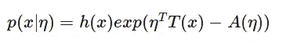
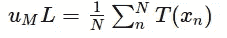
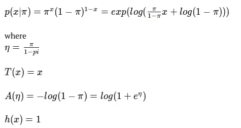
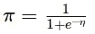
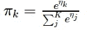

# 机器学习:Sigmoid 函数、softmax 函数和指数族

> 原文：<https://medium.datadriveninvestor.com/machine-learning-sigmoid-function-softmax-function-and-exponential-family-2d0e4639d201?source=collection_archive---------6----------------------->

sigmoid 函数和 softmax 函数是机器学习领域中常用的函数。而它们就像线性回归中的“最小二乘误差”。它们可以利用指数族的一般形式从某些基本假设中推导出来。一些基本的线性回归和分类算法也可以从一般形式中导出。让我们深入挖掘，看看我们如何获得神秘的功能。

# 指数族

指数族包括高斯、二项式、多项式、泊松、伽玛和许多其他分布。不严格地说，如果一个分布可以转化为**的一般形式**，则它属于指数族:

其中
η是正则参数

T(x)是充分统计量

A(η)是累积量函数

指数族的正则性条件在数学上是严格的。可以在这里参考:[http://stats . stack exchange . com/questions/187533/exponential-family-regularity-conditions](http://stats.stackexchange.com/questions/187533/exponential-family-regularity-conditions)

# 一般形式的良好性质

指数族的一般形式包含用于构建机器学习模型的良好性质。

1.  计算矩
    累积量函数的一阶导数是均值，而二阶导数是对应分布的方差。指数族分布的**累积量母函数**可以认为是 A(η)，可以作为计算分布矩的另一种方法。对于矩母函数，我们需要计算积分，而对于累积量母函数，我们只需要计算导数，这就简单多了。
2.  获得充分统计量
    充分统计量 T(x)可以通过检验获得。对充分性的直观解释是:在观察到 T(x)之后，我们可以为了关于θ的推论的目的而抛弃 X。
    例如，T(x)=x 是伯努利分布的充分统计量，T(x)=[x，x ]是高斯分布的充分统计量
3.  获得最大似然估计的一般公式
    我们可以得到指数族分布中参数的最大似然估计的一般公式。例如，对于均值估计，我们有:

# 将分布转换成一般形式

将分布转换成一般形式是很容易的。我们可以从一般形式中获得洞察力。

考虑伯努利分布

根据η求解π，我们有:

，也就是 **sigmoid 函数**。

类似地，我们可以转换多项式分布并获得:

，也就是 **softmax 功能**。

