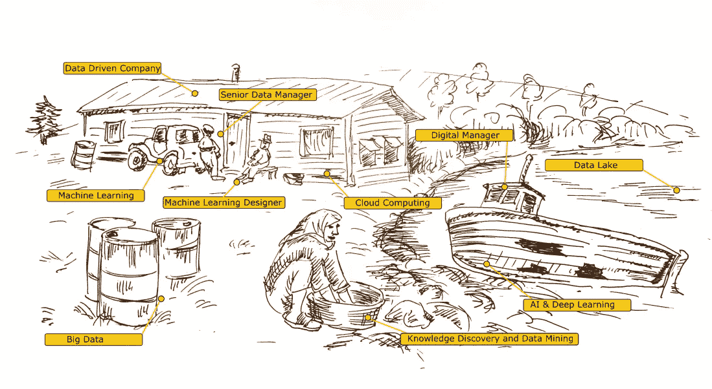
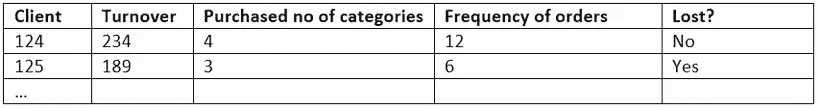
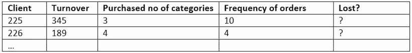
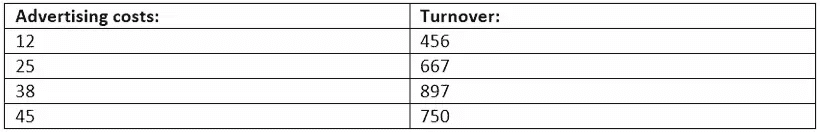
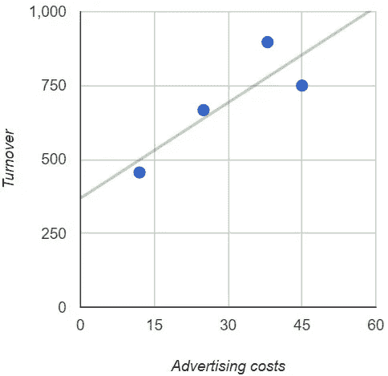
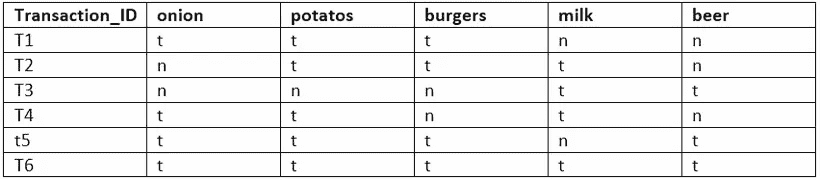
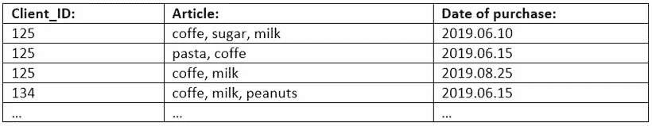
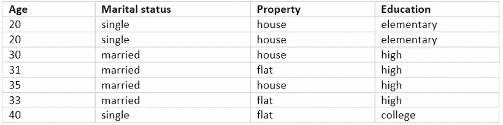
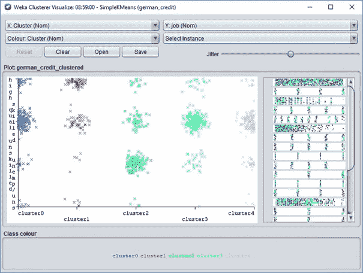

# 机器学习技术-高级胡言乱语

> 原文：<https://medium.datadriveninvestor.com/machine-learning-techno-premium-babble-e7a41f8b2bfb?source=collection_archive---------8----------------------->

## 机器学习和数据科学 noobs 的福音。

这篇文章应该很短。但是，如果不知道讨论中使用的口号，就无法谈论“机器学习”。我们将以传统的方式开始——我们将浏览“数据挖掘”中最常用技术的列表，然后来看现实生活中的例子。

“数据挖掘”这个主题本身非常广阔，人们至少可以写几页。对于我们的需求，让我们假设它只是处理数据。在这项工作中，我们通常使用下面“数据挖掘技术”一节中列出的技术。

 [## DDI 编辑推荐:5 本机器学习书籍，让你从新手变成数据驱动专家…

### 机器学习行业的蓬勃发展重新引起了人们对人工智能的兴趣

www.datadriveninvestor.com](https://www.datadriveninvestor.com/2019/03/03/editors-pick-5-machine-learning-books/) 

对背后的东西有了一个大致的概念，我们将继续在实践中应用这些知识。在“示例上的机器学习”部分，将有使用算法解决现实生活问题和回答商业中常见问题的具体案例。

# 数据挖掘技术

# 1.预言；预测；预告

分类和回归是用于解决类似问题的数据挖掘技术。两者都用于预测分析，但回归用于预测数值或连续值，而分类使用标签将数据分配到单独的类别(类)。

**分类**

分类是根据一个对象与其他对象的先前示例的相似性，将该对象分配到特定类别。通常，类是互斥的。分类问题的一个例子是“*,我们的哪个客户会对我们的提议做出回应？*”和创建两个类:“将对提议做出反应”和“拒绝提议”。

另一个示例性分类模型——信用风险。它可以在一段时间内观察到的贷款申请人的数据的基础上开发。我们可以跟踪就业历史、房屋所有权或租赁、居住时间、投资类型等等。目标类别将是信用评级；例如“低”和“高”。

我们明智地将属性(如就业历史)称为“预测因素”(或“自变量”)，将目标变量称为“因变量”，或简称为“类别”。分类属于“监督”方法。什么是监督方法？阅读下面的*【有人监督的方法和无人监督的方法】*。

**回归**

回归是一种“价值估计”。它是确定不同实体之间的关系，并在此基础上试图估计(“预测”)未知值。例如:如果我们知道公司前一年逐月的营业额，并且我们知道前一年每个月的广告费用，我们就能够通过假设下一年在广告上花费一些金额来估计收入金额。

我们可以使用回归找到答案的另一个问题可以是"*给定客户多久使用一次服务？*

# 2.共现和关联

探索组或发现关联试图基于这些对象的事务找到对象之间的链接。为什么我们要找到这样的事件？关联规则会提示我们“*购买了新电子手表的顾客，他们是否也购买了蓝牙音箱*”。序列模式搜索算法可以建议如何组织服务行为或客户服务。

**协会**

关联是发现数据集中数据之间有趣的依赖性或相关性的方法，通常称为关联。元素之间的关系表示为关联规则。关联规则通常用于分析销售交易。例如，您可以看到"*在杂货店购买麦片的顾客经常同时购买牛奶*(尤里卡！).

例如，可以在电子商务中使用关联规则来个性化网站。关联模型可以发现“访问过页面 A 和 B 人也可以以 70%的概率在同一会话中访问页面 C”。基于这个规则，我们可以为可能对 C 页面感兴趣的用户创建一个动态链接。

**搜索模式**

搜索模式(patterns)，更准确地说是顺序模式，就是搜索有序序列。元素之间的顺序很重要。建立的模式以“支持”的顺序呈现，即给定模式在元素集中出现的频率与所考虑的交易的数量相关。

# 3.使聚集

聚类是对具有相似属性的对象进行分组。作为此操作的结果，创建了一个集群或类。聚类可以给我们一个问题的答案"*我们的客户会创建群组或细分市场吗？*“因此，”*我们的客户服务团队(或销售团队)应该如何适应它们？*”。

与分类一样，聚类用于对数据进行分段。与分类相反，将模型分组到段中会将数据划分到以前没有定义的组中。

聚类属于“无人值守”方法。什么是无人值守方法？阅读下面的“监督方法和非监督方法”。

# 机器学习的例子

记住算法的理论和例子，让我们把它们应用到实践中。我们有具体的问题要解决，我们将使用上一段描述的技术。

# 分类

*“哪些客户会在不久的将来离开我们？”*

我们可以用来寻找这个问题答案的算法是 J48。C4.5 的继承者，其前身是 ID3。该算法使用熵的概念。简而言之:“需要问多少个问题才能获得信息？”。该算法属于“决策树”算法组。网上关于这些算法和决策树的文章至少有 835463248965 篇…其中 2/4 是由那些不知道它们如何工作的人写的，1/4 是由专注于加密这些信息的科学家写的。

为了回答哪些客户可以离开的问题，我们需要历史数据作为行为模式(我们知道哪些客户已经离开了我们)。分析这些信息、属性，我们将创建一个模型。该模型将用于分析仍然是我们客户的客户的数据(当前数据)。下表最后一列是班级(答案我们会在资料里找)。

历史数据:

当前数据:

哪个软件将为我们完成这项任务？不幸的是，我们不会在 Excel 中这样做(尽管这个程序有一些实验性的解决方案)。如果我们能在那里做到——整个“机器学习”的魔咒将在一瞬间烟消云散。在为数不多的几个项目中，有两个非常适合这个项目。首先是 Weka。由学术界创建，它提供了一个适当的接口。然而，它特别适合于测试属性的选择，这实际上会将我们的客户端正确地分配到适当的类中——通过实验，我们可以制定出一个应用于当前数据的模型。我们可以在第二个软件中使用已建立的模型；Pentaho 数据集成。Pentaho (PDI)的优势在于逻辑接口和处理大量数据的能力。PDI 使用 Weka 库，也能够准备一个模型来测试生产数据。

# 回归

*“如果我们在广告上投入金额 X，将会达到什么样的营业额？”*

我们需要两个变量来计算回归；预测变量(独立变量)和目标变量(因变量)。

历史数据:

经过计算我们已经准备好使用公式:

*y = 10788 * x+368848*

其中 X 是广告的预测量，Y 是预期收入。绿线是回归线。线性模型假设变量之间的关系可以用一条直线来概括。这条线表示 X 和 y 之间的关系。

回归可以在 Excel 中计算，或者使用简单的在线计算器。多亏了 Pentaho，我们可以自动进行回归计算，这可以成为数据分析过程的一部分。

该示例显示了一个简单的线性回归。真实案例经常使用带有多个预测变量的多元回归或非线性回归。

# 联合

*“最常见的产品篮子是什么？”*

我们也可以问一个类似的问题:“*汉堡包一般买什么产品？*“我们希望了解顾客购物的相互关系，了解他们的购物模式。假设我们有一个客户交易列表:

*找到的最佳规则:*

*1。burgers = y 4 = =>potatos = y 4<conf:(1)>lift:(1.17)lev:(0.08)【0】conv:(0.57)*

*2。onion = y 3 = =>potatos = y 3<conf:(1)>lift:(1.17)lev:(0.06)【0】conv:(0.43)*

*3。洋葱= y burgers = y ^ 2 = =>土豆= y ^ 2<conf:(1)>lift:(1.17)lev:(0.04)【0】conv:(0.29)*

*4。burgers = y milk = y ^ 2 = =>potatos = y ^ 2<conf:(1)>lift:(1.17)lev:(0.04)【0】conv:(0.29)*

*5。burgers = y beer = y ^ 2 = =>potatos = y ^ 2<conf:(1)>lift:(1.17)lev:(0.04)【0】conv:(0.29)*

*6。potatos = y beer = y ^ 2 = =>burgers = y ^ 2<conf:(1)>lift:(1.75)lev:(0.12)【0】conv:(0.86)*

*7。洋葱=y 牛奶=y 1 == >土豆= y 1<conf:(1)>lift:(1.17)lev:(0.02)【0】conv:(0.14)*

8。洋葱=y 啤酒=y 1 == >土豆= y 1<conf:(1)>lift:(1.17)lev:(0.02)【0】conv:(0.14)

9。洋葱=y 啤酒=y 1 == >汉堡=y 1 < conf:(1) >升力:(1.75)列夫:(0.06)【0】conv:(0.43)

10。洋葱=y 汉堡=y 啤酒=y 1 == >土豆= y 1<conf:(1)>lift:(1.17)lev:(0.02)【0】conv:(0.14)

如何解读结果？在数据中找到 10 条规则(默认程序设置)。先解释一下第一行。一对“汉堡”。在 4 次顾客交易中发现汉堡(在 4 个顾客购物篮中)。这个号码称为“支持”。土豆旁边的数字 4 意味着也有 4 个连接“汉堡== >土豆”。这个变量被称为“支持”或“覆盖率”(整个规则的覆盖率)。

“conf:”后面括号里的数字是“confidence”或“trust”。信任是规则发生的概率的百分比决定；100%确定，如果顾客买了汉堡，也会买土豆。

信心来自公式:

*置信度=支持规则(第二位数字..规则出现次数)/支持(公式实例数…第一位)*

apriori 算法为我们提供了无序的元素集(没有特定的序列)。

# 搜索模式

*“购买了产品 X 的顾客下一个会购买什么产品？”*

序列模式的发现涉及对包含关于在给定时间段内发生的事件的信息的数据库的分析，以便发现特定事件随时间的发生之间的关系。序列模式的一个例子是客户购买。包含在序列模式中的购买不必直接一个接一个地发生，它们可以被其他购买分开。这意味着客户通常在购买产品 X 和购买产品 Y 之间购买另一个产品，但是给定的顺序描述了大多数客户的典型行为。

让我们假设客户的购买情况如下:

使用 Weka 程序并应用广义序列模式算法，我们得到结果:

*频繁序列详细信息(已过滤):*

*-1-序列*

*【1】<【咖啡】>【3】*

*【2】<【牛奶】>【2】*

*【3】<【糖】>【2】*

*【4】<【面食】> (2)*

*-双序列*

*【1】<{咖啡} {咖啡} > (2)*

*【2】<{咖啡} {面食} > (2)*

*【3】<{牛奶} {咖啡} > (2)*

*【4】<{牛奶} {糖} > (2)*

*【5】<{糖} {咖啡} > (2)*

*- 3 个序列*

*【1】<{牛奶} {糖} {咖啡} > (2)*

如何解释程序计算的结果？“X 序列”是满足计算标准的实例组(最低支持设置，必须满足结果的“min support”)；单序列、双序列、三序列…

所发现的模式以“支持”的顺序呈现，即给定模式在元素集合中相对于所考虑的事务的数量的出现频率。

# 使聚集

“我们的客户创造了哪些细分市场？”

让我们假设我们的客户具有以下属性和特征:

我们希望将他们分成两组(两个集群),更准确地向他们提供我们的产品或调整销售团队，以满足他们的特定需求。我们将在 Weka 程序中使用 k-means 算法来实现。如何解读结果？

*属性完整数据 0 1*

*(7.0) (5.0) (2.0)*

*= = = = = = = = = = = = = = = = = = = = = = = = = = = = = = = = = = = = = = = = = = = = = =*

*年龄 29.8571 33.8 20*

*婚姻状况已婚已婚单身*

*产权房平房*

*教育小学高小学*

我们获得了两个集群(程序设置—我们可以请求更多)；0 和 1。在第 0 组中，平均年龄为 34 岁，婚姻状况为已婚，拥有一套公寓，受过高等教育。这一组有五张唱片。集群 1 是 20 岁，婚姻状况单一，房子主人与小学教育。“完整数据”列是所有实例的平均值。

此处使用的聚类基于一种算法，该算法使用算术平均值来计算聚类中单个要素的距离。

为了更好地说明聚类，该示例被有意限制为几个记录。实际的分组是对成千上万的记录进行的。有了如此广泛的样本，数据可以可视化，以给出我们群体的清晰图像。

# 监督方法和非监督方法。

另一种意义上的“监督学习”和“非监督学习”。在监督学习中，我们设定了一个特定的目标——我们期待一个特定的结果。示例:

“我们能找到在合同到期后很快取消服务的可能性特别高的客户群吗？”

或者:

*“因为资不抵债的风险，我们来分委托人；小号，中号，大号。”*

监督方法的例子是分类和回归。这里常用的算法有决策树、逻辑回归、随机森林、支持向量机、K 近邻。

在无监督学习中，我们不设定特定的目标——我们不期望特定的目标结果。例如，这里提出的问题是:

*“我们的客户会创建不同的团队吗？”*

无监督方法的例子是聚类和相关(关联)

打个比方，教师通过仔细提供目标信息和一组例子来“监督”学习者。无监督学习任务可能涉及相同的示例集，但不包括目标信息。学习者不会得到任何关于学习目的的信息，但会被留下来形成自己的关于这些例子有什么共同点的结论。

# 算法宝贝！

“机器学习”的全部秘密源于缺乏对执行上述工作的功能/算法的简单访问。这些工具已经上市多年了。更何况他们还经常免费！但是，要使用它们，您需要具备数据库、编程、SQL、解析文件领域的基本技能——数据通常需要转换成适当的形式才能使用。

得益于适当的算法，所有这些计算都是可能的。这些计算中的大部分都可以在十年甚至更早的时候做出。).回归算法已经有两个多世纪的历史了(它始于 1805 年)。用于分类的 j48 算法源于信息熵——克劳德·香农在 1948 年的工作。我们甚至还有更古老的算法——k-means 算法，它基于源自古希腊几何学的欧几里德距离的思想对物体进行分组。

如果有人在这里做“学习”，那么肯定不是机器而是人。作为完美的计算机器，计算机能在一秒钟内完成人类需要数周才能完成的工作。科学没有新的革命——我们获得了高速计算机器。如果“机器学习”是今天“人工智能”的基础，它本身看起来如何？

数据挖掘是一门手艺。它涉及大量科学和技术的使用，但正确的应用仍然包括艺术。没有机器可以像人类一样以正确的方式选择属性。例如，在零售业中，属性“购买频率”可能比 B2B 关系更可靠。在美国，有数据挖掘比赛(GE-NFL 头部健康挑战赛，GEQuest)和解决特定人类问题的奖励非常高(如 GE-NFL 头部健康挑战赛的 1000 万美元)。