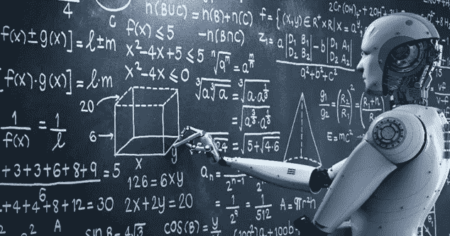
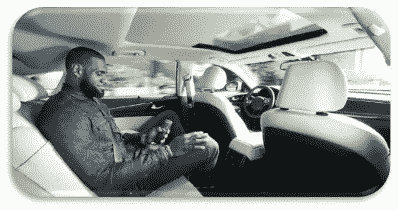

# 机器学习——基础

> 原文：<https://medium.datadriveninvestor.com/machine-learning-the-foundation-197d68f4b52d?source=collection_archive---------3----------------------->

起初，上帝创造了天堂、地球和自然智慧…

让我们想象一个汽车自动驾驶的世界，一个电脑预测你的股票的世界，一个你的手机理解你的心情的世界，一个你不在的时候，你的手机和电脑可以继续和你的朋友聊天的世界。这种世界是机器学习驱动的世界。

机器学习的第一个定义是由 Arthur Samuel [提出的，他将机器学习解释为计算机执行智能任务而无需显式编程的能力](http://www.contrib.andrew.cmu.edu/~mndarwis/ML.html)。ML 的探索在几十年前就变得非常重要，并自数据驱动的破坏开始以来获得了巨大的爆发。

然而，机器学习是人工智能的一个子领域，也是其他数据驱动的领域，如计算机视觉、IOT、深度学习等。机器学习可以分为两个主要的学习类别，即监督学习和非监督学习。

在我们直接进入机器学习的第一课之前，让我们先简要概述一下类别。

1.监督学习:这是一种学习类型，其中计算机算法被输入(训练集)和预期输出(结果)，以便它可以学习两个数据集变量之间的相关性，从而理解这种关系，并可以自己给出准确的结果。想象一下，一个老师教一个男孩，她教他乘法表，当她从男孩那里得到满意的表现水平时，她停止教男孩。同样，当算法达到令人满意的性能水平时，学习停止。

有两种主要类别的监督学习，它们是:

回归:当问题是一个回归问题，输出(结果)是一个期望的变量，如“身高”、“年龄”、“数量”、“价格”等时，这总是被实现的。

分类这与分类问题有关，因此预期输出是一个分类集，例如

回归算法的例子有简单线性回归、多元线性回归和多项式回归等。而用于分类的算法包括随机森林、支持向量机(SVM)、决策树等。

2.无监督学习:这是一种计算机算法被输入(训练集)而没有任何结果(结果)的学习。在这种学习模型中，允许算法找出数据集，并在数据中寻找重要的结构和趋势。就像给学生一套球，看着学生把它分成“大”、“中”、“小”。

无监督学习有两个主要类别，它们是:

聚类:这是基于根据数据集的一些内在特征和分组对数据集进行分类。例如，根据足球运动员的比赛风格对他们进行分组。属于这一领域的算法包括 K-means、层次聚类等。

关联规则:这是基于学习模型，侧重于发现大数据集中的趋势。例如，确定在城市中驾驶奔驰并拥有复式公寓的人的趋势。这里涉及的算法包括 Apriori 算法、Eclat 等。

我相信你喜欢读这篇文章。这只是应用机器学习的基础。请关注我的下一篇文章“数据预处理”。

对于与我的实践会议，请尽力下载 Anaconda 并安装 Spyder。Spyder 将是我们在这个机器学习教程中的主要编程接口。

玩得开心，不要停止学习！

Raji Adam bi fola(MCSA MCP)。tech specialist Consulting Limited 的数据科学家/BI 分析师