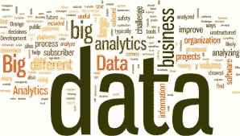

# 机器学习:明天的未来

> 原文：<https://medium.datadriveninvestor.com/machine-learning-the-future-of-tomorrow-5ccbafff3774?source=collection_archive---------7----------------------->

我听到很多人说机器学习和人工智能是一样的，也将改变未来和我们的生活。这是绝对正确的，但当人们谈论人工智能和机器学习时，他们似乎对什么是什么感到困惑。甚至我听到我的同学讨论说人工智能和人工智能是一样的，他们假设人工智能给机器人智能，这样他们可以使我们的工作变得容易。

我是一名商业分析专业的学生，商业分析师将数据作为他们的首要任务，并应用工具和技术来获得洞察力，以做出数据驱动的决策。当我们听到分析师时，我们会想到“分析”(你又向前迈了一步)。执行数据分析是为了从数据中获得洞察力。数据分析技术非常多。语言取决于你，而目标保持不变，即分析数据。

 [## DDI 编辑推荐:5 本让你从新手变成专家的机器学习书籍|数据驱动…

### 机器学习行业的蓬勃发展重新引起了人们对人工智能的兴趣

www.datadriveninvestor.com](https://www.datadriveninvestor.com/2019/03/03/editors-pick-5-machine-learning-books/) 

现在让我们把事情联系起来，机器学习基本上是“在没有明确编程的情况下赋予机器学习能力的艺术和科学”我最喜欢的一个定义是“ ***机器学习据说是从经验中学习 E w.r.t 某类任务 T 和一个表现衡量标准 P，如果 P 衡量的学习者在该类任务中的表现随着经验而提高。”*** 机器学习告诉我们在给定的数据中使用什么算法，我们建立一个适合我们数据的模型，一旦我们的模型学习了这些东西并发现了数据中的模式，我们就可以向它提供新的数据，它就可以轻松地处理这些数据。

说到数据，我有一个问题，为什么社交媒体是免费的？脸书、Snapchat 和其他社交网站是如何赚钱的？他们为我们提供了一个平台，在这里我们可以与世界各地的人们互动，而且完全免费！你能相信吗？这个游戏是关于数据的。所有的行业都是数据驱动的，从你的单张照片到你的位置状态，一切都是有价值的，都是行业所需要的。

数据是未来，数据分析是关键。我们每天生成超过 2.5 万亿字节的数据，大型数据仓库正被用来存储和清理这些数据。我希望毫无疑问地相信，如果数据在未来是有价值的，那么数据分析和机器学习也会受到重视，并将在软件行业带来一场革命。