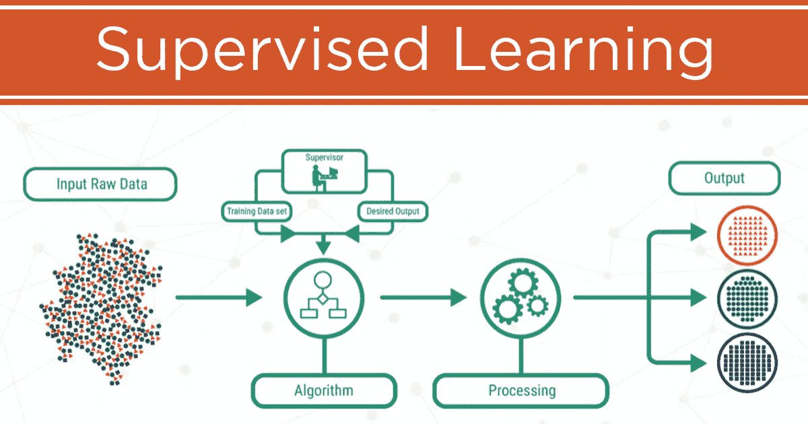
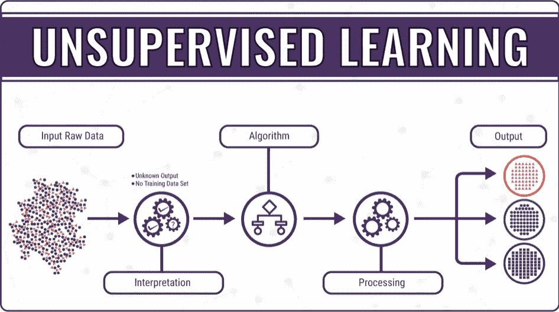
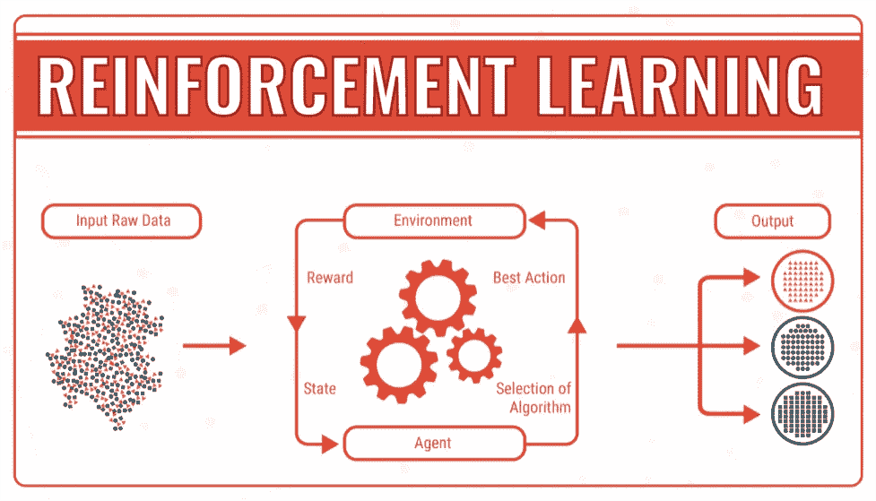

# 机器学习；矩阵具体化了

> 原文：<https://medium.datadriveninvestor.com/machine-learning-the-matrix-materialized-79071b279a7f?source=collection_archive---------6----------------------->

在成长过程中，我是个十足的极客。

我被《星球大战》、《星际迷航》(比《T2 》好多了)、《变形金刚》和其他许多粉丝的世界迷住了。但是，我不是一般的极客。大多数人喜欢这些电影或节目，因为它们背后的故事，或制片人使用的特殊效果。我喜欢它们的原因完全不同:**机器人**。

这些作品是对“人工智能”这个术语世界的一次惊人的觉醒，并从未错过吸引我的注意力。人类可以制造比他们更聪明的东西的想法对我来说就像是巫术，我想参与其中。

 [## 机器学习的外汇交易挑战|数据驱动的投资者

### 机器学习是人工智能的一个分支，之前占据了很多头条。人们是…

www.datadriveninvestor.com](https://www.datadriveninvestor.com/2019/02/18/the-challenge-of-forex-trading-for-machine-learning/) 

想一想，有了这些机器人，我们的世界会是什么样子？

想象一下，在一个机器可以自己学习做事的世界里，我们会有什么样的可能性。想象一下，由于更高智能的出现，新的大门将向我们敞开。

想象这个世界就像是母体，但是被物化了。

## "那听起来很酷，但是你在人工智能上把我弄糊涂了."

对此我不怪你。这个术语被如此过度地用于除了原意之外的目的，而这种误解往往会使人们被这个话题吓倒。

人工智能(AI)的概念最初是在 1956 年提出的，属于斯坦福大学的研究员约翰·麦卡锡，他创造了这个术语，并将人工智能的主要任务定义为计算机科学的一个子领域。

人工智能背后的基本思想是不言自明的。它展示了一个算法拥有智能特征的能力，比如拥有**原创思想或学习**。这是机器模仿人类智能的一种方式，通过根据情况和思维进行适应。

在很大程度上，人工智能的目标是利用计算机更快处理信息的能力，并将其与自适应能力相结合。这将有助于取代人类的许多任务，因为人工智能可以更高效、更准确地执行这些任务。

**Above:** AI has many applications because it is such a huge and adaptable concept

## “酷，机器学习和这有什么关系？”

“机器学习”和“人工智能”是同义词，这是一种误解，这是人们的错误。

人工智能是一个总括性的术语，用于描述它自身处理特定问题的许多不同的应用。这些应用中最常见的是机器学习。

使用机器学习背后的目标相当简单:**让机器学习。**在这种情况下，学习将被描述为从经验中改进或调整，并应用它，而无需被编程来处理不同的场景。最终，这将允许软件解释一组数据，并从中得出有意义的结论。

机器学习主要有三种类型:有监督的、无监督的和强化学习。让我们稍微分解一下。

## 监督学习

我不知道你怎么想，但我喜欢用一种主要的方式来研究新概念。*举个例子。*

让孩子用例子学习背后的概念是，他们将看到足够多的例子，并能够从中保留特定的知识。最终，当他们联系到为什么这种关系会发生时，他们可以在未知的情况下运用他们的知识。

想到排序形状；最常见的一级活动。你会看到一些熟悉的形状，比如正方形、长方形或三角形。对它们进行排序是轻而易举的事情，你以前已经遇到过这些例子了。然后你的老师拿出一些菱形、八边形和平行四边形，排序游戏变得很难。这一切都是为了寻找之后的形状之间的关系。边、顶点和大小在确定用于排序的组时起作用。

用电脑交换孩子，这是监督学习的一个很好的例子。监督学习的基本定义是用训练标签诱导学习。本质上，它是向 AI 提供一组数据并让它通过查看过去的例子从这些数据中绘制标签的过程。当你将这些例子输入到机器学习算法中时，它会通过从这些给出的**例子中寻找**的相似性和差异性**来进行学习，从而将其应用到未知的情况中。因此，当呈现新图像时，该算法会将其分类为最准确的模具。**

这可以通过一套叫做“神经网络”的算法来实现。他们通过使用机器感知来解释不同类型的感官数据，并最终对原始输入进行标记或聚类。

监督学习有三个主要用途:

**二元分类**

*   当算法将数据分为两类时

**多类分类**

*   当算法需要在特定变量的两种以上答案中进行选择时

**回归**

*   用于预测连续值，如预测净利润作为客户终身价值的度量

**Above:** Graphic showing the process in which data gets filtered through supervised learning

## 无监督学习

以之前的形状为例。你没有三角形、正方形和长方形等形状的先验知识，却对这类东西一无所知。现在，你面前有一堆不同类型的形状，你可以根据你所看到的自己做出结论。在没有先验知识的基础上提出差异和相似性的概念与无监督学习的概念非常相似。

无监督学习为系统提供未标记和未分类的输入数据，并允许它自己**找到模式**。这种类型的机器学习有一些常见的用途。这些包括(但不限于):

**聚类分析**

*   聚类分析有助于发现数据中新的隐藏模式或组

**异常检测**

*   异常检测指出给定数据集中的异常数据点。这有助于发现欺诈交易。

**关联挖掘**

*   关联是一种数据挖掘功能，可以发现一组项目同时出现的可能性

**Above:** The method in which data gets filtered through unsupervised learning

## 强化学习

好吧，让我们最后一次回到幼儿园的场景。你再次被给予随机的未知形状，并且对它们没有任何先验知识。只是这一次，不是做你自己的事而不承担后果，而是有一个轻微的转折。你的老师现在可以根据你是否做对了事情给你奖励，做错了事情给你一个暂停。你的目标是获得最少的超时和最多的奖励。这和强化学习的思想非常相似。

简而言之，强化学习是一种使用**奖励和惩罚**的思想训练算法的编程。该算法通过与其环境交互来适应和学习。该算法因执行正确而获得奖励，因执行错误而受到惩罚。通过这种方式，它可以自己学习，无需任何人工干预。这使得它具有很强的适应性。

强化学习有几个主要用途

*   最佳化
*   文本、语音和对话系统
*   数据处理
*   创建培训系统，根据学生的要求提供定制的指导和材料
*   需要策略的游戏

Above: The method of how data gets filtered through reinforcement learning

## “这很有趣……但这和《黑客帝国》有什么关系？”

机器学习**开启了一个充满可能性的世界**。

黑客帝国和其他科幻电影总是感觉很遥远，它们向我们展示了未来 50 年后的生活会是什么样子。看，随着快速发展和研究的快速进行，未来可能不会太远。

机器学习使我们能够为机器分配一些独立性，并允许它们在没有人类干预的情况下为自己采取行动。这是巨大的。在允许机器自己行动之后，下一步是允许它们基于先前的记忆进行思考。在那之后，我们甚至可以**培育人工意识**。

很快，像 C-P3O 或 R2D2 这样的机器人将被视为老派。未来并不*那么遥远*。

## 概述

*   监督学习是当你向人工智能提供一组数据，并让它通过查看过去的例子从这些数据中绘制一个标签。
*   无监督学习是给一个算法未标记和未分类的输入数据，并允许它自己**找到模式**。
*   强化学习是一种动态编程，它使用**奖励和惩罚**的思想训练算法，并专注于最大化奖励。

## 结尾注释

最后，机器学习仍在发展。它正在改变我们生活、工作和娱乐的方式，尽管我们并不经常直接注意到它。它是如此有趣和复杂，已经彻底改变了我们周围的世界，并将在未来继续影响我们。机器学习适应的速度如此之快，以至于未来似乎正以加速的速度离我们越来越近。我们曾经遥不可及的机器人意识梦想甚至可能在我们有生之年成为现实。

谁知道呢，也许你会成为你故事中的下一个卢克·天行者。