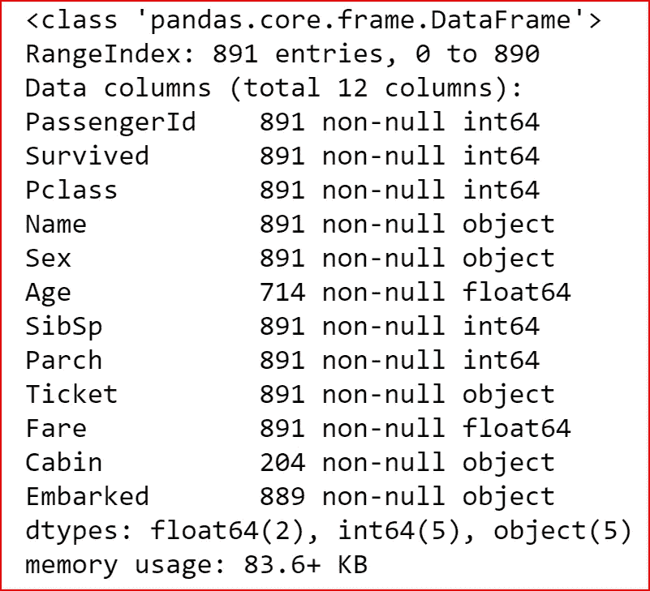
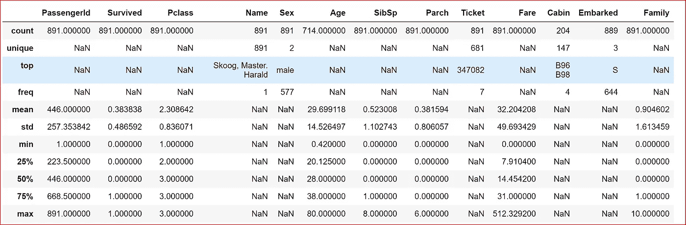
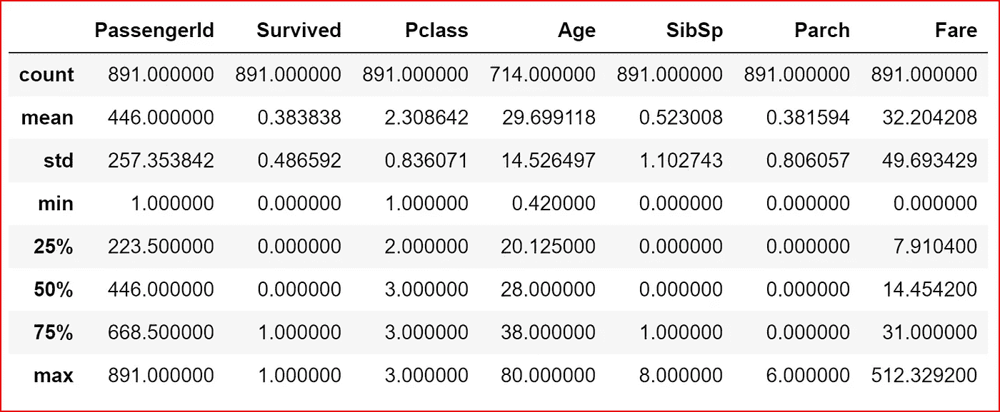
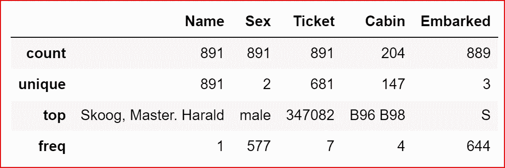
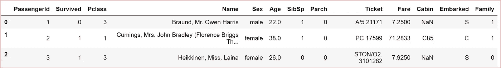
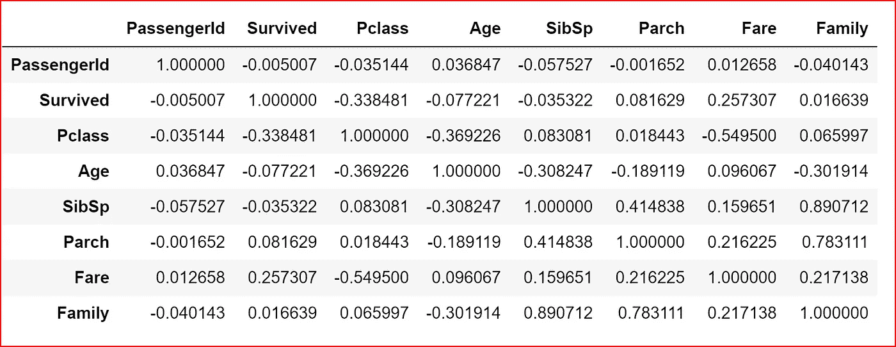
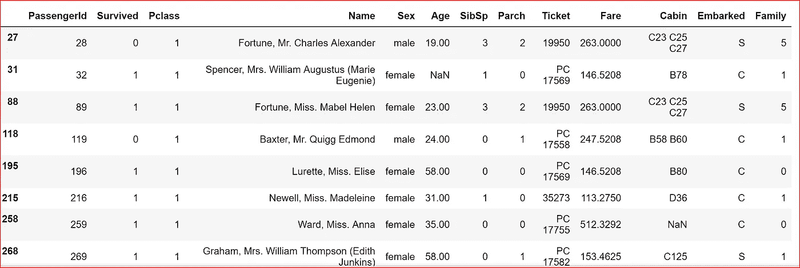

# 机器学习——理解数据

> 原文：<https://medium.datadriveninvestor.com/machine-learning-understanding-data-dfef261d833b?source=collection_archive---------4----------------------->

我们将使用泰坦尼克号的数据集，并试图理解这些数据


每当你开始一个机器学习项目时，你都会将不同来源的数据编译成一个单一的来源。做完这些，我们现在需要更好地理解所有的特征来预测一个目标变量。

了解机器学习基础，请参考我的帖子-[https://medium . com/@ arshren/machine-learning-demystified-4b 41 c 3 a 55 c 99](https://medium.com/@arshren/machine-learning-demystified-4b41c3a55c99)

当我们有了基于历史数据的可用于某些观察的目标变量，并且想要预测目标变量时，我们就使用监督学习。

如果我们没有可用于观察的目标变量，那么我们需要使用无监督学习。

*泰坦尼克号数据集和数据字典在这里*-【https://www.kaggle.com/c/titanic 

本文中提到的 Jupyter 笔记本上的 Python 代码可从[https://github . com/arshren/Machine learning/blob/master/Machine % 20 learning % 20 step % 201% 20-% 20 understanding % 20 data . ipynb](https://github.com/arshren/MachineLearning/blob/master/Machine%20Learning%20step%201%20-%20understanding%20data.ipynb)获得

在我们的泰坦尼克号数据集的例子中，我们想要预测一名乘客是否幸存。

在 train.csv 文件中，我们有包含输入特征和目标变量的观测值:**幸存下来。**

在本帖中，我们将分析 train.csv 中的数据，以识别有助于预测乘客是否幸存的特征。

我们将首先下载数据集。我已经将数据集下载到了默认的 jupyter 文件夹中

我们需要导入熊猫和 numpy 库

```
import numpy as np
import pandas as pd
```

我们现在将从下载的数据集中读取数据。我们将使用训练数据集— train.csv

有关如何从不同格式的文件中读取数据以及如何写入不同格式的文件的更多详细信息，请关注我的帖子—[https://medium . com/@ arshren/python-read-and-write-data-from-files-d3b 70441416 e](https://medium.com/@arshren/python-reading-and-writing-data-from-files-d3b70441416e)

```
data_set = pd.read_csv("train.csv")
```

让我们通过打印数据集的一个小的子集来看看我们在 titanic 数据集中有什么不同的特征。这里我们只打印前三行。

```
data_set.head(3)
```


head(3) display first three rows from the dataset

我们需要找出数据集中的列数，数据集中的行数，每列的数据类型，为此我们将使用 **info()** 方法。

```
data_set.info()
```



information about the titanic dataset

从上面的输出中，我们知道 Age、Cabin 和 apollowed 列有空值，因为数据集中的行数是 891，而这些列的空值计数不小于 891

我们可以生成描述性统计数据，总结包括 Nan 值在内的集中趋势。

想了解更多的描述性统计，请参考我的帖子-[https://medium . com/@ arshren/descriptive-statistics-BC 01594 c be](https://medium.com/@arshren/descriptive-statistics-bc01594c4cbe)

如果数据类型是数值，那么输出将包含计数、平均值、标准差、最大值、最小值以及 25%、50%和 75%的数据

如果数据类型是 object，那么我们将看到 count、unique、top 和 freq。

我们还可以显示数据集中所有特征的统计数据

```
data_set.describe(include='all')
```



describes the descriptive statistics for all the features in the data set

因为我们的数据集有数字和对象，所以让我们显示描述性统计数据

首先，我们将获取所有数字特征并显示它们的统计数据

```
data_set.iloc[:,[0,1,2,5,6,7,9]].describe()
```



Descriptive statistics for numeric data types in titanic dataset

现在，让我们使用其中一条语句来显示对象数据类型的要素的统计数据

```
data_set.iloc[:,[3,4,8,10,11]].describe()data_set.describe(include=['O'])
```



Descriptive statistics for object data types in titanic dataset

一旦我们理解了数据，我们就可以检查不同特征之间的相关性。

在进入相关性之前，让我们看看是否可以使用我们的常识对数据集进行任何特征工程。在现实世界中，它将基于我们的领域知识

当我们查看数据字典时，我们看到 SibSp 列是船上兄弟姐妹或配偶的数量，Parch 是船上父母或子女的数量。基于共同的理解或基于特征工程的机器学习语言，我们可以将这两列结合起来，称之为家庭，因为兄弟姐妹和配偶组成了我们的家庭。

这里我们使用了 Dictionary 特性对两列中的值求和，并将其分配给添加到数据中的新列。详细讲解见我的帖子-[https://medium . com/@ arshren/python-data-structures-dictionary-9b 746 b94b 421](https://medium.com/@arshren/python-data-structures-dictionary-9b746b94b421)

```
data_set["Family"] = data_set["SibSp"] + data_set["Parch"]
data_set.head(3)
```



dataset after adding a new column Family which is aggregation of SibSp and Parch

*现在潜入关联*

# 什么是相关性？

**相关性是指一个变量的变化可能导致另一个变量的变化**

相关系数的范围从-1 到+1

相关系数+1 表示完全正相关。对于一个变量的正增加，第二个变量也有正增加

相关系数为-1 表示完全负相关，两个变量的运动方向相反。对于一个变量的正增加，第二个变量减少

相关系数为 0 意味着两个变量之间没有关系。

我们将使用 corr()方法来获取数据集中所有特征的相关性

```
data_set.corr()
```



correlation between different features in titanic data set

我们从这些数字中解读出什么？

在这个数据集中，我们将分析所有特征相对于幸存特征的相关系数。这将有助于我们了解某个功能是否对乘客的生存机会有影响。

根据上述相关数据，我们做出以下推断

1.  由于乘客 Id 和幸存特征之间的值接近于 0，乘客 Id 对乘客的幸存没有显著影响
2.  Pclass 与存活率呈负相关，意味着三等舱乘客的存活率较低
3.  年龄与存活率呈负相关。年龄越大，生存机会越低
4.  兄弟姐妹和配偶似乎与生存机会呈负相关
5.  父母和孩子与生存机会成正相关
6.  当我们把配偶、兄弟姐妹、父母和孩子组合成一个家庭时，我们看到了与生存机会的轻微正相关
7.  票价是正相关的。根据票价，与三等舱乘客相比，一等舱乘客生还的机会更大。这里，我们假设头等舱乘客比三等舱乘客支付更高的票价。

在机器学习中，我们需要去除所有假设，一切以事实为基础。

让我们通过查询所有支付票价超过 100 美元的乘客的数据并检查 Pclass 是否为 1 来验证我们的假设

```
data_set[data_set['Fare'] >100]
```



Passengers who paid fare more than $100

让我们看看三等舱乘客的平均票价是多少

```
np.mean(data_set.loc[data_set['Pclass'] ==3, 'Fare'])***13.675550101832997***
```

这证明了我们对数据的理解。

为了更深入、更有效地理解数据，我们应该将数据可视化。

**关于数据可视化，请参考我的帖子**