# 使用 AWS ML 的机器学习

> 原文：<https://medium.datadriveninvestor.com/machine-learning-using-aws-ml-d3986c9386d9?source=collection_archive---------11----------------------->

机器学习是人工智能(AI)的一种应用，它为系统提供了自动学习和根据经验改进的能力，而无需显式编程。亚马逊机器学习(Amazon ML)是一个健壮的、基于云的服务，它使所有技能水平的开发人员都可以轻松使用机器学习技术。在这篇文章中，让我们看看如何使用亚马逊机器学习技术来创建机器学习模型。假设你已经知道机器学习的概念，让我们直接进入亚马逊机器学习。

在开始用 AWS ML 创建机器学习模型之前，让我们先了解一下 AWS 机器学习中使用的关键概念。

## 数据源

数据源是包含与 Amazon ML 数据输入相关联的元数据的对象。Amazon ML 读取输入数据，计算描述性统计数据，收集模式和其他信息，并将它们存储为数据源对象的一部分。目前，AWS ML 仅支持数据源创建输入，如亚马逊 S3 桶和亚马逊红移。创建数据源时要记住的一点是，数据源不存储输入数据的副本。它只存储输入数据的引用。因此，在我们的输入数据位于 S3 存储桶的情况下，如果我们移动或更改 S3 文件，Amazon ML 将无法使用该输入数据创建 ML 模型。

## ML 模型

ML 模型是一种数学模型，它通过在数据中寻找不同的模式来生成预测。目前，Amazon ML 支持三种类型的 ML 模型。

*   二元分类
*   多类分类
*   回归

二元分类和多类分类都属于监督学习，回归属于非监督学习。监督学习是我们向模型提供训练数据的地方，而无监督学习是不需要提供训练数据的地方。

**二元分类****(logistic loss function+SGD)**
预测值只能有真或假两类。(例如:一个人是否患有糖尿病，一个人是否可以获得住房贷款等..)

**多类分类** **(多项式 logistic loss + SGD)**
预测属于有限的预定义类别的值。(例如:一个人可能使用什么类型的交通工具(公共汽车/火车/汽车)等..)

**回归(平方损失函数+ SGD)**
预测数值(例如:每天的患者数量、个人收入等..)

## 评价

评估测量 ML 模型的质量，并确定模型是否表现良好。使用 AUC、F1 分数、准确度、精密度、召回率等测量来确定质量。

## 批量预测

异步生成多个输入数据观测值的预测。当有大量记录需要预测时，这很有用。我们可以通过只运行一次来预测它们，而不是使用批量预测一次运行一个。

## 实时预测

同步生成单个数据观察的预测。这在交互式 web 应用程序等预测时要求低延迟的场景中非常有用。

以上是亚马逊 ML 中使用的主要关键概念。现在是时候在 AWS ML 中创建 ML 模型了。对于这篇博文，让我们创建一个机器学习模型，在这个模型中，我们将问一个特定的人是否会获得贷款的问题。

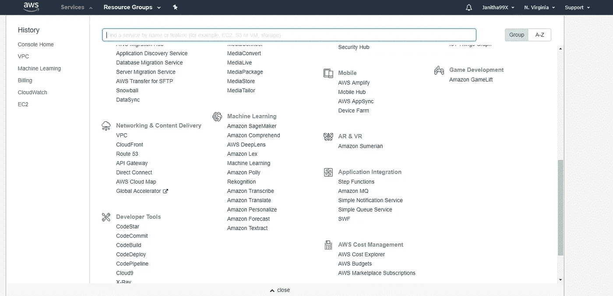

让我们首先使用控制台进入亚马逊机器学习服务。在服务方面，它应该属于机器学习类别。在里面，如果你第一次启动它，你会看到下面的屏幕。

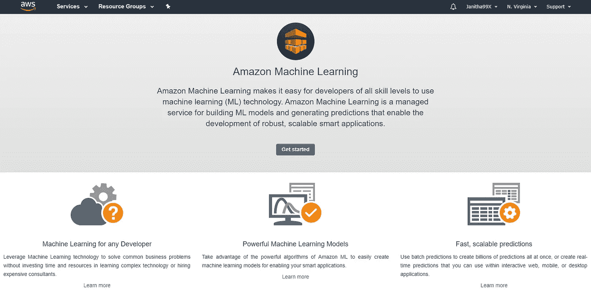

这里为您提供了入门资源。现在，让我们点击开始，开始创建我们的机器学习模型。在下一页中，单击标准设置下的启动，开始创建数据源。

# 创建数据源

在开始在 AWS ML 中创建 dat 源文件之前，我们需要先做一些事情。首先，我们必须将数据保存在逗号分隔的值中。csv)，因为数据源仅受此文件格式支持。然后，我们需要分析数据，并开始对我们收集的数据进行特征处理。特征处理是进一步转换属性以使其更有意义的过程。常见特征处理的示例有

*   替换丢失或无效的数据
*   形成一个变量与另一个变量的笛卡尔乘积。(变量之间似乎有关系)
*   非线性转换(使数值分类(如果收入< 5,000 then low, 5,000 < income < 50,000 then medium and else high)
*   Domain-specific features

After transforming our data we need to upload the data to an Amazon S3 bucket in order to hand it over to Amazon machine learning. For this post, let us use the banking datasource that is provided by Amazon themselves. You can download this datasource by this [链接](https://s3.amazonaw.com/saml-sample-data/banking.csv))。我们预测的问题是某个人是否会贷款。因此，我们需要做的第一件事是将列 loan 中的 yes/no 转换为 1/0，并将该列重命名为 target，因为这是我们的目标属性(确保也替换未知值)。另外，确保删除 y 列。

转换数据后，我们需要将这些数据上传到亚马逊 S3，以便创建数据源。为此，在 S3 创建一个新的 bucket 并上传 csv 文件。

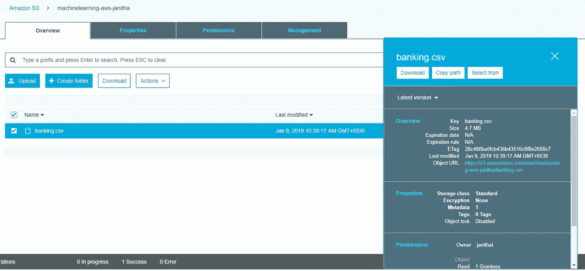

现在我们已经在 S3 存储桶中获得了输入数据，我们可以继续创建数据源。从 ML 的前一个屏幕中选择 launch 后，下一页将引导您创建数据源。在此指定 S3 位置并提供数据源名称。之后，点击验证。当验证亚马逊 ML 将要求访问 S3 桶的许可。选择是。

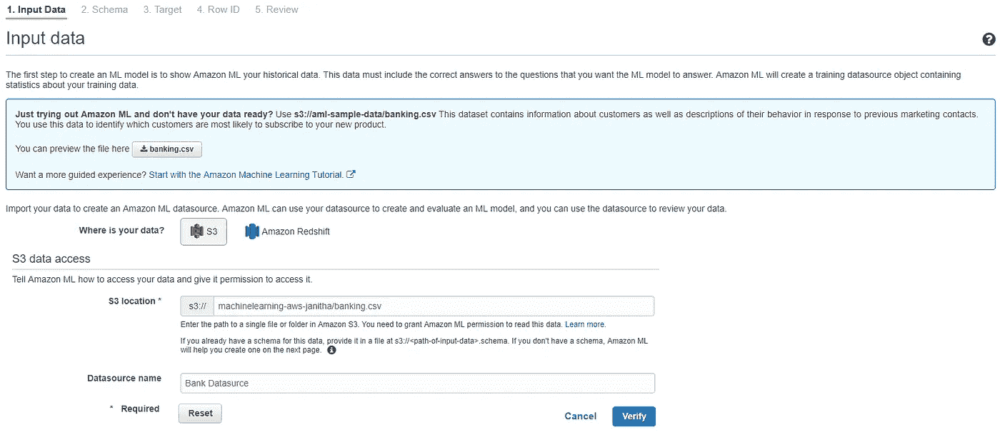

几秒钟后，Amazon ML 将验证数据源并通知您。

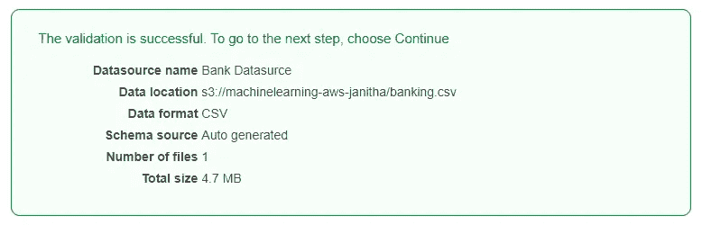

在下一页，我们需要为数据源定义一个模式。默认情况下，Amazon ML 将扫描输入数据，并为我们自动生成一个模式。但是我们可以对自动生成的模式进行修改。首先，选中 CSV 是否包含列名的单选按钮“是”。为我们的属性定义数据类型时，我们必须从下面预定义的类别中选择。

**二元** —选择只有两种可能状态的属性，例如是或否
**分类** —选择具有有限数量的唯一值的属性
**数值** —选择以数量为值的属性
**文本** —选择为一串单词的属性。

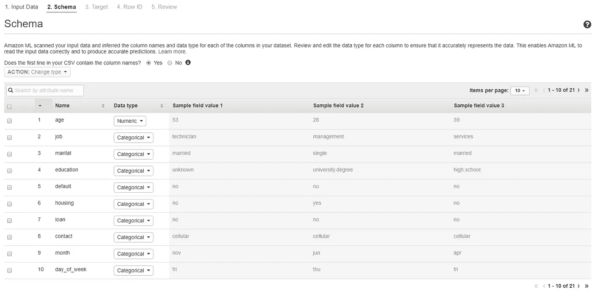

在下一页，我们需要选择我们的目标属性。在询问我们是否正在创建 ML 模型的复选框中，选择是。之后，从模式中选择目标属性。(如果您将使用数据源来训练和评估 ML 模型，则只需指定目标属性)

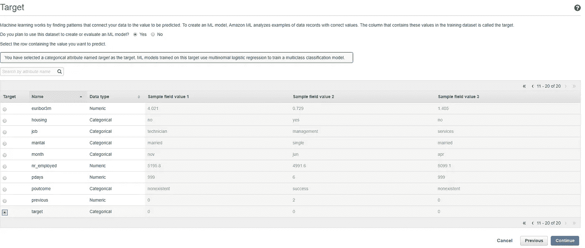

在“行 ID”页上，您的数据是否包含标识符？，确认默认选择否。接下来，在 review 页面中查看数据源并选择 Create datasource。

# 创建 ML 模型

为了训练 ML 模型，我们需要指定以下参数。

*   输入培训数据源
*   包含要预测目标的数据属性的名称
*   必需的数据转换指令
*   控制学习算法的训练参数

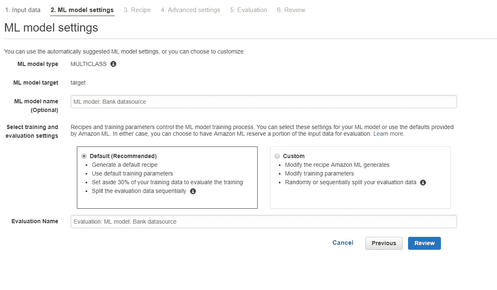

因为我们已经使用向导创建了这个 ML 模型，所以数据源会自动选择我们刚刚创建的数据源。在此步骤中，还会自动选择目标属性的名称。为了博客的简单，我们将使用 Amazon ML 生成的默认(推荐)设置。如果我们想指定进一步的数据转换和添加训练参数，我们可以选择自定义。当我们选择 Review 时，我们可以查看我们提供的设置和 Amazon ML 自动生成的设置。

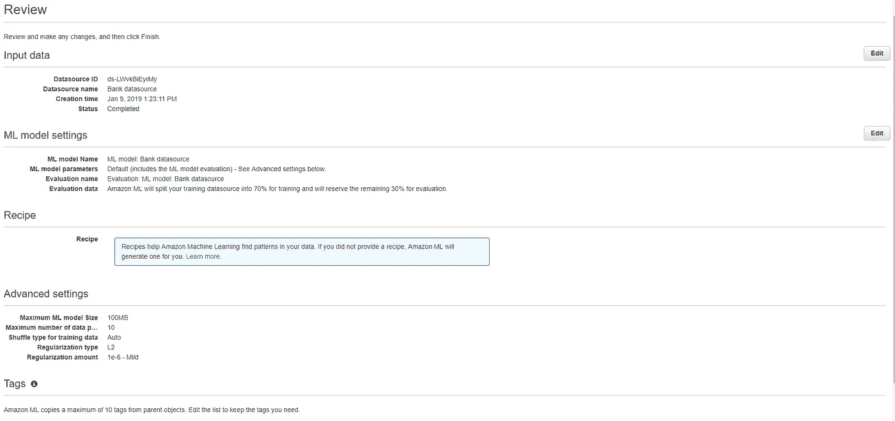

在“评估数据”下，您可以看到我们的数据分为 70%的培训数据和 30%的评估数据。如果我们选择自定义，我们可以自定义这些参数。在自定义模式下，可以配置以下训练参数。

**最大模型大小** —以字节为单位的最大模型大小。默认值为 100 MB。你是根据模型尺寸定价的。

**数据的最大传递次数** —为了发现模式，Amazon ML 对您的数据使用多次传递。默认值为 100。图案的数量可以随着通过次数的增加而增加，并且可以提高模型的质量。

**训练数据的混洗类型** —拆分数据时的混洗类型。默认情况下，亚马逊不会打乱训练数据。

**正则化类型和数量** —当数据包含太多模式时，复杂 ML 模型的性能会受到影响。正则化有助于模型避免过度拟合训练数据。

在我们的帖子中，我们将使用 Amazon ML 提供的默认值。查看后，选择创建 Ml 模型。在这一步中，Amazon ML 将您的模型添加到处理队列中。当 Amazon ML 创建您的模型时，它会应用默认值并执行以下操作:

*   将定型数据源分成两部分，一部分包含 70%的数据，另一部分包含剩余的 30%
*   在包含 70%输入数据的部分上训练 ML 模型
*   使用剩余 30%的输入数据评估模型

当您的模型在队列中时，Amazon ML 将状态报告为 Pending。当 Amazon ML 创建您的模型时，它将状态报告为正在进行中。完成所有操作后，它会将状态报告为已完成。请等待评估完成后再继续。

就是这样。我们已经使用 Amazon ML 创建了第一个 ML 模型。但是，这些步骤并不止于此。下一步是评估我们已经创建的 ML 模型。

# 评估模型

在亚马逊 ML 评估过程中，它生成行业标准的质量指标。一个这样的度量是 AUC(曲线下面积)。这表达了你的 ML 模型的性能质量。AUC 衡量模型预测正面示例比负面示例得分更高的能力。要查看我们创建的模型的 AUC，请在 ML 模型报告窗格的 ML 模型摘要页面上选择评估，然后选择模型。

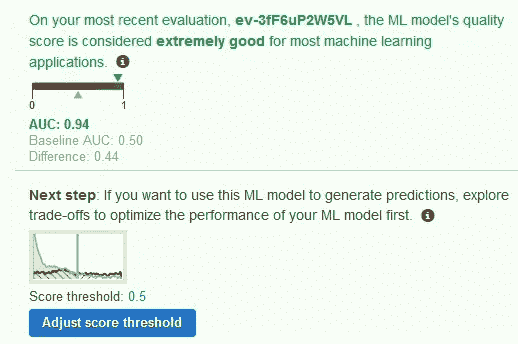

我们可以调整分数阈值以改变模型的准确性。ML 模型为预测数据源中的每条记录生成数字预测分数，然后应用阈值将这些分数转换为二进制标签 0(表示否)或 1(表示是)。通过改变分数阈值。要设置阈值，请选择调整分数阈值。

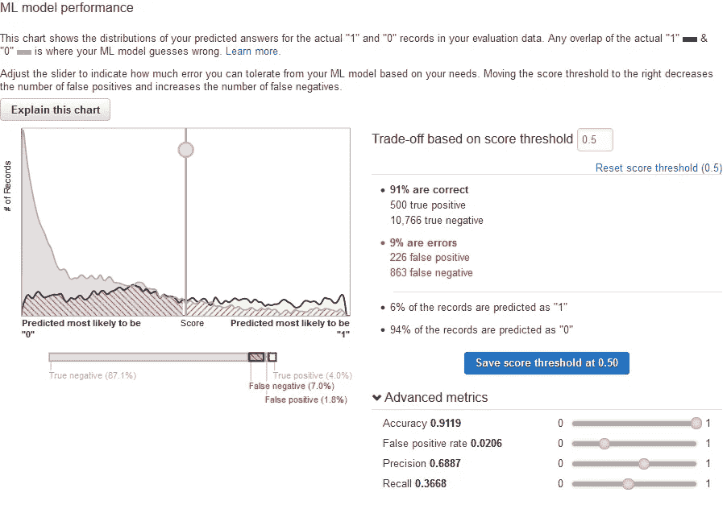

Amazon ML 提供的默认阈值是 0.5。您可以微调该值以满足您的要求。调整此值会更改模型在认为预测为肯定预测之前必须具有的置信度。它也改变了你在预测中愿意容忍多少假阴性和假阳性。如果您只需要将最大似然值设置为阳性，您可以设置更高的阈值，就像在疾病检测为阳性的情况下，错误的阳性结果可能很关键。

# 生成预测

Amazon ML 可以生成两种类型的预测。

*   实时预测
*   批量预测

让我们先来看看实时预测。当从 ML 模型预测时需要低延迟时，使用实时预测。它们是交互式网站和手机的理想选择。对于需要实时预测的应用程序，我们必须为 ML 模型创建一个实时端点。为此，我们将在终端可用时累计费用。但是我们可以尝试在工具中使用实时预测功能，而不创建实时端点。在 ML 模型报告中，选择尝试实时预测。

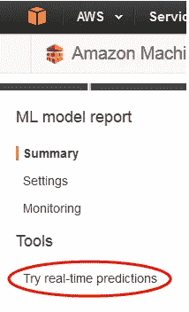

在这里，您可以粘贴一条记录并选择创建一个预测。然后 Amazon ML 实时填充预测的标签。

为了生成批量预测，我们需要从亚马逊机器学习中选择批量预测。选择新建批量预测，并在下一页选择 ML 模型。

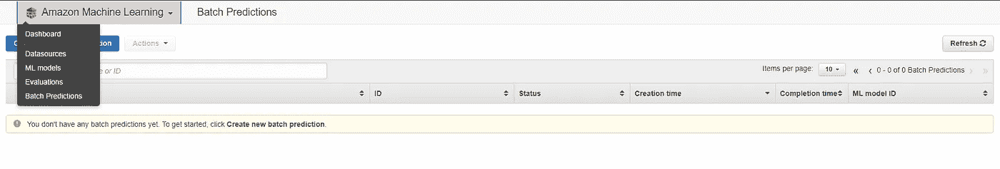

要生成批量预测，我们需要将批量数据上传到 S3 存储桶。上传批量预测后，我们可以在定位输入数据时指向它们。之后，配置批处理数据，您将再次被要求 Amazon ML 权限来访问 S3 对象。对于 S3 目的地，选择一个 S3 桶。这将是完成后上传结果的位置。完成后，批量预测将运行并将上传到指定的 S3 位置。

以上解释的是使用 AWS 机器学习创建机器学习模型的基本概要。使用以下 AWS [文档](https://docs.aws.amazon.com/machine-learning/latest/dg/what-is-amazon-machine-learning.html)可以创建更复杂的机器学习模型。