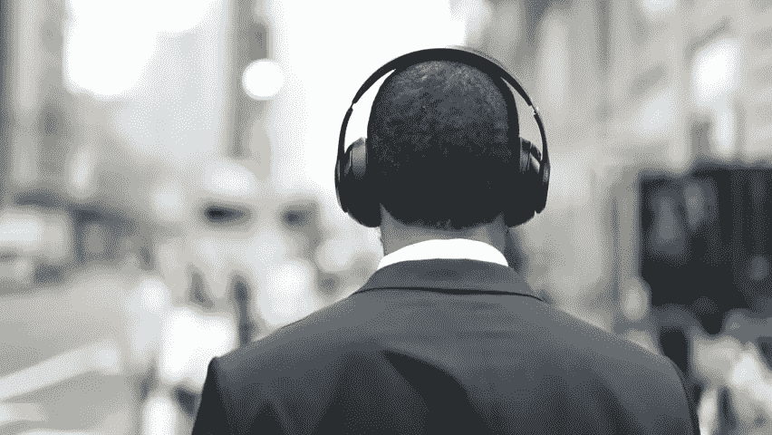
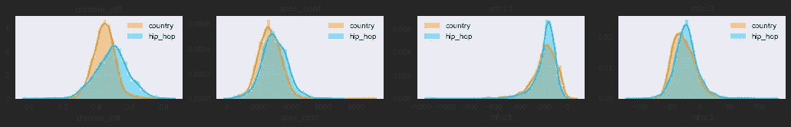
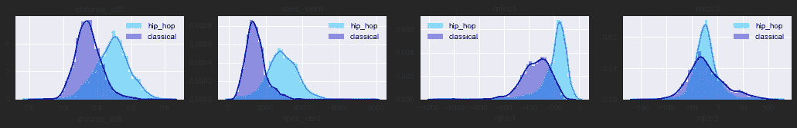
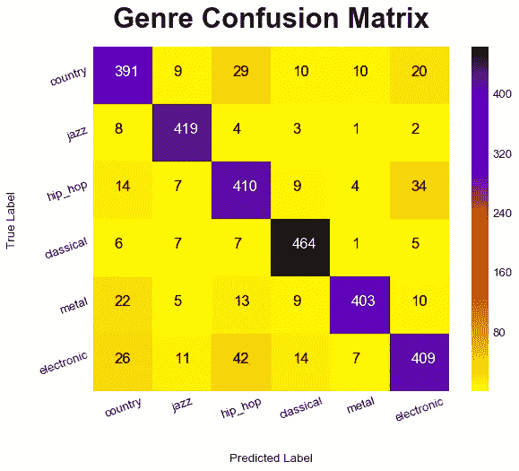
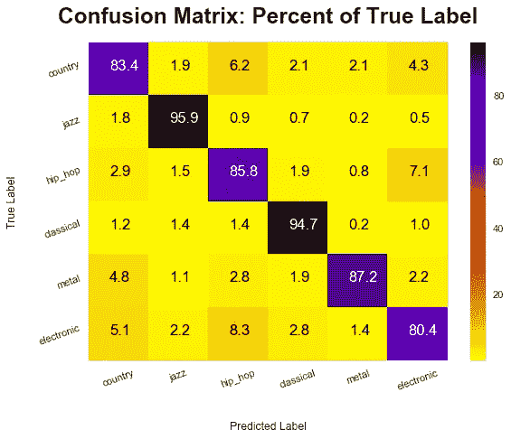

# 机器“监听”

> 原文：<https://medium.datadriveninvestor.com/machine-listening-a4312a129780?source=collection_archive---------14----------------------->

用于音乐流派分类的机器学习。



## 商业理解

音乐是大多数人生活的一部分，无论是在锻炼、鸡尾酒会、夜总会，还是在电视和电影中。但是只有特定类型的音乐在特定的情况下才起作用。我喜欢把这看作是“体裁适合”或“适当性”。音乐不仅仅是好或坏；对一种情况来说是好是坏*。《权力的游戏》的介绍很棒，但它可能不会很好地融入情景喜剧或鸡尾酒会。在一个较窄的范围内，对于一个人的婚宴来说，乡村音乐可能很棒，而古典音乐会让人不舒服。对于另一个人的婚宴来说，情况可能正好相反。幸运的是，我们经常有音乐的流派标签。新音乐呢？可能艺术家会自己报告流派。但是如果一个民间艺术家创作了一首爵士歌曲呢？或者我们要找的那些同样是爵士的民谣，却有一部分被贴上民谣的标签，有一部分被贴上爵士的标签？或者举另一个流派的例子，如果我们想找一种绝不是嘻哈的新乡村音乐呢？如果我们能预测一首歌落入某些流派的可能性，我们就能回答这些问题。*

## 数据理解

***收集-*** 为了这个实验，我收集了大约 600 首歌曲的数据，其中大约 100 首来自 6 个不同的流派。但是我希望这个实验能够在不同的混音和不同种类的音乐中快速重复。因此，如果你想用不同的风格重新进行这个实验，你可以用其他的播放列表和风格标签来替换播放列表的 URL。回购可以在[这里](https://github.com/Patrickbfuller/classify_genre)找到。

[](https://www.datadriveninvestor.com/2019/03/03/editors-pick-5-machine-learning-books/) [## DDI 编辑推荐:5 本让你从新手变成专家的机器学习书籍|数据驱动…

### 机器学习行业的蓬勃发展重新引起了人们对人工智能的兴趣

www.datadriveninvestor.com](https://www.datadriveninvestor.com/2019/03/03/editors-pick-5-machine-learning-books/) 

对于每一个流派，youtube 上都选择了一个播放列表，比如“前 100 个国家”，有效地预先标记了我的数据。使用 **BeautifulSoup** 收集每首歌曲的 URL。然后，使用 **youtube_dl** 库检索每首歌曲的音频文件。然后使用 **librosa** 音频库将音频文件加载为 1d **numpy** 数组。如果歌曲长于 4 分钟，则只载入前 4 分钟。然后，歌曲的音频被分割成 10 秒钟的片段，以便对声音进行更细致的检查。然后使用 Librosa 提取特征，如节奏、频谱质心、频谱衰减、过零率和 mel 频率倒谱系数。这些术语非常专业，但本质上，它们代表了声音的部分音色。然后以 10 秒为间隔对它们进行平均，为每个特征创建一个数据点。这些特征随后被存储在一个带有流派标签的 **json** 中，歌曲中每 10 秒钟的片段占一行。然后，在继续播放下一首歌曲之前，音频文件会被抹掉。对每种类型的每首歌曲重复相同的过程。

***探索性数据分析* -** 并非 600 首歌曲全部加载。这些是收集的结果。

```
df.groupby('genre').song.count()genre
classical     2320
country       2389
electronic    2371
hip_hop       2345
jazz          2397
metal         2399
Name: song, dtype: int64df.groupby('genre').song.nunique()genre
classical      97
country       100
electronic     99
hip_hop        98
jazz          100
metal         100
Name: song, dtype: int64
```

有太多的类型和功能的组合，在这里无法一一展示，但是如果你想看到它们，你可以探索一下笔记本。下面是几种类型和特点的组合。



Country and Hip Hop are rather similar.



Classical is more distinguishable from Hip Hop

## 数据准备

对于逻辑回归和支持向量模型，需要对数据进行缩放。测试的变压器是来自 **Scikit Learn** 的标准转换器和电源转换器。PowerTransformer 很好，因为它使偏斜分布正常化，并缩放到标准偏差，将平均值移至零。它目前默认为 Yeo-Johnson 变换。

主成分分析也被测试，并且这些准备被应用于管道对象。

## 建模

测试了以下型号:

*   逻辑回归
*   支持向量机
*   随机森林
*   梯度增强树
*   顺序网络(深度学习)

对模型进行了对数损失和 Jaccard 相似性评估。对数损失是一种基于数据点被错误标注的置信度来惩罚错误分类的度量。换句话说，它确保了模型不只是侥幸地进入狭窄的分类，而是更有信心地进行分类。

Jaccard 相似性评估两个区域之间的重叠。它类似于准确性，因为它衡量成功，但它的分母是真阳性和假阳性。因此，它将惩罚一个在预测爵士乐方面非常准确，但只对爵士乐准确的模型，因为它将几乎所有东西都归类为爵士乐。

最终，在测试集上，支持向量模型预测具有最低的对数损失(0.39)和最佳的 Jaccard 相似性(0.77)。梯度增强树位居第二，Jaccard 相似度略低(0.73)，但对数损失更大(0.50)。然而，支持向量不能很好地扩展，并且随着更多的数据，其他模型可能会表现得更好，特别是如果可以获得足够的数据来训练深度学习模型。

## 估价

在维持集上，支持向量的表现几乎相同。下面是混淆矩阵，分别是总数和正确标签的百分比(每种类型的准确度)。



## 部署

这个模型目前还没有部署，但是如果您想要克隆 repo 并从 genre.py 中导入方法 *genre.classify* 的话，代码是可用的。

## 将来的

更多类型和不同组合的更多实验可以提供更多的见解以及迭代改进。调整深度学习可以提高性能。

据报道，利用在光谱图图像上训练的卷积神经网络进行分类的实验表现非常好，并且取得了很大的进展。

对声音特征和/或频谱图的无监督聚类可以提供有趣的见解，如“有多少不同的流派*真的有*？

一个有趣的想法可能是一个预测说唱是“西海岸”、“东海岸”或“南部”的概率的模型。