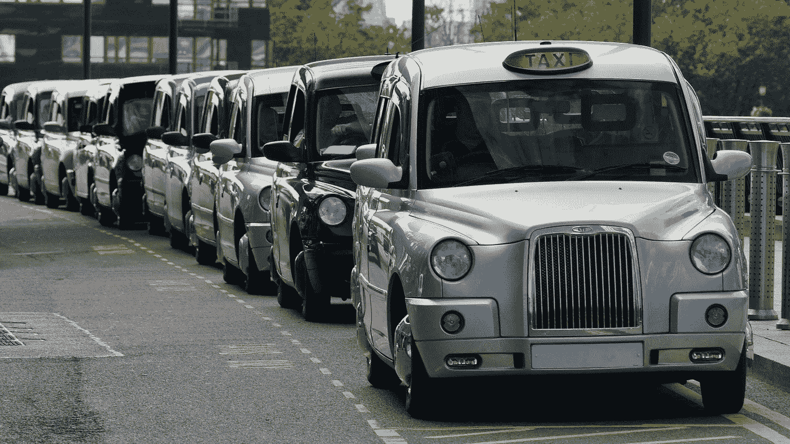

# 加密货币交易中的机器疯狂

> 原文：<https://medium.datadriveninvestor.com/machine-madness-in-cryptocurrency-trading-57430c575c4d?source=collection_archive---------1----------------------->

## 即使按照 cryptoverse 的标准，将“机器学习”和“深度学习”工具应用于加密货币交易的主张也应该引起更多的怀疑。

Driving one of these things requires a memory the size of a CPU. (Image by [PublicDomainPictures](https://pixabay.com/users/PublicDomainPictures-14/?utm_source=link-attribution&utm_medium=referral&utm_campaign=image&utm_content=19228) from [Pixabay](https://pixabay.com/?utm_source=link-attribution&utm_medium=referral&utm_campaign=image&utm_content=19228))

这件事迟早会发生。经过多年的深思熟虑的学习，40 岁的彼得·麦凯布，一个想成为伦敦出租车司机的人，终于通过了艰苦的考试，成为了一名伦敦出租车司机，或者简称为“知识”。

想要记住这座迷宫般的城市的 25000 条街道(别忘了，伦敦自罗马帝国时代就有了)以及街道上的任何商业或地标，需要多年的学习，未来的出租车司机承担着记住整个伦敦的任务。

 [## Azbit 旨在连接传统金融和加密货币|数据驱动的投资者

### Azbit 是下一个提供交易平台的加密项目，该平台提供保证金和算法交易。一样多…

www.datadriveninvestor.com](https://www.datadriveninvestor.com/2019/03/20/azbit-aims-to-connect-traditional-finance-and-cryptocurrency/) 

通过一系列逐渐变得更具挑战性的口试来展示精通，“知识”平均需要四年才能完成，而对其他人来说，则需要更长的时间——所有这些只是为了开“出租车”

因此，当麦凯布最终通过了相当于出租车司机的 sat 考试时，他注意到自己的成就有点苦乐参半。

在一个优步、全球定位系统和人工智能(或人工智能)的时代，记住伦敦的 3D 世界观还会与私人出租交通有任何关联吗？

## 机器，到处都是机器，但没有一点人性

这就是为什么已经成功渗透到像驾驶汽车这样复杂的领域的自动化首先开始渗透到仅仅五十年前原本是人类专属领地的另一个领域——投资——也就不足为奇了。

不久前，投资还是一项独特的人类事务。

与今天相比，20 世纪 70 年代的华尔街是一个不同的地方，权力午餐和权力诉讼统治着这片土地。在这里，交易优势是从威彻斯特的一个高尔夫球场或曼哈顿市中心四季酒店的豪华餐厅中获得的。

即使到了 20 世纪 80 年代，阅读《T2 华尔街日报》或在交易大厅看电视或股票行情自动收录器也提供了显著的信息优势。

Winter is coming. (Image by [ArtTower](https://pixabay.com/users/ArtTower-5337/?utm_source=link-attribution&utm_medium=referral&utm_campaign=image&utm_content=3004860) from [Pixabay](https://pixabay.com/?utm_source=link-attribution&utm_medium=referral&utm_campaign=image&utm_content=3004860))

然而，自那以后，投资环境发生了巨大变化，人的作用大大降低了。

如今，计算机、算法和被动的管理者主宰着我们的投资领域。

上个月，一家金融信息和研究提供商晨星公司报告称，被动权益资产达到了 4.3 万亿美元，首次超过了人类管理的资产。

但这并不意味着技术只是进入投资领域。

## 去过，做过，买过机器人

荷兰东印度公司(the Dutch East India company)的早期投资者在船只抵达荷兰之前，寻找有关绕过好望角的船只命运的时事通讯，希望利用廉价购买不太了解情况的投资者的股票。

据说罗斯柴尔德家族早在女王之前就知道了拿破仑在滑铁卢战役中的失败，这要归功于信鸽网络，它比船只更快地带来了法国战败的消息——空运几乎总是比海运快(除非你是从拉瓜迪亚机场起飞的)。

因此，在纸质账本和计算尺的时代，当机器开始悄悄进入时，首先处理最简单、最重复、通常也是最嘈杂的工作就不足为奇了。

上世纪 70 年代，场内交易员在交易所内互相喊着下单，开始被更加准确高效的电子执行所取代。

Existing evolutionary models suggest that humans are doomed. (Image by [Ryan McGuire](https://pixabay.com/users/RyanMcGuire-123690/?utm_source=link-attribution&utm_medium=referral&utm_campaign=image&utm_content=413688) from [Pixabay](https://pixabay.com/?utm_source=link-attribution&utm_medium=referral&utm_campaign=image&utm_content=413688))

订单的电子执行也为价格和交易量数据的集中来源铺平了道路，如果你愿意，可以称之为 oracle，这反过来通过创造更大的价格确定性提高了效率。

因此，没过多久，投资组合经理也将自动化融入了他们的产品，Vanguard 的创始人杰克·博格尔(Jack Bogle)在 1975 年创建了世界上第一只指数基金，实现了最简单的投资组合配置自动化。

到了上世纪 80 年代和 90 年代，基金经理开始创造更复杂的自动化产品，如量化对冲基金和交易所交易基金(ETF)。

尽管一些 ETF 跟踪指数，但其他 ETF 可能要复杂得多，几乎是根据预设参数自主行动，如寻找被低估的公司或自动重新平衡行业敞口——可以将它们视为陷入困境的分散自治组织的早期迭代(臭名昭著的 DAO 标志着以太坊的早期困境)。

## 考虑这个因素

这些投资机器中的大多数都是依靠业内所谓的“因素”来运作的

因素的概念已经存在了几十年，是由两位经济学家尤金·法马和肯尼斯·弗伦奇提出的。

本质上，量化对冲基金根据经济理论得出并经数据分析证实的“因素”对其算法进行编程，以选择证券，如动量(最近的价格变动)或收益率(股息支付)。

过去，只有资金最充足的基金经理才有能力处理大量数据，以供这些机器使用，而如今，几乎每个人都有机会接触到能够理解市场的技术。

获取信息和技术的民主化意味着，尽管在过去，算法基金可能享有优势，而且可以保持更长时间，但更高的效率和透明度削弱了这种优势，提高了市场效率。

今天，仅在纽约证券交易所，每天就有价值约 3200 亿美元的 70 多亿股股票易手，其中大部分是高频、自动化交易，股票在这里快速转换，以获取短暂的收益。

That face you make when the computer says “no.” (Image by [Thomas Meier](https://pixabay.com/users/tmeier1964-2034229/?utm_source=link-attribution&utm_medium=referral&utm_campaign=image&utm_content=1193318) from [Pixabay](https://pixabay.com/?utm_source=link-attribution&utm_medium=referral&utm_campaign=image&utm_content=1193318))

结果是今天的股票市场比以往任何时候都更有效率，自动化投资使得成本大幅降低，被动基金每年收取管理资产的 0.03%至 0.09%的费用，这与对冲基金要求的一磅肉(管理资产的 2%和回报的 20%)相去甚远。

因为现在的交易比以往任何时候都要便宜，关于一家公司的新信息几乎会立即反映在它的价格上。

这意味着机器主导的市场很可能会进一步扩大。

自动化投资早期开发的人为因素策略已经可以通过 ETF 广泛获得。

## 鹅的自动化就是公鹅的自动化

因此，自动化和算法交易的一些原则开始在蛇油推销和炒作的狂欢中渗透到加密货币市场，这真的只是时间问题。

但现实是，即使在资本市场，算法交易也有其局限性。

人工智能和深度学习工具的支持者指出了 AlphaZero 等例子，这是谷歌在 2017 年推出的一款计算机，它被赋予了国际象棋的规则，然后自学了如何下棋，只花了四个小时的训练就击败了 Stockfish，这是用人类战术编程的最好的国际象棋机器，这是机器不可避免的统治地位的证据。

但传奇对冲基金 Bridgewater Associates 的雷伊·达里奥等资深经理人指出，在国际象棋中，规则是静态的，而相比之下，市场是动态的，尤其是因为人们会学习，他们所学的会转化为证券价格。

> “如果有人发现了你发现的东西，它不仅一文不值，还会被过度低估，造成损失。”
> 
> "不能保证以前奏效的策略会再次奏效."
> 
> “(不采用人类逻辑的机器学习策略)如果没有深度理解，最终肯定会失败。”

将机器学习工具和数据分析大规模应用于加密货币交易的危险究竟在哪里？

在过去的三十年里，量化投资从一个投资假设开始，投资者会根据历史数据进行测试，并判断它是否继续有用。

Someone forgot to program an “OFF” button for the algorithm. (Image by [Pete Linforth](https://pixabay.com/users/TheDigitalArtist-202249/?utm_source=link-attribution&utm_medium=referral&utm_campaign=image&utm_content=2721568) from [Pixabay](https://pixabay.com/?utm_source=link-attribution&utm_medium=referral&utm_campaign=image&utm_content=2721568))

这个过程的顺序已经颠倒了。

如今，量化策略从数据开始，寻找假设，这也适用于加密货币。

从传统金融领域进入 cryptoverse 的经理们现在试图将来自不受监管来源的可疑数据插入他们现有的交易模型，结果不一致。

然而，正是因为加密货币市场的不透明和低效率，算法交易的战略部署才有可能带来丰厚回报。

可以肯定的是，由于多达 90%的加密货币交易量是伪造的，使用重复模式产生交易量的自动化机器人很容易被欺骗。

数据点的不透明和不一致意味着直觉，更重要的是经验，仍然与加密货币市场相关。

在加密货币交易中，也许比任何其他形式的基于规则的交易环境都更加如此，人类并没有被完全边缘化。

## 人类想要

在加密货币交易中，经理的角色最终仍然是破译哪些数据要输入机器。

给机器喂垃圾，你可以想象从另一端出来的是什么。

让机器独自从数据中辨别交易策略是在玩火。

通常情况下，机器衍生的“因素”会导致假阳性，从而导致人类看护者将机器发现的东西填充到“可解释的”因素中。

就像驾驶超级油轮一样，在船只航行的早期阶段，微小但错误的方向输入会决定船只是停靠在里斯本还是拉塔基亚。

事实上，一些最危险的加密货币交易模型是那些最初表现出色的模型，结果只是回报这些收益，并导致进一步的深度提款。

然后是数据的数量和来源，可以合理地转换成“因素”

Telling you where the buck stops at. (Image by [Pete Linforth](https://pixabay.com/users/TheDigitalArtist-202249/?utm_source=link-attribution&utm_medium=referral&utm_campaign=image&utm_content=3310190) from [Pixabay](https://pixabay.com/?utm_source=link-attribution&utm_medium=referral&utm_campaign=image&utm_content=3310190))

至少按照人工智能的标准，加密货币的价格、交易量和其他因素数据的数量只是沧海一粟。

因为你真正需要处理的数据量是你试图预测的事物的大小，加密货币数据在统计上是微不足道的。

例如，对于比特币的投资者来说，只有十几年的数据——也许最多只有几百个数据点，与用于训练算法识别人脸甚至驾驶汽车的数十亿字节数据相比，这根本不算什么。

其结果是，使用机器提取加密货币投资论文的交易员可能会发现，机器只是回归到动量交易——鉴于加密货币市场的波动性，这对投资组合可能是致命的。

## 机器，它们有什么用？

在这种背景下，利用算法交易进行加密货币到底有没有价值？

很多。

由于加密货币市场固有的波动性和低效率，以及加密货币本身是不受约束的资产，与任何其他资产类别的相关性有限，因此机会和风险都很丰富。

诀窍是不要让*太陷入数据中。*

机器学习工具可以被教会解密(双关语)小麦(以操纵、交易噪音、前跑、欺骗和洗盘交易的形式)从谷壳(真正的人类主导的投资行为)中分离出来，由于机器主导的重复模式，这相对容易。

由于大部分加密货币交易量要么是伪造的，要么是使用相对简单的机器人和其他交易程序操纵的，即使是最基本的数据分析工具，只要有足够的时间，也应该能够识别真实的价格行为，而不是操纵的价格行为。

然后是确保数据的链外和链内检查。

首先，有大量交易发生在加密货币交易所之外——通过柜台交易(OTC)等方式。

分散交易以及区块链分析可以提供一些迹象，说明什么在向哪里转移。

由于价格和交易量信息有如此多不同的数据点，套利机会比比皆是，特别是当使用一套自动化算法工具时。

然而，由于加密货币市场也非常依赖于情绪，人类的判断力在投资决策中仍然发挥着关键作用，或许比在金融市场中更为重要。

据两个适马的联合主席大卫·西格尔说，

> " 30 年前，最好的基金经理是直觉最好的人."
> 
> “现在，那些使用机器、数据和人工智能采取科学方法的人可以拥有优势。”

在隐世中，交易者可以享受两个世界的好处——有人是电子人吗？