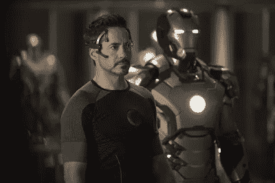
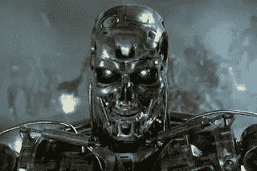

# 机器人

> 原文：<https://medium.datadriveninvestor.com/machine-man-41ed3e06c715?source=collection_archive---------15----------------------->

不久前，当计算机首次大规模进入我们的生活时，未来学家们开始猜测我们将面临什么。近几十年来，我们也见证了许多科幻书籍和电影的兴起。虽然目睹超级智能计算机物种在屏幕上毁灭人类总是一种奇怪的满足感，但我们真正想要的是一个幸福的结局。

天网很酷，但贾维斯很功利。我们都想像托尼·斯塔克一样，与一个真正感同身受的人交谈，同时为我们预订假日航班。像托尼一样有魅力和聪明是一个挑战，但是机器部分真的会发生。我们以 Alexa 和 Siri 的形式出现只是朝着这个方向迈出的一小步。尽管我们希望计算机来完成我们的大部分任务，但真正的力量在于共生。

 [## 模式和机器人:一个复杂的现实数据驱动的投资者

### 哈耶克的名著《复杂现象理论》(哈耶克，1964)深入探讨了复杂性的话题，并断言…

www.datadriveninvestor.com](https://www.datadriveninvestor.com/2019/03/04/patterns-and-robotics-a-complex-reality/) 

有了可以预测我们购物偏好的算法和自动化的制造过程，未来似乎很少有人类参与的空间。但事实远非如此。软件复杂性的增加与从抽象概念中提取上下文线索和洞察力的需求成正比。而这正是我们所擅长的，解读字里行间。

在《从零到一》一书中，彼得·泰尔谈到了他的公司 PayPal 的早期。尽管拥有一种创新的算法，可以每分钟审查数千笔交易以检测信用卡欺诈，但该公司每月仍损失 1000 万美元。欺诈者正在快速学习和违反新规则。因此，PayPal 组建了一个人工分析师团队，审查该算法标记的大多数可疑交易。该公司从下一季度开始盈利。这个人机混合系统被命名为“伊戈尔”，以俄罗斯诈骗犯的名字命名，他声称自己永远不会被抓住。

像网飞、谷歌和亚马逊这样的公司雇佣了许多人来补充和支持其大量的应用程序，并将继续这样做。计算机被用作将数百万个数据点减少到数百个数据点的第一步，然后人类输入被用于添加拼图的上下文部分。

人类和计算机擅长不同的事情，所以他们不会相互竞争。

**摘自《从零到一》一书的文章，阐述了互补的思想-**

> “现在想想来自计算机的竞争而不是来自人类工人的竞争的前景。在供应方面，计算机与人的差异远远大于任何两个人之间的差异:人和机器擅长于根本不同的事情。人是有意图的——我们在复杂的情况下形成计划，做出决定。我们不太擅长理解大量的数据。计算机恰恰相反:它们擅长高效的数据处理，但它们难以做出对任何人来说都很简单的基本判断。
> 
> 为了理解这种差异的规模，考虑一下谷歌的另一个计算机替代人类的项目。2012 年，他们的一台超级计算机成为头条新闻，在扫描了 1000 万个 YouTube 视频缩略图后，它学会了以 75%的准确率识别一只猫。这似乎令人印象深刻——除非你记得一个普通的四岁小孩也能完美地做到。当一台廉价的笔记本电脑在一些任务上击败了最聪明的数学家，但即使是一台拥有 16000 个 CPU 的超级计算机在其他任务上也无法击败一个孩子时，你可以看出人类和计算机不仅仅是比彼此更强大或更弱，而是截然不同。"

新的世界秩序将是两个强大但不同的物种共同努力的结果。在未来，我们可能不会面临与终结者的战争，但我们很可能不得不与他们分享我们的公寓。

—标清

参考文献-

[零比一——彼得·泰尔](https://www.amazon.com/Zero-One-Notes-Startups-Future/dp/0804139296)

[福布斯-人和机器如何合作](https://www.forbes.com/sites/groupthink/2014/11/11/how-man-and-machine-can-work-together/#66abf103462b)

谷歌图片