# 检测皮肤癌痣的机器

> 原文：<https://medium.datadriveninvestor.com/machines-detecting-skin-cancer-moles-e2c15d52e38e?source=collection_archive---------3----------------------->

皮肤癌是我们人类最常见的癌症类型。如果它是最常见的癌症类型，你会认为诊断过程是快速和有效的，然而，它不是。

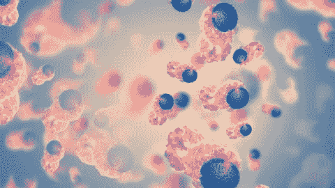

Skin Cancer Molecules

诊断皮肤癌患者的过程大概是这样的:

1.  拜访你的家庭医生，确定是否需要进一步的诊断。
2.  如果您的家庭医生确定您需要进一步诊断，将进行活检或皮肤镜分析。
3.  根据皮肤癌的诊断，根据癌痣的严重程度，可以做进一步的检查。

整个诊断过程大约需要 **2 个月！**想到意识到上述过程只是为了诊断，甚至不是为了治疗，真是疯狂！

 [## 艾预测:“颠覆，然后是生产力”|数据驱动的投资者

### 人们越来越担心，随着机器学习和互联网的普及，所有白领工作都将消失

www.datadriveninvestor.com](https://www.datadriveninvestor.com/2018/08/06/ai-forecast-disruption-then-productivity/) 

嗯，你知道在每个故事中，有一个问题，有一个英雄来拯救世界…在这种情况下**人工智能是英雄！** **AI 可以检测到癌痣**以便告诉你癌痣是良性还是恶性，这是非常有用的，因为可以根据癌症的类型开始广义的治疗，以防止对身体的进一步伤害。我所做的是编写了一个算法来检测皮肤癌痣是良性的还是恶性的。

我会告诉你我是如何设计超级英雄来拯救皮肤癌患者的！我编写了一个卷积神经网络(CNN ),因为它非常适合图像分类，我使用了 keras tensorflow 后端。

# 步骤 1:分析数据集

让我们首先了解数据集。我使用了一个来自国际皮肤图像合作组织(ISIC)的数据集。它由 1800 张良性痣的图片和 1497 张恶性分类痣的图片组成。这些图片都被调整到相同的大小，以便模型更容易识别所有的图像。

# 步骤 2:导入库

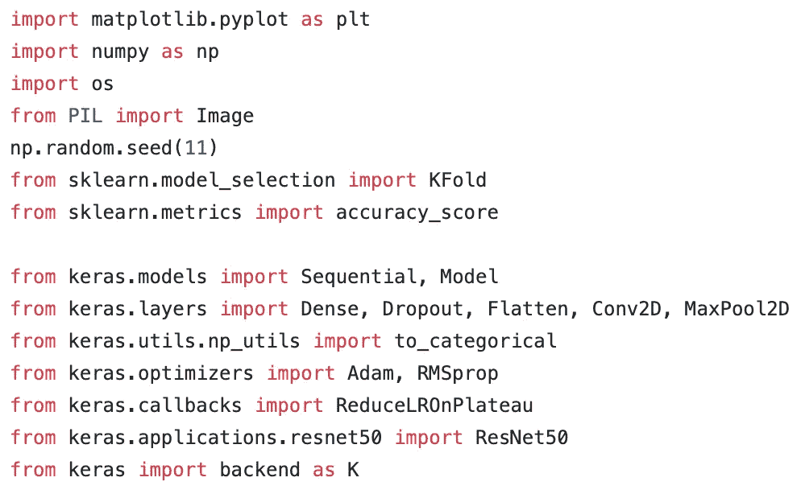

所有这些库都是为了运行从 keras tensorflow 到 numpy 的模型，所有这些库都是模型运行所必需的。

# 步骤 3:加载图片并制作图像和标签的字典

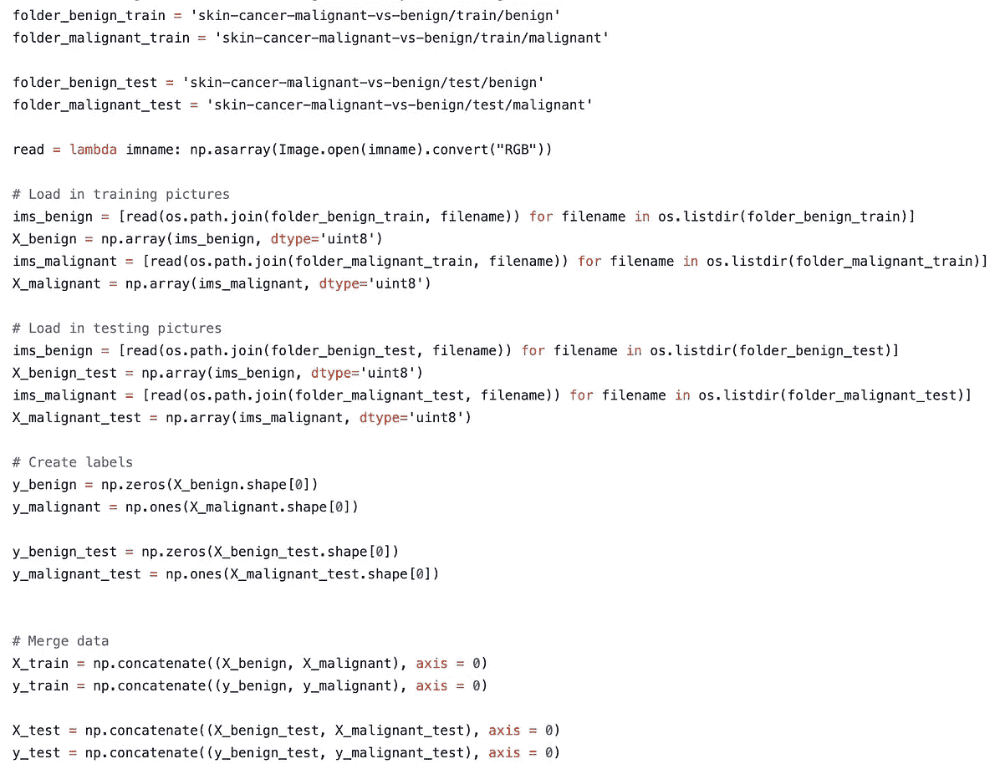

在这一步中，图片被加载，然后使用图像的 RGB 值转换成 numpy 数组。这些图片的大小已被调整为 224x224 的正方形，然后给这些图像加上标签，因为没有为这些图像创建标签。一旦标签被创建并且图像被转换成 numpy 数组，这些图像就被添加到一个训练集中并被混洗。

# 第四步:分类标签

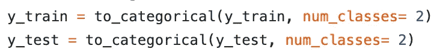

这是一个简短的步骤，因为它只是为训练和测试数据创建分类标签。

# 第五步:正常化

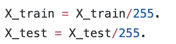

在这里，我通过将 RGB 值除以 255 来标准化图像的所有值。通过标准化图像，我改变了像素强度值的范围。

# 第六步:模型构建

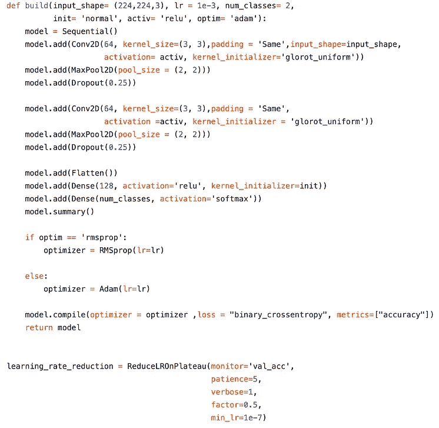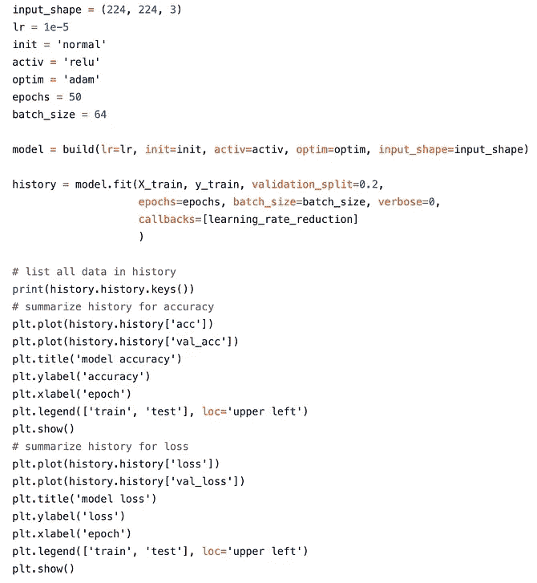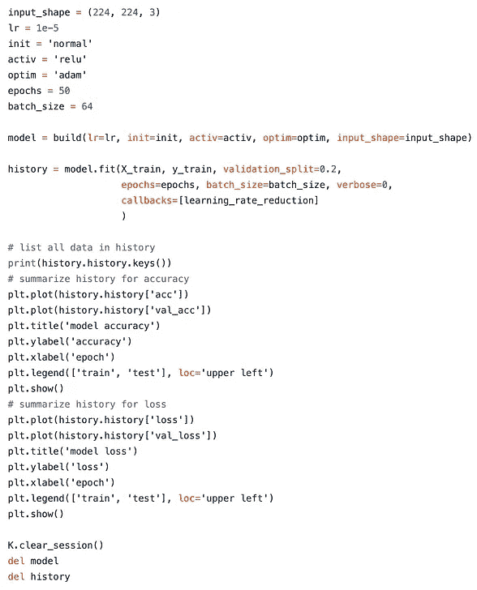

当使用 Keras 顺序 API 时，我从开始输入一次添加一层。第一层是卷积层，它是一组可学习的过滤器。对于前两个卷积层，滤波器的数量设置为 64。每个滤镜都有一个作用，即使用内核大小来变换图像的一部分。核滤波器矩阵被应用于整个图像，并且滤波器可以被可视化为图像的变换。

CNN 中的第二层是池层，这一层的作用是查看两个相邻的像素并选择最大值。使用它们有两个原因，一是为了减少计算成本，二是为了减少过拟合。

通过结合我使用的两种类型的层，卷积层和池层，CNN 能够结合图像的局部特征并学习更多的全局特征。局部特征描述了兴趣点周围的图像块，而全局特征将图像描述为单个向量。

在上面的代码中，您会看到单词 dropout，并且可能想知道它是什么，well dropout 是一种正则化方法，其中对于每个训练样本，一定比例的节点被随机忽略。节点的比例被随机丢弃，迫使网络以分布式方式学习特征。这种方法用于提高泛化能力和防止过拟合。

Relu 也用于增加网络的非线性。

网络的展平图层是转换最终要素并将其映射到单个 1D 矢量的图层。这一层将所有局部特征与先前的卷积层相结合。最后，我在一个完全连接的层中使用了这些特性，这本质上是一个人工神经网络(ANN)分类器。

# 步骤 7:交叉验证模型

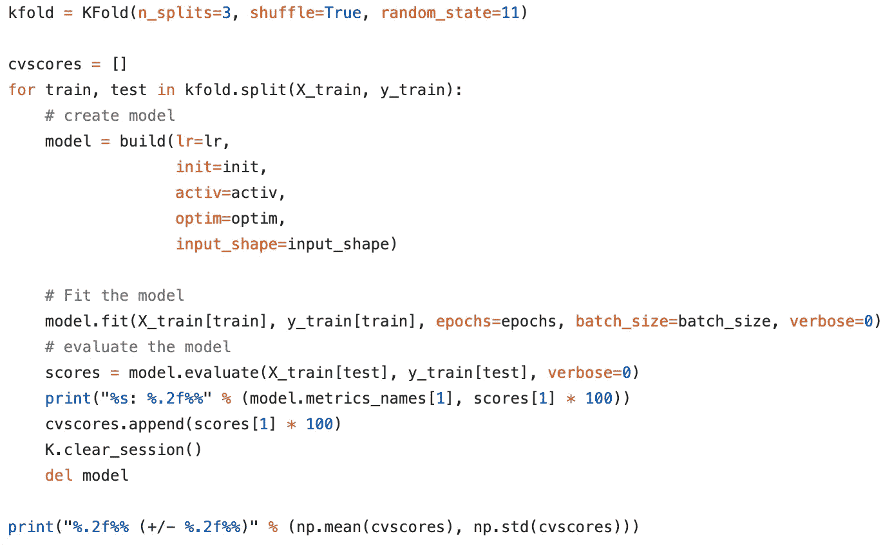

这样做的目的是测试模型预测新数据的能力，并标记诸如过度拟合或选择偏差等问题。这也将使我们了解模型将如何推广到一个独立的数据集。

# 步骤 8:测试模型

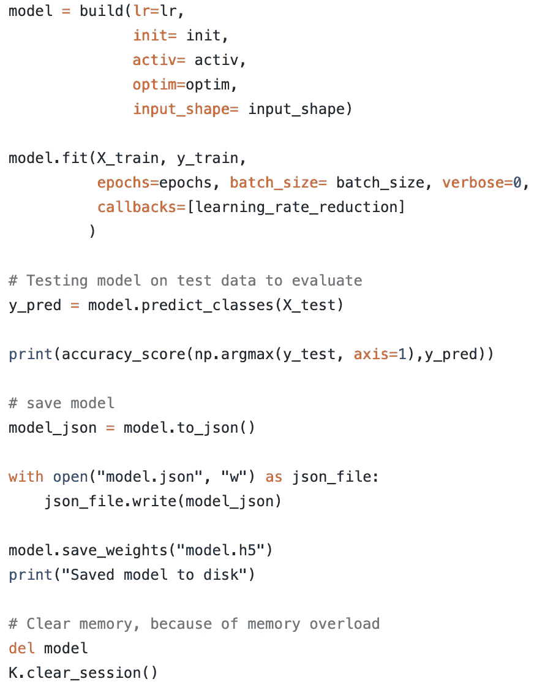

在这一步中，会发生一些事情。首先，用所有数据拟合模型，然后基于测试数据测试模型，然后在输出时打印模型的精确度。

# 第九步:ResNet50

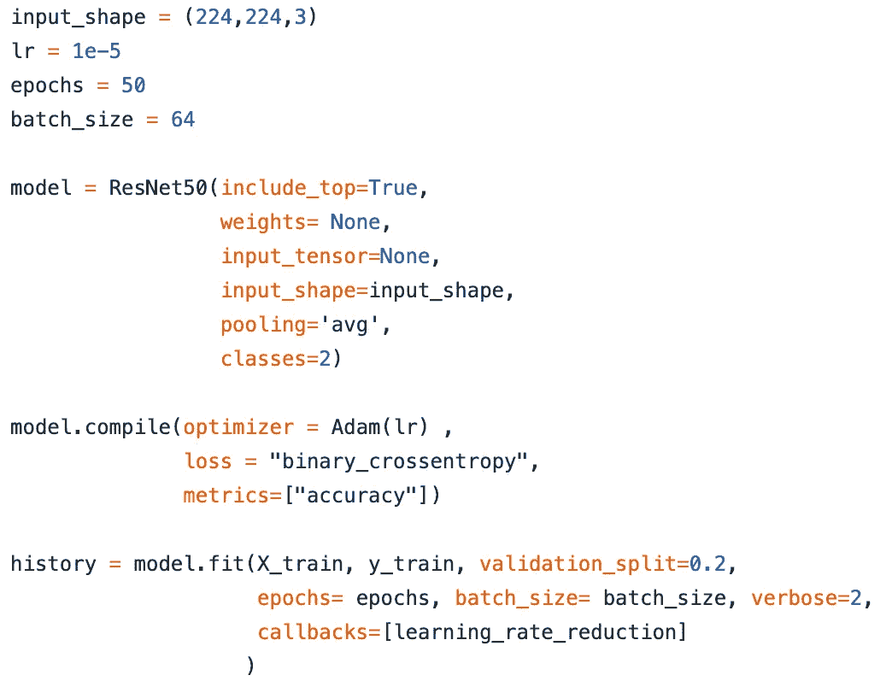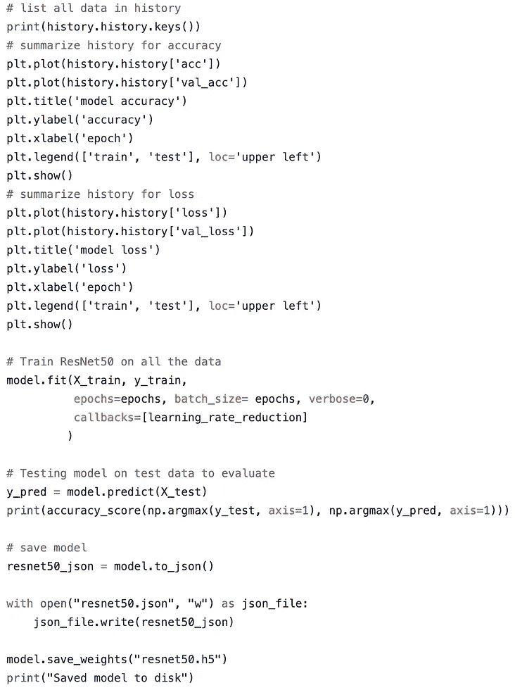

在这最后一步中，我们实现了一个 ResNet50 模型，这是因为上面我们创建的 CNN 不是很复杂。ResNet50 是残差网络的缩写，它本质上是一个经典的神经网络，用作许多计算机视觉任务的主干，就像我们正在做的一样。我们使用 ResNet50 的原因是，它允许我们成功地训练深度神经网络，而没有消失梯度的问题。

> 我的模型以 81%的准确率完成，这是一个令人惊讶的最终结果！如果我们将此与人眼进行比较，人眼的准确率约为 77%，考虑到人眼对良性或恶性痣进行诊断所花费的时间和精力，我们可以自信地说，我们的模型更加高效！
> 
> 制作这个模型是一个非常棒的项目，我玩得很开心。尽管最终结果非常酷，但是实现这个模型最好的部分实际上是对它进行编程。尽管编程部分不是直截了当的，但要找出修复代码中每一个错误的方法仍是一个巨大的挑战。

**对了……**

*   这只是我未来许多项目中的第一个，你可以在我的网站【krishchandarana.com上了解我所有的文章、项目和时事通讯！
*   在 [LinkedIn](https://www.linkedin.com/in/krish-chandarana-25a197177/) 、 [Twitter](http://twitter.com/krishchandarana) 和 [Medium](https://medium.com/@krishchandarana) 上感受联系并关注我吧！