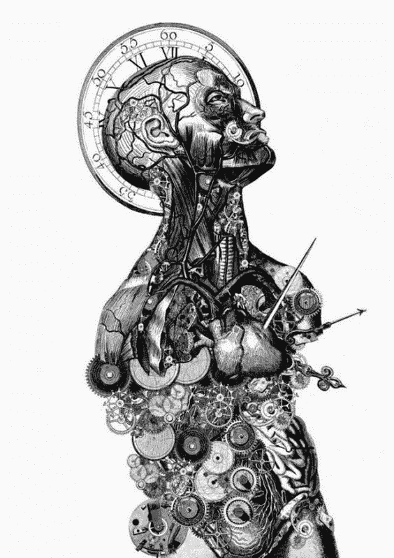

# 机器；人类真正的幸存者

> 原文：<https://medium.datadriveninvestor.com/machines-true-survivors-of-human-beings-d3c9b9f5d62d?source=collection_archive---------5----------------------->

## 机器能帮助我们重获自由吗？

Detailed engravings and collages by Paula Braconnot

哈娜·阿伦特在《人类状况》一书中定义了三类人类活动:劳动、工作和行动。劳动是我们所做的与我们的自然需求相关的事情，主要是为了我们的生存。吃不是你的工作，但你吃是因为自然地，你需要吃。似乎在古代，就像动物在日常生活中所做的一样，人类过去从事的是劳动，只是！日常狩猎和寻找食物，争夺领土和性交可能是我们远古祖先最重要的活动。

按照阿伦特的定义，工作是我们通常为创造某种东西而做的活动，在现代，它是我们为赚钱而做的事情。秘书打字，这与他/她的本性无关，但这是他/她为了得到报酬而做的事情，因为他/她在打字之前创造了一张并不存在的纸。在现代，工作几乎占据了我们大量的时间。它不仅强迫自己进入我们的日常生活时间表，而且还获得了定义我们存在的地位。世界上绝大多数人用他们的工作来定义他们的身份！

 [## 模式和机器人:一个复杂的现实数据驱动的投资者

### 哈耶克的名著《复杂现象理论》(哈耶克，1964)深入探讨了复杂性的话题，并断言…

www.datadriveninvestor.com](https://www.datadriveninvestor.com/2019/03/04/patterns-and-robotics-a-complex-reality/) 

是他们的工作定义了他们，这对于唯物主义的身份认定来说是一个更糟糕的选择，在唯物主义的身份认定中，人们对自己存在的定义是与他们在生活中拥有的东西联系在一起的。人们的身份、他们对自己是谁的理解以及他们生活的意义都取决于他们的工作。“工作”是现代化的动力，尽管它可能始于第一次农业革命之后，并在现代生产范式中结束了人类奴役，在现代生产范式中，我们所有人都在这里创造将被另一个人消费的东西。在这一范式中，生产将在市场上出售的材料和服务是生命的意义。

然而，阿伦特定义了另一类活动，即**行动**。行动是我们所做的，不是为了我们的生存，不是为了赚钱，而是为了让我们作为人类与众不同，拥有特定的特质、兴趣和独特的信仰。读一本书，听听音乐，在沙滩上边走边思考，不是为了报酬而做，而是因为我们是人而做。因此，行动是我们身份的真正决定因素，因为它们主要是因为我们真正的意愿而做的。我们不会因为自然或其他权力机制(如生产范式中的市场需求)而被迫这样做。虽然人类的“行动”可能会导致创造出可能被他人利用的东西，但并不是那些“行动”的动机。因此，如果在马斯洛金字塔中，劳动是对人类生理和安全需求的回应，如果工作是对人类归属需求的回应，那么行动就是对我们尊重和自我实现需求的回应。

要理解这一点，问自己一个关键的问题，你需要对自己诚实。想象一下，你的报酬比你现在所做的多 100 倍，让你自由选择你想做的任何事情。你还会继续现在的工作吗？或者你决定辞职去旅行，或者开始写小说，或者开始做一名人权活动家？人类摆脱工作的自由在理论上是可能的，因为人类的经济自由满足了他/她的生理和心理需求。目前，只有将人类的期望降低到最低生存条件，即牺牲生活质量来获得这种自由，才是可行的。然而，除了这个令人不快的选择，可能还有另外两种选择。

知识和技术的发展可能会带来两种更好的选择，帮助人类结束这种灾难性的生产范式困境。首先是生产成本的降低，这是由于投入价值的降低，如材料和能源成本。减少能源消耗和使用免费能源可以降低生产成本，更容易以较低的成本维持生活质量，从而降低为支付生活费用而工作的强度！另一种选择是机器人和人工智能，它们可以代替人类承担生产负荷。生产范式将很快用机器取代人类，以获得更高的准确性、更少的精神复杂性和更高的生产效率。这种替代可以给我们带来最终的救赎，让我们从工作的需要中解脱出来，帮助我们去追求我们的目标，去做那些让我们的生活变得有意义的事情。尽管对机器的统治地位和机器人产业的发展存在种种担忧，但这似乎是最终将人类从生产链中解放出来并给予他们真正自由的机会的唯一途径。

获得这种自由后，我们选择做什么才是我们真正是谁的真正决定因素？