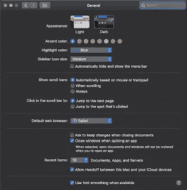
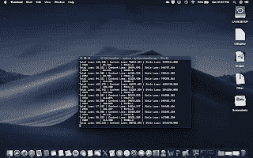

# 马科斯莫哈韦一瞥

> 原文：<https://medium.datadriveninvestor.com/macos-mojave-at-a-glance-ce664df5cc68?source=collection_archive---------8----------------------->

我刚刚安装了 MacOS 10.14 Mojave 测试版，因为它有更好的 GPU 支持。我惊讶地发现了一些优秀的内置实用程序、功能和新应用程序。如果你使用 FlexyGlass 这样的实用工具，你会有惊喜的。以下是迄今为止我最喜欢的发现。

**1。黑暗模式。**

这可能是 Windows-10 的山寨版，但我喜欢它，因为它更容易找到东西。受影响的区域是窗口边框、finder、日历、信息、Safari 和苹果编写的其他应用程序。开发者将发布具有这一新显示功能的应用。要使用 Mojave 黑暗模式，请进入系统偏好设置->常规，然后在顶部你会看到亮暗选项。

Dark or Light Option

**2。新的屏幕截图**

Cmd/Shift/5 调出一个新的捕获功能，该功能加载了选项。这个屏幕截图很直观。它类似于 IOS 上的捕获。你会喜欢这个的。我用这个新功能抓取了上面的屏幕。

**3。堆栈**

我的桌面凌乱不堪。不再是了。只需右击你的桌面，选择使用堆栈。最后，你所有的图标都组织好了。我对默认设置很满意，但是可以使用这个特性的选项。有组织的最后修改，日期增加，日期修改，日期创建和标签。这是我新桌面的快照。我现在正在运行 Turicreate，但是请注意我的桌面有多干净。我妻子会为我骄傲的。

Mojave Clean Desktop

**4。改进的取景器**

有一个新的预览窗格显示所有相关的文件信息。在 finder 中，现在您可以裁剪和旋转图像。你甚至可以生成一个 PDF 文件。

**5。改进的 Safari 隐私**

我注意到，当一些社交追踪者出现时，应用程序会弹出一个确认框。根据这些文件，它还可以防止根据你的技术足迹来跟踪你。

**6。在 MacOS 上运行的 IOS 应用程序。**

这很有趣。显然，开发者有一个框架可以将他们的 IOS 应用程序转换为 Mac 应用程序。苹果自己的录音机和新闻应用程序是皈依者。

有人会在 Best Camera 上写一整篇文章来介绍新 MacOS 的新开发框架。

感谢阅读。我希望这能帮助你开始使用 Mojave。

*原载于 2018 年 8 月 20 日 www.bestcameraapps.com***。**