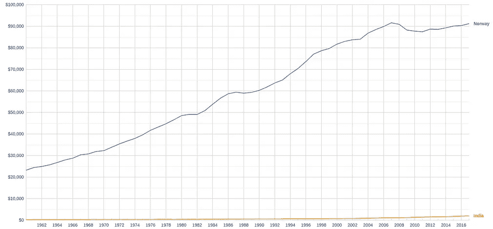
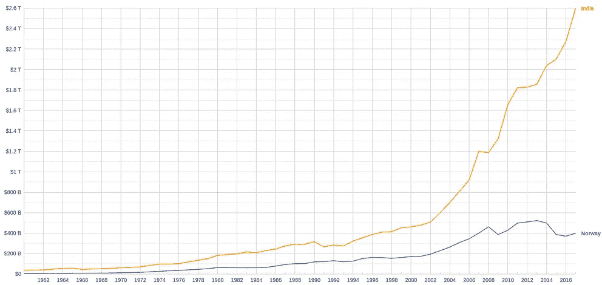

# 基本宏观经济学第二部分:GDP 作为增长的衡量标准

> 原文：<https://medium.datadriveninvestor.com/macroeconomics-part-2-gdp-as-a-measure-of-growth-b1fea05b7cbb?source=collection_archive---------7----------------------->

Photo by [Chang Duong](https://unsplash.com/@hellochang?utm_source=medium&utm_medium=referral) on [Unsplash](https://unsplash.com?utm_source=medium&utm_medium=referral)

在上一篇关于 GDP 的文章中，我们看到了 GDP 的含义。读完这篇文章后，你不需要看任何其他指南或资源来了解 GDP 是如何被用来衡量经济的。潜进去！

GDP 是一个国家或地区在一定时期内销售的所有商品和服务的市场价值总和。现在，这里有几个判断经济的问题:

1.  经济在增长吗？
2.  40 年后国家是不是更好了？
3.  在过去的 50 年里，这个国家增长了多少？

这些问题对于理解一个经济体多年来的增长至关重要。

但是……这里有一个陷阱。

比方说，我想看看印度在 2016 年至 2019 年期间增加了多少支出和销售能力。GDP 是一个很好的统计数据，但将 2016 年印度的 GDP 和 2019 年印度的 GDP 进行比较是不公平的。

 [## 为什么包容性财富指数比 GDP 更能衡量社会进步？|数据驱动…

### 你不需要成为一个经济奇才或金融大师就能知道 GDP 的定义。即使你从未拿过 ECON 奖…

www.datadriveninvestor.com](https://www.datadriveninvestor.com/2019/03/08/why-inclusive-wealth-index-is-a-better-measure-of-societal-progress-than-gdp/) 

你想知道为什么比较两年的 GDP 不公平吗？

我们现在看到的 GDP 被称为名义 GDP。名义国内生产总值是根据商品和服务的当前价格计算的国内生产总值。例如，如果我在计算印度 2018 年的名义 GDP，那么这意味着我在用 2018 年的商品和服务价格来计算 GDP。这很好，但是这里有一个主要的缺陷。

要理解这个缺陷，我们需要知道 GDP 的关键驱动因素。

一是通货膨胀或价格上涨。2016 年 1 公斤大米的成本和 2019 年 1 公斤大米的成本不一样。如果我们假设 2016 年和 2019 年销售了 1000 公斤大米，由于价格的变化，基于大米价格得出的 GDP 是不同的。另一个具体的例子是电影票的价格。21 世纪初的电影票价格与今天不同。因此，比较 2000 年代初一些电影的票房和 2019 年上映的电影的票房是不公平的。当我们比较两个不同年份的 GDP 时，我们需要相应地调整价格。

另一个影响 GDP 的因素是更高的销售额和产量。不考虑商品的价格，如果生产和销售更多的商品，或者如果人们利用更多的服务，国家的国内生产总值就会增加。比较一个国家在两个不同年份的 GDP 价格是有意义的，这两个年份是根据出售的商品数量计算的，而不是使用商品和服务的市场价值之和。

这就是真实 GDP 的来源。

在计算名义 GDP 时，我们完全忽略了商品价格每年都在变化的事实。在计算两个不同年份的实际国内生产总值时，我们使用一个基准年。

其实很简单。

假设我们想比较印度 2018 年和 1999 年的 GDP。1999 年和 2018 年在印度销售的商品价格是不同的。所以，我们假设基准年是 2009 年，也就是说，2009 年商品的市场价值被用来计算 1999 年和 2018 年的 GDP。

政府记录每年售出的商品数量。他们还记录每年商品的平均价格。因此，如果我们使用一个基准年，然后使用该年销售的各种商品的市场价值来计算两个不同年份的 GDP，那么我们只考虑每年销售的商品和服务的数量。这个 GDP，真实的 GDP，是比较两个不同年份 GDP 的更准确的方法。

现在，让我们接触一些数字，看看名义 GDP 和实际 GDP 如何帮助我们了解一个国家多年来的增长。

1960 年印度的名义国内生产总值是 615.9 亿美元。2017 年，印度名义国内生产总值为 2.59 万亿美元。这告诉我们，自 1960 年以来，印度已经增长了 42 倍。然而，由于我们习惯于名义 GDP，我们没有考虑这些年来价格的变化。现在，让我们试着比较一下印度 1960 年和 2017 年的实际 GDP。我们将基准年设为 2010 年，这意味着我们将使用 2010 年的商品和服务价格，然后使用这些价格来计算 1960 年和 2017 年的 GDP。以 2010 年为基准年，1960 年的实际 GDP 为 1487.7 亿美元，2017 年的实际 GDP 为 2.6 万亿美元。有了这个数据，我们现在可以看到印度的 GDP 增长了 17 倍。

上述比较清楚地表明了名义 GDP 与实际 GDP 的区别。如果我们比较两年的名义 GDP，那么在我们的情况下，印度在 1960 年至 2017 年之间增长了 42 倍，这是巨大的。但是，如上所述，在名义 GDP 中，我们没有考虑这些年来价格的显著变化。当我们用 2010 年的商品和服务价格来比较实际 GDP 时，我们发现印度的 GDP 只增长了 17 倍。这样比较更公平。我们能够纠正商品和服务价格差异的问题。

# **人均 GDP**

还有一个我们在上一节中忽略的因素。当我们比较两年的国内生产总值时，我们还必须考虑到这两年的人口数量。

为什么人口在这里很重要？

我们知道，GDP 是一个国家在一年或特定时间框架内销售的所有商品和服务的市场价值的总和。因此，如上所述，为了增加国内生产总值，我们需要出售更多的商品，为人们提供更多的服务。如果人口增加，这意味着有更多的人，更多的人意味着更多的商品可以出售。我们已经知道，与 1960 年的人口相比，2017 年的印度人口将会增加。由于人口的增加，更多的商品和服务将被出售，因此比较这两年的实际 GDP 是不公平的。

因此，为了说明这一点，我们使用实际人均国内生产总值。

**实际人均 GDP =(实际 GDP)/人口**

实际人均 GDP 是实际 GDP 除以国家总人口。因此，人均 GDP 可以被认为是一个国家中一个人的平均收入。例如，如果一个国家的实际人均 GDP 是 100 美元，那么一个人的平均收入是 100 美元。

实际人均 GDP 是比较一个经济体增长的好方法。

为什么？

它同时考虑了商品价格和人口的变化。

1960 年，印度实际人均国内生产总值为 304.43 美元。2017 年，实际人均国内生产总值为 1963.55 美元。这告诉我们，从 1960 年到 2017 年，印度公民的平均收入增长了 6 倍。

人均 GDP 也让我们可以比较两国的生活水平。像印度和中国这样的国家 GDP 很大，只是因为这两个国家都有大量的人口。人均 GDP 让我们可以比较两个国家公民的平均收入。我们举个例子。印度 2017 年实际 GDP 为 2.59 万亿美元，挪威 2017 年实际 GDP 为 3988.3 亿美元。仅仅基于真实的 GDP，它会让我们得出这样的结论:印度人的情况比挪威人好得多。但是值得注意的是，印度的人口比挪威的人口多得多。印度较高的人口意味着在印度比在挪威销售更多的商品和使用更多的服务。所以，通过比较印度和挪威的实际 GDP 来判断哪个国家更富裕是不公平的。现在我们来比较一下两国的人均 GDP。2017 年印度的实际人均国内生产总值为 1963.55 美元，2017 年挪威的实际国内生产总值为 75504.57 美元，这意味着一个挪威人的平均收入或支出是一个印度人的 70 倍。这告诉我们一个非常不同的故事。

The image on the left shows the GDP per capita for Norway (Blue curve) and India (Yellow curve). The graph on the right shows the Real GDP of India and Norway. It is clear that Norway has a smaller Real GDP than India, but has a GDP per capita that is 70 times more that India’s.

我们已经花了很多时间讨论如何用 GDP 来衡量增长。它可以用来比较不同国家的支出和收入。一般来说，一个公民的平均收入是一个经济运行状况的指标，但是我们忽略了很多东西。我们完全忽略了其他因素，如教育、医疗保健、失业和社会参与，这些因素对于判断一个国家是否表现良好至关重要。人均 GDP 不是一个完美的指标，但人们可以理解一个经济体的表现。然而，还有其他指标，如人类发展指数(HDI ),是衡量一个经济体健康状况的更好指标。有人认为人类发展指数和人均 GDP 成正比，但事实并非如此。人均 GDP 还忽略了一个非常重要的因素，叫做财富分配，这是西方发达国家今天面临的最大问题之一。现在，我们将以人均 GDP 结束，但我保证会在单独的文章中涵盖其他相关指标，如人类发展指数、财富分配和环境质量。

请使用下面的评论框来回答你对这篇或上一篇帖子的任何疑问，如果你对以后的帖子有任何建议，请告诉我。

注意:这一系列关于宏观经济学的文章很大程度上受到了来自 [MRUniversity](https://mru.org/) 、 [MIT 14.01SC 微观经济学原理](https://ocw.mit.edu/courses/economics/14-01sc-principles-of-microeconomics-fall-2011/)、 [MIT 14.73 世界贫困的挑战](https://ocw.mit.edu/courses/economics/14-73-the-challenge-of-world-poverty-spring-2011/)的经济学视频讲座和 [CORE-ECON](https://www.core-econ.org/) 的书籍的启发。