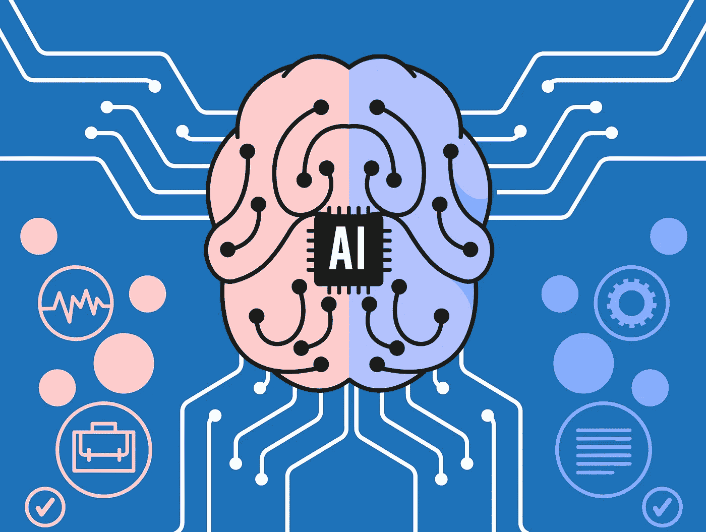
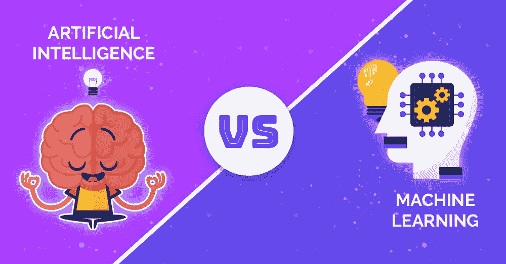
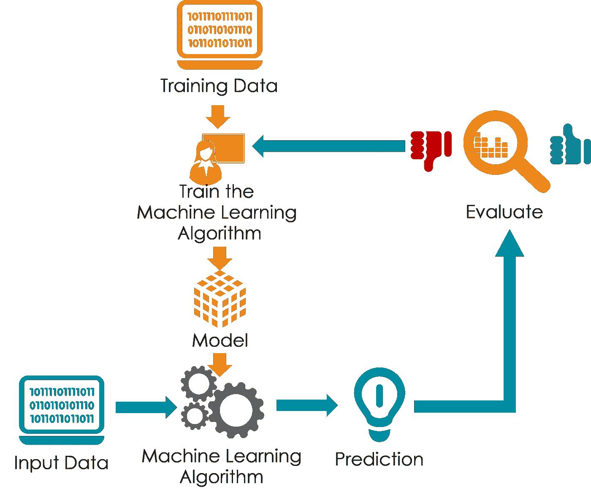
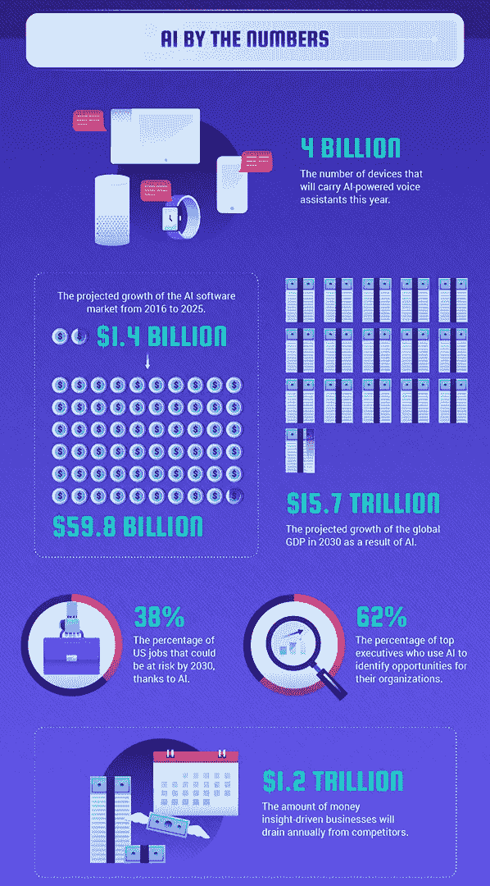
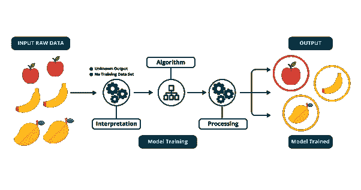

# 让食物变得简单:人工智能 vs 机器学习

> 原文：<https://medium.datadriveninvestor.com/made-simple-ai-vs-machine-learning-be78d9435c52?source=collection_archive---------5----------------------->

Image from hiddenbrains.com

似乎每年都有一组新的流行语让你无法摆脱。今年那些词好像是*‘机器学习’**‘人工智能’*。每个人似乎都在这个话题上采取了立场，从说人工智能将夺走我们所有的工作到说[人工智能是我们未来的关键](https://medium.com/datadriveninvestor/the-truth-about-ai-dbacece23e83)。尽管谈论了这么多，人们似乎仍然对这些术语感到困惑，或者至少是在误用它们。

> 人工智能和机器学习是旅程食品不可或缺的，所以可以说我们知道一两件事。我们知道食物系统和不断发展的技术场景是复杂的，我们认为关于人工智能和食物之间关系的对话需要更加响亮。

如果每个人都不了解基本知识，那么这种对话就不会有成效，所以让我们来解释一下:

*“人工智能”*和*“机器学习”*实际上指的是两个独立的、尽管相关的事物。虽然所有的机器学习都是人工智能，但并非所有的人工智能都是机器学习。(有时候是深度学习，符号逻辑等。但是我们现在不讨论这个。)

 [## 人工智能预测能力的神话——数据驱动的投资者

### AI(人工智能)最有前途的优势之一似乎是它预测未来的能力…

www.datadriveninvestor.com](https://www.datadriveninvestor.com/2019/03/01/the-myth-of-ais-predictive-power/) 

**人工智能**最基本的定义来自 AI 教父本人，并声明是 [*“制造智能机器的科学与工程”*](https://www.aisb.org.uk/public-engagement/what-is-ai) 。机器学习或 ML 的过程是人工智能的一个子集，它涉及训练一个软件使用数据做出有用的预测。基本上，这是一个运行连续实验的漫长过程，直到软件完成您需要它做的事情。

The Machine Learning Process

你可能以前听说过的机器学习的一个例子是 YouTube 的“观看下一个”功能，它使用一个系统来预测用户会喜欢哪个视频，然后向他们推荐。对于 Journey Foods，我们使用机器学习来[优化给食品公司的数据服务和产品管理软件](https://journeyfoods.io/)。这大大减少了为像你(*和我们这样的人制作新的营养食品所花费的研发时间！*)

这是一个发展非常迅速的领域，77%的消费者已经在使用人工智能驱动的服务或设备，而 31%的公司计划在明年整合人工智能。(也就是说，你需要越来越多地学习和谈论这些事情)。

Infographic from TechJury

> 很难预测 6 个月以后的艺术水平，更不用说 15-20 年以后了。我们可以预测的一件事(因为它不会改变)是人工智能的核心:**解决问题和人类。**

无论是人工智能还是机器学习，都离不开人类。尽管人工智能对一些人来说可能听起来很可怕，但“智能”部分是指人类的智力。人类可以识别问题，例如产品开发花费过多的时间，但是他们不能总是自己解决这些问题。目标是让机器能够完成需要人类智能的任务，这些任务对于人类来说可能太难或太耗时。

> 食品行业可能是从人工智能的成长和发展中受益最多的行业。

Sample machine learning process for food category identification

这些智能机器和机器学习程序可以并将用于解决世界上的各种问题。从监控作物田地、供应链管理、产品开发、交付，到餐厅烹饪，在食物真正进入你的手中之前，每个阶段都有干预的空间。随着世界人口猛增至 90 亿，人工智能和机器学习也将被 Journey Foods 等公司用来提高和增加食物的营养密度，以支持所有这些新人类的健康和福祉。

**我们看到这种“新”技术的兴起对每个人来说都充满了希望，特别是当它被专门用于公益事业的时候。既然你已经理解了人工智能和人工智能的区别，你就可以走出去，开始寻找用它为你的日常问题创造解决方案的公司了。**