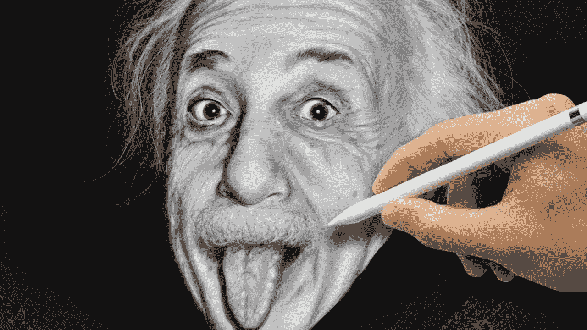

# 疯狂还是创造力

> 原文：<https://medium.datadriveninvestor.com/madness-or-creativity-661710f4e54b?source=collection_archive---------10----------------------->

为什么我没有创造力？3
最后一章

当我决定写下这个系列时，有一件事让我很困扰。当然，题目本身就说明了一切。我喜欢提问，我相信提问的艺术是了解这个世界、这个世界中的生活以及所有困境的唯一途径。几乎在每一场辩论中，无论是在酒吧还是其他任何地方，只要主题是人类创造力，我最终都会被“疯狂”这个主题绊倒。

天才存在吗？他或她需要疯狂来证明他或她的天才吗？

 [## 人工智能与创造力:作为创意引擎的比根——数据驱动的投资者

### 的确，2018 年可以被视为人工智能创造的创造力全盛时期的开始。当然可以…

www.datadriveninvestor.com](https://www.datadriveninvestor.com/2019/02/13/ai-creativity-biggan-as-a-creative-engine/) 

很难想出不让我们感到害怕的“天才”。

显然疯狂天才是一种刻板印象。到处都有天才，愿意做经常和自己长相不符的事情。历史、文学和电影在巩固我们认为的天才理想形象方面发挥了重要作用。蓬乱的头发，对某种药物上瘾，陌生感，怪异的衣服，厌世等等。

天才的神话使他或她完全配不上我们所说的正常。

我确实相信，随着时间的推移，强化这一神话已经促使许多人模仿他们偶像的态度，这些偶像被认为是天才，希望发挥他们自己的创造力。但是天才可以通过模仿发展甚至吸收吗？

展示爱因斯坦鬼脸的图像是一部西方文化的史诗，也许来自世界各地。

开始看关于网飞的任何系列，或者在图书馆(那个大而安静的地方，充满了书籍，几乎没有人经常去的地方)打开一本布满灰尘的经典，你会意识到好的故事总是讲述奇怪的人，他们逃避传统的标准，在某个时候，他们的力量或能力会被揭示出来。

我可以在这里说出一大群人的名字，但我知道你自己也能做到…

有创造力的人总会被贴上疯狂的标签。这是必然的。即使在一个自由思想被激发、对新事物开放的环境中，最好的想法也会吓到房间里最具创新精神的人。

那就是“跳出框框思考”的逻辑。

不寻常的事情超出了规则，超出了标准，与现状相去甚远。对于世界上最糟糕的问题，最有效的解决方案往往是显而易见的，而且总是在我们的眼皮底下。但是，安静祥和的环境给人安全感所带来的舒适和幸福感，几乎不会带来正确的答案。问题是风景，我们很难找到沃利。

实验，通常是人类的实验，令人害怕，但最终创造了新的词汇、时尚趋势、宣传概念、贸易路线、性革命和奇怪地跳舞的艺术，总想萦绕在似乎安静入睡的世界的眼中。

创造性思维不一定需要高剂量的威士忌，穿旧衣服，怪异的发型，以及构成典型天才的服装和心理轮廓的其他物品。创意者，不管是男人还是女人，年轻人还是老年人，穷人还是富人，都是用他们的好奇心用新的眼光看待同一件事情的人。因此，他们最终会被称为疯子，不管他们是打领带还是穿短裤还是两者都穿。心灵需要赤裸才能找到新的意义。

认为自己知道得太多的人经常在自我中绊倒，因为他们戴了太多的眼镜，最终扭曲了现实。

伟大的想法很简单。如此简单，以至于我们不用人工装置就能看到它们。

问题是放弃社会标准会让人震惊。这激怒了统治者，因此世界落到了决定独立思考的反叛者身上。有很多人被寻找有创造力的人的创新公司雇佣，但却因为成为雇主想要的人而被解雇。

创造力是福也是祸。

我在看电影《教授与疯子》时遇到的詹姆斯·穆雷教授的一生让我思考了很多。这部电影由伊朗导演法尔哈德·萨非尼亚执导，讲述了一位语言学家的故事，他被认为疯狂地接受了为英语编写一部完整词典的任务。他做了令人难以置信的工作，编辑受人尊敬的牛津词典，但价格不菲。名誉和家庭在编辑这本书的奥德赛过程中几乎被夺走。他的疯狂行为给他带来了他无法忍受的更多的敌人。

宽慰来自他永远无法想象的地方。

真正引起我注意的是默里在一个自愿决定帮助他的人身上找到的友谊，他提供了无价的内容，这最终使他的名字进入了字典的演职员表。小威廉·切斯特因错误地谋杀了一个人而被关进精神病院。禁闭把他带回了书本，不知何故也激励他接受挑战，向默里投稿以完成这本著名的字典。

不安的心灵，空闲的时间，以及杀害无辜家庭父亲的痛苦将他带到了疯狂的极限，促使这位美国陆军外科医生花费他每天的每一分钟来编写将改变默里和他自己命运的话。这一奉献拯救了他，使他免于在精神病院匿名死去，并改变了这个星球上最强大的语言之一的历史。

你知道有多少人有奇怪的态度，并在许多方面吸引了世界的注意，创造了令人惊讶的积极成果？当你决定下线，尝试打破规则的时候，有那么一瞬间，最终体验到了一种真的很难形容的感觉。

This is my new book, spare some time to know more about creativity.

我的国家有一种简单的文化，基于对过去的压制，这种压制承载着由廉价的恩惠构成的统治的重量，这种统治重视头衔和荣誉，这需要时间来成熟和理解一个有自己想法的人的真正本质。我们仍然崇拜传统，它令我们着迷。我们想看起来有创意，但又不想付出剧烈变化的代价。毕竟，创造性会危及控制谁思考和谁行动的权威地位。

天才永远看起来疯狂，我重申！一个简单的事实是，任何人的最大创造力都要经历摆脱舒适区的仪式，这需要一个信念的飞跃，当我们展示一种全新的方式来看待和处理我们所做的一切。一种奇怪的方式，是的，因为它从未被做过，但这给了我们极大的快乐，因为它有我们的面孔，我们自己的风格，我们真正的和唯一的力量:声音和身份。

因此，谁会忍不住伸舌头，不在乎别人的想法呢？