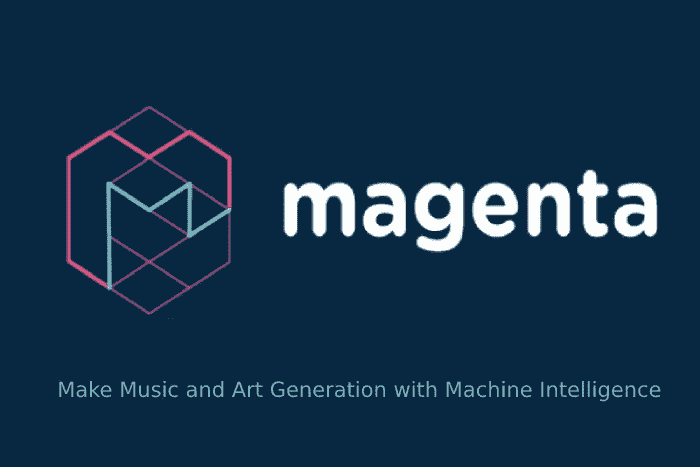

# 洋红色库

> 原文：<https://medium.datadriveninvestor.com/magenta-library-54c690a6f866?source=collection_archive---------5----------------------->



有一个由 google ML 研究员创建的库，用于将机器学习应用于音乐。你可以在‘Google colab’上试试。

Python 片段的底部可以到达 colab:

[](https://magenta.tensorflow.org/get-started/) [## 入门指南

### 准备好玩洋红色了吗？这一页将帮助你开始用机器学习制作音乐和艺术，并给…

magenta.tensorflow.org](https://magenta.tensorflow.org/get-started/) 

通过 colab 教程，我们可以训练我们的机器学习模型，并获得一些旋律。首先，尝试开发一些代码来创建算法音乐。它并不复杂，但有一些想法。我将开发，并可能使用遗传算法风格的系统后。现在是这样的。

```
from magenta.protobuf import music_pb2
import random
import mathmusic_1 = music_pb2.NoteSequence()
note = 60
noteIncrement_1 = [-5.2,-3.2,-2.2,-1.2,0.2,1.2,2.2,3.2,5.2]
noteIncrement_2 = [-4.5,-3.5,-1.5,0,1.5,3.5,4.5]
noteIncrement_3 = [-4.25,-3.25,-2,25,-1.25,-0.25,0,0.25,1.25,2.25,3.25,4.25]
noteIncrement_4 = [-5.1,-4.4,-3.7,-3,-2.3,-1,6,-0.9,0,0.9,1.6,2.3,3,3.7,4.4,5.1]
timeIncrement = [0.5,1,1.3,1.8,2,2.7,3,4.2,4.4]
multiplier = [0.1,0.2,0.4,0.8,1.1,1.3,1.5,1.7,1.9]
k = 0
start = 2
end = 3
while k < 400:
  if k % 2 == 0:
    noteInc = int(math.floor(random.choice(noteIncrement_1)*random.choice(multiplier)))
  elif k % 3 == 0:
    noteInc = int(math.floor(random.choice(noteIncrement_2)*random.choice(multiplier)))
  elif k % 4 == 0:
    noteInc = int(math.floor(random.choice(noteIncrement_3)*random.choice(multiplier)))
  else:
    noteInc = int(math.floor(random.choice(noteIncrement_4)*random.choice(multiplier)))

  increment = random.choice(timeIncrement)

  if start < end:
    music_1.notes.add(pitch = note + noteInc , start_time=start, end_time=end, velocity=80)
    if random.randint(1,100) > 95:
      start = random.randint(0,100)
      end = start + 1
    start = end 
    end = end + increment
    k += 1
  else:
    continue

music_1.tempos.add(qpm=100)
mm.plot_sequence(music_1)
mm.play_sequence(music_1,synth=mm.fluidsynth)
```

这是典型的系统。我将尝试一种强化的遗传算法，并尝试奖励一些系统，但我不知道如何创建一个选择器。这就是为什么我会潜水这个选择器功能。

[](https://www.datadriveninvestor.com/2019/03/03/editors-pick-5-machine-learning-books/) [## DDI 编辑推荐:5 本让你从新手变成专家的机器学习书籍|数据驱动…

### 机器学习行业的蓬勃发展重新引起了人们对人工智能的兴趣

www.datadriveninvestor.com](https://www.datadriveninvestor.com/2019/03/03/editors-pick-5-machine-learning-books/) 

如果你试试这个代码，听听音乐，音乐类型和现代音乐差不多。因为我使用随机数等。

可以改代码，玩一些门槛。实际上，好的数学结构和和声使音乐变得好。用这些随机函数制作无调性音乐是很容易的。然而，音调音乐真的很难，并遵循一些规则。我应该把音乐理论和类似的东西应用到这些功能上。

实际上，一个好的最大似然算法必须接受一段音乐旋律，并把它改变成不同的音乐风格。

嘿，我又开始写我的文章了。今天我不能使用钢琴版本的合成器，并改变了它

```
mm.play_sequence(music_1,synth=mm.synthesize)
```

我想无调性音乐对耳朵不好。

我懒得应用我的其他想法，但我想了很多关于选择器和其他东西的事情。

这就是问题所在。如果你知道建筑调性音高和其他细节，你可以应用一个功能系统，你不需要选择器。创造系统也是一个选择器。这就是为什么我可以给真正的段落和和弦一些选择的余地。就是这样。

*   现在我需要一个程序，可以分析一些音乐内容，并构建其数学算法结构。
*   然后，我可以将这些规则应用到我编写的程序中。
*   我可以在这个算法上概括进化算法。

细节有问题。

# 人工智能的问题

你可以尝试不同的方法，从不同的角度来看这个问题，本质上来说，这是有意义的。必须思考一些问题，比如人工智能的目标是什么？

指定目标后，您可以使用一些系统来解决问题。

数据驱动的方法现在最受欢迎，是的，但是它们是音乐生产力最有可能的解决方案吗？我们会看到的！

回头见。