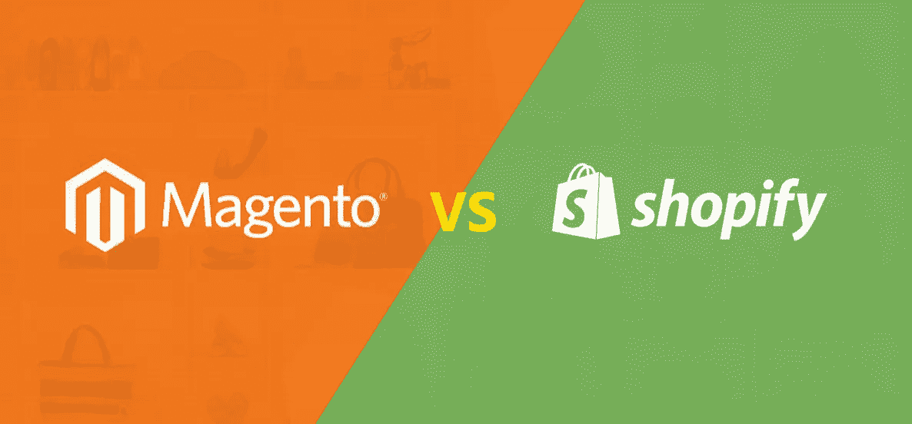
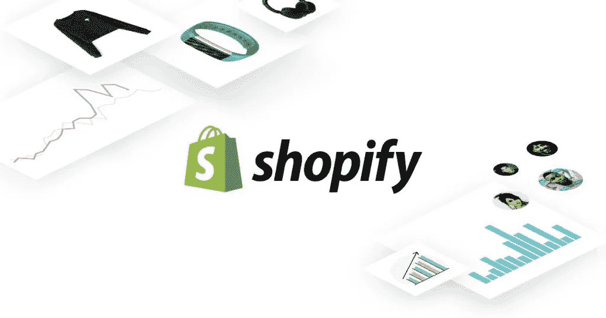
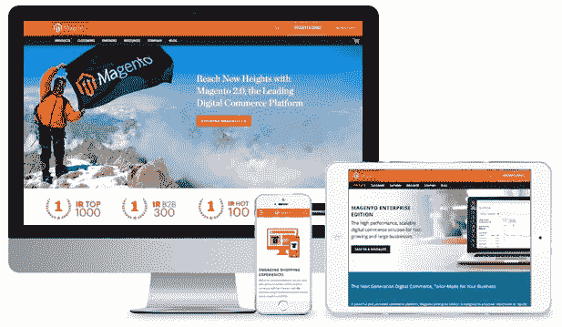
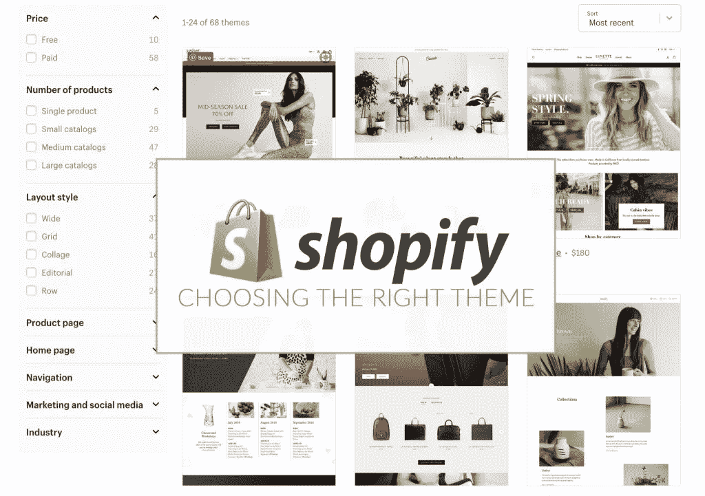

# Magento 还是 Shopify？哪个适合你？

> 原文：<https://medium.datadriveninvestor.com/magento-or-shopify-which-is-the-right-one-for-you-e98a5a62f0be?source=collection_archive---------15----------------------->

Magento or Shopify?

电子商务企业主需要创建、管理和维护在线商店。这是他们电子商务业务中最重要的部分。这是网上生意成败的关键问题。对于资源少、预算低的小型企业来说，这变得更加重要。有许多电子商务平台，但目前最受欢迎的是 Magento 和 Shopify。Shopify 是“自托管—一体化”平台之王，另一方面，Magento 是“更大、更复杂”的电子商务平台(开源)的长期统治者。

几天前，我们报道了另外两个大玩家之间的另一场面对面的战斗，WooCommerce vs Prestashop。所以这一次我们安排了 Magento 和 Shopify 之间的另一场战斗，看看哪个将是你的电子商务网站的完美平台。如果你打算创建自己的在线商店或将现有商店迁移到另一家，那么你必须记住，Shopify 和 Magento 是世界上使用最广泛的在线购物平台之一。

在我们开始这篇文章之前，让我们在做出最终决定之前看看这两个平台有什么不同。

*   Shopify 是一款完全商业化的产品，你需要付费购买。但另一方面，Magento 是完全免费的开源软件。
*   Shopify 平台自带自托管解决方案。而 Magento 需要你自己的主机，安装，设置和配置，然后你才能真正开始自己的商店。所有这些过程都需要中到高级的 web 开发知识和编程技能。
*   Shopify 是为那些不知道或者没有基本的 web 开发知识的人准备的。这是给初学者的。具有拖放功能的简单界面。另一方面，Magento 充满了机会和无限的特色平台。因此它更适合高级开发人员。如果你是一个对开发或编程一无所知的在线企业主，那么你肯定需要[为你的 Magento 商店雇佣一名网络开发人员。](https://www.supremesupports.com.au/magento-development-company/)

# Magento 或 Shopify:功能比较

*   **网上商店的基本功能**

Shopify 和 Magento 都提供了非常简单和基本的功能。但与 Magento 相比，Shopify 的设置、使用和维护都相当容易。所有的基本功能，如购物车、结账模块、收藏和产品页面都可以在这两个版本中找到。主要区别是，Magento 内置了更多集成和高级功能。在 Shopify 中，你必须为某些功能添加某个应用程序。

*   **产品管理**

Shopify(所有计划)和 Magento 都提供无限数量的产品插入选项。您可以轻松地添加产品，并轻松地对它们进行分类。但在这里，Shopify 在一个部分获得了好评，你可以直接集成到 Oberlo 这样的直运库存应用程序。对 Magento 来说，有一点很重要。由于 Magento 是由您自己购买的服务器托管的，添加太多产品可能会降低您的网站加载速度。实际上很糟糕。如果您选择使用 Shopify，这种情况不会影响您和您的网站速度。但是作为一个 Magento 用户，如果你的主机(服务器)性能(基本上是大量的空间)足够好，那么这将不是一个问题。

*   **运费的计算**

这两个平台都为计算运费提供了一个灵活而强大的选项。而这个选项是每个电商平台的根本。Shopify 还提供集成的直运工具和更精确的运输计算器。

*   **支付网关选项**

在这一点上，Shopify 明显领先于 Magento。Magento 或 Shopify 比较毁在这里！Shopify 有 70 多个支付网关，而 Magento 的网关选项要少得多。尽管可以通过第三方插件添加更多的网关。但是你必须知道一些编码经验和知识来添加这个。如果你使用 Shopify，那么所有的支付网关都是内置的。但是，如果您需要在这 70 个网关之外再添加一个网关，您必须先付费购买第三方网关。但是对于 Magento 来说，添加任何第三方网关都是完全免费的。

*   **主题和模板**

Magento 和 Shopify，它们都提供了大量的免费主题和模板集合。但与 Magento 相比，Shopify 的免费主题数量较少。由于 Magento 是一个开源平台，他们有大量的主题和模板。Magento 和 Shopify 都提供免费/付费主题。Shopify 付费主题起价为 80 美元，而 Magento 付费主题起价仅为 1 美元！

*   **应用和附加软件**

Shopify 有 100 多个应用程序可以定制您的在线商店。这些应用程序以各种方式增强功能并提高生产力。而 Shopify 应用商店也在不断变得越来越大。Shopify 严格维护和控制应用程序商店，以便他们的客户不会购买和安装任何垃圾邮件或有害的应用程序，并损坏他们的网站。

而 Magento 是一个拥有近 5000 多个应用程序和附件的地方，这些应用程序和附件在他们的应用程序商店里咆哮。这是因为 Magento 基于开源平台，开发者非常致力于提供完美的应用。Magento 的应用和附加软件提供免费和付费两种选择。

*   **语言能力**

默认情况下，Shopify 提供全面的多语言支持。你必须购买第三方应用程序来支持多语言功能。或者，您必须对 Shopify 主题进行自定义编码，以获得多语言支持。为了这个功能，你需要[雇佣一个 Shopify 开发者](https://www.supremesupports.com.au/services/website-design-web-development/)。另一方面，Magento 的优势在于更多的内置多语言支持。

*   **SEO 能力**

Magento 和 Shopify 都提供广泛的搜索引擎优化功能，因此它可以通过搜索引擎为您的商店带来更多的有机流量，在强大的搜索引擎优化功能和优势方面几乎不分上下。如果你相信你可以为自己做搜索引擎优化，那么你可以通过使用他们的插件轻松地做基本的搜索引擎优化。如果你不是那个人，你需要雇佣一个 SEO 专家来为你的网站带来高流量的有机流量。

# Magento 或 Shopify:成本

*   **设置成本**

Shopify 在安装时不会花你一分钱。甚至他们还提供 15 天的免费试用，这样你就可以测试和判断 Shopify 是否好用。在此期间，它将托管您的整个网站。对于 Magento 来说，是一辈子完全免费的。完全免费。但是为了将 Magento 设置为您的在线平台，您需要支付托管费用。

*   **月费**

每月计划仅适用于 Shopify，因为 Magento 不对他们的平台收费。

1.  精简版计划: **$9**
2.  基本购物计划: **$29**
3.  购物计划: **$79**
4.  高级购物计划: **$299**

如果你想看一些 Magento vs Shopify 在线商店的真实例子，这里有一些奇妙的 [Shopify 商店](https://ecomm.design/platform/shopify-stores/)和一些 [Magento 网站例子](https://ecomm.design/platform/magento-community/)。现在读完这篇文章后，你有什么想法？你会选择 Magento 还是 Shopify？

如果有人打算或有兴趣拥有许多自定义选项或功能，或者管理大量产品，那么我的建议是使用 Magento。如果你不想有这样的复杂性或使用默认功能，那么 Shopify 将是我的选择。从我的角度来看，如果你真的想扩大你的业务，那么 Magento 是最好的选择。但是请记住，Magento 维护需要 Magento 开发专家。