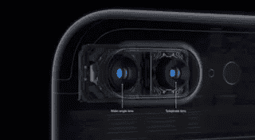
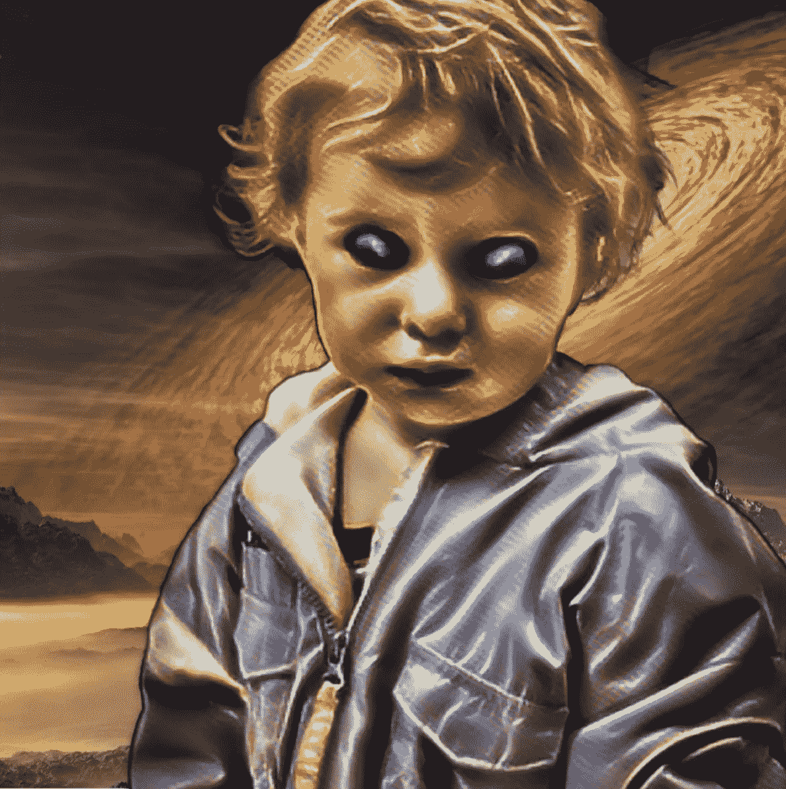

# 神奇的 3D 相机。它们是如何工作的？

> 原文：<https://medium.datadriveninvestor.com/magic-3d-cameras-how-do-they-work-1feb2e0cb723?source=collection_archive---------4----------------------->

## 像 iPhone X 背面那样的双镜头相机，使用镜头分离来检测视差偏移，以测量 3D 深度。

越靠近相机的物体，两个镜头之间的移动距离越大。这种基于距离的视差移动称为视差。

既然只有一个镜头，那么单个前置摄像头如何测量深度呢？这项技术被称为 TrueDepth。你可能会惊讶地发现，原深感摄像头在摄像机前投射出一个红外光图案。

通过观察相机镜头前物体的红外图案失真，快照软件计算出相机到图像中每个点的距离。由此，软件造成了它的差距。

这两种技术都会生成深度像素的二级图像——深度图。但不是每个像素代表一种颜色，而是像素代表图片中该点的深度。通过将深度图与颜色相结合，可以模糊甚至透明照片的某些部分，例如肖像的背景。

Photo with Depth Mask used to transport the girl to another planet

深度图或遮罩作为元数据被附加到图像。例如，JPEG 图像可能附有深度遮罩。然后，为了对 3D 模型应用效果，智能软件会将图像中的每个像素与其对应的深度遮罩相关联。

一旦一个程序员同时控制了原始图像和它的深度蒙版，所有酷的事情都是可能的。在上面的照片中，小女孩已经从她在地球上的起居室被传送到了另一个遥远的星球。

您可能已经注意到，这些示例图像似乎应用了样式转换效果。但是风格转移效果怎么只适用于图像而不适用于千变万化的背景呢？

我即将发布一款名为“非来自地球”的应用。见 https: [www.notfrom.earth](https://www.notfrom.earth) 。这个应用程序结合了许多高科技，如图像识别，风格转换效果和深度图技术，用于拍摄和处理神奇的 3D 照片。
在以后的文章中，我将深入研究这个外星应用的编码。