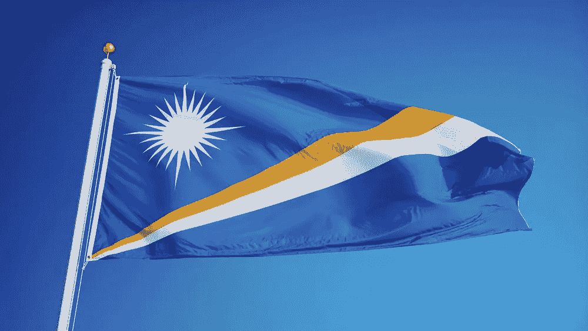

# 主流加密货币的采用正在我们身边发生——你可能还没有听说过。

> 原文：<https://medium.datadriveninvestor.com/mainstream-cryptocurrency-adoption-is-happening-around-you-may-have-just-not-heard-about-it-320fc3dda1b3?source=collection_archive---------25----------------------->

The Marshall Islands plan to adopt a cryptocurrency called ‘Sovereign’ later this year.

今天有消息称，马绍尔群岛共和国被警告不要采用数字货币作为第二种形式的法定货币。援引国际货币基金组织(IMF)的话说，这个由太平洋上数百个岛屿组成的国家应该“认真重新考虑”。

目前马绍尔群岛只使用美元作为该群岛的法定货币。然而，今年 2 月，一项采用与美元并列的数字货币**的法律获得通过。**

**首批主权硬币计划于今年晚些时候通过首次硬币发行(ICO)向公众发行。然而， [**IMF 董事们表示**](https://www.imf.org/en/Publications/CR/Issues/2018/09/10/Republic-of-the-Marshall-Islands-2018-Article-IV-Consultation-Press-Release-Staff-Report-and-46216) 此举的潜在收益远小于“经济、声誉和治理风险”的潜在成本。**

**“[马绍尔群岛]当局应该认真考虑发行数字货币作为法定货币，”**

**主要问题在于该国唯一的国内商业银行。据报道，它正面临失去与美国另一家银行的唯一代理银行关系的风险。如果没有这种关系，马绍尔群岛公民将无法将美元转入和转出该国。**

**报告接着强调了马绍尔群岛对外国援助的依赖，以及该国容易遭受自然灾害的事实。将数字货币作为法定货币的官方形式，不仅会威胁到这家美国银行的财务完整性。这个结果可能意味着未来对外援助的中断。**

**然而，并不是所有人都同意 IMF 的报告。《50 英尺区块链的攻击》一书的作者戴维·杰拉德表示，全球金融组织对此表示担忧，因为它意识到传统银行对数字货币的警惕。'**

**这些银行可能会将加密货币与包括洗钱在内的犯罪活动联系起来，因为数字货币网络被设计成可以高速移动硬币或代币。**

**他解释称，这将让美国代理银行有理由重新考虑其与马绍尔群岛的关系。**

**“国际货币基金组织没有强迫马歇尔夫妇，他们所做的是描述如果他们继续下去显然会发生什么——大型代理银行将非常担心，”他补充说。**

**尽管有国际货币基金组织的报告，马绍尔群岛仍然计划在今年晚些时候发行货币。在价格暴跌的一年里，这将是加密和数字货币大规模采用的又一胜利。**

**如果你有兴趣阅读更多，请访问我的网站。**

**最初发表于 [BBC](https://www.bbc.com/news/technology-45485685) 。**