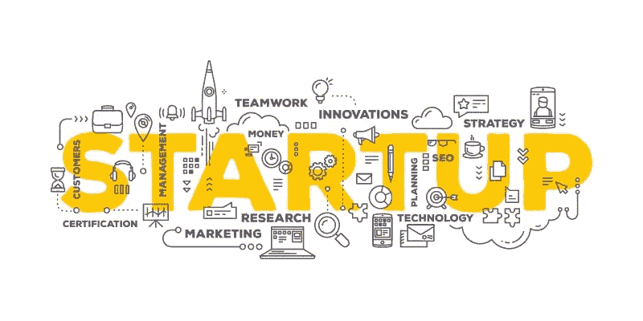

# 大公司利用小企业家的帮助来获得成功

> 原文：<https://medium.datadriveninvestor.com/major-companies-use-the-help-of-small-entrepreneurs-to-reach-success-1cd252206df5?source=collection_archive---------52----------------------->

最近在谷歌上的一项研究提醒我，有时大品牌需要更仔细地观察初创企业在做什么。我认为，小企业比大公司更有可能提供更好的客户服务，因为小企业有着与生俱来的常识，懂得换位思考的力量，懂得及时与所有员工沟通。

关键的区别在于当地小公司的常识和同情心。太多的客户服务——尤其是在大公司——已经变成了标准的操作程序，以及用虚假的冷静提供的照本宣科的答案。

最近一次与大品牌合作的经历让我后悔，我为什么选择他们？

与网络开发 UI / UX 服务的服务提供商合作，被一个朋友推荐给一个主要品牌，在我第一次接触时，我从未有机会与相关人员交谈，而是收到一封邮件，上面写着*感谢联系我们，然后继续发送关于服务的邮件，*并回复我需要的服务， 回复邮件遵循费率和付款时间表以及所有法律条款和条件(这个过程持续了一周)，我的时间表中没有给出终点线，但根据他们的工作流程和质量批准，首先我对专业方法印象深刻，但后来这个过程让我感觉太不舒服了，(对于设计的单个更改，我要遵循一个大的连锁邮件流程)。 后来我的项目交付了，我对他们的服务不太满意，但只是因为与这样一个大品牌合作过。

但是，在与小企业做生意时，这些从来不会发生，**唯一的主要挑战是选择正确的服务提供商**，当我偶然发现一家小创业公司的邮件联系时，这些人非常好，他们对我的公司和我的个人资料进行了清晰的分析，并找到了我想要的方法。因此，我与这家公司合作了一个项目——启动过程非常简单，我一回复邮件，就有该公司的一个人打电话到我的手机上，想约我见面。我们签订协议后，项目从第一天就开始了，最舒服的是，我能够与设计师和开发商沟通——就像我雇佣了一个完美的年轻而充满活力的团队，他们在截止日期前交付了高质量的成果。我被合理地收费。

**与小型创业公司做生意时要记住的要点**

有一个完美的研究是谁的人，他有什么能力

确保你不是作为一个公司，而是作为一个个人来看待

在和他们做生意之前，试着给他们点颜色看看，比较一下最新的趋势和他们的工作方法

重要提示:—与小型创业公司做生意让我感觉很舒服，而且我已经证明了结果。尤其是当涉及到技术开发时，公司的品牌并不重要，重要的是开发人员的知识，他们能把你脑海中的完美草图呈现出来

[http://www.sketchbrahma.com/portfolio.php](http://www.sketchbrahma.com/portfolio.php)

https://about.me/denverr