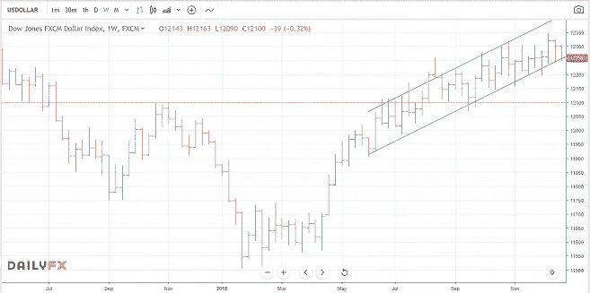
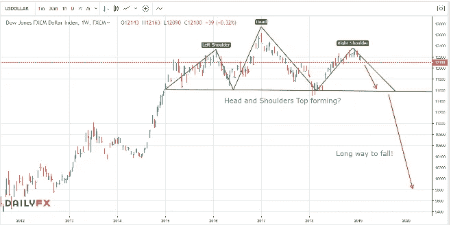

# 重大举措正在进行中——以下是如何获利

> 原文：<https://medium.datadriveninvestor.com/major-move-underway-here-is-how-to-profit-226623082ee?source=collection_archive---------6----------------------->

美元是世界上最重要的货币。

美元是世界储备货币。这意味着(除其他外)不仅所有商品都以美元定价，流动性最强的货币对也是如此。

**当它移动时，它会影响一切。**

因此，当我们看到美元出现重大波动时，它有可能影响贸易和金融领域的很大一部分。这就是为什么我总是密切关注美元的走势。

 [## 幸福的算法？数据驱动的投资者

### 从一开始，我们就认为技术正在使我们的生活变得更好、更快、更容易和更实用。社交媒体…

www.datadriveninvestor.com](https://www.datadriveninvestor.com/2019/03/08/an-algorithm-for-happiness/) 

**2018 年全年都在上涨**

在去年年初所有人都宣布美元已经完了之后，美元的反应是全年价格上涨。这影响了许多其他货币和商品，甚至股票！这是 2018 年的一个主要主题，如果你能够及早发现这一点，你就可以赚一大笔钱。然而…

**现在，它已经转向了。**

去年年底，我开始注意到这一举措的动力正在消失。当上升趋势中的任何东西停止创造新高时，你应该注意。很明显，美元已经到达了一个关键区域。然而，它也不会从天上掉下来。

我观察了已经形成的交易通道，并告诉我的学生，如果这个通道向下突破，这可能标志着一个大的下跌的开始。

几周前，事情就是这样。在巩固和重新测试这个交易通道的下限后，美元再次抛售，现在…

一项重大举措正在进行中。

我总是喜欢看大局。让我们缩小这张美元图表:

美元的下一个目标将是 2018 年 1 月的低点。这已经是一个重大的下跌。然而，如果我们能够跌破这些低点，我们很可能会进入一个多年的美元熊市，并跌得更低。

记住这是一个长期图表。但美元通常会形成这些多年的上下波动。尽管现在呼吁这一点还为时过早，但我们确实在考虑今年采取重大举措的可能性。

**盈利的方式有很多种。**

正如我之前所说的，由于美元的重要性，将有许多不同的方式来进行这一步。

自从我分享了[这篇关于贵金属前景的文章](https://mangrovetrading.com/end-of-a-bull-market/)后，贵金属价格强劲上涨，看起来处于有利位置，可以利用这一趋势。我特别喜欢白银，因为相对于黄金而言，它目前被历史性地低估了。

根据我最近关于英镑的文章，我认为英镑也将受益。

我和我的学生已经有了几个盈利的头寸，但这一举动还会带来更多。

诀窍在于识别哪些货币、大宗商品或股票看起来最强劲，并利用它们来抵御美元下跌。

**想学怎样？**

红树林交易学院将很快推出一个免费的互动培训系列，在那里你将学到清晰的、可操作的策略来识别并从这样的交易中获利。

[**点击此处了解更多信息并确保您的位置。**](https://go.mangrovetrading.com/training)

这篇文章发表时，迈克尔持有几个美元空头头寸。**本文是观点，仅供参考**。所提供的信息不作为投资建议。我们不是投资顾问。你应该向有执照的专业投资顾问寻求投资建议。