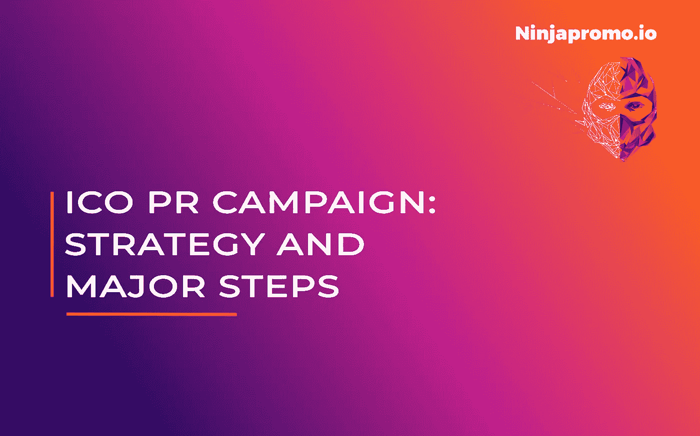
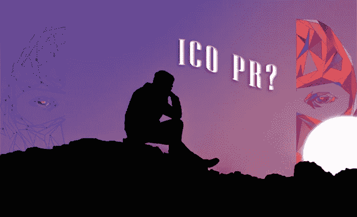
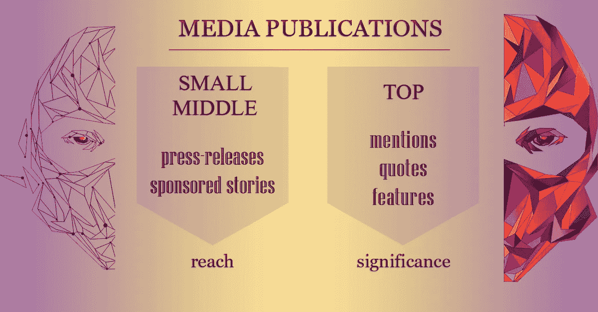

# ICO 公关活动的主要步骤

> 原文：<https://medium.datadriveninvestor.com/major-steps-of-ico-pr-campaign-3cf8a47bb6ec?source=collection_archive---------11----------------------->

公关是任何企业成功的关键因素，ICO 也不例外。恰恰相反——对区块链项目来说，公关是必不可少的，这样它才有更好的机会接触到合适的受众。它允许从他人的角度展示你的最佳想法。

正如 [NinjaPromo](http://ninjapromo.io/?utm_source=medium&utm_medium=article&utm_campaign=icoprcampaign) 之前无数次强调的(尤其是在[我们之前的那篇](https://hackernoon.com/why-micro-influencers-and-blockchain-projects-belong-together-e1194e4cb2bd))，口碑是每个人可用的最好的营销工具。让独立媒体为你做一些繁重的工作是一个好的开始。

因此，让我们来看看我们观察和实施的 ico 公关策略的一些最佳方向。

# **ICO 公关是怎么回事？**

有很多方法可以通过公共平台推广你的项目。你可以为你的媒体页面创作作品，要求秘密会议的组织者给你时间发言，向秘密记者推销你的最新新闻，为主要商业媒体的出版物寻找机会和作者…

此外，您应该及时赶上紧迫的 ICO 截止日期。

*但是，当你有忠实的社区和社交网络来传递你的信息时，你为什么还要关心更传统的公关呢？*

*   首先，你得到一个独立的意见。在具有一定可信度的第三方平台上发表的文章会显示你的项目值得关注和信任。
*   第二，你可以利用别人的知名度为自己谋利。主要媒体平台或你项目的知名顾问至少也能吸引一些观众。
*   第三，每个严肃的创业公司都有“关于我们”或“新闻”版块，他们可以在那里展示所有谈论它的第三方出版物。你的加密和商业相关媒体越多，你的项目看起来就越好。
*   最后，但同样重要的是，公关是一种沟通方式，也是扩大受众的一种方式。向你的追随者表明他们受到主流媒体的支持总是有益的。此外，给潜在投资者发送你的出版物的链接也是给他们留下深刻印象的好方法，比如说，在《福布斯》或《商业内幕》上。

# **ICO PR 的入口点**

在没有计划或模糊的事情清单的情况下匆忙进行公关是一个糟糕的主意。最好的情况是，你最终会把钱花在没有结果的事情上。在最坏的情况下，这种缺乏专业态度的行为会让你现有的观众和投资者拒绝你的项目并离开。

> “看，你的想法很棒！但我认为你不具备完成这件事的条件……”—*如果你没有营销计划，不要对这样的分手感到惊讶。*

好的第一步是和你的团队坐下来，想出你的公关策略。它通常基于项目的总体概念、里程碑的截止日期、主要代表的个性等等。然后，根据 ICO 的性质，您可以确定包含潜在主题、示例性标题和出版物目标媒体的内容计划。

在你决定了你的战略之后，它就开始实施了。你的文案撰写人创建计划好的文本，你的公关经理将它们发送给各种媒体。除此之外，你可以充分利用一个中型博客，遵循你的 SMM 战略，并求助于影响者来聚焦你发展的所有步骤(如果你不知道如何接近意见领袖，我们有一本针对区块链项目的[影响者营销手册](https://hackernoon.com/influencer-marketing-fdff540b092e))。

此外，你应该与秘密活动的组织者沟通，以便将来参加会议。

> **公关策略需要牢记的事情**

*   在代币销售期间，你的营销应该展示你的产品有多棒，你的团队有多棒，并且(可能是最重要的)证明你的 ICO 不是另一个骗局。每一条信息都是你公关活动的目标之一。
*   为你的产品和 ICO 分开公关，确定每个方向的目标受众。ICO 的目标受众应基于其最佳地区的最新数据。产品目标受众应取决于该领域在各地区的受欢迎程度和潜在客户的数量。
*   据专家称，出版物主题的最佳平衡是 70%购买信号，30%技术。
*   媒体之间的最佳平衡是 30%商业，70%区块链。另外，大约 10%的出版物应该出现在顶级媒体上(福布斯、Cointelegraph、Business Insider 等)。将专业(与你项目的特定领域相关的)媒体添加到你的愿望列表中也是一个好主意。
*   公关策略应该包括 2-3 个有创意的新闻主题，供媒体推介，以获得免费出版物。如果你的策略在内容计划中至少包含一些价格，也会有所帮助——例如，在严格要求主题的情况下(如“ICO 在一周内发布”)。

> **现有广告渠道:**

*   加密、专业和商业媒体；
*   企业博客(基于网站、媒体等。);
*   邮件列表；
*   企业社交媒体(SMM)；
*   Reddit，Bitcointalk
*   影响者；
*   区块链和专业会议。

# **媒体出版物的类型**

**中小型媒体**以特定价格提供出版物，这些价格通常低于 ICO 营销机构的价格(因为他们与许多客户合作，所以可以获得批量折扣)。对于那些网点来说，只有两种有用的出版物格式。

> **新闻稿** *最适合采访和各种公告，从 ICO 发布前到新的合作伙伴关系。* **赞助故事** *据说是由媒体自己写的，因此在某些情况下被认为更可取。然而，根据我们的经验，自己创建这些文章要好得多。*

**顶级媒体**提供更广泛的活动。你可以走和与小媒体合作时一样的路线——然而，在某些情况下，这是不可能的，当它是，文章得到一个“广告”的天赋，降低了作品的价值。另一种方法是接近专栏作家。他们提供三种类型的出版物:

*   ***引用*** (文章是关于项目相关行业，引用你的代表，简述你的项目)；
*   ***提及*** (与上一个类似，但你得到的不是报价，而是对项目的稍微大一点的提及和描述)；
*   ***特色*** (文章献给你的项目)。功能显然比相同价格范围内的提及和报价更贵。

> 专栏作家可能需要长达 5 周的时间来发布他们的出版物，因为他们必须得到编辑的批准。

# 那么我们这里有什么？

理想情况下，你的公关策略应该结合所有这些特点。预算限制并不是唯一的原因。较小的频道通常能接触到较窄的受众，而较大的频道能增加你的项目的分量和重要性。你团队中的人提供了其他人所没有的关于你的项目的知识，来自 ICO 公关公司的专业人士可以向你展示最有效的方法。一天结束时，充分利用手头的所有工具而不排除“不相关的工具”的全面营销活动就是赢得营销活动。

*感谢您阅读这篇文章！如果你喜欢它，请分享它，并告诉我们你对加密相关项目的微观影响者的相关性有什么看法。另外，你可能会喜欢我们的其他故事:*

> [*——区块链影响者营销手册*](https://hackernoon.com/influencer-marketing-fdff540b092e)
> 
> [*——ICO 为什么需要它的社群，如何关注它*](https://medium.com/@NinjaPromoAgency/why-crypto-community-matters-and-how-to-focus-on-it-ebd2d293c94)
> 
> [*——在推销你的加密项目*](https://medium.com/@NinjaPromoAgency/things-you-neglect-because-they-are-obvious-while-marketing-your-crypto-project-4100cf3bef05) 时，因为显而易见而被你忽视的事情
> 
> *-* [*ICO 发布:你想法的真实价格*](https://hackernoon.com/ico-launch-the-true-price-of-your-idea-52dcc61587d4)
> 
> [*——为什么微影响者和区块链项目属于一起*](https://hackernoon.com/why-micro-influencers-and-blockchain-projects-belong-together-e1194e4cb2bd)