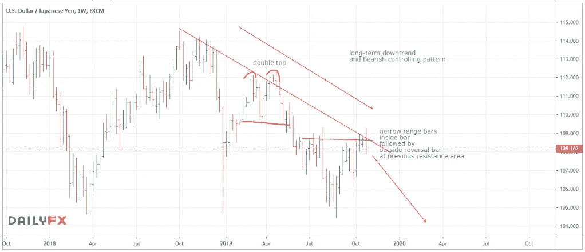

# 重大转折点…

> 原文：<https://medium.datadriveninvestor.com/major-turning-point-7f60a18ec3c3?source=collection_archive---------12----------------------->

Photo by [Kevin Ku](https://unsplash.com/@ikukevk?utm_source=medium&utm_medium=referral) on [Unsplash](https://unsplash.com?utm_source=medium&utm_medium=referral)

**本周交易:卖出美元日元**

本周，我再次回顾美元兑日元的空头。上周，我从这对搭档中抽出一段时间来[关注脸书](https://mangrovetrading.com/facebook-earnings/)(下面会有更多的介绍)，但是在两个星期没有去任何地方之后，这对搭档很好地建立起来了…

上个月，美元在一个非常重要的价格区域急剧下跌。

 [## 机器学习的外汇交易挑战|数据驱动的投资者

### 机器学习是人工智能的一个分支，之前占据了很多头条。人们是…

www.datadriveninvestor.com](https://www.datadriveninvestor.com/2019/02/18/the-challenge-of-forex-trading-for-machine-learning/) 

我观察这个地区已经有一段时间了，正如我几周前提到的，有迹象表明我们即将转向。然而，我们现在已经令人信服地收盘低于最近的范围，并开始下跌。考虑到长期图表，这一举措可能是美元和整个外汇市场的一个关键发展。

**美元现在看起来非常有可能大幅下跌，甚至可能进入新的长期熊市。**

考虑到这一点，我将寻求做空美元兑最强势货币。

这个时候，我最喜欢日元的样子。

我也喜欢加元，英镑看起来也有很大的潜力，但目前至少它需要喘口气。市场波动，而不是直线上升和下降，英镑看起来需要在最近的急剧攀升后喘口气，然后才能再次尝试新高。

一旦确定了主题，就能赚很多钱。

我们可以找到几个交易来玩这个主题，并开始积累大量头寸，持有相当长的时间来获利。看来，美元疲软可能会给我们带来一个重大机遇。

我将准备好充分利用并与你们分享我的想法和观点。

上周，我专注于在脸书发布财报前买入该公司股票。当收益公布时，我们看到股票一夜之间上涨了 5%。我上周真的关注了这个交易，买了一个大仓位(毕竟，这是我本周的交易),在隔夜的大缺口上赚了很多钱。我希望你们中的一些人也能从中获利！

我很想听听你的一些经历——请告诉我。

我试图在一周交易中关注长期交易，这样即使你在我的学生之后收到它们，也许没有立即看到分析，你仍然有机会从我分享的观点中获利。

你想学习如何从市场中持续获利吗？ [*点击这里*](https://go.mangrovetrading.com/freetraining) *，我们将通过一系列免费的培训视频带你一步步了解我们的整个交易策略。*