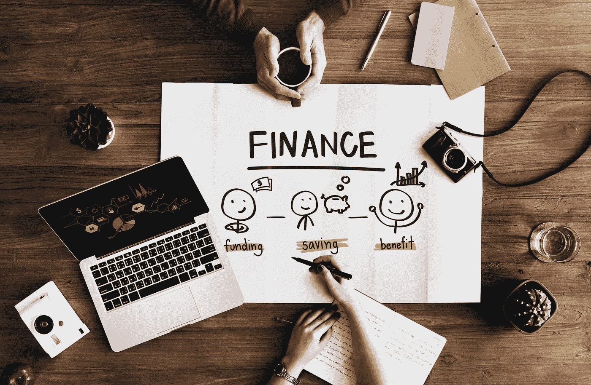

# 让孩子的理财成为人生的一课

> 原文：<https://medium.datadriveninvestor.com/make-kids-finances-a-life-lesson-71ea5b89a760?source=collection_archive---------7----------------------->

## 尽早教育他们，以避免成年人在他们之前犯的错误

Photo by [rawpixel.com](https://unsplash.com/@rawpixel?utm_source=medium&utm_medium=referral) on [Unsplash](https://unsplash.com?utm_source=medium&utm_medium=referral)

成年后的财务问题是一回事，年轻时又是另一回事。你多久教孩子财务技能？有没有太快了？

[全球领先的信息服务公司](https://twitter.com/Expn_Stacy)[益百利](https://twitter.com/Experian)的 Stacy Smith 和益百利公共教育主管 [Rod Griffin](https://twitter.com/Rod_Griffin/) 谈论了为什么以及何时教孩子理财。

“孩子和钱是如此重要，”格里芬说。“早点教他们，这样他们就不会犯我们的错误。

他说:“我们在孩子时教给他们的和展示给他们的，他们会在成年后的生活中反映出来。”

 [## 伟大的父母用金钱的魔力激励孩子

### 理财专家为父母提供了永恒的理财建议

medium.com](https://medium.com/financial-strategy/great-parents-inspire-children-with-the-magic-of-money-85236cd64d65) 

理财是一种生活技能——就像其他任何技能一样——从很小的时候起就烙印在孩子身上。不幸的是，这是学校里没有教的技能。这使得父母的角色更加重要。

史密斯说:“教孩子存钱可以帮助他们在未来避免信用卡债务、过度消费和糟糕的财务行为。”

# **不嫌早**

学习金钱知识越早越好。孩子们会比我们想象的更快地从父母的习惯中学习。

“孩子们会在你意识到之前观察你的行为，”格里芬说。"在你和他们交谈之前，告诉他们如何使用金钱."

不管你愿不愿意，年轻人都善于捕捉线索。

史密斯说:“父母越早教会孩子金钱，他们就能越有效地培养出财务上成功的成年人。”

 [## 储蓄心态赋予我们和我们的孩子力量

### 存钱既是积极的，也是财富的积累

medium.com](https://medium.com/datadriveninvestor/a-savings-mindset-empowers-us-and-our-children-bb8f5652525d) 

对孩子们来说，最重要的一课是按时支付账单，不要炫耀额外的现金。那些不是正式的课程，而是他们潜移默化中学会的习惯。

史密斯引用了 Experian 的一篇文章: [*金融素养的未来:与孩子谈钱*](https://www.experian.com/blogs/ask-experian/future-financial-literacy-guide-financial-conversations-kids/) 。

格里芬说:“教育孩子们，钱是挣来的，不是给的。”"另外，你应该把你赚的一些钱回馈社会."

# **边看边学**

有一些实用的方法可以教孩子理财。例如，让他们看着你结算支票簿、办理网上银行业务或去银行。孩子们掌握了你的所有习惯，包括财务习惯。

“把金钱的课程应用到游戏中，”史密斯说。“让孩子参与你的财务。让他们帮你做预算和购物。”

 [## 好好教育你的孩子，让他们有一个美好的退休生活

### 关于金钱的教训跨越了几代人和文化

medium.com](https://medium.com/financial-strategy/teach-your-children-well-so-they-have-a-great-retirement-3b035d36d9fd) 

教训也能带来甜蜜的回报。

“把金钱课程和他们想要的东西联系起来，”格里芬说。“我们利用停下来买冰淇淋的机会来教授节约的知识。

“当机会和你在一起时，发现它们，”他说。“不一定非得是‘坐下来，我们要谈谈钱’这样的谈话。让它成为对话，而不是说教。”

# **想要还是需要？**

孩子们也需要知道需要和想要之间的区别。从不给他们想要的一切开始教他们。被宠坏的孩子长大后几乎没有价值观。

[津贴学院](https://twitter.com/AllowanceAcad/)有一篇关于想要与需要的文章:[教孩子理财 。](http://allowanceacademy.com/teaching-kids-wants-vs-needs/)

孩子们还需要明白信用卡不是自动取款机。这些债务必须偿还——还是那句话，宜早不宜迟。

“信贷是一种金融工具，”格里芬说。“债务是一个金融问题。又不是白给的钱。”

为了帮助解释， [The Balance](https://twitter.com/thebalance/) 有一篇名为 [*8 课的综合文章，教你的孩子关于信用卡*](https://www.thebalance.com/teach-your-child-about-credit-cards-960193) 。

# **做慈善**

父母可以教育孩子节约和慈善捐赠的重要性。

孩子们应该看到父母的储蓄习惯，知道他们什么时候向慈善机构捐款，以及为什么捐款。最好有比税收注销更高尚的解释。

格里芬说:“我们经常向他们展示比告诉他们更有效。”"给予是一种模仿和学习一样多的行为."

 [## 给予对那些最需要的人来说意义重大

### 非营利组织和慈善机构都需要全年的支持

medium.com](https://medium.com/an-idea/giving-makes-a-big-difference-for-those-who-need-it-the-most-1b86025989ff) 

史密斯说，捐赠不仅仅是一项文书工作。

“让它成为一项家庭活动，”她说。"鼓励你家里的每个人都参加志愿者活动."

随着孩子年龄的增长，金融对话也会发生变化。从简单的金钱问题开始，谈论为什么要为大学留出钱，以及孩子们在其中必须扮演的角色。

格里芬说:“ [JumpStart](https://www.jumpstart.org/) 有从幼儿园到 12 年级的金融教育标准。"这是一个很好的指南，说明谈话可能会如何改变。"

史密斯说这些变化应该是渐进的。

“从简单的想法开始，比如零花钱，”她说。"随着孩子长大，讨论更复杂的话题，如预算和计划."

# **教学时间**

父母可以把孩子的财务错误变成可教的时刻。

向孩子们解释财务错误并不是世界末日。同时，不要救助他们——至少不要没有回报。告诉他们没有免费的午餐。

 [## 今天的金钱课是一生的奖励

### 获得更好结果的简单财务最佳实践

medium.com](https://medium.com/financial-strategy/todays-money-lessons-are-a-lifetime-reward-31507c4c6179) 

“停止糟糕的资金管理循环，”史密斯说。"告诉他们哪里错了，这样他们就不会重蹈覆辙。"

格里芬说，最好在错误发生之前睁大眼睛寻找它们。

“不要等待一个错误，”他说。“在孩子做决定之前，和他们谈谈这个决定。问问他们为什么要那个东西。”

即使是在财务上苦苦挣扎的父母也能教会他们的孩子良好的理财习惯。

分担财务挑战会让孩子感激父母的努力。这会让他们明白生活不是一张空白支票。

JumpStart 还有一个免费的在线金融教育资源库。

“孩子们非常聪明，”格里芬说。“诚实地解释为什么你必须说不。你会对他们的理解感到惊讶。”

**关于作者**

吉姆·卡扎曼是[拉戈金融服务公司](http://largofinancialservices.com)的经理，曾在空军和联邦政府的公共事务部门工作。你可以在[推特](https://twitter.com/JKatzaman)、[脸书](https://www.facebook.com/jim.katzaman)和 [LinkedIn](https://www.linkedin.com/in/jim-katzaman-33641b21/) 上和他联系。