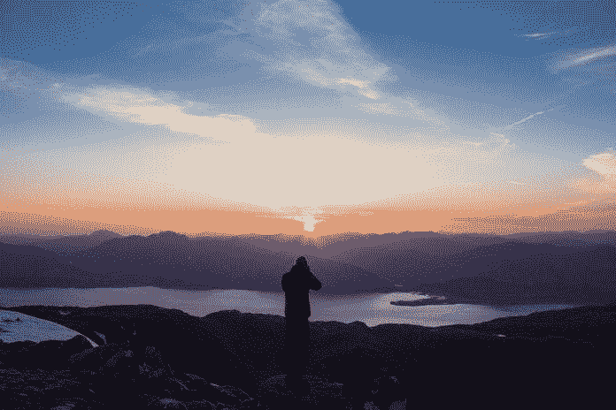
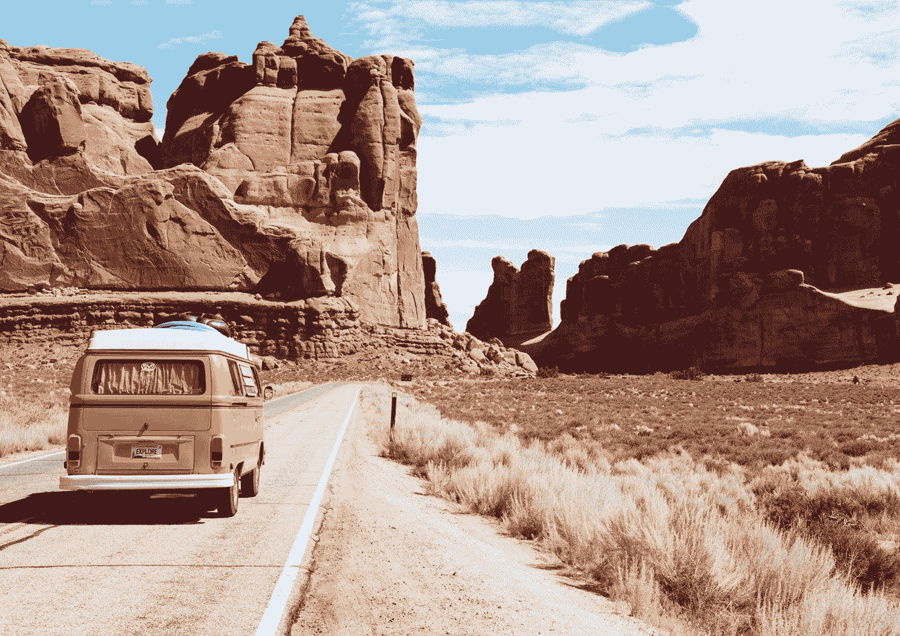
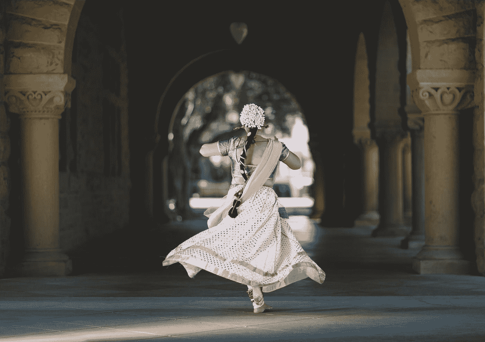

# 让你的品牌始终如一

> 原文：<https://medium.datadriveninvestor.com/make-your-brands-consistently-you-9abe44b6e75f?source=collection_archive---------12----------------------->

## 旅行创造了与读者相关的伟大内容

Photo by Danka and Peter on Unsplash

兰德大厦从不休假。不管你喜不喜欢，总有人关注你的职业或个人行为。无论你在哪里投资或建立关系，你的品牌话筒总是炙手可热。

三位即将离任的专家——[大卫·罗德斯](https://twitter.com/Rhodes411/)、[斯科特·艾迪](https://twitter.com/MrScottEddy/)和[切尔西·克罗斯特](https://twitter.com/ChelseaKrost)——承担了品牌建设的高潮、低谷和陷阱，从未休假。

Krost 是前 20 名千禧一代营销策略师、教练、LinkedIn 讲师和全球演讲者。作为一名获奖提名的讲故事者、演讲者和顾问，Rhodes 作为一名旅游博客写手一直忙于视频。埃迪是电视旅游节目《环球旅行者》的主持人。

“品牌建设、旅行和人际关系都需要你去学习和观察，”克罗斯特说。

 [## 旅行在即，现在就制定计划吧

### 向前看，以避免金融陷阱，并有一个良好的旅行

medium.datadriveninvestor.com](/with-travel-on-the-horizon-make-plans-now-83e97b0fb269) 

事实上，旅行让你接触并建立友谊，巩固你品牌的广度和深度。

“旅行给了我全球视野，”艾迪说。“它教会了我如何在不同的文化中，针对不同的人群建立品牌。至于关系，你在旅途中遇到的人通常都是志同道合的。这些关系会持续一生。”

品牌建设、旅游和关系的结合要求公众形象。

罗兹说:“要愿意把自己放在外面。”“你不能害怕打电话、发信息或尝试新事物。否则，你只是在拖自己的后腿。

他说:“旅行让你打破舒适区，让你有机会遇到你通常不会遇到的人。”“利用这一点。”

旅行让你传播你的品牌——无论是公司还是个人。

罗兹说:“所有这些不仅能帮助你培养人际交往能力，还能帮助你更好地理解他人。”。“在建立有意义的关系时，这一点非常重要。”

# 拔掉电源并重启

不同的混合会产生不同的结果。

“这取决于你在建什么，”艾迪说。“旅行肯定会给你一个新的视角，一个全新的视角。有时候去一个完全与世隔绝的地方旅行也不错。然后当你回来的时候，你的前景将会被完全重置。”

 [## 别让逃跑的人跑了

### 来自经验丰富的企业家和度假者的家庭旅行建议

medium.datadriveninvestor.com](/dont-let-the-getaway-get-away-6c83a6399c50) 

从一个地方到另一个地方有直接的好处。

“品牌建设、旅行和结识新朋友有助于你成长，”克罗斯特说。“每一次新的经历，都会让你学到宝贵的经验，打开更多机会的大门。曝光率、经验和关系是品牌建设的终极三驾马车。

“旅行是与你的在线观众面对面交流的好方法，”她说。“在前往目的地或参加会议时，计划一次与你的社交网络的会面。真正的面对面交流是进一步建立合作关系的最佳方式。”

当旅行或满足内心的旅行爱好者时，捕捉内容至关重要。

“许多新的地方提供了很好的拍照机会，”克罗斯特说。“寻找引人注目的壁画、美丽的风景和独特的景点来捕捉。让它成为一个瞬间，捕捉一场视觉盛宴。这些图片将在 Instagram 等视觉平台上表现最佳。”

艾迪也追逐摄影爱好者。

“我喜欢那个完美的镜头，那个完美的角度，”他说。“社交媒体只是展示它的工具。我通过我的眼睛看目的地，而不是媒体的眼睛。

“我最喜欢的是去一个 CNN 正在努力的地方，向世界展示它有多神奇，”他说。

美食给画报增添了趣味。

“我喜欢食物、风景、文化、人、一切，任何东西，”罗兹说。“旅行时，有无穷无尽的内容要捕捉。”

将商业和娱乐结合起来，充分利用专业和个人品牌。知道品牌话筒总是很热有助于保持一切同步。

“你是你的个人品牌，”克罗斯特说。“从本质上讲，你的冒险与你是谁、你做什么以及你能与观众分享什么有关。

“每个专业人士都受益于分享纯粹的个人经历、里程碑和兴趣，以吸引志同道合的人，”她说。

# 划定最后界限

完全整合后，旅游变成了一种营销工具。

“你总能找到方法让旅行成为你品牌的一部分，”罗兹说。“专注于旅行中你最感兴趣的东西——无论是食物、活动等等——去那些地方把这些点连接起来。

“只有你才能决定你的个人和专业品牌是什么，但为什么不把它们合二为一呢，”他说。“始终如一地做你自己。”

艾迪很快找到了完美的混合物。

“在我的私人生活和商业生活之间没有一堵墙，”他说。“我让我的品牌变得非常个性化。这一切都是关于在冒险中发展新的关系——将这些点连接起来。我努力发展自己的品牌，在旅途中结识新朋友。”

 [## 如何从你的话语中获利

### 撰写吸引你的理想读者的博客内容

medium.datadriveninvestor.com](/how-to-profit-from-your-words-d591eec74939) 

旅行和获得新的经验可以激发个人和职业。

“我最受鼓舞的是创造和分享冒险和经历，”罗兹说。“我的重点是创造内容。这促使我想要尝试新事物，并创造故事来帮助人们和我一起经历。

“体验新的文化也总是令人兴奋的，”他说。“让自己沉浸在完全不同的新事物中真的会让你对事物敞开心扉，即使你以前已经见过它们。”

当沉浸在文化中时尤其如此。

“我喜欢和当地人一起享受，”埃迪说，考虑到投资回报。“如果我能与当地人接触，这是一个双赢的局面。ROI 中的 [R](https://www.datadriveninvestor.com/glossary/r/) 代表关系。您挣得越多，尤其是在旅行时，您赢得的就越多。”

总的来说，四处走动是创业的有利条件。

“旅行给了我曝光率，经验，动力，感激和灵感，在我的生意的几乎每一个方面，”Krost 说。“每一个新的地方——无论是非洲、秘鲁、马来西亚还是希腊——都永远伴随着我，并塑造了我。”

# 会议见解

她的旅行灵感包括食物、人、自然和风景、活动和娱乐。Krost 的专业灵感来自会议、研讨会、网络机会、品牌合作、要捕捉的内容和新的学习见解。

她说:“对于那些由于繁忙的生活方式和繁重的工作负担而不能经常旅行的人，我强烈建议考虑一下我们称之为居家度假的方式。”"有时去当地的旅馆或度假村正是你放松一下的时候。"

通常，仅仅接触旅游就能提升一个品牌。看到人们如何生活在世界上不那么幸运的地方，但看起来却很快乐，会让你对自己拥有的东西产生新的欣赏，让你的个人品牌更有价值。

 [## 优秀的内容反映了最好的你

### 品牌定位帮助你避免在所有的噪音中大喊大叫

medium.datadriveninvestor.com](/sterling-content-reflects-the-best-of-you-1182f2913a48) 

“旅行增强了我的品牌，因为它允许更多的内容创作，”罗兹说。“我在旅行时总是最有创造力。主要是因为我觉得如果我无所事事，那就是在浪费时间。

“旅行也可以提升你的品牌，因为它让你有机会与那些你可能只在网上交谈过的人面对面交流，”他说。“一旦你见到某人本人，这将大大加强和建立关系。”

一个彻底的，意想不到的改变会带来惊人的结果。

“在投资银行工作了 10 年后，发生的最好的事情是，有一天老板走出办公室，说他们卖掉了公司，”埃迪说。“我去了一次改变了我生活的海外旅行。*轰！我在六个国家生活了 17 年。几年前刚回来。”*

# 冒险启示

永久的个人和职业变化来自意想不到的来源。

“在主持我的第一个广播节目时，我在 2009 年代表女性卫生保健组织了一次非洲之旅，”Krost 说。“这次旅行创作的纪录片让我与 Kotex 的[大学达成了‘千禧年代言人’协议。这次旅行永远改变了我的生活和品牌。](https://twitter.com/ubykotex/)

“有时候，最美好的结果、影响或关系来自激情项目，跳出框框思考，从个人和职业角度冒险，”她说。

在许多情况下，社交媒体让人们在旅行中形成并保持新的关系。

“无论我去哪里，我都努力认识新的人和当地人，”埃迪说。"我每天都活跃在当地的标签上."

 [## 改变我们的视角可以极大地影响我们与人交往的方式

### 关系的质量和我们看待世界的方式至关重要

medium.datadriveninvestor.com](/see-world-through-their-eyes-not-yours-2877d173713b) 

在线交流经常超越传统的联系。

“社交媒体是当今最终极的交流工具，”罗兹说。“它把你和全世界的人联系在一起。最好的经历之一是当你终于见到你认识多年的网友时。这真的加强了关系。

“另一方面，有时你会在旅行中遇到一些人，然后开始跟踪他们，”他说。“接下来你知道你也在关注他们的冒险。它让你保持联系。”

这在 Krost 最近的旅行中帮助很大。

“在过去的 10 年里，我在三个不同的州生活过，并且为了工作做了大量的旅行，”她说。“当你结识新朋友或搬家时，永远不会有再见的感觉，因为你现在有社交媒体来帮助保持联系，参与彼此的生活。"

# 抵御倦怠

在旅行中，权衡工作和生活可能是一个挑战。工作与生活的平衡不仅仅是一句口号。你需要正确看待这两者，以[避免精疲力竭](https://www.datadriveninvestor.com/2019/01/15/burnout-exhausts-easy-answers/)，享受工作内外唯一的生活。

 [## 倦怠耗尽了简单的答案

### 人们在付出全部甚至更多后会激情四射

medium.datadriveninvestor.com](/burnout-exhausts-easy-answers-143a0840743b) 

“尽量给自己留点时间，”罗兹说。“如果我什么都没做，我经常会感到内疚，但随着时间的推移，我允许自己利用这些短暂的休息时间。很容易烧坏。你的心理健康比什么都重要。”

成功的一个秘诀就是专注。

克罗斯特说:“旅行时，我能完成很多事情，因为我们真的可以把自己从世界中隔离出来，专注于工作。”。“我发现，在长途飞行中，写内容、写稿子、收发电子邮件和安排日程都是很难处理的事情。”

**关于作者**

吉姆·卡扎曼是[拉戈金融服务公司](http://largofinancialservices.com/)的经理，曾在空军和联邦政府的公共事务部门工作。你可以在[推特](https://twitter.com/JKatzaman)、[脸书](https://www.facebook.com/jim.katzaman)和 [LinkedIn](https://www.linkedin.com/in/jim-katzaman-33641b21/) 上和他联系。

*原载于 2019 年 11 月 18 日*[*https://www.datadriveninvestor.com*](https://www.datadriveninvestor.com/2019/11/18/consistent-branding/)*。*