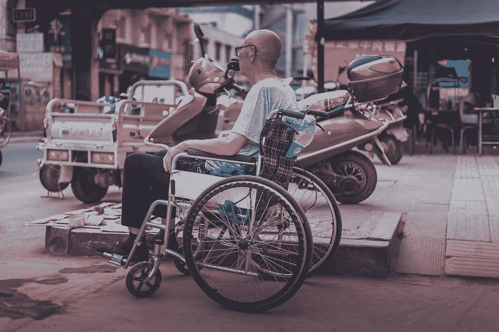

# 让自己在社交上容易接近

> 原文：<https://medium.datadriveninvestor.com/make-yourself-socially-accessible-bbcebdac1678?source=collection_archive---------15----------------------->

## 美国政府的指导方针帮助每个人克服障碍

Photo by @wooozxh on Unsplash

残疾人使用社交媒体。除了有礼貌地确保脸书、Twitter、LinkedIn、网站和博客对每个人平等开放，这是美国联邦在线用户的法律。

简称为 508 合规。这指的是 1973 年美国劳动力康复法修正案第 508 条。这要求联邦政府开发、采购、维护或使用的所有电子和信息技术对残疾人无障碍。

 [## 社交媒体收听让您随时了解|数据驱动型投资者

### 虽然社交媒体倾听是一种顶级趋势，但它应该是每个现代营销策略的一部分。保持和谐…

www.datadriveninvestor.com](https://www.datadriveninvestor.com/2019/02/26/social-media-listening-keeps-you-plugged-in/) 

虽然政府紧随其后， [508 为社交媒体上的每个人提供了有益的建议](https://epolicyworks.ideascale.com/a/pages/accessibility-statement)，许多在线的人每天都在做的 it 基础工作。如果这些建议听起来像“嗯，这很简单”，事实上，它们确实很简单。

各种社交媒体工具为帮助人们获取内容提供了巨大的好处:

*   克服组织挑战—随时随地访问文件和对话流
*   增强沟通—定制的论坛、社交网络功能和协作工具
*   提高生产效率—管理文档共享、跟踪、存储和版本控制
*   省钱——在线还是面对面；外联流程的可重用性
*   提高外联的包容性——与合作伙伴和利益攸关方进行对话和在线讨论

参与工具帮助追随者访问内容。社交媒体平台上的博客和微博互动工具包括 WordPress、Tumblr、Twitter 等。

众包是一种社交媒体外联形式，将人们与活动联系起来。它利用在线工具向利益相关者征求想法或意见，以解决问题并做出决策。用户发现这些众包优势:

*   将机构和公司与利益相关者或委托人联系起来
*   提供成本优势和效率
*   充当外联和提高认识的工具

通过有针对性的拓展，决定问题并向利益相关者提出构思挑战。建立一个[参与式、自我管理的社区](https://blog.markgrowth.com/chats-break-through-brick-and-mortar-walls-324c7c9d8f9c)，并决定参与的时间表。

被众包吸引的访客会投票和发表评论，并通过电子邮件、Twitter 或脸书交流想法的状态。版主直接与围绕这些想法形成的社区互动。“最好的”众包创意涌现出来。

# **打造领袖**

众包让领导者受益，因为他们从利益相关者那里收集反馈和想法，为政策制定提供信息。这比传统策略更容易、更便宜、更快、更灵活和更容易获得。它鼓励互动；扩大范围；提高透明度并产生良好的数据。

通过社交媒体或其他媒体获得的反馈不同于众包。你从利益相关者那里收集反馈，并从他们那里众包*想法*。

社交媒体[整合了技术、社交互动](https://www.datadriveninvestor.com/2019/09/18/vr-tentatively-peers-into-social-networks/)和内容创作，以协作方式连接在线信息。人们或团体可以创建、组织、编辑、评论、组合和共享内容。这个过程帮助那些在线的人更好地实现他们的目标。

越来越多的组织正在使用社交媒体进行推广，招聘求职者并鼓励[工作场所的生产力](https://medium.com/datadriveninvestor/work-productively-by-design-8269123f716d)。

同样，越来越多的残疾和非残疾求职者使用社交媒体寻找和申请工作，讨论职位空缺和求职技巧，制作简历和建立职业联系网络。

虽然社交媒体促进了开放性，但也带来了障碍:

*   视觉图像——弱视或无视力的人可能看不到。
*   音频输出—失聪或听力有限的人可能无法使用。
*   多媒体内容—有视觉和听觉处理障碍的人或有认知障碍的人可能无法访问。
*   需要用户交互的内容—灵活性或移动性有限的人可能无法访问。

有一些简单的方法来关注所有人的接入:

*   在您的社交媒体帐户页面上提供您的联系信息。
*   通过多个渠道提供您的社交媒体内容。
*   提供官方社交媒体支持和可访问性团队的链接或联系信息。
*   保持简单。

虽然与脸书的用户相比微不足道，但每天有超过 1 亿人使用 Twitter。如 508 所述，推文需要是可访问的:

*   通过移动应用程序发布照片时，使用替代文本功能。设置>>辅助功能。
*   包括视频抄本的链接。
*   限制缩略词[的使用，如果使用的话，解释一下。](https://medium.com/datadriveninvestor/abbreviations-are-not-letter-perfect-efa3b58a60a0)
*   使用简单的语言。
*   对标签使用骆驼大小写。Camel case 是一种将每个单词的第一个字母大写的练习，即#LikeThis 而不是#likethis。

通过这些日常实践，你的社交媒体将变得更容易接近。

**关于作者**

吉姆·卡扎曼是[拉戈金融服务公司](http://largofinancialservices.com/)的经理，曾在空军和联邦政府的公共事务部门工作。你可以在[推特](https://twitter.com/JKatzaman)、[脸书](https://www.facebook.com/jim.katzaman)和 [LinkedIn](https://www.linkedin.com/in/jim-katzaman-33641b21/) 上和他联系。