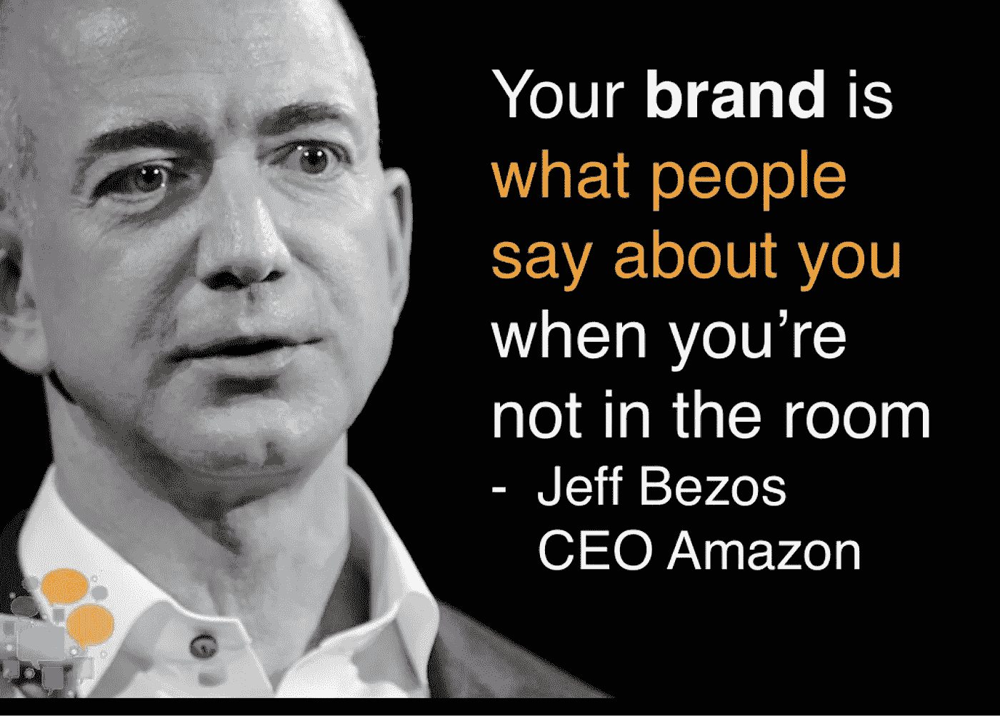

# 强大的个人品牌给人一种权威的感觉

> 原文：<https://medium.datadriveninvestor.com/make-yourself-the-talk-of-others-c39c43d5beb?source=collection_archive---------7----------------------->

## 人们会想听你说的每一件事

Photo by Alex Distel on Unsplash

权威加上强大的个人品牌能带来成功。这一点尤其适用于网络，因为在网络上，企业拥有最大的影响力。

企业家可以利用认证的“营销呆子”的专业知识，[托尼·克里斯滕森](https://twitter.com/tonydoesads)很乐意响应号召。这位创作者和演讲者痴迷于脸书和 Instagram 广告。他经营自己的营销机构，托尼做广告，并为[莫比乌斯媒体解决方案](https://mobiusmediasolutions.com/)工作。

“我的工作就是提供价值和帮助人们，”他说。

克里斯滕森的痴迷也席卷了 Twitter，自从蓝鸟展翅高飞以来，数字营销专家 Madalyn Sklar 就在 Twitter 上发表了自己的观点。他们一起讨论用 Twitter 建立权威和个人品牌。

 [## 伟大的个人品牌帮助你脱颖而出

### 创造你想让别人看到的形象

medium.com](https://medium.com/an-idea/great-personal-branding-helps-you-stand-out-7ea6152dfc1) 

一个途径是视频。社交媒体管理公司[的尼克·马丁](https://twitter.com/hootsuite)胡特苏特提出了一些发展和推广品牌的建议:

*   通过 Periscope 分享实时更新和事件。
*   回复推文。
*   推广，广告和分享挑逗。
*   做大家最喜欢的视频内容:幕后。

克里斯滕森说:“在 Twitter 上建立权威就是要与业内同行建立关系，并在网上展示你的专业知识。”“当你拥有权威时，人们会尊重你的意见、观点和建议。

“当建立权威时，当人们想到你的行业、服务和利基时，你要采取措施成为第一个想到的人，”他说。“当人们就某个特定话题寻求帮助时，他们在网上求助的人已经建立了权威。”

克里斯滕森转向 Sklar，作为任何“想知道 Twitter 最新和最棒的信息”的人的来源。

“马达林是我第一个想到的名字，也是我第一个寻求建议的人，”他说。"她通过#TwitterSmarter 聊天、播客、推特、课程和演讲建立了权威."

Sklar 同意 Twitter 的价值。

 [## 社交媒体收听让您随时了解|数据驱动型投资者

### 虽然社交媒体倾听是一种顶级趋势，但它应该是每个现代营销策略的一部分。保持和谐…

www.datadriveninvestor.com](https://www.datadriveninvestor.com/2019/02/26/social-media-listening-keeps-you-plugged-in/) 

“当你出现并分享非常有用的信息、建议、两分钱，以及成为一个花时间与你的社区联系的伟大听众时，你就在 Twitter 上建立了权威，”她说。

# **知识就是力量**

展示你权威的主要方式是学习你的手艺。

“看看是谁撼动了你的行业，”克里斯滕森说。“听听他们在说什么，在做什么，为什么。测试他们的建议。与多位行业专家一起冲洗并重复。根据你测试过的对你有用的东西，形成你自己的观点。

“提供价值，”他说。“分享你所学到的。分享你的经历。分享你取得的实际成果。要正宗。”

权威来自案例研究、博客、播客、节目和特写。

“不要只是分享文章，写下你从他们那里学到了什么，或者如果你有不同的观点，”克里斯腾森说。

“创造一致的内容，”他说。“分享适合您的内容、最新更新、回答常见问题、提供免费下载以及分享案例研究。”

 [## 用有吸引力的销售线索吸引人们来你的企业

### 有价值的赠品是良好营销活动的关键部分

blog.markgrowth.com](https://blog.markgrowth.com/lead-magnets-attractive-ways-to-get-your-foot-in-the-door-2005d8be6f96) 

Sklar 在追随者中的权威在很大程度上因其连锁品牌而得到加强。

“我通过我的#TwitterSmarter 聊天以及我的 [#TwitterSmarter](https://twitter.com/hashtag/TwitterSmarter?src=hashtag_click) 播客和大师班来展示我在 Twitter 领域的权威，”她说。“我还教授在线课程和网络研讨会，并在会议和活动中发言。你必须非常显眼。”

不管权威如何，个人品牌[的最终裁决取决于其他人](https://scottwyden.com/your-brand/):“你的品牌就是当你不在房间里时人们对你的评价。”

“我喜欢企业家和投资者克里斯·达克(Chris Ducker)关于围绕你(T8)打造你的品牌的教导，”克里斯滕森说。“分享你的个性，分享你的所爱。你的品牌可以适应和改变，因为你已经围绕你的*建立了你的业务*。

“你爱什么？”他说。“你主张什么？你的感觉是什么？你在网上和在现实中是如何行动的？这些都构成了你的个人品牌。所以要乖一点。”

正如 Sklar 所解释的，角色是包罗万象的。

“一个个人品牌是全方位的，全方位地展示你是谁，你代表什么，以及让别人看到和听到你的激情和动力，”她说。

# **最佳配置文件**

Twitter 在品牌建设方面有着特殊的优势。

克里斯滕森说:“在 Twitter 上建立个人品牌的第一步是优化你的个人资料。“确保你的简历清楚地说明你是做什么的。拥有更新的个人资料图片。优化您的横幅。添加您的网站。有一个固定的推文。准备好你的基础。

"你的个人资料优化后，开始深入你的行业，看看人们在说什么."他说。“谁是思想领袖？跟随他们，向他们学习，并在适当的时候与他们接触。”

 [## 从长远来看，个人品牌会大获成功

### 创建一个人物角色，这样你就知道在哪里进行营销

medium.datadriveninvestor.com](/personal-brands-strike-gold-in-the-long-run-4e8e563d5cdb) 

除此之外，成为信息的字体。

Sklar 说:“找到你非常熟悉的领域并拥有它。“自 2015 年 7 月以来，我每周都出席#TwitterSmarter 聊天，很好地完成了这一任务。确保你的社交媒体档案也能反映你的品牌。这太重要了。”

强大的个人品牌和巨大的权威之间有着直接的关系。

克里斯腾森说:“一个个人品牌会显示你是谁，你是什么样的人，你帮助了谁。”“人们越容易看到你的品牌，就越容易树立威信。

“当你分享内容，给出你对最新行业新闻的看法时，人们会去看你的个人资料，感受你的个人品牌，”他说。"确保你全力以赴。"

确立了这一点，其他人就会倾听。

Sklar 说:“归根结底就是让你所在行业的人看到你，听到你。”“与你所在领域的有影响力的人建立联系会有很大帮助。受邀加入他们的播客、Twitter 聊天和客座博文。”

品牌建设有陷阱，克里斯滕森列举如下:

*   分享文章，但不添加任何自己的观点或看法。
*   向人们兜售你的推销词。
*   标记*成吨*的人只是为了引起注意。

他开了这些药方:

*   从分享的文章中分享你的心得。创建您自己的内容。
*   给予*价值*而不是出售来建立你的权威。在*右侧*时间俯仰。“刺拳，刺拳，刺拳，右勾拳，”品牌专家[加里·维纳查克](https://twitter.com/garyvee)会说。
*   标记相关的人，而不是其他人。

“最大的陷阱是不被注意，”Sklar 说。“在打造你的品牌时，你需要让你所在行业中有影响力的人引起你的注意。把它们放在推特列表里。和他们谈谈。给他们贴标签。”

# **与众不同的 gif**

在社交媒体的喧嚣中，有办法脱颖而出。

“在社交媒体审查员的社交媒体营销世界里，我记得专家安德鲁和皮特说过要创建自己的 gif，”克里斯滕森说。这个怎么推荐都不为过。

“会议结束后，我回家批量制作了几个，”他说。“这是让人们快速认出你并感受你的品牌的好方法。”

Christensen [发布了一个视频](https://www.youtube.com/watch?v=Bw7P_1kzxzo),解释了 GIF 的制作过程，并添加了其他脱颖而出的方法:

*   分享你的经历。我喜欢分享我看到的客户处理的常见问题以及如何避免它们。
*   试图在一个新行业树立权威？说你是新来的，分享你一路上学到的东西。
*   做出大胆的声明和[表明立场](https://www.datadriveninvestor.com/2018/10/01/is-brand-advocacy-worth-the-risk/)。我是在谈论我看到的一个[常见客户问题](https://twitter.com/tonydoesads/status/1195398352474476544)时这样做的。它获得了超过 26，000 次展示，并导致超过 140 人查看我的 Twitter 个人资料。
*   专注于帮助人，提供*价值*。

 [## 个人品牌能吸引人们的注意力，帮助你建立信任

### 保持档案的优化和更新增加了参与度

medium.datadriveninvestor.com](/personal-brands-catch-peoples-attention-and-help-you-build-trust-abc6a93b996d) 

Sklar 说:“通过定期参与聊天，在 Twitter 上脱颖而出。”“用视频或 GIF 回复推文。使用自定义 gif 就更好了。倾听并花时间去真正了解你所在社区的人。”

Twitter 提供了许多学习权威和品牌的资源。

“搜索相关的关键词、主题和标签，看看你所在行业中表现最好的推文和人物，”克里斯滕森说。“搜索 [BuzzSumo](https://twitter.com/BuzzSumo) 你的行业关键词，看看它显示了哪些影响者。跟随他们，看看什么对他们有效。

“利用你所在行业的资源和思想领袖，但不要复制他们的个人品牌，”他说。“按你的方式去做。做你自己。要真实。保持一致。你得到了这个。”

[今日社交媒体](https://twitter.com/socialmedia2day)，社交媒体审查员和社交媒体评论员[马特纳瓦拉](https://twitter.com/MattNavarra)也提供权威和品牌信息。

**关于作者**

吉姆·卡扎曼是拉戈金融服务公司的经理，曾在空军和联邦政府的公共事务部门工作。你可以在[推特](https://twitter.com/JKatzaman)、[脸书](https://www.facebook.com/jim.katzaman)和 [LinkedIn](https://www.linkedin.com/in/jim-katzaman-33641b21/) 上和他联系。