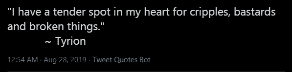

# 用 Python，Tweepy 和 Heroku 在 Twitter 上发布消息。

> 原文：<https://medium.datadriveninvestor.com/making-a-quote-tweeting-twitter-bot-with-python-tweepy-and-heroku-69a11cd3f47e?source=collection_archive---------1----------------------->


Photo by [Sara Kurfeß](https://unsplash.com/@stereophototyp?utm_source=medium&utm_medium=referral) on [Unsplash](https://unsplash.com?utm_source=medium&utm_medium=referral)

自从我在 twitter 上发现了这些机器人的@QuotesReplies、@downloaderbot 和@ Remindmeaboutthis 以来，我一直想做一个 Twitter 机器人，并想知道它们是如何制作的，但因为我之前申请 Twitter 开发者账户被拒绝，我暂时放弃了这个想法。

然而，最近，我决定用个人账户再试一次，我的申请得到了批准。事实证明，我所要做的就是用绝对清晰的术语说明我想对他们的 API 和数据做什么。如果你需要一些关于如何做的指南，我很乐意帮助你写一篇文章讨论我是如何做的。不管怎样，我的申请得到了批准，我开始着手制作我的第一个 Twitter 机器人。

[](https://www.datadriveninvestor.com/2019/01/15/the-path-of-mobile-app-development-in-2019/) [## 2019 年移动应用开发之路|数据驱动的投资者

### 任何在移动应用程序开发行业工作的人，无论他们是专注于在伦敦开发 iOS 应用程序还是…

www.datadriveninvestor.com](https://www.datadriveninvestor.com/2019/01/15/the-path-of-mobile-app-development-in-2019/) 

我的机器人很简单——不像我上面提到的那些那么花哨。它将在推特上随机引用我已经拥有的 data.json 文件。这个文件包含了从不同网站上删除的角色的引用——大约 100 多个。

首先，我需要从 data.json 文件中获取 object 的引号。使用 python 内置的`json`包和内置的`open`函数；我创建了一个名为`get_quotes()`的功能。它解析 json 文件并返回一个包含对象的列表，每个对象都由一个引号、id 和引号所在的字符组成。

```
def get_quotes():
    with open('data.json') as f:
        quotes_json = json.load(f)
    return quotes_json['quotes']
```

接下来，我需要一种随机选择报价的方法。当我用 JavaScript [在这里](https://github.com/adamichelle/got-quote-generator/)做类似的事情时，我必须使用 slice 创建一个 quotes 数组的副本，使用 JavaScript 数学函数创建一个随机索引，最后使用随机生成的索引选择一个报价。然而，在 Python 中，我从内置的`random`包中找到了一个内置的`random.choice()`函数，它允许我从从`get_quotes()`获得的报价对象列表中返回一个随机报价对象。通过在 json 导入行下面添加`import random`来导入这个包。

```
def get_random_quote():
    quotes = get_quotes()
    random_quote = random.choice(quotes)
    return random_quote
```

然后我需要在`create_tweet()`函数中创建 tweet 结构，使用从上面的`get_random_quote()`中获得的 quote 对象，然后返回 tweet。这只是一个多行字符串串联变量的函数。

```
def create_tweet():
    quote = get_random_quote()
    tweet = """
            {}
            ~{}
            """.format(quote['quote'], quote['character'])
    return tweet
```

最后，我需要将推文发送到我的账户。这就是需要 twitter 开发者账户的地方。如果你已经有了一个 twitter 开发者账户，你需要[注册](https://developer.twitter.com/en/apps/create)一个应用程序。如果您没有，您需要在创建应用程序和您的应用程序被批准之前[申请](https://developer.twitter.com)一个。这是为了让您能够获得访问 Twitter API 的凭证。您可以将凭证存储在名为 *credentials.py* 的文件中，用于**本地**开发。在该文件中，您将在新应用仪表板的“密钥和令牌”选项卡中添加以下详细信息。

```
API_KEY=YOUR-API-KEY
API_SECRET_KEY=YOUR-API-SECRET-KEY
ACCESS_TOKEN=YOUR-ACCESS-TOKEN
ACCESS_TOKEN_SECRET=YOUR-ACCESS-TOKEN-SECRET
```

我们将需要 ***tweepy*** 包来与 Twitter API 接口。如果您还没有运行在 github 仓库的 README.md 中找到的命令，您将需要使用 pip 安装 tweepy。如果你没有 pip，你也必须[安装](https://pip.pypa.io/en/stable/installing/)那个。

```
pip install tweepy
```

安装后，我们可以使用它通过 OAuth 认证访问 Twitter 的 API。在文件的开头，就在`import random`行的下面，导入 tweepy 包。此外，导入您的凭据文件。

```
import tweepy
import credentials
```

然后在它后面添加下面几行代码。

```
consumer_key = credentials.API_KEY
consumer_secret_key = credentials.API_SECRET_KEY
access_token = credentials.ACCESS_TOKEN
access_token_secret = credentials.ACCESS_TOKEN_SECRET
```

然后定义一个`tweet_quote()`函数。我们将首先发送一条测试 tweet 来验证我们是否正确连接到了 Twitter API。所以在 tweet_quote 函数之后，我们将添加`if __name__ == "__main__":`，然后调用`tweet_quote()`函数。然后，我们将从命令行运行`python bot.py`或任何你的文件名。

```
def tweet_quote(): auth = tweepy.OAuthHandler(consumer_key, consumer_secret_key)
    auth.set_access_token(access_token, access_token_secret)
    api = tweepy.API(auth)
    test_tweet = create_tweet()
    api.update_status(test_tweet)if __name__ == "__main__":
    tweet_quote()
```

如果一切顺利，你会在个人资料中看到一条引用了《权力的游戏》的新推文。在推文下面，我们通常会有“Android 版 twitter”或“iPhone 版 Twitter”，你会看到你的源标签是你在 Twitter 开发者账户中创建的应用的名称。



What the tweet would look like.

既然我们已经验证了它可以工作，那么我就可以继续确保它以真正的机器人方式运行一段时间。为此，我需要在上面的代码中添加一个`interval`——在我的例子中是 60 * 60 * 24 秒，因为我希望它每天运行一次。然后，我还将创建一个`while`循环，它将无限运行，但会休眠，即`time.sleep(interval)`在我们的区间变量中设置的秒数。在文件的顶部，你需要导入`time`函数，即`import time`来使用这个函数。

```
def tweet_quote():
    interval = 60 * 60 * 24

    auth = tweepy.OAuthHandler(consumer_key, consumer_secret_key)
    auth.set_access_token(access_token, access_token_secret)
    api = tweepy.API(auth) while True:
        print('getting a random quote...')        
        tweet = create_tweet()
        api.update_status(tweet)
        time.sleep(interval)
```

再次运行该文件，您应该会看到另一条类似上面的 tweet。你可以减少你希望你的机器人发推特的秒数，但是一定要遵守推特禁止垃圾邮件的规定，否则你可能会被暂停。

我们的机器人成功了！您可能不想让您的工作站/笔记本电脑和终端一直开着，以便脚本继续运行，那么如果您想将它移动到一个更永久的位置，该怎么办呢？你可以用 Heroku 来托管这个应用。

**注意:**你想让**绝对**确定当你想托管你的应用时**而不是**提交你的凭证文件，所以在提交文件之前，如果你是从头开始构建你的应用，确保你在一个`.gitignore`文件中列出你的凭证文件。

当我在做我的工作时，我遇到了一些挑战，不知道如何去做。我按照这个[教程](https://dev.to/emcain/how-to-set-up-a-twitter-bot-with-python-and-heroku-1n39)去做，它让事情变得简单。我按照教程中的说明创建了 server.py 文件和 Procfile 文件以及 requirements.txt 文件。

```
# server.py filefrom os import environ
from flask import Flaskapp = Flask(__name__)
app.run(host= '0.0.0.0', port=environ.get('PORT'))# Procfile
web: python server.py
worker: python bot.py# requirements.txt file
Tweepy
Flask
```

然后在包含机器人代码的文件中，即`bot.py`，在文件的开头，在其他导入之后，我添加了:

```
import sys
from os import environ
```

然后更改了检索应用程序凭据的部分，如下所示:

```
consumer_key = environ['API_KEY']
consumer_secret_key = environ['API_SECRET_KEY']
access_token = environ['ACCESS_TOKEN']
access_token_secret = environ['ACCESS_TOKEN_SECRET']
```

然后，我在我的项目文件夹中初始化了一个 git 存储库，将我的文件提交并推送到我的本地主分支。我有一个 heroku 账户，并且安装了命令行界面，所以我运行`heroku create tweet-quote-bot`来创建一个新的 Heroku 应用程序。没有账号的可以[注册一个](https://signup.heroku.com/)。然后[安装](https://devcenter.heroku.com/articles/heroku-cli)Heroku 命令行界面(CLI)运行上面的命令。

然后，我在浏览器上登录到我的 Heroku 仪表板，并设置我的环境变量。

然后将我的本地主分支推到 Heroku 来部署我的应用程序:

```
git push heroku master
```

上面链接的教程到此为止，但我的应用程序仍然无法工作，因为我的帐户上没有新的推文，所以我认为有些事情是错误的，我是对的。我的 web [dyno](https://www.heroku.com/dynos) 由我的工人打开，dyno 关闭，我的工人 dyno 将运行我的 bot 代码所在的文件。解决方案是使用我的 CLI 启动 dyno。所以我运行了下面的命令。主要感谢提供这个[答案](https://stackoverflow.com/questions/39139165/running-simple-python-script-continuously-on-heroku/50498116#50498116)的栈溢出用户。

```
heroku ps:scale worker=1
```

当我回到我的仪表板上查看时，worker dyno 已经打开了，当我查看我的 twitter 帐户时，viola！推特上发布了一条新的引述。我的应用程序现在工作了。上面的 stack overflow 用户似乎暗示没有必要使用 flask 创建服务器，因为他只是指出在 Procfile 中包含 worker 行。我没有机会尝试，但如果你喜欢，你可能会想，我想听听进展如何。

所以，这就是我如何创建我的第一个引用推特机器人。我期待着用 twitter API 做更多的事情，也许是像我前面提到的机器人一样复杂的东西。如果我写了，我也会写的。

这个项目的源代码可以在这里找到: [Tweet 报价机器人](https://github.com/adamichelle/tweet-quote-bot)。