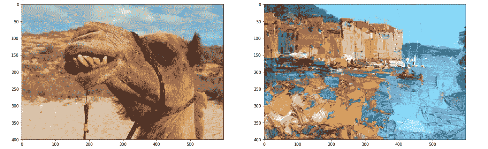
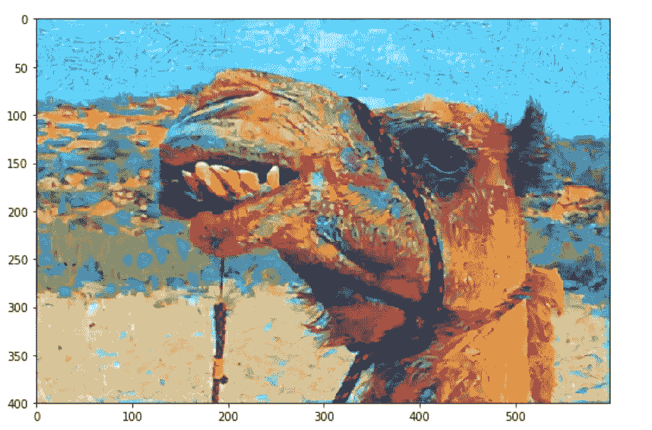
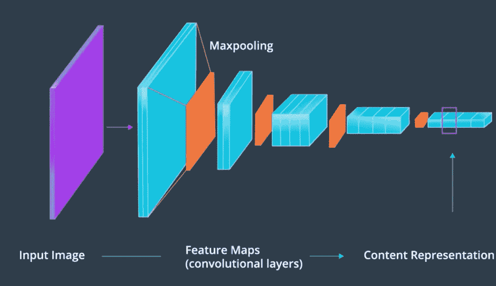
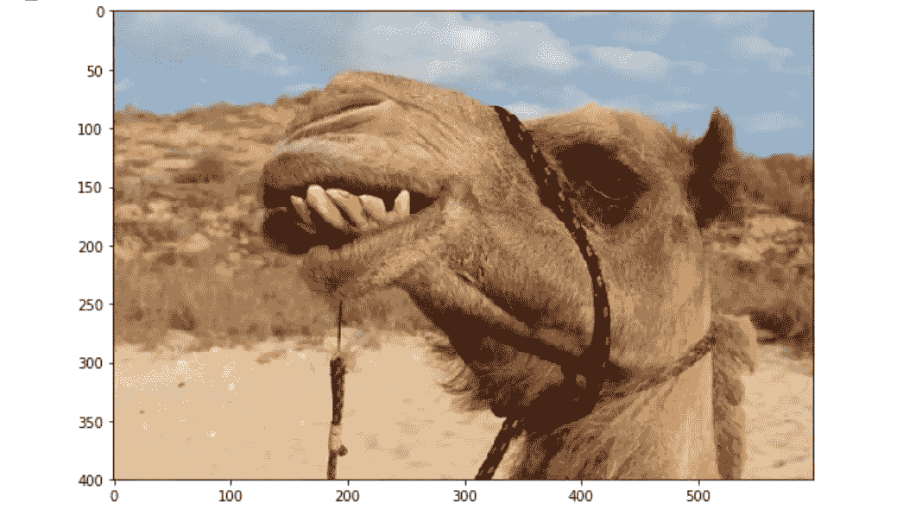
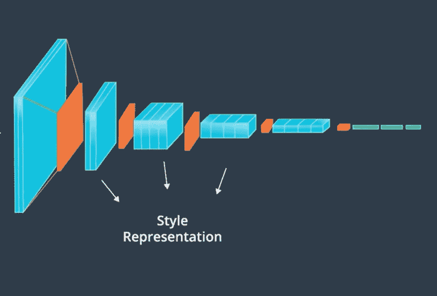

# 用人工智能让骆驼更漂亮

> 原文：<https://medium.datadriveninvestor.com/making-camels-prettier-with-ai-318ab2d9640b?source=collection_archive---------7----------------------->

你是否曾经看着一张骆驼的照片想:“该死，骆驼很有趣，但是想象一下如果它们更有趣、更多彩。有点像这两张图片的交叉”

*一只艺术骆驼将是超级大傻瓜。*

可惜我不会画画，而且我很懒。

但是，如果你有人工智能😉…

Art 😍

风格转移使用预先训练的 CNN(卷积神经网络)来理解一幅图像中的**内容**(对象)，并将其与另一幅图像的**风格**(颜色、笔画)相结合。

 [## DDI 编辑推荐:5 本机器学习书籍，让你从新手变成数据驱动专家…

### 机器学习行业的蓬勃发展重新引起了人们对人工智能的兴趣

www.datadriveninvestor.com](https://www.datadriveninvestor.com/2019/03/03/editors-pick-5-machine-learning-books/) 

有点像制造婴儿，但是有图片。

内容+风格=新图片。

我个人是分解代谢反应的粉丝，所以让我们来分解一下🤓(抱歉，这个化学笑话没人觉得好笑)。

# 内容

为了获得“内容”，我们可以使用 CNN 的后续层。

CNN 主要检测图像中的模式。CNN 由许多层组成，那种看起来像蜘蛛网的🕸.圆圈是互相交流信息的“节点”，而线条是控制节点如何交流的“权重”。

一个“训练有素”的 CNN，已经有了预定的权重。这意味着它的重量，非常善于检测模式。

CNN 传统上由两部分组成:特征提取层和分类层。在风格转换中，分类就像教鱼走路一样有用，所以我们忽略这些层次。

我们剩下的是一个深度神经网络，能够识别一些图像像素中的模式。

## CNN 如何工作(高级概述)

[这里有一个更深入的来源。](https://brohrer.github.io/how_convolutional_neural_networks_work.html)

他们 2 层:卷积和最大池。

**卷积层**(蓝色)是“特征图”，它们总结了输入中检测到的特征(如一条线)。

**最大池化**(橙色)层简化了卷积层。

随着我们深入网络，卷积层总结了整个图像∴这些层被称为**内容表示**。

为了制作我们漂亮的骆驼宝宝，我们通过 CNN 传递骆驼图片，因此我们可以获得骆驼的“内容表示”。

“content” image, or “baby daddy”

一旦我们有了内容的表示，我们就需要👶。

# 风格

CNN 的卷积层由大量的特征地图组成。这些特征图中的每一个都负责检测一些*特征。*

这些特征图的相关性可以告诉我们很多关于图像风格的信息。

每个特征图检测单独的特征。但是，在这些地图中，颜色和一些形状(即。样式)将保持不变。我们可以通过相关性来确定图像的哪些部分构成了它的风格。

样式表示是通过 Gram 矩阵计算出来的，大概在这里可以读到[。](https://towardsdatascience.com/neural-networks-intuitions-2-dot-product-gram-matrix-and-neural-style-transfer-5d39653e7916)

一旦我们有了风格+内容表示，我们就把它们结合起来

# 风格转移

概述:

提取一个图像的内容:使用 CNN 的后一层

提取另一幅图像的风格:在许多卷积层中使用特征图的相关性。

为了确保我们不会宰杀我们美丽的骆驼，我们定义了内容损失。

## 内容损失

→ *一个功能，以确保当我们创建一个新的图像，它仍然像骆驼*

损失是原始骆驼和新骆驼之间的**均方误差**。

我们希望损失尽可能低。

## 风格丧失

风格损失告诉我们，我们的新骆驼，是如何接近我们漂亮的图片的风格。

## 目标损失

为了计算新 camel(目标图像)的损失，我们将内容和样式损失相加:

目标 _ 损失=内容 _ 损失+样式 _ 损失

**目标是最小化目标损失。**

更低的目标损失=更好的内容表现和更好的风格表现。

经过 5000 次迭代，你得到了这种美丽:

我还有一个关于让骆驼变漂亮的视频:

感谢阅读！一定要鼓掌并与你的网络分享！

**与我联系，我的邮箱是 igrandic03@gmail.com，**[**Twitter**](https://twitter.com/isabellagrandi3?lang=en)**，**[**LinkedIn**](https://www.linkedin.com/in/isabella-grandic-000b25172/)**，可以报名我的** [**月报**](https://landing.mailerlite.com/webforms/landing/r3j2t5) **。**