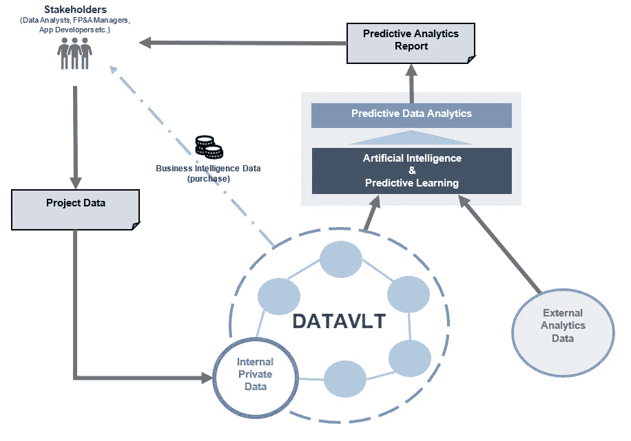
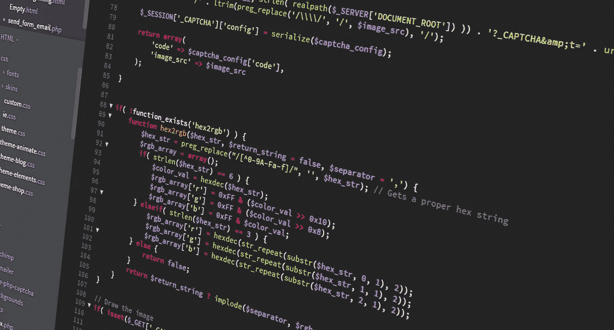
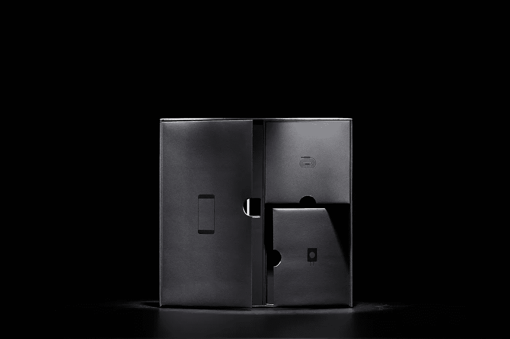

# 让数据分析在区块链上工作

> 原文：<https://medium.datadriveninvestor.com/making-data-analytics-work-on-a-blockchain-469db12b7557?source=collection_archive---------1----------------------->

“Artificial Intelligence”

一种采用黑盒算法的具有预测学习能力的人工智能已经存在了几十年，被包括政府和军队在内的不同机构所使用。

这种技术的应用范围很广，从医疗到教育，再到国家安全。**然而，我们知道它在提供行为数据分析的区块链上是如何工作的吗？**

“User Interfacing provided by DATAVLT”

**DATAVLT** 是首批在区块链上应用具有机器学习能力的人工智能的机构之一，旨在提供一种低成本、高效的数据分析工具。他们在白皮书中提供了一个整体的数据处理框架。任务；让我们用简单的术语来理解每个组成部分。讨论将按以下顺序进行:外部和内部数据、算法黑盒、人工智能、预测学习或机器学习能力，以及数据区块链。

“Business data”

# **第一步:什么类型的数据将被输入网络？**

数据可以是外部的和内部的。外部数据包括来自全球网络的信息，包括类似实体、行业、Google analytics、任何其他第三方来源的信息，以及来自涉及商品和服务消费的通信的数据，如使用该平台的组织的社交媒体帐户。内部数据包括由不同部门(尤其是 IT 和规划部门)持有的组织的私有数据，以促进更高的生产力并鼓励员工创新，从而更好地为客户服务。

“Black Box”

# **第二步:黑盒的算法是什么？**

当收集了所有需要的数据后，就该将这些数据输入到算法黑盒中了。然后，这些数据被当作盒子的输入(这个盒子可以是算法、晶体管，甚至是人脑)。它将充当观察者，并选择与工具用户所属的规范或行业相关的所有数据。此后，选定的数据将被视为具有可观察到的要素或相似性的输出。这让我们进入下一阶段。

## **用 DATAVLT 解决黑盒问题**

尽管这种方法有许多用途，但有些人会认为它可能会对处理的输出数据产生偏差，从而导致分析不准确。此外，创作者将无法知道一些黑盒算法的过程。然而，如果一个组织愿意花时间来解决这个问题，这个问题是可以解决的。DATAVLT 知道这个问题的存在，并且从他们成立之初就非常严谨，要带来最好的黑匣子。大多数失败的原因是这种系统的快速部署没有经过适当的测试。但是，在他们的路线图上，我们可以清楚地看到他们致力于提供最好的工具，因为在正式发布之前，他们将与合作伙伴一起进行大量的测试。

“Future Learning”

# **第三步:人工智能的功能**

DATAVLT 表示，AI 将分类、整理和拒绝表里不一和可疑的数据。这意味着人工智能将不得不削减不可逾越的数据输出，以获得分析所必需的数据，并拒绝因部门保留具有相同相似性的独立账户而产生的重复数据。

“DATAVLT Blockchain”

# **第四步:区块链数据**

一旦数据准备好进行处理和深入分析，就应该对其进行保护并保持不变，以防止报告不准确。这是通过区块链完成的，因为它具有不变性和防篡改的特点，在这种情况下，任何人都不允许在网络中进行故意或无意的欺诈。

# **第五步:机器学习能力(预测学习)**

现在，数据将准备好被处理成可以传达给管理团队的信息。预测学习功能允许跟踪历史财务信息的重要模式、客户行为趋势、经理绩效、异常管理中有用的差异等。

> 这些信息现在可以用于制定影响公司资源、运营和现金流的经济决策。

