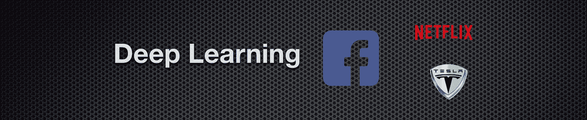
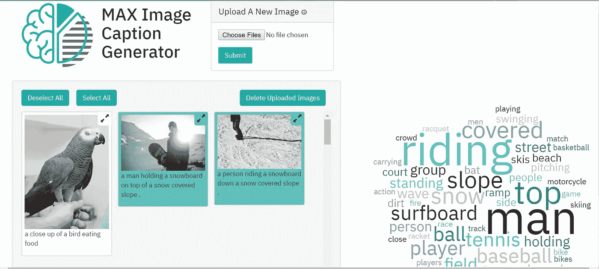
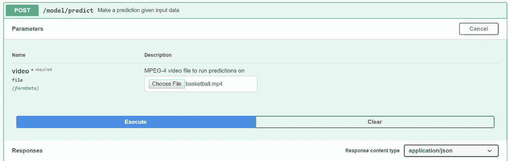
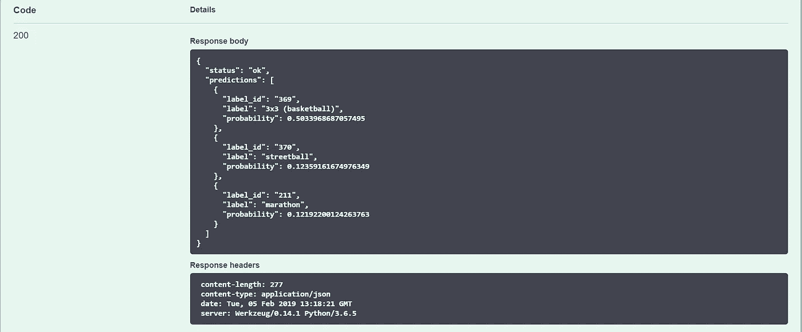
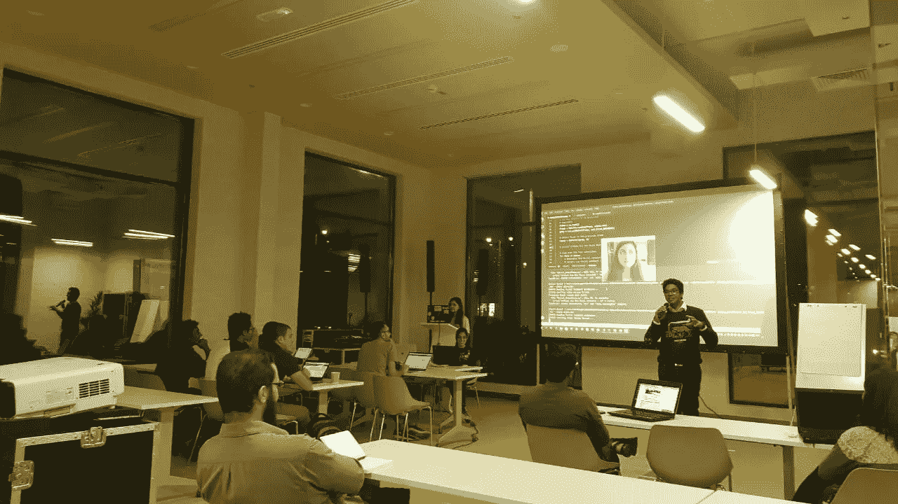

# 让深度学习变得用户友好

> 原文：<https://medium.datadriveninvestor.com/making-deep-learning-user-friendly-fd2a2fc88150?source=collection_archive---------19----------------------->

1 月 20 日，迪拜的 IBM 开发人员倡导团队在 in5 Tech 举行了一次关于如何以有趣的方式开始深度学习的会议。本博客简要概述了会议期间所涵盖的内容。

**深度学习简介**

我在会议开始时强调了什么是深度学习，以及它在人工智能和机器学习方面的位置。所以，如果你感到困惑，[深度学习是机器学习的子集，机器学习是 AI](https://towardsdatascience.com/clearing-the-confusion-ai-vs-machine-learning-vs-deep-learning-differences-fce69b21d5eb) 的子集。AI 意味着将人类的智能融入机器。它是所有智能机器的总称。机器学习意味着赋予计算机系统使用提供的数据进行“学习”和进行预测的能力。然而，深度学习算法大致是受人脑中发现的信息处理模式的启发。就像我们用大脑来识别模式和分类各种类型的信息一样，深度学习算法可以被教会为机器完成同样的任务。

**为什么我们今天需要深度学习？**

通常，当我们试图对对象进行分类时(例如图像识别、视频或图像解析)，我们需要考虑许多特征，这使得分类非常复杂。

**用例**

深度学习在今天被广泛用于解决很多问题。这里提到了一些众所周知的用例。脸书正在将深度神经网络用于其面部识别算法。我相信你们大多数人一定注意到了，一旦你在脸书上上传了一张照片，照片中的人脸就会被自动识别出来，并询问你是否要给他们加标签。

你对自动驾驶汽车着迷吗？你爱特斯拉吗？所以，特斯拉正在将深度学习用于自动驾驶。这里有一个简短的[视频](https://electrek.co/2018/10/15/tesla-new-autopilot-neural-net-v9/)，展示了模型如何检测周围的物体。

source: [https://electrek.co/2018/10/15/tesla-new-autopilot-neural-net-v9/](https://electrek.co/2018/10/15/tesla-new-autopilot-neural-net-v9/)

**神经网络**

神经网络包括输入层、一个或多个隐藏层和输出层。正常的神经网络有一个隐藏层，但是深度神经网络有多个隐藏层。当人们使用深度这个术语时，他们通常指的是网络的层数。

**卷积神经网络(CNN)**

CNN 类似于神经网络，但它有一个卷积层，添加在完全连接的神经网络之前。当你有太多的特性需要考虑时，这是很有用的，也许有几百万个特性。因此，在这里，您首先在卷积层提取重要特征，然后将其馈送到全连接网络以获得输出。

下面是会议期间展示的一些有趣的演示，带有供您试用的链接！

[**图像字幕生成器**](https://github.com/IBM/MAX-Image-Caption-Generator-Web-App)

[Anchal Bhalla](https://medium.com/u/7f1cbb04238?source=post_page-----fd2a2fc88150--------------------------------) 展示了一个应用程序的演示，它可以为你上传的任何照片生成标题。这个应用程序使用了一个[模型资产交换](https://developer.ibm.com/exchanges/models/)，它提供免费和开源的深度学习模型，可以在 [IBM Developer](https://developer.ibm.com) 上获得。

Snapshot of the App.

[**体育视频分类器**](https://developer.ibm.com/exchanges/models/all/max-sports-video-classifier/)

对于这个演示，使用了深度学习模型，该模型接受视频并对视频中正在进行的运动进行分类。在会议期间，下面的视频用于测试模型。

Basketball.mp4

Testing the sports video classifier model with a basketball video.

结果以 JSON 格式提供，其中提供了视频中运动的概率。

[**瞌睡检测 App**](https://github.com/bedangSen/Drowsiness-Detector)

Bedang Sen 展示了一个检测司机困倦程度的应用程序。该解决方案利用摄像机通过计算垂直眼睛标志之间的距离和水平眼睛标志之间的距离的比率来检测睡意。当眼睛快要闭上时，它会发出警报声来唤醒驾驶员。

那都是乡亲们！

以下是会议期间使用的**资源**的链接:

*   幻灯片:[https://ibm.box.com/v/DeepLearningIn5](https://ibm.box.com/v/DeepLearningIn5)
*   代码模式:[https://github.com/bedangSen/Drowsiness-Detector](https://github.com/bedangSen/Drowsiness-Detector)
*   IBM 模型资产交易所:[https://developer.ibm.com/exchanges/models/](https://developer.ibm.com/exchanges/models/)

您还可以在 IBM Developer 上找到有趣的**用例作为代码模式，并通过以下方式提供代码供您探索:**

*   [https://developer . IBM . com/code/technologies/artificial-intelligence/](https://developer.ibm.com/code/technologies/artificial-intelligence/)
*   【https://developer.ibm.com/code/technologies/data-science/ 号

您也可以在 https://www.meetup.com/IBMCloud-Dubai/[的](https://www.meetup.com/IBMCloud-Dubai/)上了解我们的最新活动

您可以回答这份**调查**，就您希望我们在未来涉及的主题进行投票:[https://www.meetup.com/IBMCloud-Dubai/polls/1274671/](https://www.meetup.com/IBMCloud-Dubai/polls/1274671/)

注册 IBM 云账户:[http://ibm.biz/datasci1](http://ibm.biz/datasci1)

 [## 澄清困惑:人工智能 vs 机器学习 vs 深度学习的差异

### 如果你陷入了区分人工智能(AI)和机器的困惑，请举手…

towardsdatascience.com](https://towardsdatascience.com/clearing-the-confusion-ai-vs-machine-learning-vs-deep-learning-differences-fce69b21d5eb)  [## 报告称，特斯拉在 v9 中部署大规模新自动驾驶神经网络，令人印象深刻的新功能

### 虽然特斯拉在版本 9 的发布中保留了其主要的新自动驾驶功能，但它仍然部署了一个新的…

electrek.co](https://electrek.co/2018/10/15/tesla-new-autopilot-neural-net-v9/)  [## 如何用 Python 从零开始构建自己的神经网络

### 理解深度学习内部运作的初学者指南

towardsdatascience.com](https://towardsdatascience.com/how-to-build-your-own-neural-network-from-scratch-in-python-68998a08e4f6)  [## 深度学习简介:什么是卷积神经网络？录像

### 在这个 MATLAB 技术讲座中，探索卷积神经网络(也称为 CNN 或 ConvNets)的基础知识。你会…

www.mathworks.com](https://www.mathworks.com/videos/introduction-to-deep-learning-what-are-convolutional-neural-networks--1489512765771.html) 

# DDI 特色数据科学课程:

*   [**用于数据科学的 Python**](http://go.datadriveninvestor.com/intro-python/mb)
*   [**Scikit-Learn**](http://go.datadriveninvestor.com/scikitlearn/mb)
*   [**数据可视化**](http://go.datadriveninvestor.com/datavisualization/mb)

**DDI 可能会从这些链接中收取会员佣金。我们感谢你一直以来的支持。*