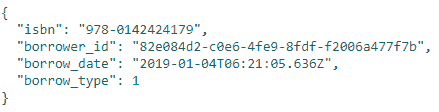
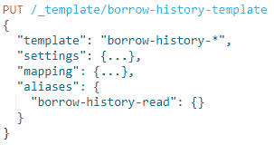
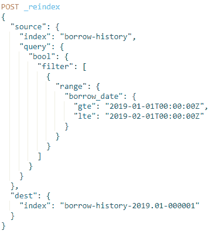
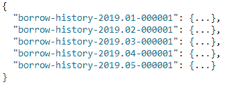
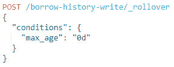

# 让我们的弹性搜索指数更易于管理

> 原文：<https://medium.datadriveninvestor.com/making-elasticsearch-indices-manageable-d49ac113a6be?source=collection_archive---------1----------------------->

达米安·卡斯特·法德里

我们最近将 Elasticsearch 整合到我们图书馆的图书借阅历史记录中。总的来说，Elasticsearch 实例存储图书被借出或归还时的数据，以及在另一个数据库中查找的其他字段。

这一切都很好，直到几个月后，我们的 Elasticsearch 实例开始失败。它已经达到了最大容量。显然，人们借了很多书，是吧？

 [## 雅虎财经 API 的 6 个替代方案——数据驱动投资者

### 雅虎财务 API 是新的财务 API 万岁！雅虎财务 API 长期以来一直是许多公司的可靠工具。

www.datadriveninvestor.com](https://www.datadriveninvestor.com/2019/02/25/6-alternatives-to-the-yahoo-finance-api/) 

## **形势**

我们的 Elasticsearch 实例基本上是单一服务器上的单一索引`borrow-history`。是的，我们真的没想到数据会膨胀得这么快。或者我们只是低估了它？

无论如何，更多的机器被添加到集群中(这是另一个时间的主题)来分担负载。但这还不够。我们需要更好地组织我们的数据。我们需要把它分成几个指数。

## **策划**

我们决定按月分割我们的数据。在这种情况下，我们将查询我们的`borrow-history`指数，并将它们重新索引到我们的*月度指数。*

我们的文档看起来像这样:

我们决定遵循索引格式，`borrow-history-YYYY.MM-xxxxxx. YYYY.MM`代表索引中文档的年份和月份，`xxxxxx`代表填充位数，以确保索引的唯一性。因此，重新编制索引应该为每个月生成一个单独的指数(如`borrow-history-2019.01–000001`等)。

## **创建模板**

在开始重建索引之前，我们首先为索引创建了一个模板。索引模板本质上是一个蓝图，它自动将写入其中的所有配置设置为匹配的索引。我们需要这样做，这样我们就不会将所有的指数配置分配给*月度指数*，该指数将由我们稍后的重新索引生成。

这将创建一个索引模板，该模板将指定的设置和映射分配给一个索引，该索引遵循模板字段中写入的模式。在我们的例子中，我们所有的索引都将以`borrow-history-`为前缀，所以我们使用了它。

另一件要注意的事情是“别名”字段的增加。这意味着我们所有的借款历史指数都可以在`borrow-history-read`下搜索，而不是指定每个月的指数。这样，我们就为主要活动做好了准备！

## **重新索引数据**

由于数据将按月分离，我们通过其`borrow_date`字段查询了我们的`borrow-history`索引，并按月重新索引。

这是一个示例查询，用于重新索引 2019 年 1 月完成的所有借阅历史。对所有月份重复该查询，以生成每个月的索引。在我们的`borrow-history-read`别名上执行`GET`看起来像这样:

此外，我们使用 Elasticsearch 的日期数学语法创建了本月的索引。这将在以后发挥作用。

我们还添加了一个`borrow-history-write`别名，仅指向当月的指数。这将是执行所有索引操作的地方。然后别名应该被移动到下个月将生成的新索引中。

请注意，虽然多个索引可以与`borrow-history-read`相关联，但只有一个索引可以与`borrow-history-write`别名相关联，因为这是所有索引发生的地方。

## **自动化期货指数**

所有这些只是将我们过去的数据划分为月度指数。为了确保我们不会在接下来的几个月里重复这个过程，我们研究了 rollover API。

由于 rollover API 只在执行命令时翻转索引，我们实际上无法在每个月初执行自动翻转。因此，我们只是为它设置了一个 cron 作业，它每月运行一次，并为我们执行上面的查询。

成功转存后，将会创建一个新的索引，使用我们之前创建的日期数学索引名称。由于 rollover 命令只在每个月的月初执行，因此它将生成一个名称，其中 month 字段会滚动。最重要的是，我们设置的写别名将自动转移到新的索引中。很整洁，是吧？

基本就是这样。可伸缩的索引结构是更好的弹性搜索实例的关键。而这个，就在这里，是朝着那个方向迈出的一步。

获得免费的机器人过程自动化(RPA)软件: [**在此下载**](https://www.raxsuite.com/freetrial)