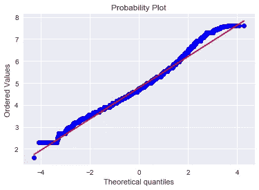
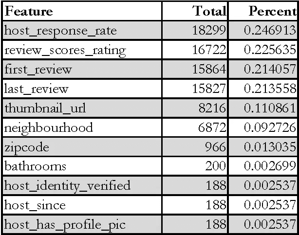
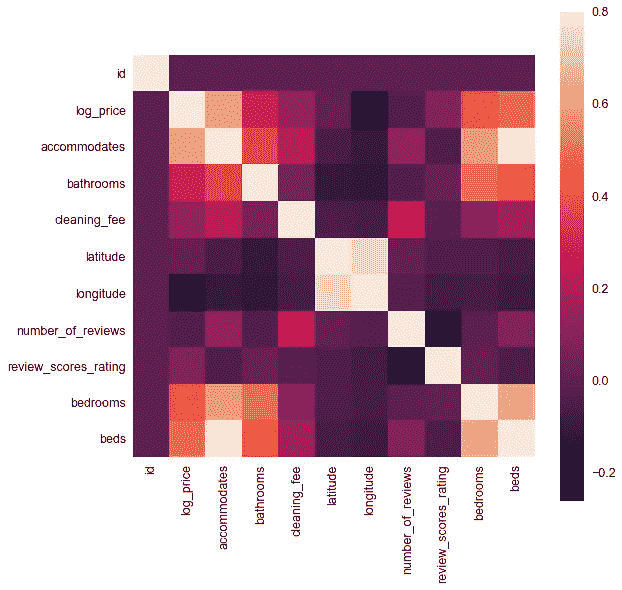
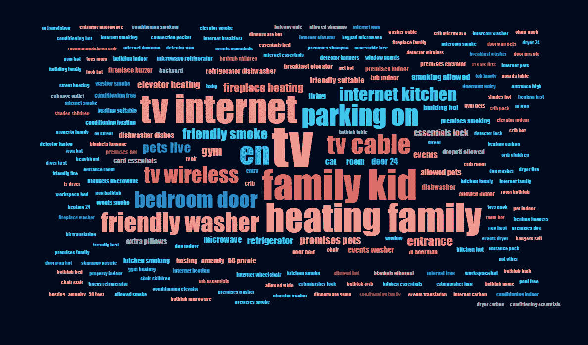

# Airbnb 价格预测:用 Python 进行数据分析|制作模型(一)

> 原文：<https://medium.datadriveninvestor.com/making-models-airbnb-price-prediction-data-analysis-15b9af87c9d8?source=collection_archive---------0----------------------->

## 位置，位置…取消？

*这是记录开发和设计通用线性模型的端到端流程的系列文章的第一部分，该模型输出预测的 Airbnb 租赁价格。作为一个整体，该系列将包括一个* ***数据集分析的描述****[*建议通过网络搜集方法*](https://medium.com/@philmohun/making-models-airbnb-price-prediction-data-collection-via-web-scraping-6218f35cdebb)*[*特征工程(专门针对非结构化图像)*](https://medium.com/@philmohun/making-models-airbnb-price-prediction-feature-engineering-and-unstructured-image-analysis-8f0456663fd8) *、模型选择和结果的附加数据收集。当读者开发他们自己的预测模型，或者寻找一个框架来组织他们的思想时，他们会发现这个文档很有帮助。最重要的是，我希望通过将一个典型的工作流分解成不同的模块化活动，揭开“数据科学”背后的一些过程，这些活动可以针对许多类型的问题进行重现。如果你觉得有帮助或者有问题，请在下面留言，我会尽我所能回答。***

**今天我们将把我们的分析分成几个部分，每个部分都有一个明确的目标。其中包括:**

1.  ****数据集特征的描述**以及用简单的英语解释每个变量。**
2.  ****目标变量检查**以了解可能的影响。**
3.  ****多变量研究**各个特征，以及变量之间的潜在关系。**

**在本节结束时，我们应该对构成数据集的特征以及它们如何影响我们的目标变量有了更好的理解。**

## *****数据集描述*****

**为了准确预测 Airbnb 价格，我们旨在收集一个包含直接影响租赁价格的特征的数据集。没有比直接从网站上收集大量带有字段的列表更好的起点了。下面你会发现一系列来自 Airbnb 的特性，这些特性在价格预测中非常重要。由于我们知道每一行的价格，这可以归类为监督学习问题，我们将把我们的数据分成不同的训练集、测试集和交叉验证集。现在，我们将把数据集作为一个整体来检查，稍后再回到这个部分。一般来说，在继续收集或决定收集更多数据之前，我喜欢检查数据集的几个特征。这些特征包括:**

*   **缺失值的数量以及如何处理它们(NaN 或 null)**
*   **数据类型(分类、布尔、图像、数字、文本等)**
*   **数据的形状和大小(这会影响我们将使用的模型类型)**
*   **经典统计分析(均值、中值、范围、方差、标准差等)**

****理解问题****

***一目了然:***

****目标变量:**对数价格(自然对数)**

****数据集特征:****

*   ***id* (数字)|每个列表的唯一标识符**
*   ***财产类型*(分类)|(例如公寓、房子、公寓)**
*   ***房间类型*(分类)|(如整个家庭/公寓、私人房间)**
*   ***便利设施*(文本)|逗号分隔的非结构化列表(如电视、厨房)。文本分析的候选对象。**
*   ***可容纳*(数字)|出租可容纳的人数**
*   ***浴室*(数字)|全浴室和/或半浴室的数量**
*   ***床 _ 类型*(分类)|(如蒲团、真床)**
*   ***取消 _ 政策*(分类)|(如灵活、适度、严格)**
*   ***清洁 _ 费用* (boolean) | T/F**
*   ***城市*(分类)|(例如波士顿、纽约、洛杉矶)**
*   ***描述*(文本)|非结构化，由主机决定如何填充。文本分析的候选对象。**
*   ***first_review* (日期)|第一次评审是多久前留下的**
*   ***host _ has _ profile _ pic*(boolean)| T/F(无图片链接)**
*   ***host _ identity _ verified*(boolean)| T/F(通过电子邮件验证)**
*   ***host_response_rate* (数字)|主机回复查询的频率(%)**
*   ***host_since* (date) |他们开户的日期**
*   ***即时 _ 可预订*(布尔)|判断对错**
*   ***最近一次回顾*(日期)|最近一次主持的日期**
*   ***纬度*(数字)**
*   ***经度*(数字)**
*   ***名称*(文字)|出租物业名称。文本分析的候选对象。**
*   ***街区*(分类)|对街区的非正式描述(如布鲁克林高地、市中心)**
*   ***点评数*(数字)|客人点评总数**
*   ***点评 _ 评分 _ 评分*(数字)|客人点评的平均评分**
*   ***缩略图 _ 网址*(数字；我们将回到这个)|链接到出租物业的主要照片。图像分析的候选人。**
*   ***邮政编码*(数字；同样)|邮政编码。引入附加数据的候选对象。**
*   ***卧室*(数字)|出租的卧室数量**
*   ***床位*(数字)|出租床位数**

**让我们把它分解一下。**

**特征的类型(分类、数字、布尔、文本)将影响我们执行分析和选择最终模型的方式。对于我们的数字指标，我们可以进行统计分析，但对于我们的分类和文本数据，我们将不得不变得更有创造性。**

**这一部分的目的是查看我们当前的信息，并对我们正在处理的事情有一个感觉。Airbnb 网站很有帮助地提供了这些功能，但它没有告诉我们哪个作为价格指标更重要或更不重要。根据轶事经验(也就是住在 Airbnbs)，我猜测床的数量*、*容纳*、*邮政编码*可能对决定价格很重要。现在，我将保持所有特征不变，我们将在多变量分析中回到这一点！***

## **目标变量分析**

**回想一下，我们试图预测 l *og_price* 作为我们的目标变量。我将使用 Python 和 Jupyter 笔记本进行一些操作，并在适当的时候包含代码片段。**

**We are using the pandas library for analysis here — highly recommend.**

**我们可以看到，我们收集了大约 74，000 行信息， *log_price* 在 0 和 7.7 之间波动。这里的零值是有问题的，需要更仔细的检查。如果主机提供免费租赁，我想知道！**

**Only one listing had a “0” value for log_price — I knew it was too good to be true.**

**我们已经删除了 *log_price —* 的零值行，这样更好。**

**通过直方图了解这一点将有助于确定在继续之前是否需要进行任何额外的转换。**

********

**最小程度的偏斜和显示不明显的峰度(<1) this passes the spot check for normal distribution (bell-shaped, symmetrical about the center). Likewise, our probability plot appears linear and reinforces our decision to leave *log_price* 原样。**

**我们现在已经给自己画了一张 *log_price* 的图片，这在检查我们的模型的结果时会很有用。当预测结果的时候，我们可以将我们的测试集与这个分布进行比较，并确定我们是否在正确的范围内。在到达那里之前，我们还有一些工作要做——让我们深入了解是什么导致了它的运行。**

## **多元研究**

**看看这个集合是如何堆积起来的，我们已经知道我们已经收集了大约 74，000 行，如果我们决定删除缺少信息的列表，这给了我们一些余地。事实上，看看哪些是缺失价值观的最大元凶可能是个好主意。**

****

**We can see that host response rate and review scores rating are missing nearly 1/4 of the time.**

**既然我们已经确定了具有大量缺失值的要素，我们必须决定如何处理它们。有许多选项可用，例如完全删除要素，移除不存在这些要素的行，或者用零、平均值、最大值或最小值替换空单元格。这个决定将根据您的模型参数而有所不同，现在我们将对此进行标记，并用“0”替换丢失的值，以便不会在我们的计算中引发错误。**

**好多了。**

**一般来说，确定我们的变量如何相互关联是一个好主意，pandas 提供了一个简单的方法来通过 *corr* 方法完成这项工作。**

****

**Correlation matrices provide a quick and easy visual to make sense of multiple variable interactions.**

**在该图中，较浅的颜色表示与相交要素的高度相关性。我们的注意力被吸引到与 *log_price* 高度相关的*住宿、浴室和清洁费*上。根据我们最初的观察，这是有意义的，尽管 *cleaning_fee* 的重要性并不是我们所预测的。另一个好处是我们能够看到彼此高度相关的特征，从而影响我们的模型创建。*纬度* & *经度*和*床&卧室*高度相关不出所料。让我们注意到这一点，并在稍后构建模型时回到这个观察结果。**

**这些相关矩阵对于数值来说是很好的，但是对于在我们的分类和文本字段中发生的事情却没有多少洞察力。一般来说，我会用虚拟变量(NYC = 1，Boston = 2 等)替换分类特征。对于非结构化文本，我们必须采取不同的方法。从质量上来说，了解这些特性的典型内容是很好的。幸运的是，我们可以制作一个单词云来帮助我们——让我们来看看:**

****名称****

****

****便利设施****

****

****描述****

****

**我们可以看到词云如何让用户快速识别出每个特征中出现最频繁的令牌。通过将每个字符串分解成独立的部分，我们能够识别出反复出现的常见单词。不出所料，“房间”、“床”和类似的限定词是跨类别使用最频繁的。我将把它作为一个练习，以确定如何成功地合并这个观察结果(考虑*频率*)。**

**我们的分析到此结束！我们对数据进行了分割，可以说我们现在对影响 log_price 的潜在变量有了更深入的理解。 [在下一部分中，我们将回顾通过网络搜集收集额外数据的方法，使用*邮政编码*作为关键字。感谢您的阅读，如果您喜欢，请随意鼓掌。](https://medium.com/@philmohun/making-models-airbnb-price-prediction-data-collection-via-web-scraping-6218f35cdebb)**