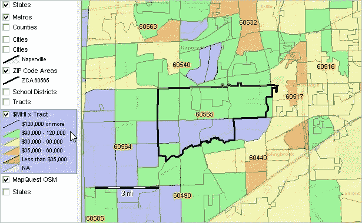
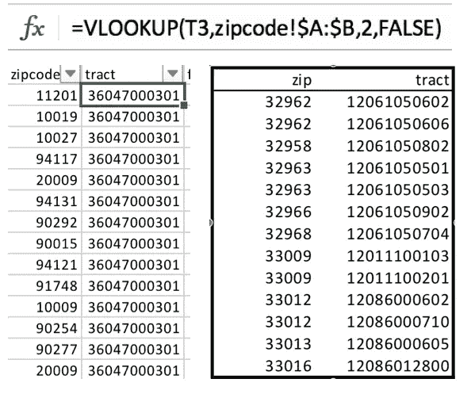
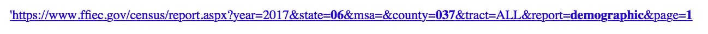

# Airbnb 价格预测:通过网络搜集数据|制作模型

> 原文：<https://medium.datadriveninvestor.com/making-models-airbnb-price-prediction-data-collection-via-web-scraping-6218f35cdebb?source=collection_archive---------0----------------------->

## 关于你的租赁，网上怎么说？

*这是一个系列的第二部分，记录了开发和设计通用线性模型的端到端过程，该模型输出预测的 Airbnb 租赁价格。作为一个整体，该系列将包括一个* [*对数据集分析的描述*](https://medium.com/@philmohun/making-models-airbnb-price-prediction-data-analysis-15b9af87c9d8)****通过 web 抓取方法收集附加数据的建议、*** [*特征工程(专门针对非结构化图像)*](https://medium.com/@philmohun/making-models-airbnb-price-prediction-feature-engineering-and-unstructured-image-analysis-8f0456663fd8) *、模型选择和结果。**

*当读者开发自己的预测模型，或者寻找一个框架来组织他们的想法时，他们会发现这份文件很有帮助。最重要的是，我希望通过将一个典型的工作流分解成不同的模块化活动，揭开“数据科学”背后的一些过程，这些活动可以针对许多类型的问题进行重现。如果你觉得有帮助或者有问题，请在下面留言，我会尽我所能回答。*

**

*“Green Matrix-style code raining down a computer screen” by [Markus Spiske](https://unsplash.com/@markusspiske?utm_source=medium&utm_medium=referral) on [Unsplash](https://unsplash.com?utm_source=medium&utm_medium=referral)*

*[上一次，我们检查了一组 Airbnb 数据，以确定变量对 *log_price*](https://medium.com/@philmohun/making-models-airbnb-price-prediction-data-analysis-15b9af87c9d8) 的影响。今天，我们将使用现有数据集中的特征来引入外部信息，以增强我们的预测能力。我们将使用 Excel 和 Python 处理请求、BeautifulSoup 和 pandas 包。*

* [## 成为数据科学家所需的 8 项技能——数据驱动型投资者

### 数字吓不倒你？没有什么比一张漂亮的 excel 表更令人满意的了？你会说几种语言…

www.datadriveninvestor.com](https://www.datadriveninvestor.com/2019/02/07/8-skills-you-need-to-become-a-data-scientist/) 

为了帮助构建我们的思维，我们将把这个练习分成几个部分:

1.检查问题和合适外部资源的标准

2.数据的网络搜集和整合

3.将新要素集成到现有数据集中

在这一部分之后，我们将成功地从第三方来源收集信息，并就这些信息将如何影响我们的预测提出假设。* 

***问题检查和外部来源标准***

*回想一下，该模型的目标是根据网站提供的信息准确预测给定 Airbnb 租赁的价格。然而，并不是所有重要的细节都被 Airbnb 跟踪，我们可以想到一些可能影响我们入住的因素。现在，让我们站在一个潜在租户的角度考虑一下——*

> *我的家人第一次去纽约，在朋友的推荐下，想住在 Airbnb。我们上了网站，被我们所有的选择淹没了！有这么多地方要扫描，我们决定设定一些标准。我们想住在一个相对安静的地方，并且有很多购物和食物选择。此外，我们想靠近中央公园，这样孩子们可以喂鸭子。我们至少需要 3 间卧室，我们更愿意住在整个公寓，而不是一个共享空间。最后，我们希望确保白天有足够的窗户采光。我们愿意为这种体验支付介于***【x】和$x+n*** *之间的费用。**

*通过这个例子，我们原始数据集中的一些字段似乎符合要求。我们已经有了关于*邻居*、*卧室*和*房间类型*的信息；餐厅信息和橱窗呢？请记住，我们的目标是通过使用可用的信息和一些巧妙的工程来生成一个介于 **$x 和$x+n** 之间的值。不幸的是，一些示例家庭的标准在我们的初始设置中没有被捕获——我们将不得不在别处寻找。*

*当考虑引入什么类型的外部数据时，我们必须问自己几个问题:*

*-数据是否准确和最新？*

*-是公开发布还是在付费墙后发布？*

*-它适用于我们试图预测的所有样本吗？*

*-我们可以通过引入目标变量来了解更多信息吗？*

*使用这些指导原则，我们接下来检查*如何*引入数据来与我们现有的功能集成。通常，地理信息是这些类型练习的良好候选，并且可以从多个来源广泛获得。值得注意的是，北美行业分类系统(NAICS)和联邦金融机构考试委员会(FFIEC)提供了可以与邮政编码*结合使用的奇妙数据集。我们将从 FFEIC 网站开始搜索。**

**

*Visual of the overlap between zipcode and tract. From: [Demographic-Economic Patterns: Composite & Related Geography](https://proximityone.wordpress.com/2015/07/03/demographic-economic-patterns-composite-related-geography/)*

*这次人口普查很有帮助地提供了各县人口统计、财政和住房的详细信息。每个州被分配一个两位数的代码(例如“06”)，每个县有一个相应的三位代码(例如“037”)。经过一番挖掘，我们发现了一条人行横道，它将*的邮政编码*与这些指数联系了起来。邮政编码*和县编码*之间的关系是一对多的，所以我们稍后需要做一些清理工作。记住这一点，我们可以使用我们的邮政编码变量来确定哪些县需要包含在我们的提取中。*

*要实施人行横道，请从上面链接的门户网站下载数据集。接下来，我们在数据集中创建一个列，并使用 Excel 的 vlookup 函数提取相应的县。*

**

*The county code are the 3rd, 4th, and 5th digits in the tract number. In this example: “047”*

*在执行我们的人行横道后，我们确定了 29 个不同的县，我们的租赁位于这些县。每份报告有三个独立的部分，有将近 100 个 pdf 文件需要处理。此外，将 PDF 转换成。csv 或其他类似的分析格式非常耗时且乏味。相反，我们可以选择直接抓取网页来收集我们想要的信息。*

***抓取网页并整理数据***

*[下面部分的源代码可以在这里找到。](https://github.com/pmohun/census2csv)*

*检查 FFEIC 网站，我们看到每个网页由一个表格、多个页面和描述每个变量的列标题组成。FFIEC 没有为此提供 API 调用，但是我们可以利用 url 命名约定来获取我们需要的信息。*

**

*The **bolded** text will be replaced to navigate through each report.*

*检查 url，我们看到县、州、报告和页码都被明确地标注出来。通过简单地替换这四个变量，我们可以快速地遍历每个报告并提取必要的信息。*

**【我建议在此时查看完整的脚本，以便更深入地了解一些实现这个功能的技巧。虽然看起来很简单，但是每个网站都有一些细微的差别，比如页码、命名的不一致以及其他一些奇怪的地方。]**

*在这一点上，我们已经收集了一些县的数据，这些县包含了我们的列表所在的区域。为了深入了解每个列表如何对应一个区域，我们将使用提供的*纬度*和*经度*来精确定位我们的地址位置。*

*我们在政府部门的朋友再次提供了一个有用的网站，可以用来根据地理坐标提取区域代码。API 调用和相应的映射相当简单，所以我将在这里包含脚本，然后继续。*

*This script pulls tract data based on latitude and longitude coordinates.*

*由于每个*纬度-经度*对特定于一个唯一的列表，我们能够确定每个列表位于哪个区域。这个练习成功地使用了一个现有的特性(*邮政编码*)为我们的模型引入了另外 20 多个变量。类似的网络抓取活动可以用来引入任何数量的新数据集——这取决于设计者的独创性，选择他们认为可能是目标变量的重要指标。*

*在这个场景中，我们收集了人口普查数据，以帮助回答关于我们的租赁所在的社区类型的问题。其他需要进一步研究的领域可能包括*温度、工业/职业的主要类型、气候*等等。*

***整合到现有数据集中***

*从我们的普查摘录中，我们现在已经收集了三个独立的数据集，它们可以集成到我们的模型中。每个数据库中的信息类型可以分为三组:人口统计、人口和住房。继续我们第一部分的变量命名练习，让我们描述每个新特性。*

***人口统计***

*   **tract_code* (数字)|一个县内特定区域的 6 位代码标识符。跨县重复。*
*   **tract_income_level* (分类)|(如低、中、高)*
*   *贫困的|贫困的|贫困的|贫困的|贫困的|贫困的*
*   **Tract _ median _ fam _ income _ percentage*(数字)|用 2015 Tract MFI 除以 2015 MSA/MD MFI 计算*
*   **2017 _ Median _ fam _ Income*|通过将该区域的家庭收入中位数%乘以年度 FFIEC MSA/MD MFI 计算得出*
*   **2015 _ Median _ fam _ Income*|通过将该区域的家庭收入中位数%乘以年度 FFIEC MSA/MD MFI 计算得出*
*   **地域 _ 人口*(数字)|居住在该地域的总人口数*
*   **区域 _ 少数民族*(数字)|区域内被认定为少数民族的总人口百分比*
*   *少数民族人口(数字)|居住在该地区的少数民族人口总数*
*   **owner _ occupated _ units*(数字)|主要居民同时也是房产所有者的单元总数*
*   **1_4_family_units* (数字)|居民为两个相关个体的单元总数*

***人口***

*   **家庭数量*(数字)|居住在该区域内有子女的家庭总数*
*   **数字 _ 住户*(数字)|住户是指任何住所，包括由单身人士和两人或两人以上的不相关群体居住的住所*
*   **非西班牙裔白人人口*(数字)|非西班牙裔/白人人口总数*
*   **少数民族 _ 人口*(数字)|被认定为少数民族的人口总数*
*   **美国印第安人人口*(数字)|美国印第安人的总人口数*
*   **亚裔岛民人口*(数字)|被认定为亚裔岛民的人口总数*
*   **black_population* (数字)|黑人/非裔美国人的总人数*
*   **西班牙裔人口*(数字)|西班牙裔人口总数*
*   **混合 _ 人口*(数字)|识别为混合种族的人口总数*

***外壳***

*   **total_housing_units* (数字)|地块内个人住房单元数*
*   **1 _ 4 _ 家庭 _ 单元*(数字)|居住者相关的个人住房单元数*
*   **房屋年龄中位数*(数字)|地块房屋年龄中位数*
*   **inside_city* (boolean) |指示区域是否在市区*
*   **房主自住单元*(数字)|房主也是主要居民的个人住房单元数*
*   **空置单元*(数字)|没有主要居民的个人单元数*
*   **owner _ occupated _ 1 _ 4 _ fam _ units*(数字)|房产所有人也是主要居民和居住在房产上的亲属的个人住房单元数量。*
*   **renter _ occupated _ units*(数字)|主要居民出租房产的个人住房单元数*

*这些信息有助于描绘每个租赁位置周围的区域，并且通常是房价的有用指标。流行的在线租赁网站 Zillow 建立了一个强大的预测算法，利用这些信息以及其他数千个数据集来生成估计的估值。未来的部分将旨在测试我们的假设，即这些额外的变量将提高我们的模型的准确性。*

**制作模型| Airbnb 价格预测第二部分到此结束。*我们现在已经创建了一个强大的数据集，它考虑了 Airbnb 房源提供的信息以及周围地区的数据。基于相似的模型，我们假设这些信息在为我们选择的测试集生成预测时会降低我们的 RMSE。[接下来，我们将研究如何处理分类特征，讨论几种标准化变量的策略，并对缩略图进行基本的图像分析。感谢您的阅读，如果您喜欢，请随意鼓掌。](https://medium.com/@philmohun/making-models-airbnb-price-prediction-feature-engineering-and-unstructured-image-analysis-8f0456663fd8)*