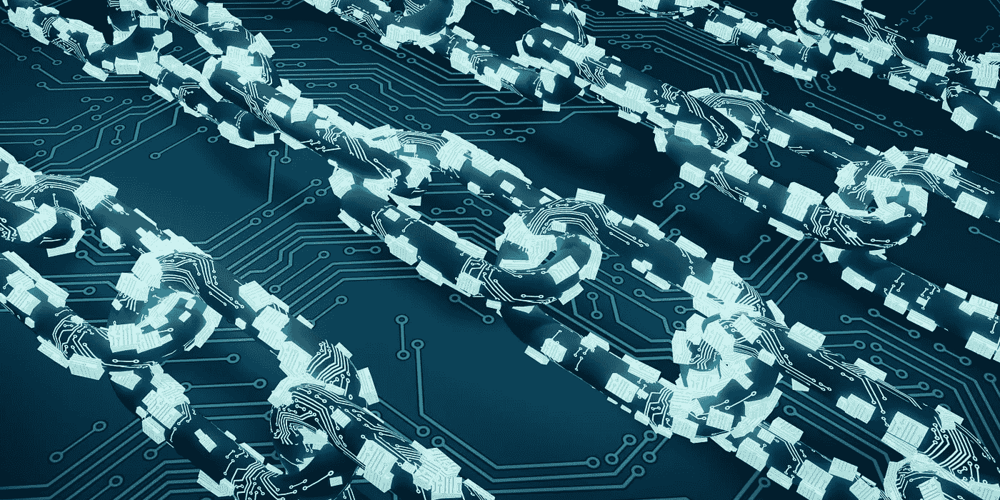

# 理解 ICO，STO 和 IEO 的疯狂。哪个最好？

> 原文：<https://medium.datadriveninvestor.com/making-sense-of-the-ico-sto-ieo-craziness-which-one-is-the-best-7d0b643f5348?source=collection_archive---------2----------------------->

你可能已经熟悉(并且厌倦了)那些在区块链世界迅速传播的无止境的首字母缩略词。正如我们在[之前的文章](https://medium.com/datadriveninvestor/a-case-for-making-the-blockchain-crypto-terminology-more-accessible-e80966b5a6a7)中所说，我们这些密码爱好者倾向于让我们的生活变得更加艰难，试图用过于复杂的商业模式进行创新(但不是真的)。今天我们想澄清一些问题，希望对 ico、sto 和 IEOs 的讨论有积极的贡献。

> [DDI 编辑推荐——认证加密货币专家](http://go.datadriveninvestor.com/crypto/matf)

**ICO**

先说 ICOs。一个*初始硬币发行* (ICO)只不过是一种筹资方法，通常用于推出与密码世界相关的新产品或服务。

*为什么要投资一个？作为投资的交换，投资者将获得由 ICO 发行的大量代币(加密硬币)。理论上，投资者冒险进入看起来和听起来有前途的项目，因为他们的利润只有在代币的价值从基础价格增加时才会存在。然后，投资者可以利用交易所交易他们的代币，最终获得一些利润。*

*为什么要做 ICO？*首先，如果您的企业生态系统需要您的令牌，您应该只启动一个。如果是的话，把它作为一种筹资形式是有意义的，因为传统筹资形式涉及的监管程序可能会扼杀你的项目。你可以利用空投、奖金计划、私人和公开销售，轻松筹集大量资金。

*弊:*骗局。没错。有很多这样的。 [Satis Group LLC 表示，他们分析的 ico 中有 81%是骗局。这就是让投资者对现行制度感到恐惧和失望的地方。幸运的是，对他们和你来说，我们有一个解决方案，帮助你收集资金，让投资者控制他们的钱会发生什么。点击此处了解更多信息。](https://satisgroup.io/)

**STO**

证券代币发行 (STO)也是一种筹资方式，与 ICO 不同，它以投资合同的形式进入投资资产，如债券、股票、基金或房地产信托。现在，根据 [Investopedia](https://www.investopedia.com/terms/s/security.asp) :

> 证券是一种持有某种货币价值的可替代、可流通的金融工具。它代表在上市公司中的所有权地位(通过股票)，与政府机构或公司的债权人关系(通过拥有该实体的债券来表示)，或由期权表示的所有权。

安全令牌被记录在区块链上，与传统股票投资被记录在数字证书上的方式类似。如果你愿意，sto 是传统的*公开发行*(IPO)和 ico 的混合方式。

*为什么这对投资者有意义？*因为 sto 是基于实物资产的，它们需要遵守监管机构的规定。然而，这就是为什么 sto 对开发者没有真正的吸引力，因为加密世界的主要优势之一是它不那么官僚化。由于 sto 受证券法管辖，启动 sto 可能会有点复杂，特别是因为监管机构会要求 KYC/反洗钱认证解决方案，这意味着高额的咨询和律师费。然而，有一些方法可以让这变得更容易，我们的建议是使用 [Daicore](https://daicore.io/) 作为一个启动平台。

**IEO**

这是一种较新的筹资做法。*首次公开募股* (IEOs)指的是那些不通过 ICO 直接在交易所上市的项目。这里发生的事情是，开发人员铸造项目的令牌，将其发送到交易所，然后交易所将在他们的平台上向个人贡献者出售令牌，以获得另一枚硬币(通常是 ETH)。因此，贡献者不直接参与与 ICO 的智能合约，而是在交易所创建一个帐户，并向该帐户发送 ETH。然后，当 IEO 开始时，贡献者可以直接从交易所购买代币。

现在，[一些作者](https://medium.com/traceto-io/what-is-an-initial-exchange-offering-ieo-245a7cf72f28)认为，运行 IEO 而不是 ICO 的优势包括:a)直接使用交易所现有用户群的可能性，b)交易所给予的信任票，它执行自己的尽职调查，因此它只接受值得信赖的项目(显然在他们看来)，并且它还使得欺骗贡献者参与欺诈活动更加困难。

这些在一定程度上都是真的。由此产生了一系列问题:

1.很大一部分代币被少数人持有。这意味着当价格上涨时，一小部分人会以牺牲其他人的利益为代价获得大量利润，一小部分人可以操纵硬币的价格。这违背了分散体系的整体理念，在这种体系中，价格受制于供求法则。

2.为了能够在一个大的交易所上市，*你需要很多钱。*由于交易所必须履行自己的尽职调查，并以某种方式为你的项目价值提供担保，他们自然会索要大量资金。项目还承担营销费用，其中[可以轻松达到 10 万美元或更多。](https://hacked.com/what-is-an-initial-exchange-offering-ieo/)

3.许多钱被浪费在交易费用上。这就是交易所参与 ieo 上市的意义所在。拥有更多的用户和硬币意味着更多的交易和明显更高的收入。如果你正考虑开始或投资 IEO，想想你的大部分资金都投入了交易所。

**4。** *膨胀。* IEOs 从一开始就让制造巨大的通货膨胀变得可以接受。一旦该项目的硬币可以交易，投资者可能会想把它们换成利润。这使得代币的行为只不过是一种筹款方法，并破坏了它在生态系统中的长期效用。这导致了投机行为，违背了创造良好商业模式的理念。

根据一篇两个月前的文章，[币安反对 IEOs](https://medium.com/binanceexchange/ieo-ifo-iao-ico-token-issuing-considerations-2b556055f199) 因为它们带来了很多风险。赵昌鹏总结道:

> 我相信 ico 仍然是最好的融资方式。事实上，它是如此之好，以至于我无法想象为什么任何像样的项目仍然会寻求传统的风险投资。所有聪明的风投现在都在投资 ico，甚至是业内的顶级公司。

然而，意识到他们可以赚很多钱，他们很快重新考虑了这个观点，因为他们列出了他们的前两个 ieo，即 Fetch 和 BitTorrent。不要过分夸大他们已经筹集了多少资金。相反，密切关注他们的发展，亲眼看看他们有多可持续。

在那之前，我们告诉你，不要放弃 ico 和 sto。他们在过去被证明是成功的，他们将继续为加密领域带来价值。我们给你一个解决方案，让你摆脱过去扰乱商业模式的欺诈行为。完全控制你的钱，冒险进入风险非常有限的值得信赖的项目。试试[**Daicore。**](https://daicore.io/)

编辑披露:编辑有时会发布有用资源的链接。如果你发现它们有用并购买，我们会赚很多钱。不，我不是说要把我的薯条做大。我说的是超大披萨上的意大利香肠。感谢您一直以来的支持，我们将继续为 p̶e̶p̶p̶e̶r̶o̶n̶i̶出版而努力。