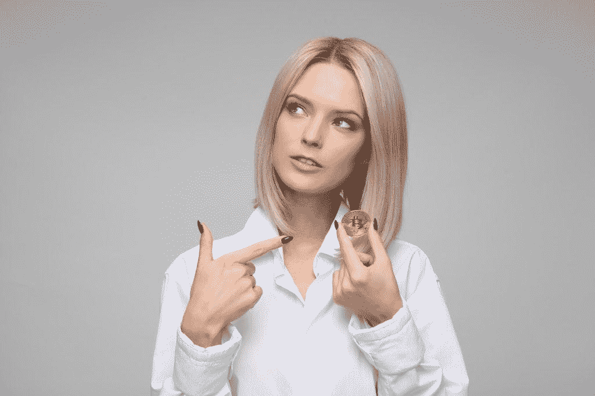

# 充分利用你的比特币投资

> 原文：<https://medium.datadriveninvestor.com/making-the-best-of-your-bitcoin-investment-b12bef499e73?source=collection_archive---------15----------------------->

Image by [Icons8_team](https://pixabay.com/users/Icons8_team-6332517/?utm_source=link-attribution&utm_medium=referral&utm_campaign=image&utm_content=3435862) from [Pixabay](https://pixabay.com/?utm_source=link-attribution&utm_medium=referral&utm_campaign=image&utm_content=3435862)

我相信你们在比特币过山车上玩得很开心。我们已经看到最近发生了一些疯狂的波动和交易。每个人都在谈论这些天我们看到的价格的疯狂波动。

偶尔回顾一下加密货币的基本原理是有好处的，这样才能在投资加密货币，特别是比特币时做出更明智的决定。我们已经看到，替代硬币仍然保持他们的模式，一直保持在相当远的地方。然而，比特币在 2019 年几乎没有出现抛物线的事件。

 [## 总部位于瑞士的 ETP 进入加密交易市场|数据驱动的投资者

### 虽然金融市场几乎没有沉闷的时刻，特别是在引入…

www.datadriveninvestor.com](https://www.datadriveninvestor.com/2019/03/10/swiss-based-etp-enters-the-crypto-trading-market/) 

因此，让我们来谈谈一些技巧和诀窍，或者更确切地说，我称之为预防措施，你可以采用它们来充分利用和保护你的比特币。

## 价格高的时候不要过分

不要太疯狂，试图买一个农场来为自己赢得提前退休。比特币有可能继续上升趋势，在未来几个月内达到 10 万美元吗？是的，从技术上讲这是可能的。但也有可能是完全相反的方向。我们无法预测这一切将会如何发展。有了比特币，你意想不到的事情会在幕后发生。例如，cryoto 交易所之一可能会突然崩溃，或者一条坏消息可能会像病毒一样传播，人们谈论着整个事情的倒退，人们在恐慌中获利了结。

因此，如果你是那些每个月都在继续向 crypto 投入资金的人之一，那么就坚持你的路线吧。享受旅程，继续你的既定计划。这不是一个金融建议，虽然我也不是一个有执照的专业人士。所以如果你想要专业的建议，请找理财顾问。但我在这里只想说，我总是发现，无论是在牛市还是熊市，坚持到底总是最好的。

## 积累你的知识

试着复习一下你的比特币基本原理。我认为，对于投资比特币的人来说，理解他/她为什么投资比特币非常重要。如果你已经理解了比特币的工作原理，那么也许你可以开始了。但如果你是这个领域的新投资者，并试图了解比特币是什么，你必须在投入大量资金之前了解这个行业。拿起一些关于比特币的基本面，阅读[一个‘价值互联网’的入门指南](https://opinined.com/a-beginners-guide-to-the-internet-of-value/)，自己决定是否应该投资。不要让我或其他任何人骗你盲目投资。

 [## “价值互联网”入门指南

### 对密码世界的所有行话感到困惑？关于‘价值互联网’，你需要知道的就是这些。

medium.com](https://medium.com/opinined/a-beginners-guide-to-the-internet-of-value-1bad51ad3823) 

## 明智地选择你的交易

确保你知道你使用的交换。首先要认识到购买、出售和转移比特币的相关费用。尽量找一个费用相对较低的交易所，让你对自己支付的交易费用有一定的控制权。请确保您与一家提供良好支持的声誉良好的交易所合作。不要陷入虚假交易所或欺诈性比特币经纪人的骗局。点击下方了解[比特币经纪人不会告诉你的事](https://opinined.com/what-bitcoin-brokers-wont-tell-you/)。一定要做好调查，避免陷入[加密货币骗局](https://opinined.com/the-fear-of-cryptocurrency-scams/)。

 [## 比特币经纪人不会告诉你的事

### 有没有比特币经纪人向你提出一个听起来好得难以置信的报价？在你给他们你的…

medium.com](https://medium.com/datadriveninvestor/what-bitcoin-brokers-wont-tell-you-4902f70cf128) 

## 对秘密新闻半信半疑

不要过多解读加密货币新闻。如果你在加密推特上或在[与加密相关的新闻门户](https://opinined.com/technology/cryptocurrency/breaking-news/)上看太多，你最终会发现自己处于一个没有中间立场的位置。加密货币新闻通常是关于要么直接去月球，要么急剧下降。你不需要相信任何极端的新闻。现实是，我们都有自己的动机和投资组合。对所有的秘密消息都要持保留态度，试着对比特币未来的表现做出自己的判断。

在一天结束时，[Opinined](https://opinined.com/technology/cryptocurrency/)的加密货币部分是为我们所有人创建的，让我们作为一个社区聚集在一起，讨论关于加密货币和区块链运动的利弊、风险和好处以及个人意见，这可能会给我们做生意和相互交易的方式带来范式转变。

我们目前在 [Opinined](https://opinined.com/) 上开放客座博文，因此如果您有兴趣做出贡献，请随时发表评论或私信。你将获得完整的作者归属，并通过对你作品的额外评论获得作为专业作家的额外曝光率。

*原载于 2019 年 11 月 11 日*[*【https://opinined.com】*](https://opinined.com/making-the-best-of-your-bitcoin-investment/)*。*