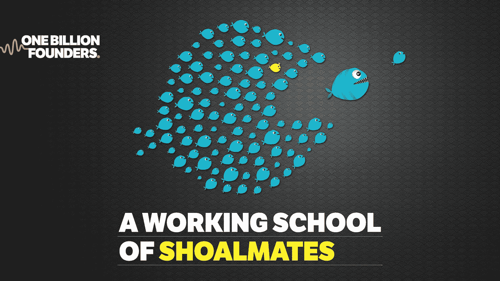
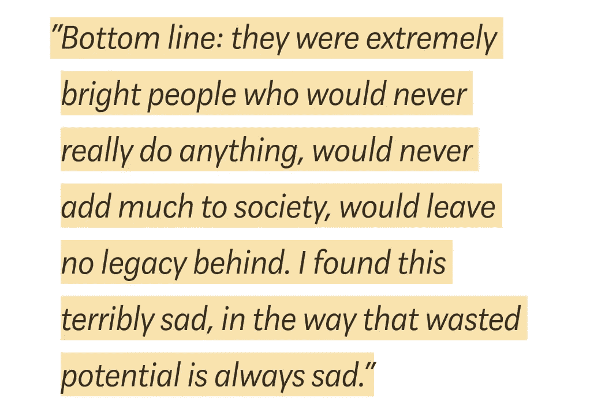
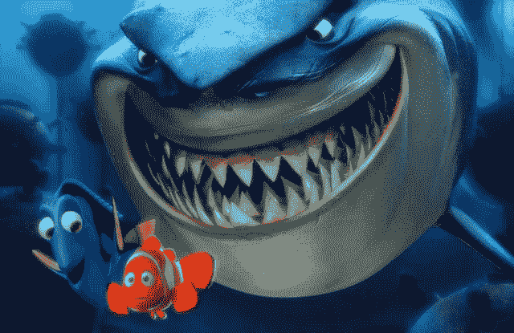
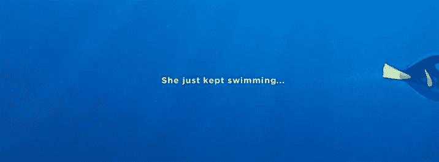

# 让工作的未来有价值

> 原文：<https://medium.datadriveninvestor.com/making-the-future-of-work-count-b6511ca642d3?source=collection_archive---------4----------------------->

## 探索民主生活实验室

死亡，在我看来，是万有引力的谷底。这可以与自然发展的生物区分开来。这就是我们定义的生命周期。

一个死气沉沉的人还活着，但行为就像一个病毒，在表面利益的存在中屈服于它的生物冲动，从他们周围的一切中吸取生命。这种自我吸收的有机体的特点是零价值的活动和社会贡献(如 snapchat 自拍)，因此，对其作为智能生命形式的角色及其在自然生态系统中的责任漠不关心。

[Darius Foroux](https://medium.com/u/54163a1723f6?source=post_page-----b6511ca642d3--------------------------------) [https://medium.com/darius-foroux/the-purpose-of-life-is-not-happiness-its-usefulness-65064d0cdd59](https://medium.com/darius-foroux/the-purpose-of-life-is-not-happiness-its-usefulness-65064d0cdd59)

根据这一定义，一个物种的死亡可以被描述为一群人无法适应和发展他们对与其生计的持续可持续性相关的问题的关注和努力。

一个物种的灭绝会产生连锁反应，导致进一步的灭绝。这些也被称为“灭绝链”，特别是关键物种。

基石物种多少有些进化。有一种与生俱来的自我意识，他们的行为是有意识的行动，对他们的社交圈以及他们生活的环境产生有益的影响。而且总是有积极和消极的影响。

假设你生来基因健康，随着时间的推移，一个人会发展出自己的个性。虽然基因组学对我们的身体属性有所说明，但我们的认知发展倾向与我们的直接环境(特别是在我们存在的前 5 年)和我们从与我们相处的人那里继承的社会影响(行为)有很大关系。

还有我们的信仰体系。对此我没有太多要说的，因为宗教人士有一个根深蒂固的信仰(从核心价值观到极端主义的两极分化),这种信仰根植于他们的道德中。一个难以转移的文化传统，绝对是我们应该扔进“太硬的篮子”的东西。

当我想到那些即使在食物链中处于捕食者之下许多层也能生存下来的物种时，这让我想到了人类的同类相食和暴食行为，以及**我们如何才能学会对抗我们自己的生物灭亡。**

> **“所以，我们现在是在欺骗死神。这就是我们正在做的，同时我们也在享受乐趣。”—多莉【海底总动员】**

有个叫凯西·内斯塔特的家伙擅长向世界展示他是如何完成任务的。他很大程度上利用了企业自相残杀……[哎呀抱歉]……我的意思是，**资本主义**将全球运动品牌耐克的广告预算收入囊中，并将其用于环球旅行，同时为广告拍摄他的冒险经历。

他的口号**做得更多**被纹在身上。我会称赞他的叛逆和“思维方式不同”(广告人的创意圣地)，虽然他的成就值得尊重，但依我拙见，他在社会效益方面得分不高，因为我无法衡量他对弱势群体的影响，他也没有解决需要解决的具体环境问题。

所以，让我们回到绘图板:我们如何抵消启发式人类行为的破坏性影响，同时留下一份你的孩子会感谢你的持久遗产？

# 做得更多(纯粹的资本主义)与**让它有价值(优先考虑你如何完成任务)**

我们可以利用这一时刻向自然界中的鱼群伙伴学习:

鱼类从群体行为中获得许多好处，包括防御捕食者(通过更好的捕食者探测和稀释个体捕获的机会)，提高觅食的[成功率](https://en.wikipedia.org/wiki/Foraging)，以及更高的寻找配偶的成功率。鱼类也有可能通过增加[水动力](https://en.wikipedia.org/wiki/Hydrodynamic)效率而从鱼群成员中受益(类似于骑自行车的人可以在 peloton 中互相牵引，或者在 v 字形编队中飞行的鹅可以节省能量，因为编队中前一只动物产生的[翼尖涡流](https://en.wikipedia.org/wiki/Wingtip_vortices))。

[[https://en.wikipedia.org/wiki/Shoaling_and_schooling](https://en.wikipedia.org/wiki/Shoaling_and_schooling)

现在让我们把这种方法应用到进化人类行为的背景中:

> 学校(sko͞ol)-一个教授技能或商业的机构:秘书学校；空手道学校。

也许在未来的工作中，学校可以取代公司。参与需要有自我主权(别忘了不值得我们花时间和精力去影响“太硬的篮子”里的人)。

但对于那些愿意并有能力支付工作学校会员资格的人来说，这可能会成为一群拥有共同价值观的人在协作环境(虚拟或物理)中学习的一种方式，同意以最有效的方式实现共同利益和群体的财政收入，同时为社会或环境事业做出贡献。

在我们兴奋之前，进化模型不会在一夜之间出现。研究动物群体行为的科学家使用了一种遗传算法来模拟在模型中进化了许多代的种群。这些研究调查了许多解释动物为什么会进化出群集行为的假设，如[自私群体理论](https://en.wikipedia.org/wiki/Selfish_herd_theory)，捕食者混淆效应，稀释效应，以及多眼理论。

在浅滩结构和替代模型方面还有很多更有趣的研究，但我现在不会用细节来烦你。

但是，悄悄地说，我对人类的未来超级兴奋！

> **学校有可能成为社会企业的工作模式。**

Pixar Disney — Finding Dory

**社会企业**是一种[组织](https://en.wikipedia.org/wiki/Organization)，它运用商业策略来最大限度地改善财务、社会和环境福祉。值得注意的是，社会企业不是慈善机构，但是它们的结构可能包括一个非营利性实体，与一个营利性商业企业一起工作。

我相信这是人类进化可行的工作模式的一个重要特征，因为我们不能忽视这样一个事实，从长远来看，人类会按照自己的利益行事。

我长期研究行为经济学，尤其是丹·艾瑞里进行的实验。在他的书《非理性的好处——在工作和家庭中挑战逻辑的意想不到的好处》中，他探讨了劳动的意义:

> 孩子们根据他们将成为什么(消防员、教师、医生、行为经济学家等)来考虑他们未来的职业。但不是关于他们将挣多少钱)。

这是一个如此珍贵的视角，我们应该在我们后代的发展中继续培养它。我们让大量的流行文化媒体用不切实际的期望消耗我们的头脑，让我们自己走向失败，这是一种耻辱。我们使用老式的信仰体系，比如寻找与“那一个”的心跳加速的浪漫。我们使用控制狂策略来欺负我们的生活方式，而不是从我们的个人关系中培养爱和尊重，因此创造了一个自我实现的预言:一种流行的邪教人群，习惯于自私的优先事项和压倒性的不可能性。不幸的是，这些人无法被拯救，他们也不想被拯救。

我认为现在是我们开始现实地看待人类需要什么和你认为其他人应该有权得到什么，或者宣布“权利”的时候了。仅仅因为你把自己比作一个数字幻想，或者你认为你有一个独特的突破性的想法，并不意味着你比另一个可能已经注册了通过做得更好来节省时间的想法的人更特殊或更值得获得资源。需要有一种逻辑方法来决定哪种活动在短期内更可行和有效，同时计划为突破性的想法分配资源。

最终，如果没有对过程的尊重，没有考虑到其他人的努力对更广泛的生态系统的价值，那么你还不如脱离民主。想法和意见多如牛毛。共识和协调执行是一个想法从零到一的过程。

# 人类的可持续发展必须是自主的。

我明白每个人都想成为下一个大人物或者拥有他们的 15 分钟成名时间。你可以的。但是你需要明确你的角色和你的贡献。阐明为什么一项行动优先于另一项行动也很重要。这意味着时间、努力和复杂性的比率需要小于收益价值的速度(否则您不会取得任何进展)。我将这个算法定义为**“公司货币政策”**。

技术和工具已经存在。我们只需要将开源平台与开发高效财政劳动力结构的协议连接起来。它旨在衡量并提供一个透明的会计系统，以便所有成员做出明智的决策，创建自己的商业合作伙伴关系，资助研究和开发，并通过参与以声誉和主题专业知识为权重的决策共识，民主地“将资金投入到您所说的地方”。

当然，有了自主数字身份，你就可以选择从系统中“拔下插头”，随身携带你的个人数据。但请记住，新成员从零开始，尊重是从你参与的社区中赢得的。

我目前正在进行科学模型的研究，并为这个会员制的社会企业管理技术和协议。

我很想听听有兴趣的批判性思想家和经济学家的意见，他们愿意分享他们的想法，并成为测试这个 MVP 数字社会的创始成员。

如果我们能让这种模式正确，我们应该听到我们的孩子渴望长大后成为像他们父母一样的人:他们决定的任何目的的“创始人”。